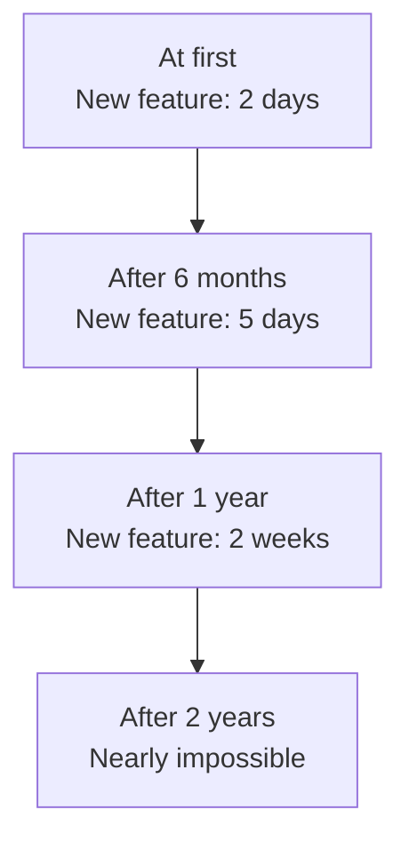
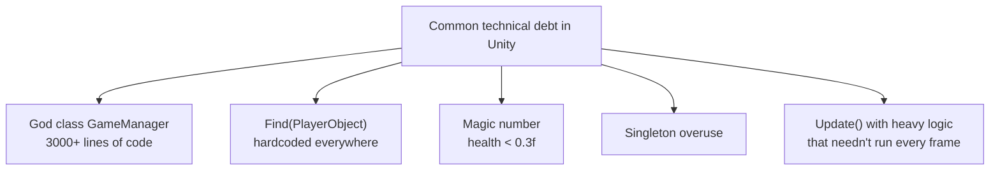

# 💳 Technical Debt

> **Origin:** Compiled and adapted from [Refactoring.Guru — Technical Debt](https://refactoring.guru/refactoring/technical-debt)
> Author: **Alexander Shvets** · Illustrations: **Dmitry Zhart**
> This is a study summary; all rights belong to the original author.

## What is Technical Debt?

**Technical Debt** is a financial metaphor for what happens when you choose a quick solution instead of the right one.

Just like **taking out a bank loan** — you move faster now but pay more later:

- **Principal** = the time saved by choosing the quick approach
- **Interest** = the time wasted in the future because the code is hard to understand and hard to change
- **Repaying the debt** = refactoring to fix the code properly

> ⚠️ Everyone creates technical debt — even the best programmers. The point isn't to avoid debt entirely, but to **control it and pay it down regularly**.

---

## The Interest on Technical Debt

Technical debt behaves like compound interest — it **accumulates over time**:

Every time you take a shortcut, development speed **slows down over time**. At first it's negligible, but after months and years, the time to develop a new feature increases significantly because you're fighting the old code.

---

## Causes of Technical Debt

### 1. 📊 Business Pressure

When a deadline is tight and a feature has to ship right away, the team chooses the fastest solution instead of the best one. Code that's "good enough" today becomes a burden tomorrow.

> *"Just ship it, we'll come back and fix it later"* — a familiar line, but "later" usually never comes.

### 2. 🧪 Lack of Tests

Without test coverage, the team is **afraid to change the code**:

- They don't dare refactor because they don't know what might break
- Every change requires manually testing everything
- Bugs slip into production because there's no safety net

### 3. 🤷 Lack of Understanding

When the team doesn't clearly understand what technical debt is:

- They don't realize the code is accumulating debt
- They don't spend time on refactoring because "the code still runs"
- Management doesn't see the value of refactoring → doesn't allocate time

### 4. 🔗 Strict Coherence of Components

When parts of the system are **tightly bound together** (tight coupling):

- Changing one module → forces changes in many others
- You can't test or deploy parts individually
- Every small change becomes a large and risky change

---

## ⚡ The Tipping Point

There's a threshold beyond which, once technical debt crosses it, the project becomes nearly **impossible to develop further**:

- Adding any feature causes new bugs
- Fixing one bug creates another
- Development time grows exponentially
- New developers joining the team spend weeks just to understand the code

When this point is reached, the team often faces a hard decision: **keep enduring it or rewrite from scratch**. Both are expensive, but frequent refactoring from the start can prevent this situation.

---

## 🎮 In Game Dev

Technical debt in game dev comes in distinctive forms:

### 🏃 Game Jam Code
Code written during a 48–72 hour game jam is entirely technical debt. If you want to develop it into a finished game, you **must refactor** — usually rewriting most of it.

### 🧪 The Prototype Trap
The initial prototype works well → the team decides to "build on top of this foundation" → the prototype code wasn't designed to scale → debt piles on debt.

> 💡 **Advice:** Always treat prototype code as **throwaway code**. Once a prototype is approved, start rewriting it with a proper architecture.

### ⏰ Crunch Time
The crunch period before release usually generates a large amount of technical debt:

- Hardcoding values to fix bugs quickly
- Skipping code review to ship on deadline
- Turning off warnings, ignoring best practices

After each milestone or release, set aside time for a **sprint 0** to pay down technical debt before starting new features.

### 🎮 Concrete Unity Examples

---

## 🗺️ Navigation

| Direction | Link |
|-------|----------|
| ← Previous | [Clean Code](./01-clean-code.md) |
| → Next | [When to Refactor](./03-when-to-refactor.md) |

---

> 📝 **Origin:** [Refactoring.Guru](https://refactoring.guru/) · Author: Alexander Shvets · Illustrations: Dmitry Zhart
