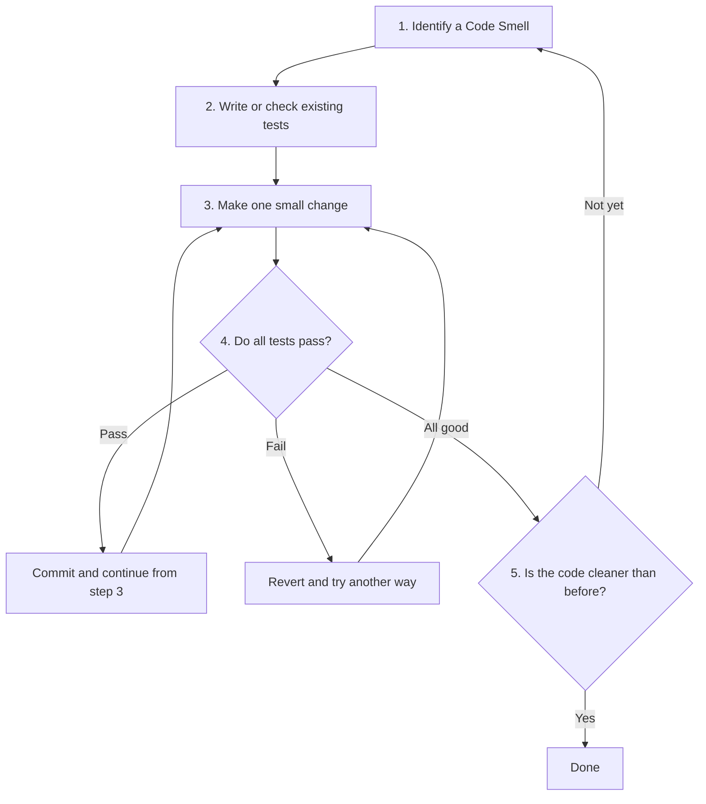

# 🔧 How to Refactor

> **Origin:** Compiled and adapted from [Refactoring.Guru — How to Refactor](https://refactoring.guru/refactoring/how-to)
> Author: **Alexander Shvets** · Illustrations: **Dmitry Zhart**
> This is a study summary; all rights belong to the original author.


## How to Perform Refactoring

Refactoring must be done **carefully and systematically**. Done the wrong way, you can introduce new bugs or waste time without the code getting any better. Below are the principles and processes to follow.

---

## The 3 Golden Rules

A mandatory checklist for every refactoring:

### ✅ 1. The code must be cleaner after refactoring

This is the core goal. If, after refactoring, the code isn't clearer and simpler — you've done something wrong.

Sometimes you start refactoring but realize the problem is too big. In that case, **document it** and come back later, rather than trying to half-refactor and then abandoning it.

### ✅ 2. Don't create new functionality during refactoring

**Absolutely do not mix** refactoring with adding new features:

- Refactoring = changing the **structure** of the code while keeping the **behavior** the same
- Adding a feature = changing the **behavior** of the code

If you're refactoring and you think of a new feature, **write it down** (TODO/ticket) and do it later. Mixing the two increases the risk of errors and makes rollback harder.

### ✅ 3. All existing tests must pass after every step

For each small refactoring step, you need to make sure **all tests still pass**:

- A test failing after refactoring = you've changed behavior, not just structure
- If there are no tests → **write tests first** before refactoring (this is your safety net)
- Never skip the step of running the tests

---

## The Process

A safe, step-by-step refactoring process:



### Step-by-step details:

**Step 1 — Identify a Code Smell:** Find the specific problem to address. See [Code Smells](../02-Code-Smells/00-code-smells-overview.md) to recognize them.

**Step 2 — Ensure test coverage:** Write tests for the current behavior if there aren't any. This is the most important step — tests are the safety net that protects you from breaking the code.

**Step 3 — Make a small change:** Change only one small thing at a time. For example: rename a variable, extract a method, move a field. Never make many large changes at once.

**Step 4 — Run the tests:** After EVERY small change, run the entire test suite again. If it fails, revert immediately.

**Step 5 — Review:** Look back at all the changes. Is the code better? If not, keep refactoring or revert.

---

## 💡 Advice

### Keep commits separate

Separate refactoring commits from feature/bugfix commits:

```
✅ Good:
  commit 1: "Refactor: Extract CalculateDamage from PlayerCombat"
  commit 2: "Feature: Add critical hit multiplier"

❌ Bad:
  commit 1: "Refactor PlayerCombat and add critical hit"
```

**Reason:** If the new feature causes a bug, you can revert the feature commit while keeping the refactoring. If they're mixed, you have to revert both.

### Small, incremental changes (Small Incremental Changes)

- Each change should take **a few minutes**, not a few hours
- If a refactoring is too large, break it into multiple steps
- Commit frequently — each successful small step is a commit

### Don't be a perfectionist

- You don't need to refactor everything at once
- Focus on the code you're **actively working on**
- "Boy Scout Rule": Always leave the code cleaner than you found it

---

## 🎮 In Game Dev

### 🎮 Use Play Mode to test

In Unity, **Play mode** is the fastest testing tool:

- After each refactoring change → hit Play → check that the game works correctly
- Use Debug.Log to verify logic
- Check Inspector values at runtime

In addition, write **Unit Tests** with the Unity Test Framework for important logic:

```
Tests/
├── EditMode/
│   ├── DamageCalculationTests.cs
│   └── InventorySystemTests.cs
└── PlayMode/
    ├── PlayerMovementTests.cs
    └── EnemyAITests.cs
```

### 🔀 Use Version Control

Version control (Git) is **mandatory** when refactoring:

- A **separate branch** for large refactorings: `refactor/player-combat-system`
- **Commit frequently** with clear messages
- **Revert easily** if a refactoring goes the wrong way
- A **pull request** for the team to review before merging

### 🛠️ Supporting tools in Unity/IDE

| Tool | Function |
|---------|-----------|
| **Rider/VS Refactoring** | Rename, Extract Method, Move automatically |
| **Unity Test Framework** | Unit tests for game logic |
| **Unity Profiler** | Check performance after refactoring |
| **Git** | Version control, branching, reverting |
| **Rider Inspections** | Automatically detect code smells |

### 📋 Refactoring Checklist for Game Dev

Before you start refactoring a system in a game:

- [ ] Committed the current code (clean working directory)
- [ ] Have tests or a way to verify the current behavior
- [ ] Created a separate branch for the refactoring (if it's a large change)
- [ ] Not in a crunch period / tight deadline
- [ ] Clearly identified the code smell to address
- [ ] Chosen the appropriate refactoring technique

---

## 🗺️ Navigation

| Direction | Link |
|-------|----------|
| ← Previous | [When to Refactor](./03-when-to-refactor.md) |
| → Next | [Code Smells →](../02-Code-Smells/00-code-smells-overview.md) |
| 🏠 Overview | [Refactoring Overview](../00-refactoring-overview.md) |

---

> 📝 **Origin:** [Refactoring.Guru](https://refactoring.guru/) · Author: Alexander Shvets · Illustrations: Dmitry Zhart
