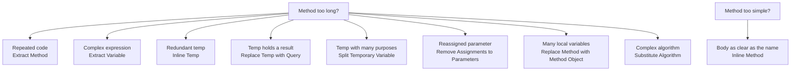

# 📝 Composing Methods

> 📖 **Source:** [Refactoring.Guru — Composing Methods](https://refactoring.guru/refactoring/techniques/composing-methods) | Author: Alexander Shvets

## Introduction

Most refactoring involves reorganizing **methods**. Overly long methods are the root of many problems — they hold too much logic, are hard to read, hard to test, and prone to bugs.

The **Composing Methods** group of techniques focuses on:
- **Breaking** long methods into shorter, clearer ones
- **Removing** redundant temporary variables
- **Simplifying** the internal structure of methods

---

## 📋 The 9 techniques

| # | Technique | Short description | Details |
|---|----------|-------------|----------|
| 1 | **Extract Method** | Pull a group of statements into its own method, named after its purpose | [📄 Details](./01-extract-method.md) |
| 2 | **Inline Method** | Merge away an overly simple method — when its body is as clear as its name | [📄 Details](./02-inline-method.md) |
| 3 | **Extract Variable** | Break a complex expression into a clearly named, easy-to-understand variable | [📄 Details](./03-extract-variable.md) |
| 4 | **Inline Temp** | Replace a temporary variable used only once with the expression itself | [📄 Details](./04-inline-temp.md) |
| 5 | **Replace Temp with Query** | Replace a temp holding an expression's result with a method call | [📄 Details](./05-replace-temp-with-query.md) |
| 6 | **Split Temporary Variable** | Split a temp that is assigned multiple times for different purposes into separate variables | [📄 Details](./06-split-temporary-variable.md) |
| 7 | **Remove Assignments to Parameters** | Don't reassign a parameter — use a local variable instead | [📄 Details](./07-remove-assignments-to-parameters.md) |
| 8 | **Replace Method with Method Object** | Turn a long method with many local variables into its own class | [📄 Details](./08-replace-method-with-method-object.md) |
| 9 | **Substitute Algorithm** | Replace a complex algorithm with a clearer, more efficient one | [📄 Details](./09-substitute-algorithm.md) |

---

## 🗺️ Which technique, and when?

---

## 🎮 In Game Dev

Composing Methods is the **most heavily used** group of techniques in game development:

### Common examples:
- **Extract Method**: Split a giant `Update()` into `HandleInput()`, `HandleMovement()`, `HandleCombat()`, `HandleAnimation()`
- **Extract Variable**: Turn a complex expression `if (player.hp > 0 && player.stamina > 10 && !player.isStunned && Time.time > lastAttackTime + cooldown)` into `bool canAttack = ...`
- **Replace Temp with Query**: Replace `float damage = baseDamage * multiplier` with a method `GetCalculatedDamage()`
- **Replace Method with Method Object**: Pull complex AI logic out of a `DecideAction()` method into an `AIDecisionMaker` class

---

## 🔗 Links

- ⬆️ [Refactoring Techniques — Overview](../00-techniques-overview.md)
- ➡️ [Moving Features between Objects](../02-Moving-Features/00-moving-features-overview.md)

---

> 📚 **Origin:** Content adapted from [Refactoring.Guru](https://refactoring.guru/) — Author: Alexander Shvets, Illustrations: Dmitry Zhart
