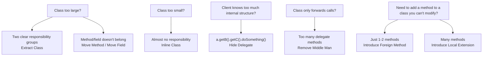

# 🚚 Moving Features between Objects

> 📖 **Source:** [Refactoring.Guru — Moving Features between Objects](https://refactoring.guru/refactoring/techniques/moving-features-between-objects) | Author: Alexander Shvets

## Introduction

One of the most important decisions in object-oriented design is **where to place responsibility**. Even the best design needs adjustment when requirements change.

The **Moving Features between Objects** group of techniques helps you:
- **Move** a method/field to a more suitable class
- **Split** an overly large class into several smaller ones
- **Merge** an overly small class into another class
- **Hide** or **remove** unnecessary delegation

---

## 📋 The 8 techniques

### 1. Move Method
> 🔗 [Refactoring.Guru](https://refactoring.guru/move-method)

**When to use:** A method **uses the data of another class more** than the class that contains it (Feature Envy).

**How to do it:** Create a new method in the target class, copy the logic over, then turn the old method into a delegate or delete it.

```csharp
// Move CalculateDamage() from Player to DamageCalculator
// because it uses more data from Weapon and Target than from Player
```

---

### 2. Move Field
> 🔗 [Refactoring.Guru](https://refactoring.guru/move-field)

**When to use:** A field **is used more by another class** than by the class that contains it.

**How to do it:** Create the field in the target class and update all references.

```csharp
// Move `attackRange` from Player to Weapon
// because range depends on the weapon, not the player
```

---

### 3. Extract Class
> 🔗 [Refactoring.Guru](https://refactoring.guru/extract-class)

**When to use:** A class **does too much** (violating Single Responsibility). When you notice a class has two distinct groups of methods/fields.

**How to do it:** Create a new class, move the related fields and methods over, and set up the link between the two classes.

```csharp
// Split PlayerController → PlayerInput + PlayerMovement + PlayerCombat
// Each class takes on a single responsibility
```

---

### 4. Inline Class
> 🔗 [Refactoring.Guru](https://refactoring.guru/inline-class)

**When to use:** A class is **too small** and has almost no responsibility of its own. This often happens after several rounds of refactoring leave a class "gutted".

**How to do it:** Move all features from the small class into another class, then delete the small class.

```csharp
// If a PhoneNumber class only has a single `number` field → merge it into Person
```

---

### 5. Hide Delegate
> 🔗 [Refactoring.Guru](https://refactoring.guru/hide-delegate)

**When to use:** Client code has to **know about the internal structure** to access functionality (violating the Law of Demeter). For example: `person.GetDepartment().GetManager()`.

**How to do it:** Create a method on the intermediate class so the client doesn't need to know about the delegate.

```csharp
// ❌ player.GetInventory().GetWeapon().GetDamage()
// ✅ player.GetEquippedWeaponDamage()
```

---

### 6. Remove Middle Man
> 🔗 [Refactoring.Guru](https://refactoring.guru/remove-middle-man)

**When to use:** A class has **too many delegate methods** — methods that simply forward calls without adding any logic. The opposite of Hide Delegate.

**How to do it:** Let the client access the delegate directly and remove the redundant forwarding methods.

```csharp
// When GameManager just forwards everything to AudioManager, UIManager, etc.
// → Let the systems be accessed directly via a ServiceLocator or DI
```

---

### 7. Introduce Foreign Method
> 🔗 [Refactoring.Guru](https://refactoring.guru/introduce-foreign-method)

**When to use:** You need a method on a class that **you can't modify** (a library class, a sealed class), but you only need **one or two methods**.

**How to do it:** Create a method on the client class that takes an instance of the library class as a parameter.

```csharp
// Add a utility method for the DateTime class, which you can't modify
static DateTime NextWorkingDay(DateTime date)
{
    // Logic to compute the next working day
}
```

---

### 8. Introduce Local Extension
> 🔗 [Refactoring.Guru](https://refactoring.guru/introduce-local-extension)

**When to use:** You need **several methods** for a class you can't modify. More than one or two methods (if it's just a few, use Introduce Foreign Method).

**How to do it:** Create a wrapper class (a subclass or decorator) or an **extension method** (in C#).

```csharp
// C# Extension Methods — the most common approach in Unity
public static class VectorExtensions
{
    public static Vector3 WithY(this Vector3 v, float y) => new Vector3(v.x, y, v.z);
    public static Vector3 Flat(this Vector3 v) => new Vector3(v.x, 0, v.z);
    public static float DistanceTo(this Vector3 a, Vector3 b) => Vector3.Distance(a, b);
}
```

---

## 🗺️ Which technique to use when?



---

## 🎮 In Game Dev

- **Extract Class**: Split a 2000-line `PlayerController` into `PlayerInput`, `PlayerMovement`, `PlayerCombat`, `PlayerAnimation`
- **Move Method**: Move damage-calculation logic from `Player` to `CombatSystem`
- **Hide Delegate**: `gameManager.GetScore()` instead of `gameManager.GetScoreSystem().GetCurrentScore()`
- **Extension Methods (Unity)**: Extend `Vector3`, `Transform`, `GameObject` — very common in Unity projects

---

## 🔗 Links

- ⬆️ [Refactoring Techniques — Overview](../00-techniques-overview.md)
- ⬅️ [Composing Methods](../01-Composing-Methods/00-composing-methods-overview.md)
- ➡️ [Organizing Data](../03-Organizing-Data/00-organizing-data-overview.md)

---

> 📚 **Origin:** Content adapted from [Refactoring.Guru](https://refactoring.guru/) — Author: Alexander Shvets, Illustrations: Dmitry Zhart
