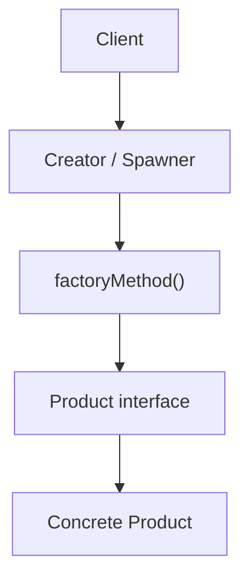
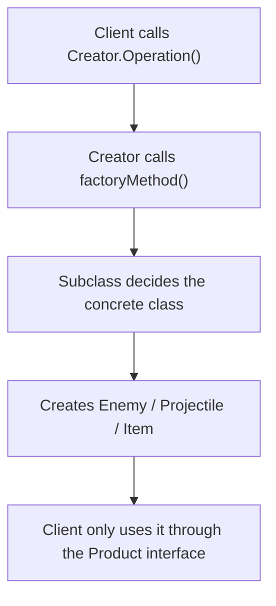
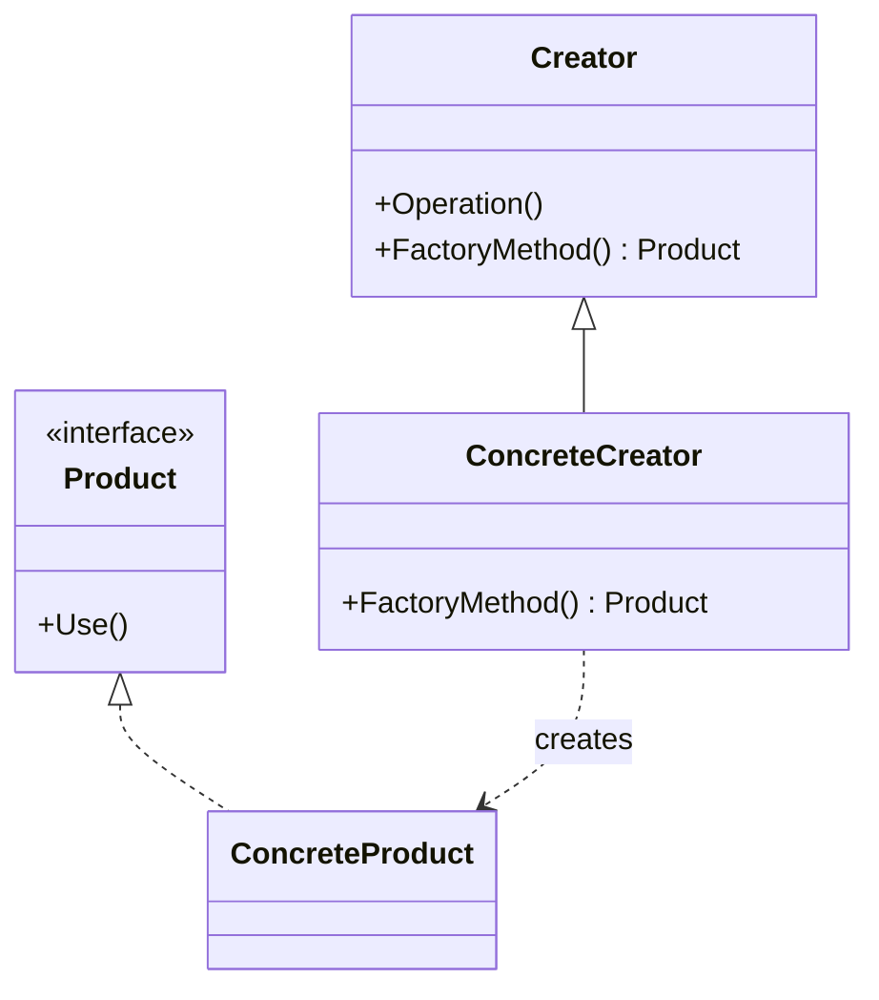

# Factory Method

> 📖 **Source:** [Refactoring.Guru — Factory Method](https://refactoring.guru/design-patterns/factory-method) | Author: Alexander Shvets

---

## 🎯 Intent

**Factory Method** is a creational design pattern that provides a common interface for creating objects in a superclass, but allows subclasses to change the concrete type of object that will be created.

---

## ❌ Problem

Imagine you are writing a survival role-playing game (RPG).
- In the first version, your game has only a single type of enemy: the **Zombie**. Your monster-creation logic is hardcoded directly inside the `Spawner` class using the `new` operator:
  `Zombie zombie = new Zombie();`
- The code runs great. But after a few weeks, the designer asks for two new monster types: **Skeleton** (a bow-shooting skeleton) and **Dragon** (a fire-breathing dragon).
- At this point, your `Spawner` class turns into a nightmare. You are forced to open up that class and add tangled `if-else` or `switch-case` statements to check which type of monster needs to be created.
- Every time you add a new monster type in the future, you have to modify the `Spawner` class again, directly violating the **Open/Closed Principle** and creating extremely tight coupling between the spawner and every concrete monster class.

---

## ✅ Solution

The **Factory Method** pattern suggests replacing direct calls to the `new` constructor from the client side (the Spawner) with calls to a special creation method — called the **Factory Method**.

1.  Create a common interface `IEnemy` (the Product) that defines the basic behaviors of a monster (such as moving and attacking).
2.  All concrete monsters (`Zombie`, `Skeleton`, `Dragon`) implement the `IEnemy` interface.
3.  Turn the `EnemySpawner` class into an abstract class (the Creator), declaring the factory method `CreateEnemy()` that returns the common type `IEnemy`.
4.  Create specialized Spawner subclasses: `ZombieSpawner` simply overrides `CreateEnemy()` to return `new Zombie()`, and `SkeletonSpawner` returns `new Skeleton()`.

Now, the main Spawner only interacts with the `IEnemy` interface without needing to care which concrete monster is created underneath!

---

## 🎨 Structure

Instead of reading one big UML diagram right away, read the pattern in three layers: **quick idea → real execution flow → simplified UML**.

### 1. Quick Idea



### 2. Real Execution Flow



### 3. Simplified UML



### How to Read the Diagram

| Component | Meaning |
|---|---|
| Quick look | The `Creator` does not hard-code the class it needs to create. |
| Main flow | The `ConcreteCreator` overrides `FactoryMethod()` to choose the concrete object. |
| In the game | A shared spawner can produce many different kinds of enemies/projectiles. |
| Solid arrow | One object holds a reference to or directly calls another object. |
| Triangle / dashed arrow in UML | Inheritance or interface implementation. |

> Quick-reading tip: first find the **Client/Context**, then follow the arrows to the main interface. The concrete classes are just variations swapped in at runtime.

---

## 💻 Pseudocode

```csharp
// Common interface for products
interface IProduct
{
    void DoSomething();
}

// Concrete product classes
class ConcreteProductA : IProduct
{
    public void DoSomething() => Print("Product A is working!");
}

class ConcreteProductB : IProduct
{
    public void DoSomething() => Print("Product B is working!");
}

// Base creator class (Creator)
abstract class Creator
{
    // This is the abstract Factory Method
    protected abstract IProduct CreateProduct();

    public void BusinessLogic()
    {
        // Call the Factory Method to create an object without knowing the concrete class
        IProduct product = CreateProduct();
        product.DoSomething();
    }
}

// Subclass that overrides the Factory Method
class ConcreteCreatorA : Creator
{
    protected override IProduct CreateProduct() => new ConcreteProductA();
}
```

---

## ⚙️ Applicability

Use Factory Method when:
- You don't know in advance the exact structure and types of objects your client code will have to work with in the future.
- You want to give users of your library or framework the ability to extend and customize internal components independently.
- You want to save system resources by reusing existing objects instead of constantly creating new ones (combined with a Cache/Object Pooling mechanism).

---

## 📝 How to Implement

1.  Define a common interface or abstract class for all the concrete products that will be created (the Product).
2.  In the Creator class, declare an empty creation method (the Factory Method). The return type of this method must be the Product interface.
3.  Find every line that calls the `new` operator on the Product inside the Creator class, extract them, and move them into the Factory Method.
4.  Create Creator subclasses for each Product type and override the Factory Method to perform the concrete creation.

---

## ⚖️ Pros and Cons

*   **👍 Pros:**
    *   *Avoids tight coupling (Loose Coupling):* Completely separates the main logic code from the concrete product classes.
    *   *Single Responsibility Principle:* Encapsulates the object-creation logic in a single place.
    *   *Open/Closed Principle:* Easily add new product types to the game without breaking or modifying existing code.
*   **👎 Cons:**
    *   The code can become more complex and have more files, since you are forced to create many new subclasses for both the Creator and the Product.

---

## 🎮 In Game Dev: C# Code Example (Unity)

Below is how to implement a proper **Wave Spawner** system in Unity using Factory Method:

### 1. The Product Interface and Concrete Classes
```csharp
using UnityEngine;

// Defines the common behavior of an enemy
public interface IEnemy
{
    void Initialize();
    void MoveTo(Vector3 destination);
}

// Concrete enemy: Zombie
public class Zombie : MonoBehaviour, IEnemy
{
    public void Initialize() => Debug.Log("Zombie rises from the grave!");
    public void MoveTo(Vector3 destination) => Debug.Log("Zombie is shambling toward " + destination);
}

// Concrete enemy: Skeleton
public class Skeleton : MonoBehaviour, IEnemy
{
    public void Initialize() => Debug.Log("Skeleton assembles its bones!");
    public void MoveTo(Vector3 destination) => Debug.Log("Skeleton is running toward " + destination);
}
```

### 2. The Creator Class (Base Spawner) and the Concrete Creators (Spawner Subclasses)
```csharp
// Abstract Spawner class
public abstract class EnemySpawner : MonoBehaviour
{
    [SerializeField] protected GameObject enemyPrefab;
    [SerializeField] protected Transform spawnPoint;

    // Abstract Factory Method
    protected abstract IEnemy CreateEnemyInstance();

    // Shared business logic: spawn the monster and command it to move
    public void SpawnEnemyWave(Vector3 targetLocation)
    {
        IEnemy enemy = CreateEnemyInstance();
        enemy.Initialize();
        enemy.MoveTo(targetLocation);
    }
}

// Subclass spawner that only creates Zombies
public class ZombieSpawner : EnemySpawner
{
    protected override IEnemy CreateEnemyInstance()
    {
        GameObject obj = Instantiate(enemyPrefab, spawnPoint.position, Quaternion.identity);
        return obj.AddComponent<Zombie>();
    }
}

// Subclass spawner that only creates Skeletons
public class SkeletonSpawner : EnemySpawner
{
    protected override IEnemy CreateEnemyInstance()
    {
        GameObject obj = Instantiate(enemyPrefab, spawnPoint.position, Quaternion.identity);
        return obj.AddComponent<Skeleton>();
    }
}
```

---

> 📚 **Origin:** Content adapted from [Refactoring.Guru](https://refactoring.guru/) — Author: Alexander Shvets, Illustrations: Dmitry Zhart

| Direction | Link |
|-------|----------|
| ← Back | [Creational Patterns Overview](./00-creational-overview.md) |
| → Next | [Abstract Factory](./02-abstract-factory.md) |
