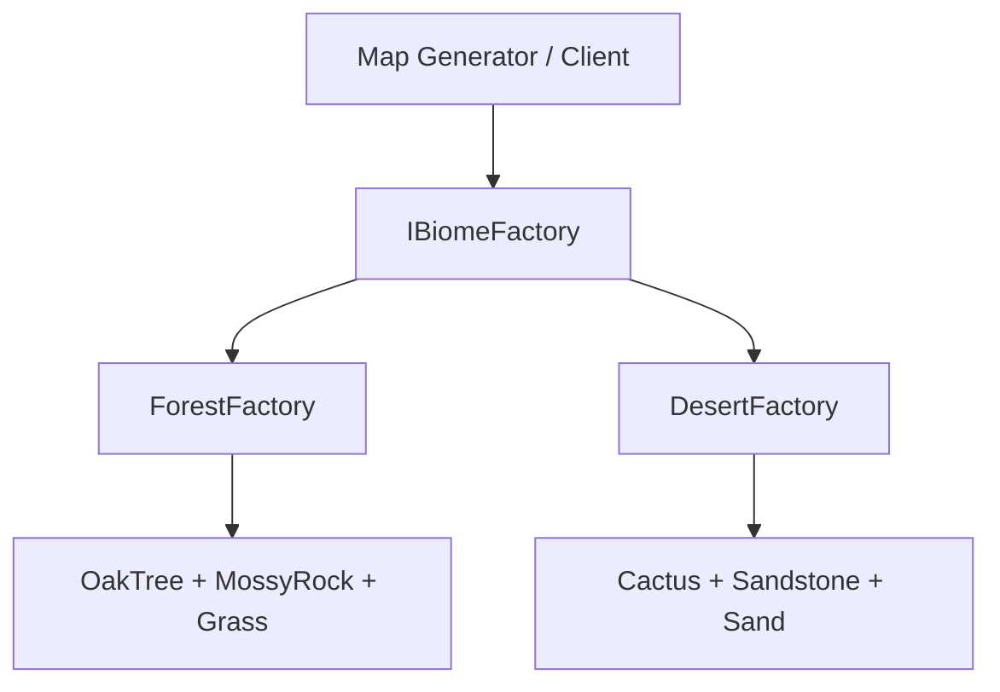
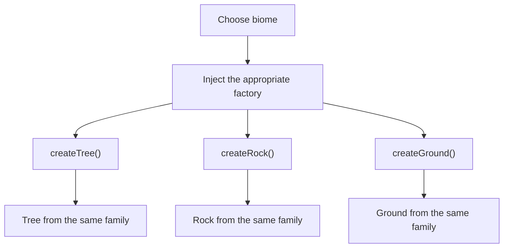
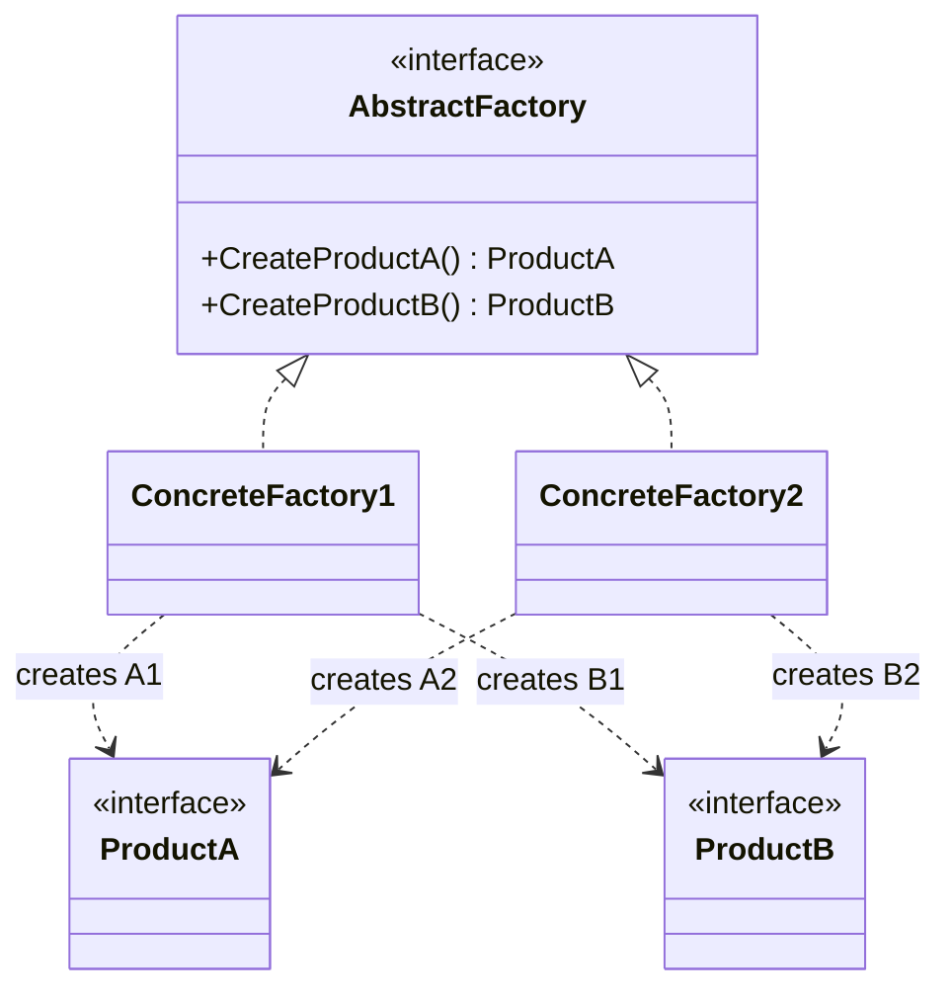

# Abstract Factory

> 📖 **Source:** [Refactoring.Guru — Abstract Factory](https://refactoring.guru/design-patterns/abstract-factory) | Author: Alexander Shvets

---

## 🎯 Intent

**Abstract Factory** is a creational design pattern that provides a mechanism for creating **families of related or dependent objects** without specifying their concrete classes explicitly.

---

## ❌ Problem

Imagine you are writing an open-world (sandbox) game with many different ecological regions (**Biomes**):
- The **Forest Biome** has: *Oak Trees*, *Mossy Rocks*, and *Grass*.
- The **Desert Biome** has: *Cactus plants*, *Sandstone*, and *Sand*.
- You need a Map Generator system that automatically and randomly spawns vegetation and terrain as the player moves around.
- **The problem:** If you hand-write code that assigns each class manually:
  ```csharp
  if (currentBiome == BiomeType.Forest) {
      Instantiate(oakTreePrefab);
      Instantiate(mossyRockPrefab);
  }
  ```
  Your code will quickly become a tangle of giant branching statements.
- Even worse, it becomes very easy to create "theme mismatch" bugs (for example, the Map Generator accidentally spawning a desert cactus in the middle of the green grass of a forest) due to a lack of consistency within the product family. And when you add a new Biome (for example, Snow), you have to dig through the entire Map Generator code to modify it.

---

## ✅ Solution

The **Abstract Factory** pattern suggests:

1.  Define separate interfaces for each type of entity in the system: `ITree`, `IRock`, `IGround`.
2.  All concrete variants implement these interfaces (for example, both `OakTree` and `Cactus` implement `ITree`).
3.  Create the **Abstract Factory** interface `IBiomeFactory` that declares creation methods for each product in the family:
    ```csharp
    interface IBiomeFactory {
        ITree CreateTree();
        IRock CreateRock();
        IGround CreateGround();
    }
    ```
4.  Create specialized concrete factories for each Biome:
    - `ForestBiomeFactory` only creates `OakTree`, `MossyRock`, `Grass`.
    - `DesertBiomeFactory` only creates `Cactus`, `Sandstone`, `Sand`.

Now the Map Generator class only needs to hold a reference to the common `IBiomeFactory` interface. When the player steps into the Forest, the Map Generator is assigned a `ForestBiomeFactory` and automatically spawns exactly the right family of forest vegetation flawlessly, never worrying about a theme mismatch again!

---

## 🎨 Structure

Instead of reading one big UML diagram right away, read the pattern in three layers: **quick idea → real execution flow → simplified UML**.

### 1. Quick Idea



### 2. Real Execution Flow



### 3. Simplified UML



### How to Read the Diagram

| Component | Meaning |
|---|---|
| Quick look | Each factory creates an entire consistent family of objects. |
| Main flow | The client chooses a factory once, then calls the creation methods through the interface. |
| In the game | The Forest biome never mixes in the cactus/sand of the Desert biome. |
| Solid arrow | One object holds a reference to or directly calls another object. |
| Triangle / dashed arrow in UML | Inheritance or interface implementation. |

> Quick-reading tip: first find the **Client/Context**, then follow the arrows to the main interface. The concrete classes are just variations swapped in at runtime.

---

## 💻 Pseudocode

```csharp
// Product line A
interface IAbstractProductA { string UsefulFunctionA(); }
class ConcreteProductA1 : IAbstractProductA { public string UsefulFunctionA() => "Product A1"; }
class ConcreteProductA2 : IAbstractProductA { public string UsefulFunctionA() => "Product A2"; }

// Product line B
interface IAbstractProductB { string UsefulFunctionB(); }
class ConcreteProductB1 : IAbstractProductB { public string UsefulFunctionB() => "Product B1"; }
class ConcreteProductB2 : IAbstractProductB { public string UsefulFunctionB() => "Product B2"; }

// The Abstract Factory defines the methods that create the product family
interface IAbstractFactory
{
    IAbstractProductA CreateProductA();
    IAbstractProductB CreateProductB();
}

// The Concrete Factories create compatible product families
class ConcreteFactory1 : IAbstractFactory
{
    public IAbstractProductA CreateProductA() => new ConcreteProductA1();
    public IAbstractProductB CreateProductB() => new ConcreteProductB1();
}

class ConcreteFactory2 : IAbstractFactory
{
    public IAbstractProductA CreateProductA() => new ConcreteProductA2();
    public IAbstractProductB CreateProductB() => new ConcreteProductB2();
}
```

---

## ⚙️ Applicability

Use Abstract Factory when:
- Your code needs to work with various families of related products, but you don't want it to depend directly on their concrete classes, so it stays easy to extend in the future.
- The system needs to guarantee absolute compatibility and consistency among objects in the same group (for example, the same UI theme, the same ecological region).

---

## 📝 How to Implement

1.  Build a product classification matrix: the columns are product types (Tree, Rock, Ground), and the rows are theme variants (Forest, Desert, Snow).
2.  Declare a common interface for all product types.
3.  Declare the Abstract Factory interface with a set of creation methods for all the abstract product types.
4.  Implement the corresponding Concrete Factories for each variant in the rows, overriding the creation methods to return the correct concrete class for that variant.
5.  In the client code, inject the appropriate concrete factory and use it through the Abstract Factory interface.

---

## ⚖️ Pros and Cons

*   **👍 Pros:**
    *   *Absolute consistency:* Guarantees that the products created by the same factory are always compatible and match the theme 100%.
    *   *Avoids coupling:* The client code is completely independent of the concrete product classes.
    *   *Open/Closed Principle:* Easily add a new product family (for example, SnowBiome) without modifying the core code of the Map Generator.
*   **👎 Cons:**
    *   The code architecture becomes rather bulky and complex due to the large number of new interfaces and classes generated for each entity type.

---

## 🎮 In Game Dev: C# Code Example (Unity)

Implement a **Biome Asset Spawner** system in an open world:

### 1. Declaring the Abstract and Concrete Product Lines
```csharp
using UnityEngine;

// 1. The Tree product line
public interface ITree { void Grow(); }

public class OakTree : ITree
{
    public void Grow() => Debug.Log("A lush forest oak tree grows up!");
}

public class Cactus : ITree
{
    public void Grow() => Debug.Log("A spiky desert cactus grows up!");
}

// 2. The Rock product line
public interface IRock { void Spawn(); }

public class MossyRock : IRock
{
    public void Spawn() => Debug.Log("A green moss-covered rock appears!");
}

public class Sandstone : IRock
{
    public void Spawn() => Debug.Log("A yellow desert sandstone appears!");
}
```

### 2. Defining the Abstract Factory and the Concrete Factories
```csharp
// The common Abstract Factory interface for the Biomes
public interface IBiomeFactory
{
    ITree CreateTree();
    IRock CreateRock();
}

// Specialized factory for the Forest
public class ForestBiomeFactory : IBiomeFactory
{
    public ITree CreateTree() => new OakTree();
    public IRock CreateRock() => new MossyRock();
}

// Specialized factory for the Desert
public class DesertBiomeFactory : IBiomeFactory
{
    public ITree CreateTree() => new Cactus();
    public IRock CreateRock() => new Sandstone();
}
```

### 3. Client Code Using the Abstract Factory
```csharp
public class MapGenerator : MonoBehaviour
{
    private IBiomeFactory biomeFactory;

    // Flexibly switch the Biome Factory at runtime
    public void SetBiome(IBiomeFactory newBiomeFactory)
    {
        biomeFactory = newBiomeFactory;
    }

    // Randomly spawn consistent vegetation and terrain
    public void GenerateZone()
    {
        if (biomeFactory == null) return;

        ITree tree = biomeFactory.CreateTree();
        IRock rock = biomeFactory.CreateRock();

        // Run the logic
        tree.Grow();
        rock.Spawn();
    }
}
```

---

> 📚 **Origin:** Content adapted from [Refactoring.Guru](https://refactoring.guru/) — Author: Alexander Shvets, Illustrations: Dmitry Zhart

| Direction | Link |
|-------|----------|
| ← Back | [Factory Method](./01-factory-method.md) |
| → Next | [Builder](./03-builder.md) |
