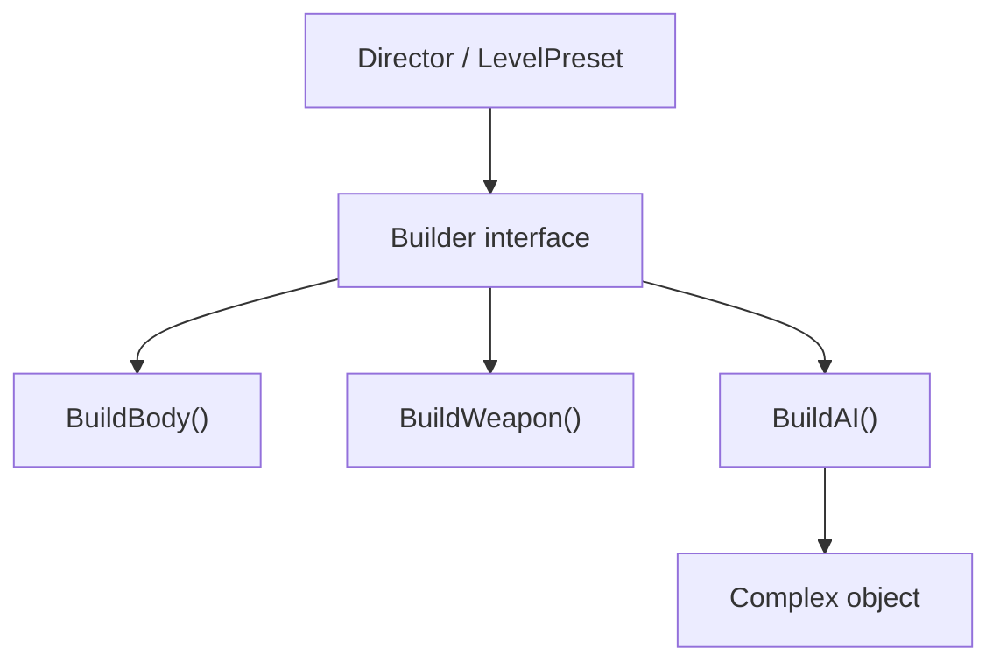
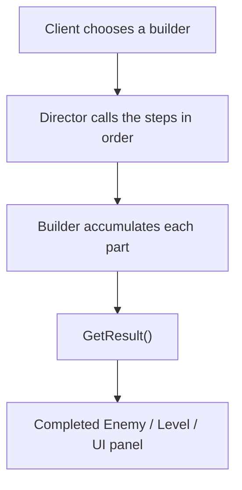
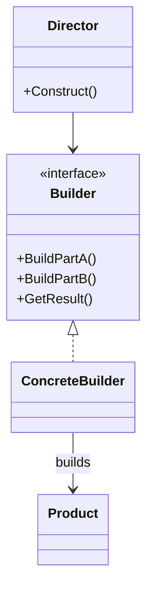

# Builder

> 📖 **Source:** [Refactoring.Guru — Builder](https://refactoring.guru/design-patterns/builder) | Author: Alexander Shvets

---

## 🎯 Intent

**Builder** is a creational design pattern that lets you construct extremely complex objects **step by step**. By using the same construction process, the pattern lets you produce many different variations (configurations) of that object.

---

## ❌ Problem

Imagine you are writing an open-world role-playing game (RPG). You need to create a `Character` class representing the heroes in the game.
- At first, a character has only a few simple attributes: race (`Race`), class (`Class`), and hit points (`HP`).
- Over time, the game adds countless deeply customizable attributes: hairstyle, eye color, helmet, chest armor, shield, primary weapon, magic ring, boots, accompanying pet, and so on.
- **The Telescoping Constructor Problem:** To initialize a fully equipped character, you are forced to write a gigantic constructor with 15-20 parameters:
  ```csharp
  public Character(Race race, Class cls, string name, int hairStyle, string eyeColor, Helmet helmet, Shield shield, Weapon weapon, Ring ring, Pet pet...) { ... }
  ```
- Calling this constructor is torture: it's very easy to mix up the order of the `string` or `int` parameters, and you are forced to pass `null` for the parameters you don't have (for example, a character with no helmet or no pet).
- To work around this, you have to write dozens of additional constructor overloads for each character-configuration case. Your code quickly becomes extremely chaotic and unmaintainable!

---

## ✅ Solution

The **Builder** pattern suggests extracting the object construction logic out of the class itself and moving it into a separate class called the **Builder**.

1.  Extract all the complex attribute-assignment logic out of the `Character` class.
2.  Create a `CharacterBuilder` class that contains methods for assigning each small attribute: `SetRace()`, `SetClass()`, `EquipWeapon()`, `EquipShield()`.
3.  These methods return the Builder instance itself (`return this;`), letting you chain method calls (**Method Chaining / Fluent Interface**) very elegantly.
4.  The final `Build()` method returns the fully assembled `Character` instance.
5.  (Optional) You can also create a **Director** class to predefine standard character-assembly procedures (for example, `ConstructWarrior()`, `ConstructMage()`) for quick reuse.

---

## 🎨 Structure

Instead of reading one big UML diagram right away, read the pattern in three layers: **quick idea → real execution flow → simplified UML**.

### 1. Quick Idea



### 2. Real Execution Flow



### 3. Simplified UML



### How to Read the Diagram

| Component | Meaning |
|---|---|
| Quick look | Separate the build process from the complex object. |
| Main flow | The Director knows the build order; the Builder knows the build details. |
| In the game | Used for level presets, enemy presets, weapon loadouts. |
| Solid arrow | One object holds a reference to or directly calls another object. |
| Triangle / dashed arrow in UML | Inheritance or interface implementation. |

> Quick-reading tip: first find the **Client/Context**, then follow the arrows to the main interface. The concrete classes are just variations swapped in at runtime.

---

## 💻 Pseudocode

```csharp
// The complex object that needs to be built
class Product
{
    public List<string> parts = new List<string>();
    public void Add(string part) => parts.Add(part);
}

// Interface defining the build steps
interface IBuilder
{
    void BuildPartA();
    void BuildPartB();
}

// Concrete builder class
class ConcreteBuilder : IBuilder
{
    private Product product = new Product();

    public void Reset() => product = new Product();
    public void BuildPartA() => product.Add("Part A");
    public void BuildPartB() => product.Add("Part B");

    public Product GetResult()
    {
        Product finishedProduct = product;
        Reset(); // Ready for the next build
        return finishedProduct;
    }
}
```

---

## ⚙️ Applicability

Use Builder when:
- You want to completely eliminate constructors with too many parameters (the Telescoping Constructor syndrome).
- You want to create different variant configurations of the same complex object using the same assembly process (for example, building many different kinds of robots from the same wheel, gun, and engine parts).
- You need to build complex structured objects such as composite trees or nested data, step by step.

---

## 📝 How to Implement

1.  Identify the common build steps for creating the variants of the Product object.
2.  Declare these steps in the common Builder interface.
3.  Create Concrete Builders that implement that interface. The Concrete Builder class must hold an empty Product instance internally and a `Build()` method that returns the result.
4.  (Optional) Build a Director class to group the most common assembly procedures into convenient dedicated methods.
5.  The client code initializes the Builder, passes it to the Director (if one exists) or chains the steps itself to receive the finished Product.

---

## ⚖️ Pros and Cons

*   **👍 Pros:**
    *   *Step-by-step construction:* You can defer some build steps or run them recursively in a flexible way.
    *   *Fluent API:* The object-creation code becomes extremely explicit, clear, and readable.
    *   *Code reuse:* Completely separates the complex creation code from the object's main runtime logic.
*   **👎 Cons:**
    *   The overall number of classes and lines of code increases, because you have to write the accompanying Builder and Director files.

---

## 🎮 In Game Dev: C# Code Example (Unity)

Implement a **Character Customizer** system that assembles game characters:

### 1. The Complex Object to Build: Character
```csharp
using UnityEngine;

public class Character
{
    public string name;
    public string race;
    public string charClass;
    public string weapon;
    public string armor;
    public string pet;

    public void ShowStats()
    {
        Debug.Log($"[Hero: {name}] Race: {race} | Class: {charClass} | Weapon: {weapon} | Armor: {armor} | Pet: {pet ?? "None"}");
    }
}
```

### 2. The Builder Class That Assembles Step by Step
```csharp
public class CharacterBuilder
{
    private Character character = new Character();

    public CharacterBuilder(string name)
    {
        character.name = name;
    }

    public CharacterBuilder SetRace(string race)
    {
        character.race = race;
        return this; // Return this to enable chaining
    }

    public CharacterBuilder SetClass(string charClass)
    {
        character.charClass = charClass;
        return this;
    }

    public CharacterBuilder EquipWeapon(string weapon)
    {
        character.weapon = weapon;
        return this;
    }

    public CharacterBuilder EquipArmor(string armor)
    {
        character.armor = armor;
        return this;
    }

    public CharacterBuilder SummonPet(string petName)
    {
        character.pet = petName;
        return this;
    }

    // Return the finished object
    public Character Build()
    {
        Character completedHero = character;
        character = new Character(); // Reset the state
        return completedHero;
    }
}
```

### 3. The Director Class That Encapsulates Common Character Presets
```csharp
public class CharacterDirector
{
    // Create a standard Human Warrior preset
    public Character BuildStandardWarrior(string name)
    {
        return new CharacterBuilder(name)
            .SetRace("Human")
            .SetClass("Warrior")
            .EquipWeapon("Rusty sword")
            .EquipArmor("Crude iron armor")
            .Build();
    }

    // Create a high-end Elf Mage preset with an accompanying pet
    public Character BuildEliteMage(string name)
    {
        return new CharacterBuilder(name)
            .SetRace("Elf")
            .SetClass("Mage")
            .EquipWeapon("Ancient crystal staff")
            .EquipArmor("Silk robe")
            .SummonPet("Fire phoenix")
            .Build();
    }
}
```

---

> 📚 **Origin:** Content adapted from [Refactoring.Guru](https://refactoring.guru/) — Author: Alexander Shvets, Illustrations: Dmitry Zhart

| Direction | Link |
|-------|----------|
| ← Back | [Abstract Factory](./02-abstract-factory.md) |
| → Next | [Prototype](./04-prototype.md) |
