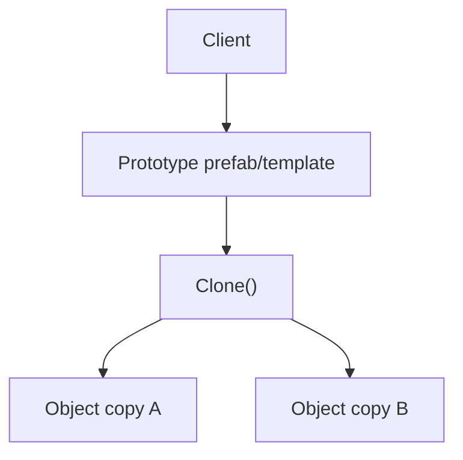
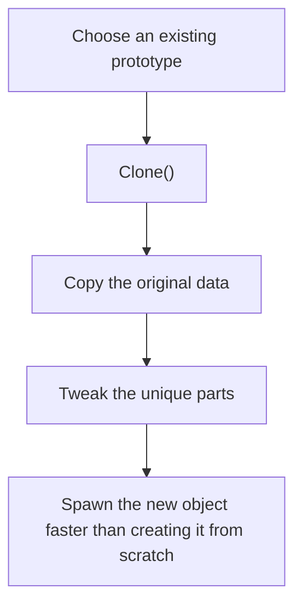
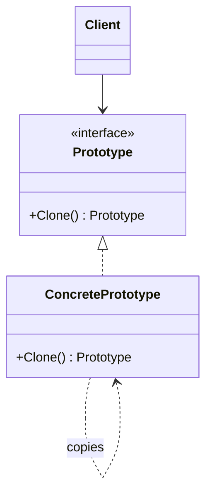

# Prototype

> 📖 **Source:** [Refactoring.Guru — Prototype](https://refactoring.guru/design-patterns/prototype) | Author: Alexander Shvets

---

## 🎯 Intent

**Prototype** is a creational design pattern that lets you copy (clone) an existing object without making your code dependent on that object's concrete classes.

---

## ❌ Problem

Imagine you are writing a real-time strategy (RTS) game like *Age of Empires* or *StarCraft*.
- Your game needs to continuously create thousands of military units (**Soldiers**). Each Soldier is an extremely complex object: it contains expensive 3D mesh models, a materials system, a list of stats (HP, Mana, Armor, Speed), and current AI states.
- **The performance problem:** If every time you create a new soldier you call the constructor and ask the CPU to reload the 3D model, parse a configuration file from disk, and reinitialize everything from scratch, your game will immediately suffer severe frame drops and run out of RAM.
- **The encapsulation problem:** You want to copy a Soldier that already exists in the game (with all its current stats, for example, 50% remaining health and a wooden sword equipped) to create an identical duplicate. If you do it manually from the outside, you have to read each of its data fields to assign them to the new object. But many of a Soldier's important attributes are hidden (private/protected) for safety, so you can't access them to copy from the outside!

---

## ✅ Solution

The **Prototype** pattern solves this problem by delegating the responsibility of copying to **the existing object itself**.

1.  Define an interface with a `Clone()` method (or inherit from the `ICloneable` interface built into C#).
2.  The `Soldier` class itself implements the `Clone()` method.
3.  Inside the `Clone()` method, the `Soldier` object creates a new instance of itself and copies all of its attribute values (including private variables) into this new object.
4.  Client code that wants to create a new soldier only needs to keep a sample instance (the Prototype) as a reference and call:
    `Soldier newSoldier = prototypeSoldier.Clone();`

> [!NOTE]
> In Unity, the **Prototype Pattern** is the core foundation behind the **Prefab** system and the legendary **`Instantiate()`** method! When you drag a Prefab from your Assets into the Scene or call `Instantiate(prefab)`, Unity is cloning an existing prototype object.

---

## 🎨 Structure

Instead of reading one big UML diagram right away, read the pattern in three layers: **quick idea → real execution flow → simplified UML**.

### 1. Quick Idea



### 2. Real Execution Flow



### 3. Simplified UML



### How to Read the Diagram

| Component | Meaning |
|---|---|
| Quick look | The new object is copied from an existing template. |
| Main flow | `Clone()` keeps the original configuration, then lets you tweak the unique parts. |
| In the game | Prefab, bullet template, enemy wave template. |
| Solid arrow | One object holds a reference to or directly calls another object. |
| Triangle / dashed arrow in UML | Inheritance or interface implementation. |

> Quick-reading tip: first find the **Client/Context**, then follow the arrows to the main interface. The concrete classes are just variations swapped in at runtime.

---

## 💻 Pseudocode

```csharp
// The Prototype interface
interface IPrototype
{
    IPrototype Clone();
}

// A concrete object that supports cloning
class ConcretePrototype : IPrototype
{
    private string name;
    private int value;

    public ConcretePrototype(string name, int value)
    {
        this.name = name;
        this.value = value;
    }

    // Copy Constructor
    public ConcretePrototype(ConcretePrototype source)
    {
        this.name = source.name;
        this.value = source.value;
    }

    // Implement the Clone method
    public IPrototype Clone()
    {
        return new ConcretePrototype(this); // Call the copy constructor to clone itself
    }
}
```

---

## ⚙️ Applicability

Use Prototype when:
- Creating a new object directly costs too many system resources (loading files, complex geometric calculations) or requires many cumbersome configuration steps.
- You want to copy the exact current runtime state of an active object into a new, independent object.
- You want to reduce the number of subclasses in the system that differ only in how their initial values are configured. Instead of creating many subclasses, you only need to create sample Prototypes with different values and then clone them.

---

## 📝 How to Implement

1.  Create the Prototype interface and declare the `Clone()` method.
2.  Implement the `Clone()` method in the concrete class:
    *   **Shallow Copy:** Copies only the primitive data types (Value Types like int, float, bool). Reference Types will only have their memory address copied (pointing to the same child instance). In C#, you can quickly call the built-in `this.MemberwiseClone()` method.
    *   **Deep Copy:** Fully and independently clones all the child objects inside. This is the recommended approach for game dev, to avoid bugs where changing an attribute of the copy affects the original in turn.
3.  Create a Registry (or Manager) to store a list of the prototype instances, making it easy for the client to retrieve them and issue clone commands when needed.

---

## ⚖️ Pros and Cons

*   **👍 Pros:**
    *   *Extremely high performance optimization:* Skips the complex initialization process and reloading assets from disk.
    *   *Dynamic state copying:* Clones a game entity exactly as it is at any moment at runtime.
    *   *Reduced coupling:* The client code no longer depends directly on the concrete product class but only interacts through the Prototype interface.
*   **👎 Cons:**
    *   Implementing a **Deep Copy** for classes with extremely complex structures and many cross-cutting circular references is exceptionally difficult and very prone to data-leak bugs.

---

## 🎮 In Game Dev: C# Code Example (Unity)

Implement a **Monster Duplicator** system that clones monsters using a Deep Copy:

### 1. The Interface and Concrete Monster Class
```csharp
using UnityEngine;

// Define the cloning interface
public interface IMonsterPrototype
{
    IMonsterPrototype Clone();
}

// The concrete monster object
public class Monster : IMonsterPrototype
{
    private string species;
    private int currentHP;
    private Weapon equippedWeapon; // A reference-type object (Reference Type)

    public Monster(string species, int hp, Weapon weapon)
    {
        this.species = species;
        this.currentHP = hp;
        this.equippedWeapon = weapon;
    }

    // Implement a DEEP COPY to independently clone the accompanying weapon
    public IMonsterPrototype Clone()
    {
        // 1. Create a new independent weapon for the cloned monster
        Weapon clonedWeapon = new Weapon(equippedWeapon.weaponName, equippedWeapon.damage);
        
        // 2. Return a new Monster fully separated from the original
        return new Monster(this.species, this.currentHP, clonedWeapon);
    }

    public void SetHP(int newHP) => currentHP = newHP;

    public void ShowStatus(string label)
    {
        Debug.Log($"[{label}] Species: {species} | HP: {currentHP} | Weapon: {equippedWeapon.weaponName} (Dmg: {equippedWeapon.damage})");
    }
}

// The supporting weapon object
public class Weapon
{
    public string weaponName;
    public int damage;

    public Weapon(string name, int dmg)
    {
        weaponName = name;
        damage = dmg;
    }
}
```

### 2. Client Code Verifying Independence After Cloning
```csharp
public class SpawnManager : MonoBehaviour
{
    void Start()
    {
        // 1. Create an extremely powerful prototype monster (an Orc Warrior)
        Weapon prototypeSword = new Weapon("Serrated Blade", 50);
        Monster orcPrototype = new Monster("Orc", 500, prototypeSword);
        orcPrototype.ShowStatus("ORIGINAL - Orc Prototype");

        // 2. The player slashes the prototype Orc for 200 HP
        orcPrototype.SetHP(300);
        orcPrototype.ShowStatus("ORIGINAL - Orc Prototype after being slashed");

        // 3. The spawner clones this prototype Orc into a brand-new copy
        Monster clonedOrc = (Monster)orcPrototype.Clone();
        clonedOrc.ShowStatus("CLONED - Orc Copy");

        // 4. Verify independence: increase the copy's health to 1000 HP
        clonedOrc.SetHP(1000);
        
        // See the result: the original's HP is still 300, the copy's HP is 1000. Perfectly independent!
        orcPrototype.ShowStatus("ORIGINAL - Final Orc Prototype");
        clonedOrc.ShowStatus("CLONED - Final Orc Copy");
    }
}
```

---

> 📚 **Origin:** Content adapted from [Refactoring.Guru](https://refactoring.guru/) — Author: Alexander Shvets, Illustrations: Dmitry Zhart

| Direction | Link |
|-------|----------|
| ← Back | [Builder](./03-builder.md) |
| → Next | [Singleton](./05-singleton.md) |
