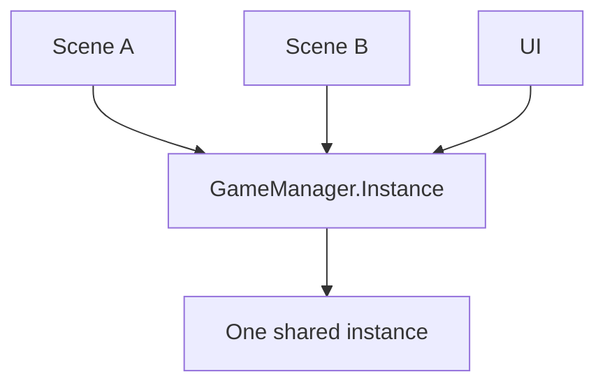
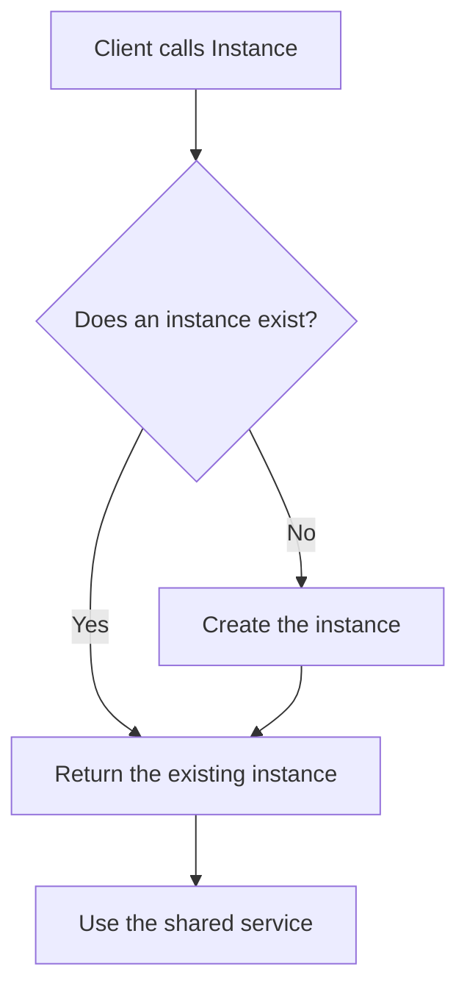
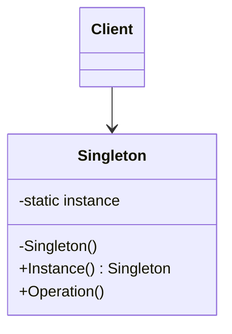

# Singleton

> 📖 **Source:** [Refactoring.Guru — Singleton](https://refactoring.guru/design-patterns/singleton) | Author: Alexander Shvets

---

## 🎯 Intent

**Singleton** is a creational design pattern that ensures a class has only **a single instance** active throughout the lifetime of the application and provides a global access point to that instance.

---

## ❌ Problem

In game development, you have many central management systems (Core Managers) that are allowed to have exactly one active instance:
*   **AudioManager:** Manages all background music and sound effects. If two AudioManagers run at once, the background music will overlap and create extremely chaotic noise.
*   **GameManager:** Manages the game's state loop (Waiting, Playing, Paused, Win, Lose).
*   **SaveSystem:** Manages writing save data to disk.
- **The access problem:** Small individual entities in the game (like Player, Enemy, Item, Coin) constantly need to call these central systems to play sounds or add points. Manually dragging a reference to the `AudioManager` into thousands of monster scripts in the Unity Inspector is impossible and extremely time-consuming. You need a quick, direct way to call them anytime, anywhere in the codebase.

---

## ✅ Solution

The **Singleton** pattern solves both problems by integrating a self-managing instance mechanism directly into the class itself:

1.  **Hide the Constructor:** Make the class's constructor `private`. This completely prevents outside classes from arbitrarily calling `new GameManager()` to create a second, malformed instance.
2.  **Store a Static Instance:** Declare an internal static variable to store the single instance:
    `private static GameManager instance;`
3.  **Provide a Global Access Point:** Create a public static property (usually called `Instance` or `getInstance()`) to return that single instance. Other scripts only need to call it directly:
    `GameManager.Instance.AddScore(10);`

---

## 🎨 Structure

Instead of reading one big UML diagram right away, read the pattern in three layers: **quick idea → real execution flow → simplified UML**.

### 1. Quick Idea



### 2. Real Execution Flow



### 3. Simplified UML



### How to Read the Diagram

| Component | Meaning |
|---|---|
| Quick look | The entire system uses the same instance. |
| Main flow | Accessed through a static gateway, with the constructor locked. |
| In the game | Be careful with GameManager/AudioManager, since they easily create global state that is hard to test. |
| Solid arrow | One object holds a reference to or directly calls another object. |
| Triangle / dashed arrow in UML | Inheritance or interface implementation. |

> Quick-reading tip: first find the **Client/Context**, then follow the arrows to the main interface. The concrete classes are just variations swapped in at runtime.

---

## 💻 Pseudocode

```csharp
class Singleton
{
    // Static variable storing the single instance
    private static Singleton instance;

    // 1. The constructor must be private!
    private Singleton() { }

    // 2. The single global access point
    public static Singleton GetInstance()
    {
        if (instance == null)
        {
            instance = new Singleton(); // Lazy Initialization
        }
        return instance;
    }
}
```

---

## ⚙️ Applicability

Use Singleton when:
- A class in the program must be allowed only one active instance to avoid data conflicts (for example, a file-writing stream, a database connection, audio management).
- You need an easy, lightweight global access point to call core systems from anywhere without passing references cumbersomely through many intermediate layers.

---

## ⚠️ Toxicity Warning: A Game Dev Nightmare!

Although Singleton is an easy-to-write and extremely popular design pattern, it is also **the most overused pattern and is considered an "anti-pattern"** when used carelessly:

1.  **Creates Hidden Dependencies:** When you call `GameManager.Instance`, your class becomes tightly dependent on `GameManager`. If you later want to change this class, every class that calls it will break.
2.  **Hard to Unit Test:** A Singleton stores global state. When running tests, the state from a previous test case directly affects the next one, making it impossible to write independent tests.
3.  **Violates the Single Responsibility Principle:** A Singleton class must both do its specialized job (for example, managing audio) and take on the extra responsibility of managing its own initialization and destruction lifecycle.
4.  **Problematic with Multi-threading:** When multiple CPU threads access and modify a Singleton at the same time, memory-conflict bugs (Race Conditions) occur constantly.

---

## 📝 How to Implement

1.  Declare a static field `private static ClassName instance` in the class.
2.  Make the class's default constructor `private`.
3.  Provide a static property `public static ClassName Instance` that returns the `instance` variable.
4.  In Unity, implement it in the `Awake()` method to automatically destroy malformed duplicates when a new scene loads, and keep the instance alive with `DontDestroyOnLoad()`.

---

## ⚖️ Pros and Cons

*   **👍 Pros:**
    *   Absolutely guarantees that only 1 instance is active.
    *   An extremely convenient, fast global access point for developers.
    *   Supports Lazy Initialization: the object is created only when someone first calls it, saving memory upfront.
*   **👎 Cons:**
    *   Creates a tightly coupled design (Tight Coupling).
    *   Hides dependencies, hindering Unit Testing and automated testing.
    *   Causes memory conflicts in multi-threaded programming.

---

## 🎮 In Game Dev: C# Code Example (Unity)

Implement a proper, safe, duplicate-proof **Game Manager** in Unity:

```csharp
using UnityEngine;

public class GameManager : MonoBehaviour
{
    // 1. Static variable storing the single instance
    public static GameManager Instance { get; private set; }

    // Game state data
    public int playerScore { get; private set; }
    public bool isGameOver { get; private set; }

    // 2. In Unity, the constructor is handled through the Awake method
    private void Awake()
    {
        // Check whether an Instance already exists
        if (Instance != null && Instance != this)
        {
            // If another instance already exists -> destroy this malformed instance immediately!
            Destroy(gameObject);
            return;
        }

        // Assign the single instance
        Instance = this;

        // Keep the GameManager from being destroyed when switching Scenes
        DontDestroyOnLoad(gameObject);
    }

    public void AddScore(int points)
    {
        if (isGameOver) return;
        playerScore += points;
        Debug.Log("Current score: " + playerScore);
    }

    public void TriggerGameOver()
    {
        isGameOver = true;
        Debug.Log("GAME OVER!");
    }
}
```

### 💡 Better Alternatives to Singleton in Unity:
- **ScriptableObjects:** Store shared data and share configuration between Prefabs without a static Instance.
- **Dependency Injection (DI):** Use frameworks like *Zenject/Extenject* to automatically inject system references into the classes that need them, completely eliminating the dependency on a static global.

---

> 📚 **Origin:** Content adapted from [Refactoring.Guru](https://refactoring.guru/) — Author: Alexander Shvets, Illustrations: Dmitry Zhart

| Direction | Link |
|-------|----------|
| ← Back | [Prototype](./04-prototype.md) |
| 🦨 Return | [Creational Patterns Overview](./00-creational-overview.md) |
