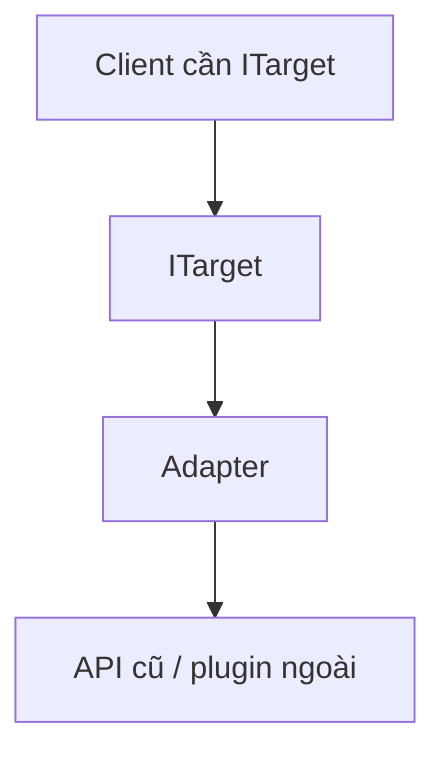
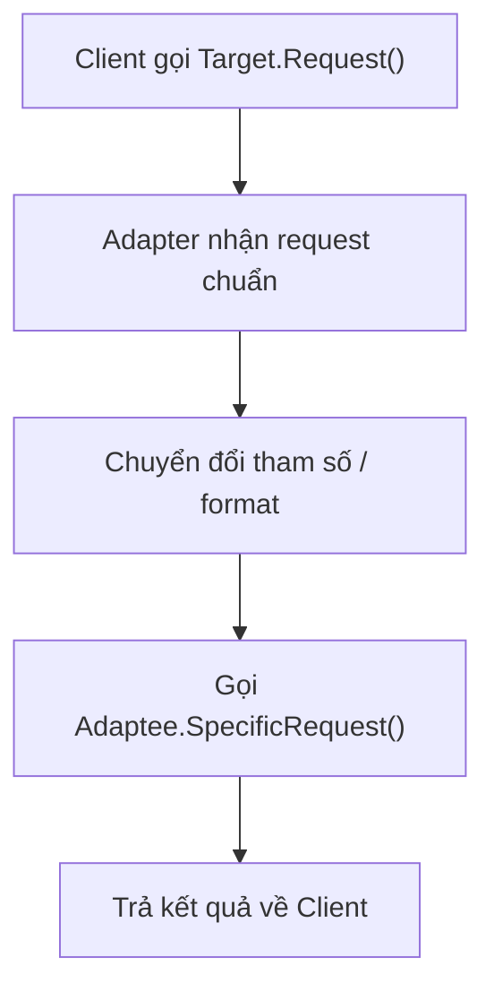
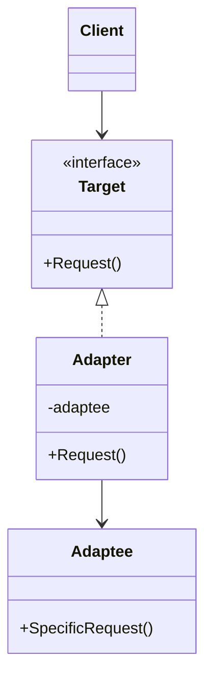

# Adapter

> 📖 **Source:** [Refactoring.Guru — Adapter](https://refactoring.guru/design-patterns/adapter) | Author: Alexander Shvets

---

## 🎯 Intent

**Adapter** is a structural design pattern that allows objects with incompatible interfaces to collaborate and work together. It acts as a converter between two systems, translating requests from the client into a format that the service system expects.

---

## ❌ Problem

Imagine you are upgrading a large MMORPG game project from an old version to a new one.
- The game's old achievement-tracking system is managed by the `LegacyAchievementSystem` class. This class has run stably for the past 5 years, using methods such as `RecordScore(string id, int points)` and `UnlockBadge(string badgeName)`.
- In the new version, you integrate a unified, cross-platform Achievements API (Steam, Google Play, iOS Game Center) through the `IAchievementsManager` interface. This new system requires a very different parameter format: it uses a percentage progress `TrackProgress(string achievementId, float progressPercent)` and completion via `CompleteAchievement(string achievementId)`.
- You cannot modify `LegacyAchievementSystem` directly because it is closed-source code from an old library or has become too complex, and you fear causing regressions in other systems. However, all of the new gameplay logic is written to communicate directly with `IAchievementsManager`.

---

## ✅ Solution

The **Adapter** pattern suggests creating a special class called an **Adapter** that acts as an intermediary:

1.  The Adapter class implements the interface of the new system (`IAchievementsManager`).
2.  The Adapter class holds a reference to an object of the old class (`LegacyAchievementSystem`).
3.  When the gameplay calls `TrackProgress` on the Adapter, this class automatically converts the logic: it calculates the corresponding concrete score from the percentage progress and calls the old system's `RecordScore` method.

As a result, the Client (the new gameplay) can communicate smoothly with the old system through the Adapter without ever needing to know that the old system exists.

---

## 🎨 Structure

Instead of reading one big UML diagram from the start, read the pattern in 3 layers: **quick idea → real execution flow → simplified UML**.

### 1. Quick Idea



### 2. Real Execution Flow



### 3. Simplified UML



### How to Read the Diagram

| Component | Meaning |
|---|---|
| Quick glance | The Adapter is the converter between the desired interface and an existing API. |
| Main flow | The Client doesn't know the Adaptee has a different format. |
| In games | Wrapping an old SDK, input plugin, analytics, or asset loader. |
| Solid-line arrow | An object holds a reference to or directly calls another object. |
| Triangle / dashed arrow in UML | Inheritance or interface implementation. |

> Quick-reading tip: first find the **Client/Context**, then follow the arrow to the main interface. The concrete classes are just variants plugged in at runtime.

---

## 💻 Pseudocode

```csharp
// Giao diện Target mà Client mong đợi
interface ITarget
{
    void Request();
}

// Lớp Adaptee chứa các hàm hữu ích nhưng không tương thích interface
class Adaptee
{
    public void SpecificRequest()
    {
        Print("Yêu cầu đặc thù của hệ thống cũ.");
    }
}

// Lớp Adapter kết nối Target và Adaptee
class Adapter : ITarget
{
    private Adaptee _adaptee;

    public Adapter(Adaptee adaptee)
    {
        this._adaptee = adaptee;
    }

    public void Request()
    {
        // Chuyển đổi cuộc gọi sang định dạng của Adaptee
        this._adaptee.SpecificRequest();
    }
}
```

---

## ⚙️ Applicability

Use Adapter when:
- You want to use an existing class but its interface is not compatible with the rest of your project.
- You want to create a reusable class that is compatible with unknown or unrelated classes in the future (creating a buffer layer — an abstraction layer).
- You need to integrate third-party SDKs/plugins (ads, payments, analytics) whose interfaces change constantly across updates into the core of your game.

---

## 📝 How to Implement

1.  Identify the interface that the client expects (Target).
2.  Identify the existing but incompatible class that needs converting (Adaptee).
3.  Create the Adapter class that implements the Target interface.
4.  Declare a field in the Adapter class that holds the Adaptee instance (Composition). Initialize it through the Constructor.
5.  Implement the Target's methods in the Adapter by calling the corresponding methods of the Adaptee, along with appropriate data-format conversion logic.

---

## ⚖️ Pros and Cons

*   **👍 Pros:**
    *   *Single Responsibility Principle:* Separates the interface-conversion code from the game's main business logic.
    *   *Open/Closed Principle:* You can add new adapters without affecting the code of the Client or the Adaptee.
    *   *High reusability:* Allows you to reuse old classes extremely safely.
*   **👎 Cons:**
    *   Increases the overall complexity of the code because you have to introduce additional new interfaces and intermediary classes.

---

## 🎮 In Game Dev: C# Code Example (Unity)

Below is how to convert the old achievement-saving system to the game's new Achievements API in Unity:

### 1. The Old System (Adaptee - Legacy Achievement System)
```csharp
using UnityEngine;

namespace DesignPatterns.Adapter
{
    // Lớp cũ, không thể chỉnh sửa trực tiếp vì lý do bảo trì hoặc nguồn đóng
    public class LegacyAchievementSystem
    {
        public void RecordScore(string id, int points)
        {
            Debug.Log($"[Legacy System] Ghi nhận thành tích '{id}' đạt {points} điểm.");
        }

        public void UnlockBadge(string badgeName)
        {
            Debug.Log($"[Legacy System] Đã mở khóa huy hiệu: '{badgeName}'!");
        }
    }
}
```

### 2. New Interface (Target) and the Adapter Class
```csharp
namespace DesignPatterns.Adapter
{
    // Interface chuẩn mực mới mà Gameplay và UI đang sử dụng
    public interface IAchievementsManager
    {
        void TrackProgress(string achievementId, float progressPercent);
        void CompleteAchievement(string achievementId);
    }

    // Lớp Adapter thực hiện cầu nối chuyển đổi dữ liệu
    public class LegacyAchievementAdapter : IAchievementsManager
    {
        private readonly LegacyAchievementSystem _legacySystem;
        private const int MAX_POINTS = 100;

        public LegacyAchievementAdapter(LegacyAchievementSystem legacySystem)
        {
            _legacySystem = legacySystem;
        }

        public void TrackProgress(string achievementId, float progressPercent)
        {
            // Chuyển đổi phần trăm (0.0f -> 1.0f) sang điểm số cũ (0 -> 100)
            int points = Mathf.RoundToInt(Mathf.Clamp01(progressPercent) * MAX_POINTS);
            
            // Gọi hàm của hệ thống cũ
            _legacySystem.RecordScore(achievementId, points);
        }

        public void CompleteAchievement(string achievementId)
        {
            // Hoàn thành thành tích đồng nghĩa với mở khóa Badge hệ thống cũ
            _legacySystem.UnlockBadge(achievementId);
        }
    }
}
```

### 3. How to Use It in the Game (Client - GameplayManager)
```csharp
using UnityEngine;

namespace DesignPatterns.Adapter
{
    public class GamePlayManager : MonoBehaviour
    {
        private IAchievementsManager _achievementsManager;

        private void Start()
        {
            // 1. Khởi tạo hệ thống cũ
            LegacyAchievementSystem legacySystem = new LegacyAchievementSystem();

            // 2. Wrap hệ thống cũ qua bộ chuyển đổi Adapter
            _achievementsManager = new LegacyAchievementAdapter(legacySystem);

            // 3. Gameplay mới sử dụng interface mới mượt mà
            Debug.Log("--- Gameplay bắt đầu tiêu diệt quái vật ---");
            
            // Người chơi tiêu diệt được 50% số lượng quái yêu cầu
            _achievementsManager.TrackProgress("MONSTER_SLAYER", 0.5f);

            // Người chơi hoàn thành thử thách
            _achievementsManager.CompleteAchievement("MONSTER_SLAYER");
        }
    }
}
```

---

> 📚 **Origin:** Content adapted from [Refactoring.Guru](https://refactoring.guru/) — Author: Alexander Shvets, Illustrations: Dmitry Zhart

| Direction | Link |
|-------|----------|
| ← Back | [Structural Patterns Overview](./00-structural-overview.md) |
| → Next | [Bridge](./02-bridge.md) |
