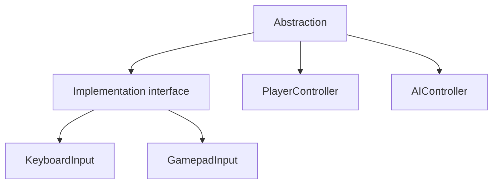
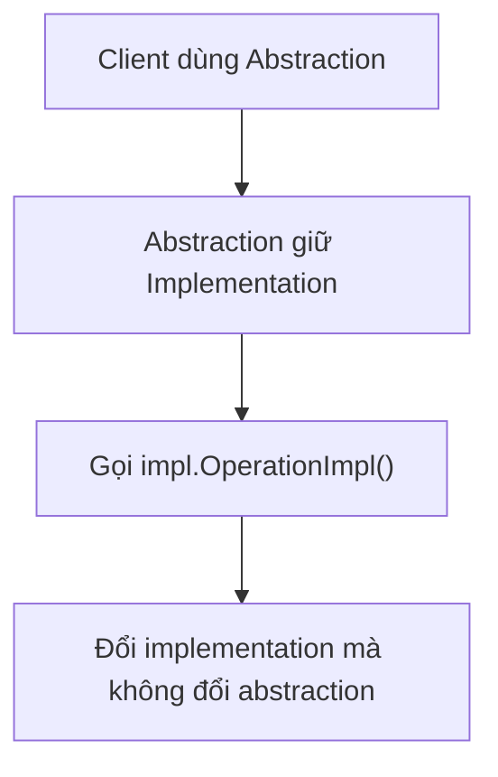
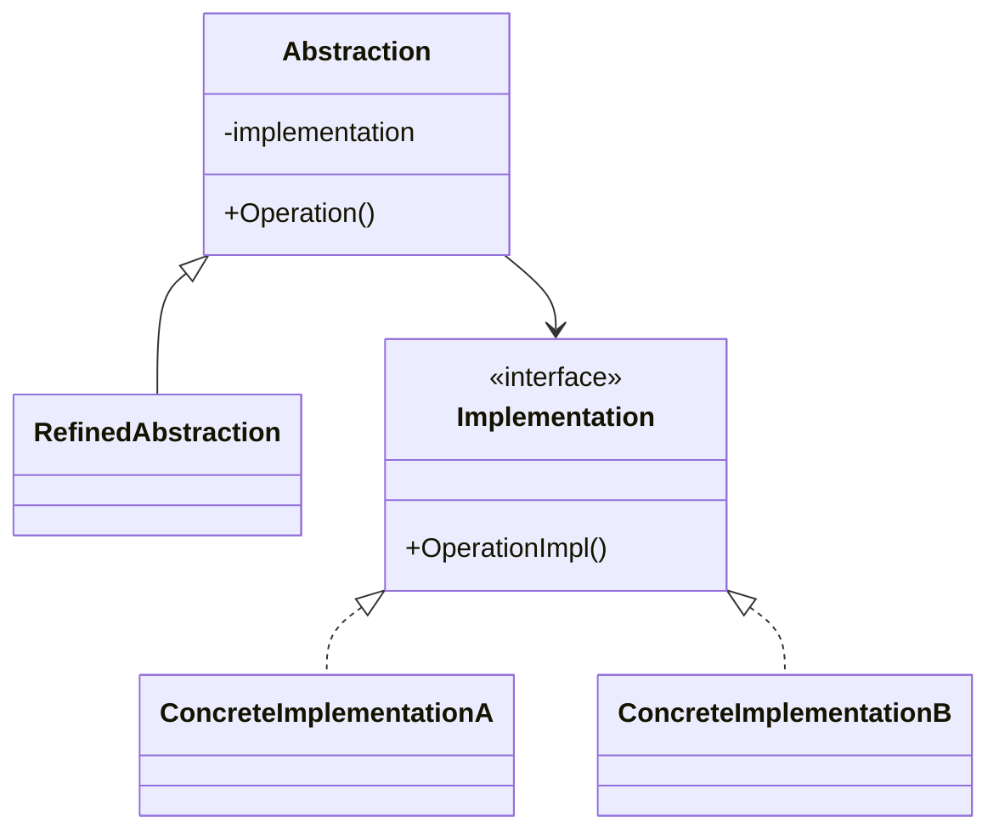

# Bridge

> 📖 **Source:** [Refactoring.Guru — Bridge](https://refactoring.guru/design-patterns/bridge) | Author: Alexander Shvets

---

## 🎯 Intent

**Bridge** is a structural design pattern that lets you split a large class (or a set of closely related classes) into two separate hierarchies: **Abstraction** and **Implementation**, which can be developed independently of each other.

---

## ❌ Problem

Imagine you are building a Weapon System for an action RPG game.
- Initially, you have two weapon types: `Sword` and `Bow`.
- You want to add different elemental effects (VFX/SFX) to each weapon type: `Fire` and `Ice`.
- If you use traditional inheritance, you have to create subclasses such as: `FireSword`, `IceSword`, `FireBow`, `IceBow`.
- In the future, if the designer wants to add a new weapon type, `Staff`, and a new effect, `Shadow`, the number of subclasses explodes exponentially ($M \times N$):
  *   *New weapons:* `ShadowSword`, `ShadowBow`, `FireStaff`, `IceStaff`, `ShadowStaff`...
  *   This leads to extremely severe duplication of VFX/SFX code, and the class hierarchy becomes bloated and unmanageable.

---

## ✅ Solution

The **Bridge** pattern proposes switching from inheritance to composition.

1.  **Separate the two hierarchies:**
    *   **Abstraction hierarchy (Gameplay Logic):** Defines how a weapon type behaves (e.g., a melee sword, a long-range bow).
    *   **Implementation hierarchy (Visual & Sound):** Defines how the elemental effects are presented (e.g., playing a fire effect, playing an icy sound).
2.  The base class `Weapon` (Abstraction) holds a reference to the `IWeaponVisual` interface (Implementation).
3.  When the `Attack()` method is called, the weapon only performs its own mathematical logic (such as calculating damage) and delegates the visual/audio presentation to the `IWeaponVisual` object through that reference.

This way, we only need to create $M + N$ classes instead of $M \times N$ classes. We can easily add new weapons or new effects without modifying existing classes. We can even swap a weapon's effect at runtime (such as when the character picks up an elemental buff).

---

## 🎨 Structure

Instead of reading one large UML diagram right away, read the pattern in three layers: **quick idea → real runtime flow → condensed UML**.

### 1. Quick idea



### 2. Luồng chạy thực tế



### 3. Condensed UML



### How to read the diagram

| Component | Meaning |
|---|---|
| Quick look | Separate two independent axes of change. |
| Main flow | The abstraction delegates to the implementation currently attached. |
| In game | Separate the gameplay object from the input/render/audio backend. |
| Solid arrow | An object holds a reference to, or directly calls, another object. |
| Triangle / dashed arrow in UML | Inheritance or interface implementation. |

> Quick reading tip: first find the **Client/Context**, then follow the arrows to the main interface. The concrete classes are merely variants plugged in at runtime.

---

## 💻 Pseudocode

```csharp
// Phân cấp Thực thi (Implementation)
interface IImplementation
{
    void MethodImpl();
}

// Phân cấp Trừu tượng (Abstraction)
class Abstraction
{
    protected IImplementation _impl;
    
    public Abstraction(IImplementation impl)
    {
        _impl = impl;
    }
    
    public virtual void Operation()
    {
        _impl.MethodImpl();
    }
}

// Lớp trừu tượng mở rộng (Refined Abstraction)
class RefinedAbstraction : Abstraction
{
    public RefinedAbstraction(IImplementation impl) : base(impl) {}
    
    public override void Operation()
    {
        base.Operation();
        // Logic bổ sung riêng
    }
}
```

---

## ⚙️ Applicability

Use Bridge when:
- You want to divide and organize a monolithic class that has many variants on both the logic side and the graphical presentation side.
- You need to develop the abstraction layer (Gameplay Mechanics) and the implementation layer (Platform-specific API, VFX/SFX, Rendering Engine) independently.
- You want the ability to switch between different implementation components while the game is running (runtime), without recreating the entire game object.

---

## 📝 How to Implement

1.  Identify the independent dimensions within your class (e.g., weapon type vs. elemental effect).
2.  Create a common interface for the implementation hierarchy and define the required methods.
3.  In the abstract parent class (Abstraction), declare a field of the newly created interface type and set it through a constructor or a property setter.
4.  Extend the abstract parent class to create concrete abstractions (Refined Abstraction) that contain the main business logic.
5.  Implement the Implementation interface in the concrete subclasses to handle the detailed graphics/audio.
6.  In the Client, instantiate the desired Implementation object and pass it into the Abstraction's constructor.

---

## ⚖️ Pros and Cons

*   **👍 Pros:**
    *   *Fewer inheritance classes:* Turns an $M \times N$ hierarchy into a flat $M + N$ structure.
    *   *Open/Closed Principle:* You can add new weapon types and new effects completely independently.
    *   *Single Responsibility Principle:* Separates the gameplay computation code (Dev) from the animation/audio control code (Artist).
    *   *Runtime Flexibility:* You can change a weapon's visual effect at runtime simply by reassigning the Implementation reference.
*   **👎 Cons:**
    *   It can make the source code harder to read at first for those who are unfamiliar with the Bridge/Composition model.

---

## 🎮 In Game Dev: C# Code Example (Unity)

Below is a Weapon System that fully separates the gameplay logic (Sword, Bow) from the visual and audio effects (Fire, Ice) in Unity:

### 1. Implementation Hierarchy (IWeaponVisual and the Concrete Implementations)
```csharp
using UnityEngine;

namespace DesignPatterns.Bridge
{
    // Giao diện điều khiển hình ảnh và âm thanh của vũ khí
    public interface IWeaponVisual
    {
        void PlayAttackEffects(Vector3 spawnPosition);
        void PlayHitSound();
    }

    // Hiệu ứng lửa (Fire Elemental)
    public class FireWeaponVisual : IWeaponVisual
    {
        public void PlayAttackEffects(Vector3 spawnPosition)
        {
            Debug.Log($"[VFX] Bùng nổ hạt lửa đỏ rực rỡ tại {spawnPosition}!");
            // Thực tế sẽ Instantiate một Particle System lửa ở đây:
            // Object.Instantiate(firePrefab, spawnPosition, Quaternion.identity);
        }

        public void PlayHitSound()
        {
            Debug.Log("[SFX] Âm thanh xèo xèo thiêu đốt!");
        }
    }

    // Hiệu ứng băng (Ice Elemental)
    public class IceWeaponVisual : IWeaponVisual
    {
        public void PlayAttackEffects(Vector3 spawnPosition)
        {
            Debug.Log($"[VFX] Tạo chông băng nhọn hoắt tỏa hơi lạnh tại {spawnPosition}!");
        }

        public void PlayHitSound()
        {
            Debug.Log("[SFX] Âm thanh rạn nứt đóng băng giòn giã!");
        }
    }
}
```

### 2. Abstraction Hierarchy (Weapon and the Refined Abstractions)
```csharp
namespace DesignPatterns.Bridge
{
    // Lớp trừu tượng đại diện cho Vũ khí
    public abstract class Weapon
    {
        // Cầu nối (Bridge) sang phần thực thi hiển thị
        protected IWeaponVisual weaponVisual;

        protected Weapon(IWeaponVisual visual)
        {
            weaponVisual = visual;
        }

        // Cho phép thay đổi hiệu ứng ở runtime (Enchantment)
        public void SetVisual(IWeaponVisual newVisual)
        {
            weaponVisual = newVisual;
        }

        public abstract void PerformAttack(Vector3 targetPosition);
    }

    // Kiếm cận chiến
    public class Sword : Weapon
    {
        public Sword(IWeaponVisual visual) : base(visual) { }

        public override void PerformAttack(Vector3 targetPosition)
        {
            Debug.Log("[Weapon System] Thực hiện nhát chém chí mạng cận chiến!");
            
            // Gọi phần thực thi hiển thị thông qua cầu nối
            weaponVisual.PlayAttackEffects(targetPosition);
            weaponVisual.PlayHitSound();
        }
    }

    // Cung bắn xa
    public class Bow : Weapon
    {
        public Bow(IWeaponVisual visual) : base(visual) { }

        public override void PerformAttack(Vector3 targetPosition)
        {
            Debug.Log("[Weapon System] Bắn ra mũi tên xuyên thấu tầm xa!");
            
            // Gọi phần thực thi hiển thị thông qua cầu nối
            weaponVisual.PlayAttackEffects(targetPosition);
            weaponVisual.PlayHitSound();
        }
    }
}
```

### 3. Client Test Component in Unity
```csharp
using UnityEngine;

namespace DesignPatterns.Bridge
{
    public class CombatManager : MonoBehaviour
    {
        private void Start()
        {
            // 1. Tạo các đối tượng thực thi hiệu ứng
            IWeaponVisual fireEffect = new FireWeaponVisual();
            IWeaponVisual iceEffect = new IceWeaponVisual();

            // 2. Khởi tạo vũ khí kiếm mang hiệu ứng lửa
            Debug.Log("--- Khởi tạo Kiếm Lửa ---");
            Weapon mySword = new Sword(fireEffect);
            mySword.PerformAttack(new Vector3(2f, 0f, 0f));

            // 3. Khởi tạo cung mang hiệu ứng băng
            Debug.Log("\n--- Khởi tạo Cung Băng ---");
            Weapon myBow = new Bow(iceEffect);
            myBow.PerformAttack(new Vector3(10f, 2f, 0f));

            // 4. Thay đổi hiệu ứng của thanh kiếm sang băng tại runtime (Nhặt bùa băng)
            Debug.Log("\n--- Thanh kiếm được phù phép băng (Enchant Ice) ---");
            mySword.SetVisual(iceEffect);
            mySword.PerformAttack(new Vector3(3f, 0f, 0f));
        }
    }
}
```

---

> 📚 **Source:** Content adapted from [Refactoring.Guru](https://refactoring.guru/) — Author: Alexander Shvets, Illustrations: Dmitry Zhart

| Direction | Link |
|-------|----------|
| ← Back | [Adapter](./01-adapter.md) |
| → Next | [Composite](./03-composite.md) |
