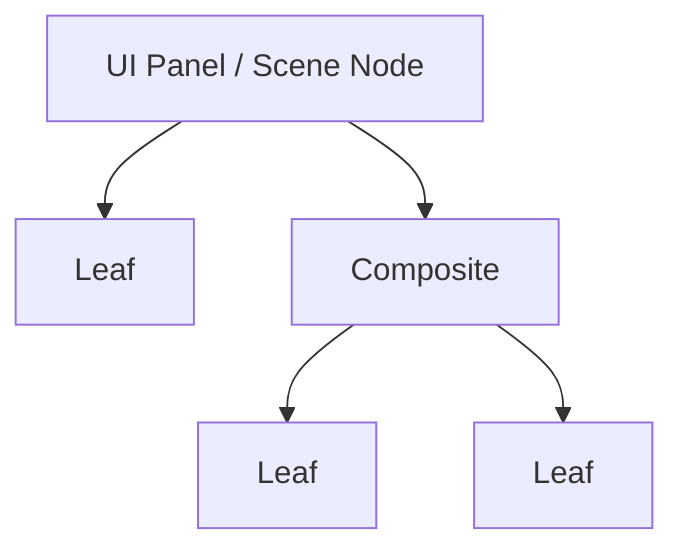
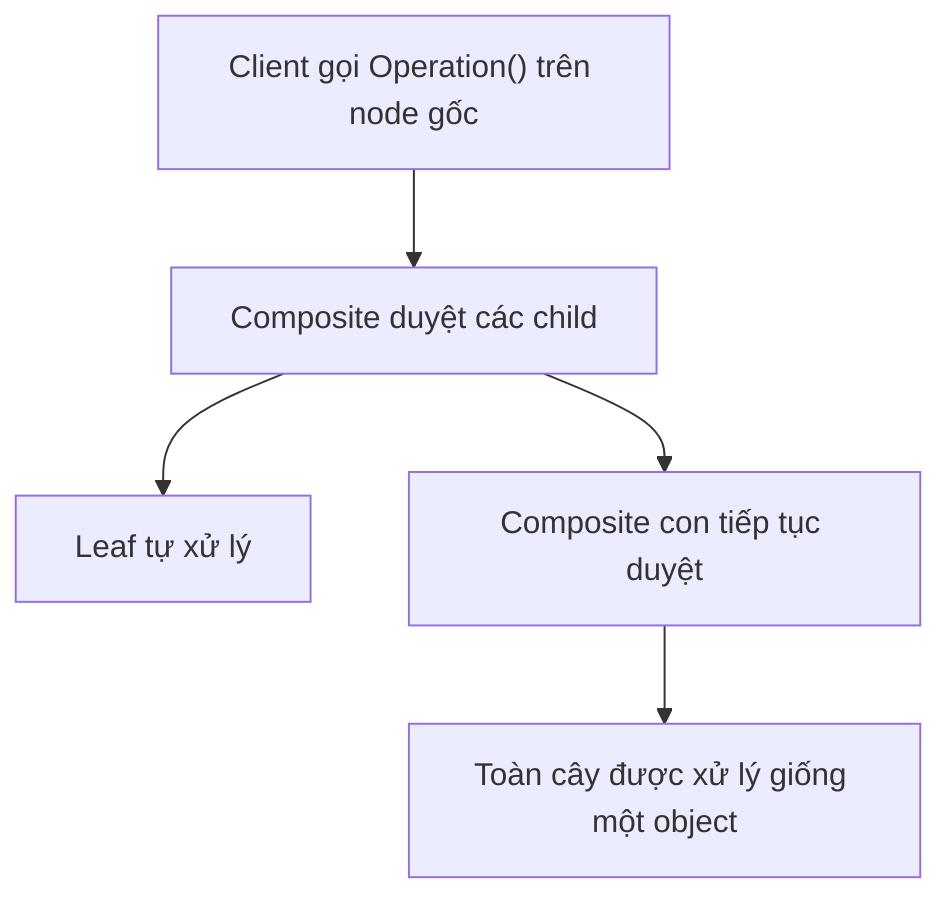
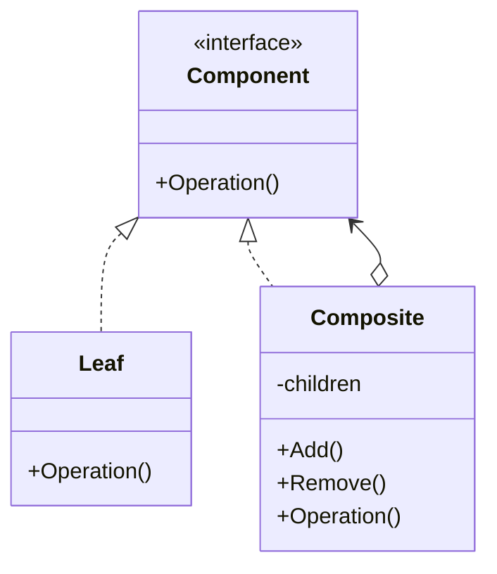

# Composite

> 📖 **Source:** [Refactoring.Guru — Composite](https://refactoring.guru/design-patterns/composite) | Author: Alexander Shvets

---

## 🎯 Intent

**Composite** is a structural design pattern that lets you compose objects into a tree structure and then work with these structures as if they were individual objects (uniformity between a single object and a group of objects).

---

## ❌ Problem

Imagine you are programming an Inventory System for a survival RPG game.
- The player can own single items such as: `Sword` (weighs 2kg, worth 150 gold), `Health Potion` (weighs 0.2kg, worth 15 gold).
- The player can also own container items such as a `Pouch`, a `Backpack`, or a `Treasure Chest` they find. A backpack can hold a few health potions, a sword, and... another smaller pouch inside it.
- When you need to compute the **total weight** of the luggage to see whether the player is overencumbered, or the **total value** of the inventory to sell to a merchant, you run into a big problem.
- Without a proper design pattern, you have to write type-checking code: iterate through the list, and for any item that is a container, open it and recursively iterate the items inside, while any item that is a single item gets added directly. This produces tangled nested loops that are extremely error-prone and hard to maintain when adding new item types.

---

## ✅ Solution

The **Composite** pattern advises you to use a common interface for both single items and container items. This interface is called **Component** (in the game, it is `IInventoryItem`).

1.  **Component (`IInventoryItem`):** Defines common methods such as `GetWeight()` and `GetValue()` (get the gold value).
2.  **Leaf (`SingleItem`):** Represents a basic item that contains nothing else. This class simply returns its own weight and value.
3.  **Composite (`ItemContainer`):** Represents container items (Backpack, Pouch, Chest). It holds a list of child `IInventoryItem`s.
    *   Its `GetWeight()` method automatically iterates over all the child items inside, calling each one's `GetWeight()` and summing them up (plus the empty weight of the bag itself, if any).

When the Client wants to calculate the total weight of the entire backpack, they simply call `backpack.GetWeight()`. The backpack automatically queries its child items, regardless of whether a child is a small health potion or another intermediate pouch. The recursive call automatically propagates throughout the tree structure.

---

## 🎨 Structure

Instead of reading one large UML diagram right away, read the pattern in three layers: **quick idea → real runtime flow → condensed UML**.

### 1. Quick idea



### 2. Luồng chạy thực tế



### 3. Condensed UML



### How to read the diagram

| Component | Meaning |
|---|---|
| Quick look | Leaf and group share the same interface. |
| Main flow | The client works with the whole tree as a single object. |
| In game | Scene hierarchy, UI hierarchy, skill tree. |
| Solid arrow | An object holds a reference to, or directly calls, another object. |
| Triangle / dashed arrow in UML | Inheritance or interface implementation. |

> Quick reading tip: first find the **Client/Context**, then follow the arrows to the main interface. The concrete classes are merely variants plugged in at runtime.

---

## 💻 Pseudocode

```csharp
// Giao diện chung Component
interface IComponent
{
    void Execute();
}

// Đối tượng Lá (Leaf)
class Leaf : IComponent
{
    public void Execute()
    {
        // Thực hiện hành vi của đối tượng đơn lẻ
    }
}

// Đối tượng Hỗn hợp (Composite)
class Composite : IComponent
{
    private List<IComponent> _children = new List<IComponent>();

    public void Add(IComponent component) => _children.Add(component);
    public void Remove(IComponent component) => _children.Remove(component);

    public void Execute()
    {
        // Duyệt đệ quy qua tất cả các con
        foreach (var child in _children)
        {
            child.Execute();
        }
    }
}
```

---

## ⚙️ Applicability

Use Composite when:
- You need to represent tree-like hierarchical relationships (parent–child, container–contained) in the game world.
- You want client code to be able to ignore the difference between individual objects and groups of objects, allowing the client to interact uniformly with every component.
- Typical in games: hierarchical UI systems (Canvas -> Panel -> Button/Text), skill tree systems, inventory systems, or military organization charts (Corps -> Division -> Platoon -> Soldier).

---

## 📝 How to Implement

1.  Make sure the game's domain model can be represented as a tree structure.
2.  Declare a Component interface (e.g., `IInventoryItem`) with the common business methods (such as getting weight, calculating sale price).
3.  Create a Leaf class to represent the terminal elements. Implement the business methods to return the Leaf's direct values.
4.  Create a Composite class to represent the nodes that contain other elements.
    *   Declare an array or list to hold the Component-typed elements.
    *   Provide child-management methods such as `Add()` and `Remove()`.
    *   Implement the business methods by iterating over the child list and recursively calling the children's corresponding methods.

---

## ⚖️ Pros and Cons

*   **👍 Pros:**
    *   *Strong polymorphism:* Keeps client code clean, with no need for manual type checking or excessive nested loops.
    *   *Open/Closed Principle:* You can easily introduce new leaf item types or new chest/bag types into the game without breaking the existing calculation logic.
*   **👎 Cons:**
    *   It is hard to create hard type restrictions at compile-time (for example, preventing an Iron Chest from being placed inside a small cloth Pouch). You have to handle this nesting validation logic at runtime.

---

## 🎮 In Game Dev: C# Code Example (Unity)

Below is how to implement a nested inventory system in Unity using Composite:

### 1. Component Interface
```csharp
namespace DesignPatterns.Composite
{
    // Interface chung cho tất cả vật phẩm trong hòm đồ
    public interface IInventoryItem
    {
        string GetName();
        float GetWeight();
        int GetValue();
    }
}
```

### 2. Leaf Class (Single Item)
```csharp
namespace DesignPatterns.Composite
{
    // Đại diện cho một vật phẩm đơn lẻ
    public class SingleItem : IInventoryItem
    {
        private string name;
        private float weight;
        private int value;

        public SingleItem(string name, float weight, int value)
        {
            this.name = name;
            this.weight = weight;
            this.value = value;
        }

        public string GetName() => name;
        public float GetWeight() => weight;
        public int GetValue() => value;
    }
}
```

### 3. Composite Class (Container Item - Backpack/Pouch/Chest)
```csharp
using System.Collections.Generic;
using System.Text;

namespace DesignPatterns.Composite
{
    // Đại diện cho hộp chứa, túi đồ có thể chứa các IInventoryItem khác
    public class ItemContainer : IInventoryItem
    {
        private string containerName;
        private float containerEmptyWeight; // Trọng lượng bản thân chiếc túi khi rỗng
        private List<IInventoryItem> storedItems = new List<IInventoryItem>();

        public ItemContainer(string name, float emptyWeight)
        {
            this.containerName = name;
            this.containerEmptyWeight = emptyWeight;
        }

        public void AddItem(IInventoryItem item)
        {
            storedItems.Add(item);
        }

        public void RemoveItem(IInventoryItem item)
        {
            storedItems.Remove(item);
        }

        public string GetName() => containerName;

        // Tính tổng trọng lượng đệ quy: Trọng lượng túi rỗng + trọng lượng các vật phẩm bên trong
        public float GetWeight()
        {
            float totalWeight = containerEmptyWeight;
            foreach (var item in storedItems)
            {
                totalWeight += item.GetWeight();
            }
            return totalWeight;
        }

        // Tính tổng giá trị đệ quy: Tổng giá trị của các vật phẩm bên trong
        public int GetValue()
        {
            int totalValue = 0;
            foreach (var item in storedItems)
            {
                totalValue += item.GetValue();
            }
            return totalValue;
        }

        // Hàm helper để in ra cấu trúc hòm đồ dạng cây
        public string GetStructureInfo(int indent = 0)
        {
            StringBuilder sb = new StringBuilder();
            string indentSpace = new string(' ', indent * 4);
            sb.AppendLine($"{indentSpace}[Container] {containerName} (Nặng: {GetWeight()}kg | Trị giá: {GetValue()} Vàng)");
            
            foreach (var item in storedItems)
            {
                if (item is ItemContainer subContainer)
                {
                    sb.Append(subContainer.GetStructureInfo(indent + 1));
                }
                else
                {
                    sb.AppendLine($"{indentSpace}    - {item.GetName()} ({item.GetWeight()}kg | {item.GetValue()} Vàng)");
                }
            }
            return sb.ToString();
        }
    }
}
```

### 4. Client Test Component in Unity
```csharp
using UnityEngine;

namespace DesignPatterns.Composite
{
    public class InventoryTest : MonoBehaviour
    {
        private void Start()
        {
            // 1. Tạo các vật phẩm lá đơn lẻ
            IInventoryItem ironSword = new SingleItem("Kiếm Sắt", 2.5f, 120);
            IInventoryItem redPotion = new SingleItem("Bình Máu Đỏ", 0.2f, 15);
            IInventoryItem goldRing = new SingleItem("Nhẫn Vàng", 0.05f, 500);

            // 2. Tạo một Túi nhỏ (Pouch) đựng Potion
            ItemContainer potionPouch = new ItemContainer("Túi Thuốc Nhỏ", 0.1f);
            potionPouch.AddItem(redPotion);
            potionPouch.AddItem(new SingleItem("Bình Mana Xanh", 0.2f, 20));

            // 3. Tạo một Balo (Backpack) lớn của người chơi
            ItemContainer backpack = new ItemContainer("Balo Thám Hiểm", 1.0f);
            
            // Thêm kiếm sắt và nhẫn vàng vào balo
            backpack.AddItem(ironSword);
            backpack.AddItem(goldRing);
            
            // Thêm chiếc túi thuốc nhỏ (Pouch) vào balo (Composite lồng Composite)
            backpack.AddItem(potionPouch);

            // 4. In ra thông tin chi tiết
            Debug.Log("--- CẤU TRÚC HÒM ĐỒ CỦA NGƯỜI CHƠI ---");
            Debug.Log(backpack.GetStructureInfo());

            // 5. Tính toán nhanh
            Debug.Log($"Tổng trọng lượng của Balo: {backpack.GetWeight()} kg");
            Debug.Log($"Tổng giá trị kinh tế của Balo: {backpack.GetValue()} Vàng");
        }
    }
}
```

---

> 📚 **Source:** Content adapted from [Refactoring.Guru](https://refactoring.guru/) — Author: Alexander Shvets, Illustrations: Dmitry Zhart

| Direction | Link |
|-------|----------|
| ← Back | [Bridge](./02-bridge.md) |
| → Next | [Decorator](./04-decorator.md) |
