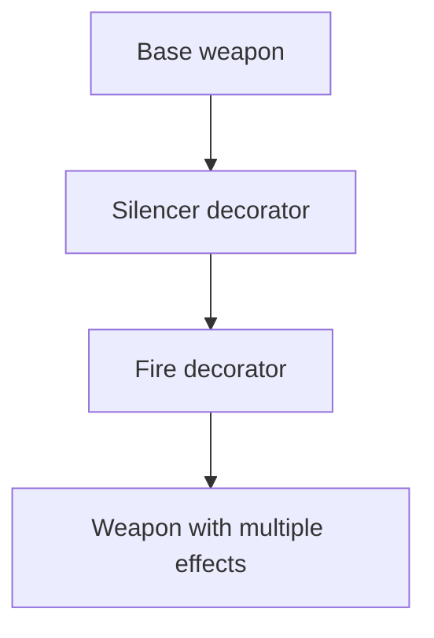
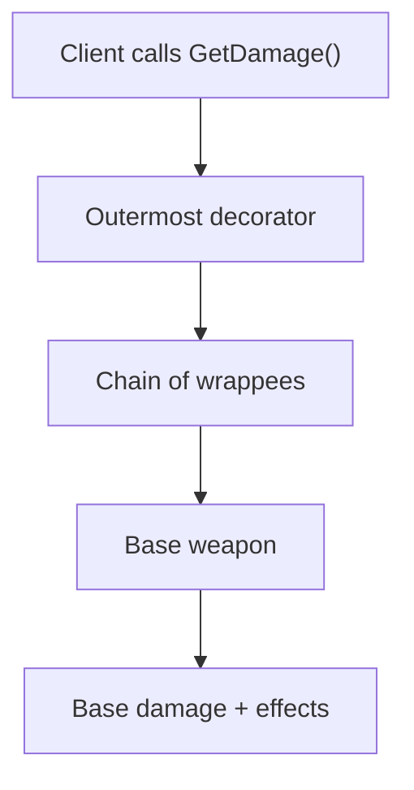
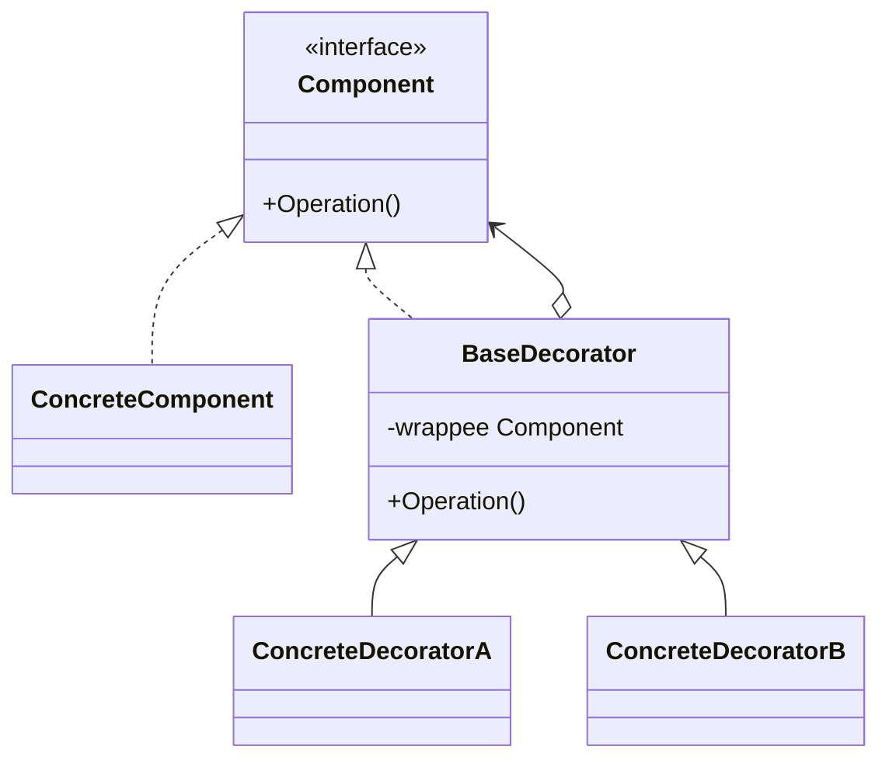

# Decorator

> 📖 **Source:** [Refactoring.Guru — Decorator](https://refactoring.guru/design-patterns/decorator) | Author: Alexander Shvets

---

## 🎯 Intent

**Decorator** is a structural design pattern that lets you attach new behaviors and features to an object dynamically (at runtime) by placing the object inside special "wrapper" objects that contain those behaviors.

---

## ❌ Problem

Imagine you're writing code for a Weapon system in a survival shooter or an RPG.
- You have a basic weapon class called `SimpleWeapon` (a standard rifle) that deals 20 damage.
- Players can pick up upgrade attachments or enchantments to mount onto the weapon, such as:
  *   `Silencer`: Reduces noise and slightly lowers base damage by 2, but increases critical chance.
  *   `FireAmmo`: Adds a burning effect, granting an extra 5 fire damage.
  *   `PoisonAmmo`: Adds a poison drain effect, granting an extra 3 poison damage.
- If you use inheritance, you'll have to create a whole series of classes to cover every possible combination: `SilencedWeapon`, `FireWeapon`, `PoisonWeapon`, `SilencedFireWeapon`, `SilencedPoisonWeapon`, `FirePoisonWeapon`, `SilencedFirePoisonWeapon`...
- This leads to an uncontrollable subclass explosion. At the same time, you can't easily attach or detach accessories or change weapon effects mid-battle when the player presses the button to remove an attachment.

---

## ✅ Solution

The **Decorator** pattern proposes replacing direct inheritance with **Wrapping**.

1.  **Component (`IWeapon`):** Defines a common interface for both the base weapon and the decorative attachments.
2.  **Concrete Component (`SimpleWeapon`):** The raw, original base weapon that implements `IWeapon`.
3.  **Base Decorator (`WeaponDecorator`):** Implements the `IWeapon` interface and holds a reference to another `IWeapon` object. This class is responsible for forwarding every method call (such as computing damage or retrieving the description) to the object wrapped inside it.
4.  **Concrete Decorators (`FireEnchantment`, `SilencerDecorator`):** Override the parent Decorator's methods to add their own logic (for example, taking the inner weapon's damage and then adding fire elemental damage).

When the game runs, we can assemble weapons like layers of an onion nested inside one another:
*   Start with: `IWeapon myWeapon = new SimpleWeapon();` (Damage: 20)
*   Add a silencer: `myWeapon = new SilencerDecorator(myWeapon);` (Damage: 20 - 2 = 18)
*   Add fire ammo: `myWeapon = new FireEnchantment(myWeapon);` (Damage: 18 + 5 = 23)

Every time we call `myWeapon.GetDamage()`, the call runs through all the Decorator layers to compute the final result.

---

## 🎨 Structure

Instead of reading one big UML diagram from the start, read the pattern in three layers: **the quick idea → the actual execution flow → a condensed UML**.

### 1. The quick idea



### 2. The actual execution flow



### 3. Condensed UML



### How to read the diagram

| Component | Meaning |
|---|---|
| Quick glance | A Decorator wraps an object to add behavior at runtime. |
| Main flow | The call travels from the outermost wrapper inward, then adds logic on the way back out. |
| In games | Power-ups, buffs/debuffs, weapon attachments. |
| Solid arrow | An object holds a reference to or directly calls another object. |
| Triangle / dashed arrow in UML | Inheritance or interface implementation. |

> Quick-reading tip: first find the **Client/Context**, then follow the arrows to the main interface. The concrete classes are just variants swapped in at runtime.

---

## 💻 Pseudocode

```csharp
// Component interface
interface IComponent
{
    string Operation();
}

// Base concrete object class
class ConcreteComponent : IComponent
{
    public string Operation() => "Base";
}

// Base decorator
abstract class Decorator : IComponent
{
    protected IComponent _component;

    public Decorator(IComponent component)
    {
        this._component = component;
    }

    public virtual string Operation() => _component.Operation();
}

// Concrete decorator A
class ConcreteDecoratorA : Decorator
{
    public ConcreteDecoratorA(IComponent comp) : base(comp) {}

    public override string Operation()
    {
        return $"Decoration A({base.Operation()})";
    }
}
```

---

## ⚙️ Applicability

Use Decorator when:
- You want to add new properties or behaviors to objects dynamically without affecting other objects.
- You need a flexible alternative to inheritance, which is suffering from an excessive subclass explosion.
- Typical examples in games: weapon enchantment systems, character Buff/Debuff systems (each buff is a decorator wrapping the character's stats), and equipment stat-upgrade systems.

---

## 📝 How to Implement

1.  Define a common interface (Component) that represents both the core entity and the decorators.
2.  Create a concrete class (Concrete Component) that implements this interface to serve as the base object.
3.  Create a Base Decorator class that implements the Component interface and holds a reference field of that Component type.
4.  Delegate all of the Component's methods to the object wrapped inside.
5.  Create Concrete Decorators that inherit from the Base Decorator. In each method that needs decorating, call the corresponding method of the parent class (or the inner object), then add your accumulated/supplementary logic.

---

## ⚖️ Pros and Cons

*   **👍 Pros:**
    *   *Outstanding flexibility:* You can combine many different effects/attachments at once at runtime (for example, a gun that is both silenced and firing poison ammo).
    *   *Single Responsibility Principle:* Splits effects (fire, poison, silencer) into separate classes.
    *   *Avoids static inheritance:* Drastically cuts down the number of subclasses you need to maintain.
*   **👎 Cons:**
    *   It's hard to remove a specific Decorator from the middle of the wrapping chain (for example, removing the silencer while keeping the fire ammo and poison ammo).
    *   The nesting order of Decorators can affect the logic (for example, whether you multiply damage first or add damage first).
    *   The code can be hard to debug at first because the final object is actually a deeply nested chain.

---

## 🎮 In Game Dev: C# Code Example (Unity)

Below is how to build a Weapon Decoration system with Fire Ammo and Silencer effects in Unity:

### 1. Component Interface and Concrete Component
```csharp
namespace DesignPatterns.Decorator
{
    // Common interface for all weapons and upgrade attachments
    public interface IWeapon
    {
        string GetDescription();
        float GetDamage();
    }

    // The original base weapon
    public class SimpleWeapon : IWeapon
    {
        private string weaponName;
        private float baseDamage;

        public SimpleWeapon(string name, float damage)
        {
            weaponName = name;
            baseDamage = damage;
        }

        public string GetDescription() => weaponName;
        public float GetDamage() => baseDamage;
    }
}
```

### 2. Base Decorator (WeaponDecorator)
```csharp
namespace DesignPatterns.Decorator
{
    // Base class for every weapon-decorating attachment
    public abstract class WeaponDecorator : IWeapon
    {
        protected IWeapon wrappedWeapon;

        protected WeaponDecorator(IWeapon weapon)
        {
            this.wrappedWeapon = weapon;
        }

        // Forward the call to the weapon wrapped inside
        public virtual string GetDescription()
        {
            return wrappedWeapon.GetDescription();
        }

        public virtual float GetDamage()
        {
            return wrappedWeapon.GetDamage();
        }
    }
}
```

### 3. Concrete Decorators (the specific attachments)
```csharp
namespace DesignPatterns.Decorator
{
    // Attachment: Silencer
    public class SilencerDecorator : WeaponDecorator
    {
        public SilencerDecorator(IWeapon weapon) : base(weapon) { }

        public override string GetDescription()
        {
            return base.GetDescription() + " + Silencer";
        }

        public override float GetDamage()
        {
            // The silencer slightly reduces base damage by 2 units
            return base.GetDamage() - 2f;
        }
    }

    // Upgrade: Fire Enchantment
    public class FireEnchantment : WeaponDecorator
    {
        public FireEnchantment(IWeapon weapon) : base(weapon) { }

        public override string GetDescription()
        {
            return base.GetDescription() + " & Fire Ammo";
        }

        public override float GetDamage()
        {
            // Add 5 extra fire damage
            return base.GetDamage() + 5f;
        }
    }
}
```

### 4. Client Test Component in Unity
```csharp
using UnityEngine;

namespace DesignPatterns.Decorator
{
    public class WeaponModTest : MonoBehaviour
    {
        private void Start()
        {
            // 1. Create the basic M4A1 rifle
            IWeapon myRifle = new SimpleWeapon("M4A1 Rifle", 20f);
            PrintWeaponInfo(myRifle);

            // 2. Attach a silencer to the M4A1
            Debug.Log("\n--- The player attaches a Silencer ---");
            myRifle = new SilencerDecorator(myRifle);
            PrintWeaponInfo(myRifle);

            // 3. Enchant the silenced M4A1 with Fire Ammo (Fire Enchantment)
            Debug.Log("\n--- The player loads Fire Ammo ---");
            myRifle = new FireEnchantment(myRifle);
            PrintWeaponInfo(myRifle);

            // 4. We can nest another fire ammo layer if the game allows stacking effects
            Debug.Log("\n--- The player stacks another layer of Fire Ammo ---");
            myRifle = new FireEnchantment(myRifle);
            PrintWeaponInfo(myRifle);
        }

        private void PrintWeaponInfo(IWeapon weapon)
        {
            Debug.Log($"Weapon: {weapon.GetDescription()}");
            Debug.Log($"Total damage: {weapon.GetDamage()} DPS");
        }
    }
}
```

---

> 📚 **Source:** Content adapted from [Refactoring.Guru](https://refactoring.guru/) — Author: Alexander Shvets, Illustrations: Dmitry Zhart

| Direction | Link |
|-------|----------|
| ← Back | [Composite](./03-composite.md) |
| → Next | [Facade](./05-facade.md) |
