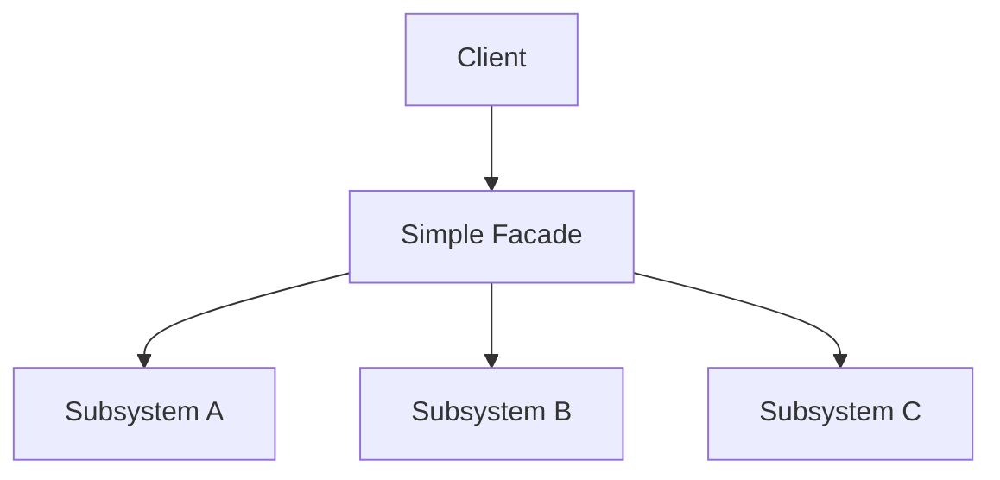
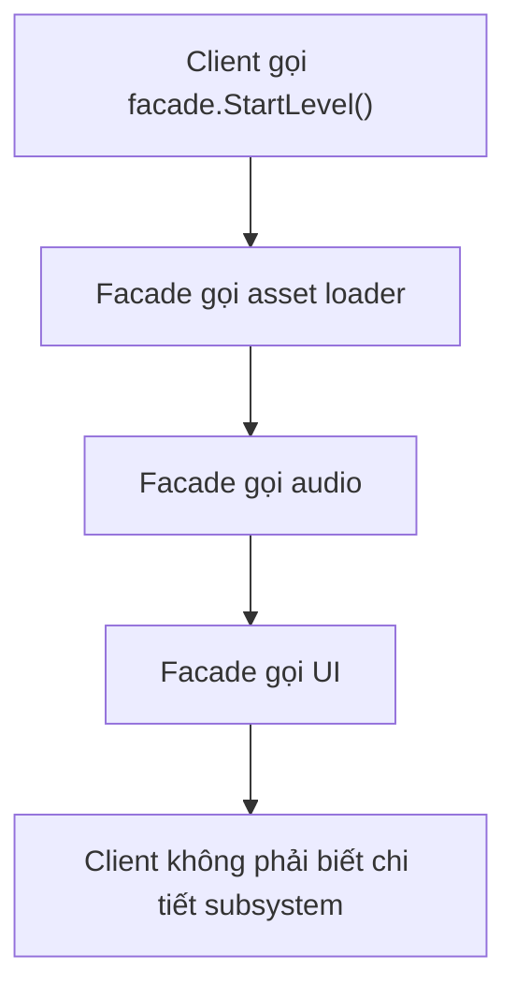
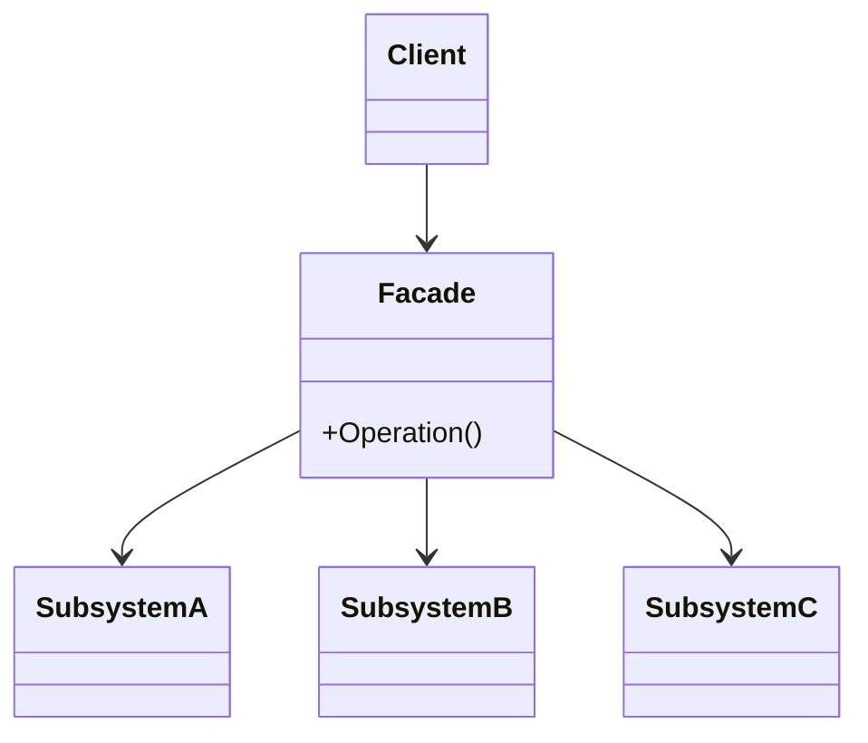

# Facade

> 📖 **Source:** [Refactoring.Guru — Facade](https://refactoring.guru/design-patterns/facade) | Author: Alexander Shvets

---

## 🎯 Intent

**Facade** is a structural design pattern that provides a single, simplified interface representing an extremely complex subsystem made up of many tangled classes, libraries, or processing logic inside. A Facade hides the complexity and channels the client's interaction into a single, streamlined point.

---

## ❌ Problem

Imagine you're implementing the **Save/Load Game** feature for an open-world RPG.
- To save the game state (health, position, inventory, quests), the system needs to coordinate many complex steps:
  1.  **Serialization:** Convert the C# `SaveData` object into a JSON-formatted string or binary data.
  2.  **Encryption:** Encrypt the data string (for example, using AES) to prevent players from opening the file and editing it to cheat.
  3.  **File I/O:** Write the encrypted data file to the device's local disk (`Application.persistentDataPath`).
  4.  **Local Settings:** Save small settings (such as volume and brightness) separately into Unity's `PlayerPrefs`.
  5.  **Cloud Sync:** Synchronize the just-saved file to the cloud (Steam Cloud, Google Play Games, or iCloud).
- If the Gameplay or UI classes call all five of these systems directly every time the player presses the "Save Game" button, the code becomes extremely messy, convoluted, and tightly coupled.
- Any time you change the encryption library, or switch from JSON to Protocol Buffers, you have to go and fix the code in every place that calls Save.

---

## ✅ Solution

The **Facade** pattern proposes creating a single class, `SaveLoadManager` (acting as the Facade).

1.  The `SaveLoadManager` class wraps all the complex inner subclasses, such as: `JsonSerializer`, `DataEncryptor`, `DiskWriter`, `CloudSyncManager`.
2.  It exposes only two extremely simple methods to the Client:
    *   `void Save(SaveData data)`
    *   `SaveData Load()`
3.  All the internal processing details about encryption, file writing, and cloud sync are handled discreetly inside `SaveLoadManager`.

The Client (Gameplay, UI Button) now only needs to interact with `SaveLoadManager` through a single line of code, without knowing how the underlying sub-libraries work.

---

## 🎨 Structure

Instead of reading one big UML diagram from the start, read the pattern in three layers: **the quick idea → the actual execution flow → a condensed UML**.

### 1. The quick idea



### 2. The actual execution flow



### 3. Condensed UML



### How to read the diagram

| Component | Meaning |
|---|---|
| Quick glance | A Facade bundles many subsystems into one easy-to-use API. |
| Main flow | The Client calls a single method, and the Facade orchestrates many steps. |
| In games | Loading a level, starting a match, save/load, menu flow. |
| Solid arrow | An object holds a reference to or directly calls another object. |
| Triangle / dashed arrow in UML | Inheritance or interface implementation. |

> Quick-reading tip: first find the **Client/Context**, then follow the arrows to the main interface. The concrete classes are just variants swapped in at runtime.

---

## 💻 Pseudocode

```csharp
// Các lớp hệ thống con phức tạp (Subsystems)
class SubsystemA { public void OperationA1() {} }
class SubsystemB { public void OperationB1() {} }
class SubsystemC { public void OperationC1() {} }

// Facade gom tất cả hệ thống con lại
class Facade
{
    private SubsystemA _a = new SubsystemA();
    private SubsystemB _b = new SubsystemB();
    private SubsystemC _c = new SubsystemC();

    public void SimpleOperation()
    {
        // Phối hợp các hệ thống con
        _a.OperationA1();
        _b.OperationB1();
        _c.OperationC1();
    }
}
```

---

## ⚙️ Applicability

Use Facade when:
- You want to provide a simple, minimal interface to a complex subsystem containing many cross-linked components.
- You want to layer your game's code. Use a Facade as the entry point for each layer, which helps minimize the dependencies between the layers.
- Typical examples in games: the Save/Load system, the Audio Manager system (covering Mixer management, AudioSource playback, loading clips from Addressables, and adjusting group volumes), and the Network Manager system (connecting, authenticating, sending and receiving packets).

---

## 📝 How to Implement

1.  Identify the complex subsystem whose interface needs simplifying.
2.  Create a new Facade class (for example, `SaveLoadManager`). This class will hold reference variables to the subsystem's instances.
3.  Implement streamlined business methods on the Facade. These methods are responsible for distributing and orchestrating the work among the subclasses in the correct order.
4.  Direct the Client code to call through the Facade instead of calling the subclasses directly.

---

## ⚖️ Pros and Cons

*   **👍 Pros:**
    *   *Reduced coupling:* Isolates the Client from the complexity and changes of the underlying sub-libraries.
    *   *Ease of use:* Makes it easy for other developers on the team to call complex features without learning how each subsystem works in detail.
*   **👎 Cons:**
    *   If not designed carefully, the Facade can turn into a **God Object** (a super-class that holds too much logic and grows endlessly over time).

---

## 🎮 In Game Dev: C# Code Example (Unity)

Below is how to build a `SaveLoadManager` Facade that manages Serialization, Encryption, File I/O, and Cloud Sync in Unity:

### 1. Save Data and the Subsystems
```csharp
using System;
using UnityEngine;

namespace DesignPatterns.Facade
{
    // Lớp chứa dữ liệu Save game
    [Serializable]
    public class SaveData
    {
        public int playerLevel;
        public float health;
        public string currentScene;
    }

    // Subsystem 1: Chuyển đổi dữ liệu (Serializer)
    public class GameSerializer
    {
        public string Serialize(SaveData data)
        {
            Debug.Log("[Subsystem] Đang serialize SaveData sang JSON...");
            return JsonUtility.ToJson(data);
        }

        public SaveData Deserialize(string json)
        {
            Debug.Log("[Subsystem] Đang deserialize JSON sang SaveData...");
            return JsonUtility.FromJson<SaveData>(json);
        }
    }

    // Subsystem 2: Mã hóa dữ liệu (Encryptor)
    public class DataEncryptor
    {
        public string Encrypt(string plainText)
        {
            Debug.Log("[Subsystem] Đang mã hóa dữ liệu (AES)...");
            return "ENCRYPTED_[" + plainText + "]"; // Giả lập mã hóa
        }

        public string Decrypt(string cipherText)
        {
            Debug.Log("[Subsystem] Đang giải mã dữ liệu...");
            return cipherText.Replace("ENCRYPTED_[", "").Replace("]", "");
        }
    }

    // Subsystem 3: Ghi file xuống ổ cứng (FileWriter)
    public class FileStorage
    {
        public void WriteToFile(string fileName, string content)
        {
            string path = Application.persistentDataPath + "/" + fileName;
            Debug.Log($"[Subsystem] Đang ghi file xuống ổ đĩa cục bộ tại: {path}");
            // Thực tế: File.WriteAllText(path, content);
        }

        public string ReadFromFile(string fileName)
        {
            string path = Application.persistentDataPath + "/" + fileName;
            Debug.Log($"[Subsystem] Đang đọc file từ ổ đĩa cục bộ tại: {path}");
            // Thực tế: return File.ReadAllText(path);
            return "ENCRYPTED_[{\"playerLevel\":15,\"health\":85.5,\"currentScene\":\"Level_3\"}]"; // Giả lập dữ liệu đọc được
        }
    }

    // Subsystem 4: Đồng bộ hóa đám mây (CloudService)
    public class CloudService
    {
        public void SyncToCloud(string fileName)
        {
            Debug.Log($"[Subsystem] Đang đồng bộ file '{fileName}' lên Steam Cloud...");
        }
    }
}
```

### 2. The Facade Class (SaveLoadManager)
```csharp
namespace DesignPatterns.Facade
{
    // Lớp Mặt tiền (Facade) quản lý toàn bộ hệ thống Save/Load phức tạp
    public class SaveLoadManager
    {
        private readonly GameSerializer _serializer;
        private readonly DataEncryptor _encryptor;
        private readonly FileStorage _storage;
        private readonly CloudService _cloud;

        private const string SAVE_FILE_NAME = "gamesave.sav";

        public SaveLoadManager()
        {
            _serializer = new GameSerializer();
            _encryptor = new DataEncryptor();
            _storage = new FileStorage();
            _cloud = new CloudService();
        }

        // Interface cực kỳ đơn giản cho Client sử dụng để Lưu Game
        public void SaveGame(SaveData data)
        {
            Debug.Log(">>> Bắt đầu quy trình Lưu Game (Save Facade) <<<");
            
            string json = _serializer.Serialize(data);
            string encryptedData = _encryptor.Encrypt(json);
            _storage.WriteToFile(SAVE_FILE_NAME, encryptedData);
            _cloud.SyncToCloud(SAVE_FILE_NAME);
            
            Debug.Log(">>> Đã lưu game thành công! <<<\n");
        }

        // Interface cực kỳ đơn giản cho Client sử dụng để Tải Game
        public SaveData LoadGame()
        {
            Debug.Log(">>> Bắt đầu quy trình Tải Game (Load Facade) <<<");
            
            string encryptedData = _storage.ReadFromFile(SAVE_FILE_NAME);
            string json = _encryptor.Decrypt(encryptedData);
            SaveData data = _serializer.Deserialize(json);
            
            Debug.Log(">>> Đã tải game thành công! <<<\n");
            return data;
        }
    }
}
```

### 3. Client Component in Unity (GameplayController)
```csharp
using UnityEngine;

namespace DesignPatterns.Facade
{
    public class GameplayController : MonoBehaviour
    {
        private SaveLoadManager _saveLoadManager;

        private void Start()
        {
            // 1. Khởi tạo Facade
            _saveLoadManager = new SaveLoadManager();

            // 2. Tạo dữ liệu game hiện tại của người chơi
            SaveData currentProgress = new SaveData
            {
                playerLevel = 15,
                health = 85.5f,
                currentScene = "Level_3"
            };

            // 3. Thực hiện lưu game qua 1 cuộc gọi duy nhất
            _saveLoadManager.SaveGame(currentProgress);

            // 4. Thực hiện tải game qua 1 cuộc gọi duy nhất
            SaveData loadedProgress = _saveLoadManager.LoadGame();

            // Kiểm tra dữ liệu sau khi tải
            Debug.Log($"[Client] Kết quả tải game - Level: {loadedProgress.playerLevel}, Máu: {loadedProgress.health}, Màn: {loadedProgress.currentScene}");
        }
    }
}
```

---

> 📚 **Source:** Content adapted from [Refactoring.Guru](https://refactoring.guru/) — Author: Alexander Shvets, Illustrations: Dmitry Zhart

| Direction | Link |
|-------|----------|
| ← Back | [Decorator](./04-decorator.md) |
| → Next | [Flyweight](./06-flyweight.md) |
