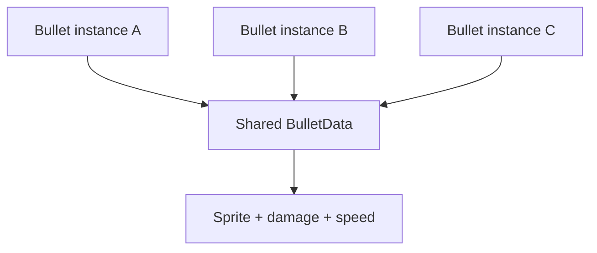
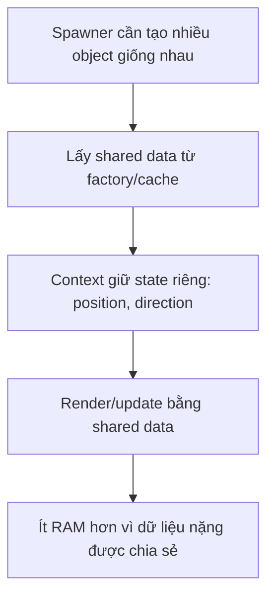
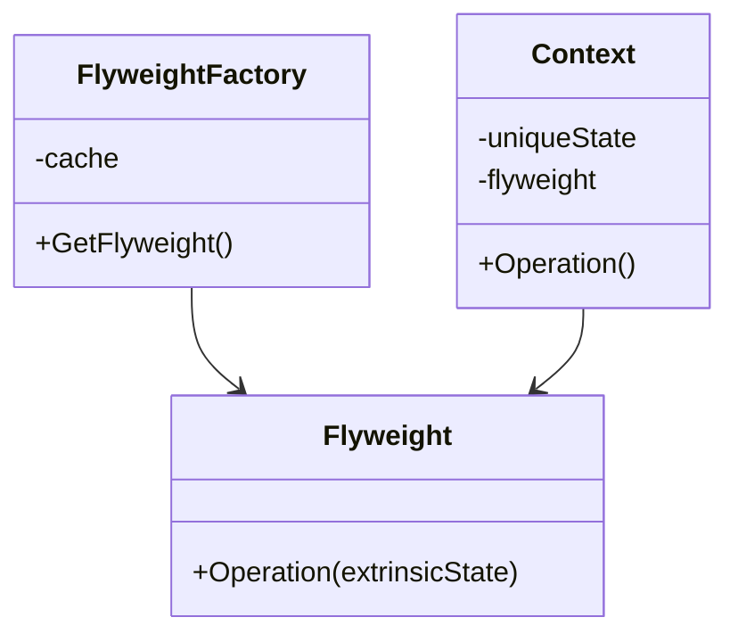

# Flyweight

> 📖 **Source:** [Refactoring.Guru — Flyweight](https://refactoring.guru/design-patterns/flyweight) | Author: Alexander Shvets

---

## 🎯 Intent

**Flyweight** is a structural design pattern that helps optimize RAM usage by sharing the common parts of state (the **Intrinsic State**) among many similar objects, instead of repeatedly storing all of that data in each object individually.

---

## ❌ Problem

Imagine you are developing a "Bullet Hell" shooter or a large-scale real-time strategy (RTS) game.
- At any given moment, there can be up to 10,000 bullets flying on the screen at once.
- Each bullet in the game needs to store the following information:
  *   *Dynamic information:* Position (`Vector3 position`), travel direction (`Vector3 direction`), current speed.
  *   *Static information:* The bullet sprite (`Sprite`), the 3D model (`Mesh`), the sound effect played when fired (`AudioClip`), the damage dealt (`damage`), the explosion radius, and the maximum lifetime (`maxLifetime`).
- If each bullet is an independent GameObject containing all of the variables above, RAM will be overloaded extremely quickly. Tens of thousands of bullets would keep tens of thousands of identical copies of the same Sprite, the same AudioClip, and the same damage values. This wastes a tremendous amount of memory and leads to stutter caused by the Garbage Collector (GC) having to constantly clean up memory whenever bullets disappear.

---

## ✅ Solution

The **Flyweight** pattern proposes splitting an object's attributes into two parts:

1.  **Intrinsic State:** This is the immutable data that is completely identical across every bullet of the same type (such as sprite, damage, speed, maxLifetime). This data is separated out and stored as **only a single copy** in memory.
2.  **Extrinsic State:** This is the data that changes continuously and independently per specific instance (such as position, direction). This data is retained inside each specific bullet.

In Unity, the most standard and intuitive way to implement Flyweight is to use a **ScriptableObject**.
- We create a ScriptableObject named `BulletData` (which plays the role of the Flyweight) that contains all of the Intrinsic State. We only need to create exactly one `BulletData` Asset file for the "Red Laser Bullet" type and one for the "Blue Plasma Bullet" type.
- The `Bullet` class (the Context) represents the actual bullet flying on screen and only holds the Extrinsic State (position, travel direction) plus a reference pointing to the shared `BulletData` Asset file.

As a result, even with 10,000 Red Laser bullets on screen, they all share a single reference to one unique `BulletData` file, saving up to 90% of the required RAM.

---

## 🎨 Structure

Instead of reading one large UML diagram right away, read the pattern in three layers: **quick idea → real runtime flow → condensed UML**.

### 1. Quick idea



### 2. Luồng chạy thực tế



### 3. Condensed UML



### How to read the diagram

| Component | Meaning |
|---|---|
| Quick look | Separate shared data from data unique to each instance. |
| Main flow | The Context passes its own state into the shared Flyweight at runtime. |
| In games | ScriptableObject data for bullets, tiles, trees, enemy stats. |
| Solid arrow | An object holds a reference to or directly calls another object. |
| Triangle / dashed arrow in UML | Inheritance or interface implementation. |

> Quick-reading tip: first find the **Client/Context**, then follow the arrows to the main interface. The concrete classes are just variants swapped in at runtime.

---

## 💻 Pseudocode

```csharp
// Lớp Flyweight chứa trạng thái nội tại (Intrinsic State)
class Flyweight
{
    private string _sharedState; // Ví dụ: Texture, âm thanh, chỉ số chung
    
    public Flyweight(string shared) => _sharedState = shared;
    
    public void Operation(string uniqueState)
    {
        // Thực hiện hành động kết hợp trạng thái nội tại và ngoại tại
        Print($"Nội tại: {_sharedState}, Ngoại tại: {uniqueState}");
    }
}

// Lớp Context chứa trạng thái ngoại tại (Extrinsic State) và tham chiếu Flyweight
class Context
{
    private string _uniqueState; // Trạng thái ngoại tại (Vị trí, hướng)
    private Flyweight _flyweight;

    public Context(string unique, Flyweight flyweight)
    {
        _uniqueState = unique;
        _flyweight = flyweight;
    }

    public void Render() => _flyweight.Operation(_uniqueState);
}
```

---

## ⚙️ Applicability

Use Flyweight when:
- Your game needs to create an extremely large number of entities (thousands or tens of thousands of objects).
- The memory cost of storing these objects directly threatens game performance (causing crashes from RAM exhaustion or frame stutter from GC spikes).
- Most of an object's attributes can be clearly split into intrinsic state (shared) and extrinsic state (unique).
- Typical cases in games: bullet systems, particle effect systems, vegetation systems (rendering millions of grass blades and trees across an open-world map), or small minion units in MOBA/RTS games.

---

## 📝 How to Implement

1.  Analyze the attributes of the object you want to optimize and split them into two groups: Intrinsic and Extrinsic.
2.  Create a Flyweight class (in Unity, you should use a `ScriptableObject`) to store the Intrinsic attributes. Make sure this class contains no data that changes per specific instance.
3.  Create a Context class (usually a `MonoBehaviour` or a lightweight `struct`) to hold the Extrinsic attributes along with a reference pointing to the Flyweight class you just created.
4.  When the Spawner instantiates a Context object, inject the corresponding Flyweight reference into that object.

---

## ⚖️ Pros and Cons

*   **👍 Pros:**
    *   *Outstanding RAM savings:* Avoids duplicating thousands of expensive assets (Sprite, Audio, Mesh) in memory.
    *   *Improved performance:* Reduces the frequency of memory allocation and reclamation, minimizing stutter caused by Garbage Collection.
*   **👎 Cons:**
    *   The programmer has to separate the data, making the code slightly more complex.
    *   It costs a little CPU to retrieve data from the Flyweight through a reference (but this trade-off is extremely worthwhile compared to the RAM savings).

---

## 🎮 In Game Dev: C# Code Example (Unity)

Below is how to implement a memory-optimized Bullet system using a `ScriptableObject` as the Flyweight in Unity:

### 1. The Flyweight class (ScriptableObject) holding the intrinsic state
```csharp
using UnityEngine;

namespace DesignPatterns.Flyweight
{
    // Tạo menu để tạo file Asset trong Unity Editor
    [CreateAssetMenu(fileName = "NewBulletData", menuName = "Design Patterns/Flyweight/Bullet Data")]
    public class BulletData : ScriptableObject
    {
        [Header("Intrinsic Properties (Shared)")]
        public Sprite bulletSprite;
        public float baseDamage = 10f;
        public float baseSpeed = 20f;
        public float maxLifetime = 3f;
        
        [SerializeField] private AudioClip hitSound;

        public void PlayHitAudio(Vector3 position)
        {
            if (hitSound != null)
            {
                // Giả lập phát âm thanh tại vị trí va chạm
                Debug.Log($"[SFX] Phát âm thanh {hitSound.name} tại {position}");
            }
        }
    }
}
```

### 2. The Context class (MonoBehaviour) holding the extrinsic state
```csharp
using UnityEngine;

namespace DesignPatterns.Flyweight
{
    // Lớp đại diện cho viên đạn thực tế bay trong game
    public class Bullet : MonoBehaviour
    {
        // Trạng thái ngoại tại (Extrinsic State - Độc lập cho mỗi viên đạn)
        private Vector3 _velocity;
        private float _currentLifetime;

        // Tham chiếu đến Flyweight (Chia sẻ chung)
        private BulletData _bulletData;
        private SpriteRenderer _spriteRenderer;

        private void Awake()
        {
            _spriteRenderer = GetComponent<SpriteRenderer>();
        }

        // Thiết lập trạng thái ngoại tại ban đầu và gán Flyweight
        public void Initialize(Vector3 direction, BulletData data)
        {
            _bulletData = data;
            
            // Áp dụng dữ liệu nội tại chung để cấu hình hiển thị
            _spriteRenderer.sprite = _bulletData.bulletSprite;
            
            // Tính toán vận tốc dựa trên hướng đi (ngoại tại) và tốc độ bay (nội tại)
            _velocity = direction.normalized * _bulletData.baseSpeed;
            _currentLifetime = 0f;
        }

        private void Update()
        {
            // Cập nhật trạng thái ngoại tại theo thời gian thực
            transform.Translate(_velocity * Time.deltaTime);
            _currentLifetime += Time.deltaTime;

            if (_currentLifetime >= _bulletData.maxLifetime)
            {
                DestroyBullet();
            }
        }

        private void OnTriggerEnter2D(Collider2D collision)
        {
            // Xử lý va chạm
            Debug.Log($"[Bullet] Gây ra {_bulletData.baseDamage} sát thương lên {collision.name}");
            
            // Gọi hàm của Flyweight để phát âm thanh chung
            _bulletData.PlayHitAudio(transform.position);
            
            DestroyBullet();
        }

        private void DestroyBullet()
        {
            // Thực tế nên sử dụng Object Pooling kết hợp với Flyweight để đạt hiệu năng tối đa
            Destroy(gameObject);
        }
    }
}
```

### 3. The Spawner that creates bullets in bulk (BulletSpawner)
```csharp
using UnityEngine;

namespace DesignPatterns.Flyweight
{
    public class BulletSpawner : MonoBehaviour
    {
        [SerializeField] private GameObject bulletPrefab;
        
        // Kéo thả các file ScriptableObject BulletData vào đây từ Inspector
        [SerializeField] private BulletData redLaserData;
        [SerializeField] private BulletData bluePlasmaData;

        private void Update()
        {
            // Nhấn phím J để bắn đạn Laser Đỏ
            if (Input.GetKeyDown(KeyCode.J))
            {
                SpawnBullet(Vector3.up, redLaserData);
            }

            // Nhấn phím K để bắn đạn Plasma Xanh
            if (Input.GetKeyDown(KeyCode.K))
            {
                SpawnBullet(new Vector3(0.5f, 1f, 0f), bluePlasmaData);
            }
        }

        private void SpawnBullet(Vector3 direction, BulletData data)
        {
            // Khởi tạo GameObject
            GameObject bulletObj = Instantiate(bulletPrefab, transform.position, Quaternion.identity);
            Bullet bulletScript = bulletObj.GetComponent<Bullet>();
            
            // Inject Flyweight ScriptableObject vào viên đạn
            bulletScript.Initialize(direction, data);
            
            Debug.Log($"[Spawner] Đã bắn 1 viên đạn. Đạn này dùng chung dữ liệu: {data.name} (Sát thương: {data.baseDamage})");
        }
    }
}
```

---

> 📚 **Source:** Content adapted from [Refactoring.Guru](https://refactoring.guru/) — Author: Alexander Shvets, Illustrations: Dmitry Zhart

| Direction | Link |
|-------|----------|
| ← Back | [Facade](./05-facade.md) |
| → Next | [Proxy](./07-proxy.md) |
