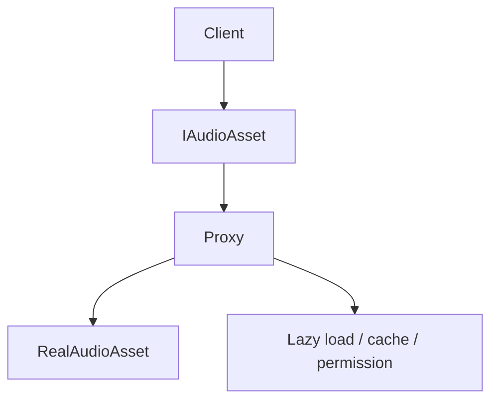
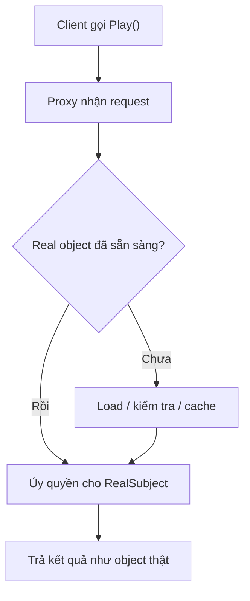
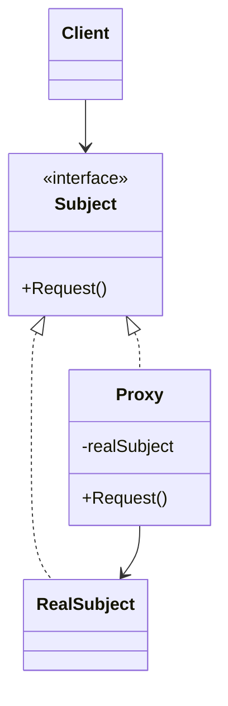

# Proxy

> 📖 **Source:** [Refactoring.Guru — Proxy](https://refactoring.guru/design-patterns/proxy) | Author: Alexander Shvets

---

## 🎯 Intent

**Proxy** is a structural design pattern that lets you provide a substitute or placeholder for another object. A Proxy controls access to the original object, allowing additional processing (such as lazy loading, security, logging, caching) to be performed before or after the request is forwarded to the original object.

---

## ❌ Problem

Imagine you are developing an open-world AAA game that is tens of GB in size, with thousands of high-quality sound effects (SFX) and very heavy lossless-format background music (BGM).
- If you load all of these audio files into RAM the moment the game launches, the player's device will run out of memory immediately, and the game will take several minutes just to finish booting.
- The best solution is to use **Lazy Loading**: only load an audio file into RAM when it is actually requested for playback (for example, when the player enters a specific area or picks up a particular weapon).
- However, writing asynchronous loading code from Unity Addressables or Asset Bundles everywhere throughout the gameplay would make your code extremely messy.
- You don't want Client classes (such as a moving character or a UI button) to have to manage the lifecycle of the audio themselves, or to implement the logic of checking whether the audio file has already been loaded into RAM every time they request playback.

---

## ✅ Solution

The **Proxy** pattern advises you to create an intermediary Proxy class that has the same interface as the real object.

1.  **Subject (`IAudioAsset`):** The interface that defines the common action, for example `void Play()`.
2.  **Real Subject (`RealAudioAsset`):** The real entity, which contains the actual audio file (`AudioClip`) loaded into RAM and performs the audio playback.
3.  **Proxy (`AudioAssetProxy`):** The intermediary proxy class. This class holds the asset's address path (Addressable Key) and keeps a reference to the `RealAudioAsset`.

When the Client calls `Play()` on the Proxy:
- The Proxy checks whether the `RealAudioAsset` has been initialized (whether the clip has been loaded into RAM).
- **If not:** the Proxy automatically performs the asynchronous audio-loading process from disk into RAM, initializes the `RealAudioAsset`, and then calls `Play()` on it.
- **If it has:** the Proxy immediately calls `Play()` on the existing `RealAudioAsset`.

The Client interacts with the Proxy exactly as if it were interacting with the real object, completely unaware that behind it lies an entire process of lazy loading and complex RAM management.

---

## 🎨 Structure

Instead of reading one large UML diagram right away, read the pattern in three layers: **quick idea → real runtime flow → condensed UML**.

### 1. Quick idea



### 2. Luồng chạy thực tế



### 3. Condensed UML



### How to read the diagram

| Component | Meaning |
|---|---|
| Quick look | The Proxy sits in front of the real object to control access. |
| Main flow | The Proxy can lazy-load, cache, log, or authorize before delegating. |
| In games | Lazy-loading audio/texture, network proxy, anti-cheat guard. |
| Solid arrow | An object holds a reference to or directly calls another object. |
| Triangle / dashed arrow in UML | Inheritance or interface implementation. |

> Quick-reading tip: first find the **Client/Context**, then follow the arrows to the main interface. The concrete classes are just variants swapped in at runtime.

---

## 💻 Pseudocode

```csharp
// Interface chung cho Proxy và Real Subject
interface ISubject
{
    void Request();
}

// Đối tượng thực tế (Real Subject) chứa logic nghiệp vụ nặng nề
class RealSubject : ISubject
{
    public void Request()
    {
        Print("Xử lý nghiệp vụ của RealSubject.");
    }
}

// Đối tượng đại diện (Proxy) kiểm soát quyền truy cập
class Proxy : ISubject
{
    private RealSubject _realSubject;

    public void Request()
    {
        // Thực hiện tiền xử lý hoặc Lazy Loading
        if (_realSubject == null)
        {
            _realSubject = new RealSubject();
        }
        
        // Chuyển tiếp yêu cầu
        _realSubject.Request();
    }
}
```

---

## ⚙️ Applicability

Use Proxy when:
- **Virtual Proxy (Lazy Initialization):** You need to manage heavy resources (images, 3D models, audio) that are only loaded into RAM when actually used, in order to conserve system resources.
- **Protection Proxy (Access Control):** You want to control access permissions. For example: a Proxy that controls whether the Client is authorized to send packets to the Game Server.
- **Caching/Logging Proxy:** You want to cache the results of expensive requests (such as requesting data from a Database/Network) or log the client's access history, without modifying the code of the original object.

---

## 📝 How to Implement

1.  If there is no shared interface yet, create a common interface (Subject) for both the Proxy class and the original class.
2.  Create the Proxy class and declare a field to store a reference to the original class (Real Subject).
3.  Implement the interface methods in the Proxy class.
4.  Inside the bodies of those methods, insert control logic (such as lazy loading or security checks) before delegating the call to the original object.
5.  Consider a mechanism to release the original object when it is no longer in use to reclaim RAM.

---

## ⚖️ Pros and Cons

*   **👍 Pros:**
    *   *Optimal lifecycle management:* Allows lazy initialization of heavy objects without bothering the Client code.
    *   *Works silently:* The Proxy works even when the original object is not yet ready or has failed.
    *   *Open/Closed Principle:* You can introduce new Proxies (such as a security Proxy or a logging Proxy) without modifying the original object.
*   **👎 Cons:**
    *   The response may be delayed on the first call due to having to perform heavy tasks (such as loading the asset from disk or network).
    *   It increases the number of classes and the complexity of the code.

---

## 🎮 In Game Dev: C# Code Example (Unity)

Below is how to implement a Lazy-Loading audio system using the Proxy pattern that simulates loading data from disk (Addressables) in Unity:

### 1. The Subject interface and Real Subject (the actual audio object)
```csharp
using UnityEngine;

namespace DesignPatterns.Proxy
{
    // Interface chung cho tất cả các tài nguyên âm thanh
    public interface IAudioAsset
    {
        void Play();
    }

    // Đối tượng âm thanh thật, chỉ tồn tại khi đã nạp file âm thanh vào bộ nhớ RAM
    public class RealAudioAsset : IAudioAsset
    {
        private string _assetAddress;
        private string _audioClipName; // Giả lập AudioClip thực tế

        public RealAudioAsset(string address)
        {
            _assetAddress = address;
            LoadClipFromDisk();
        }

        private void LoadClipFromDisk()
        {
            // Giả lập tốn thời gian đọc file từ đĩa cứng vào RAM
            _audioClipName = "AudioClip_Data_of_" + _assetAddress.Replace("Assets/Audio/", "");
            Debug.Log($"[Real Subject] Đã nạp thành công '{_audioClipName}' vào RAM (Tiêu tốn 5MB bộ nhớ).");
        }

        public void Play()
        {
            Debug.Log($"[Real Subject] Đang phát âm thanh: {_audioClipName} thông qua AudioSource!");
        }
    }
}
```

### 2. The Proxy class (AudioAssetProxy) that manages Lazy Loading
```csharp
namespace DesignPatterns.Proxy
{
    // Lớp đại diện (Proxy), được tạo sẵn mà không tốn RAM load file âm thanh
    public class AudioAssetProxy : IAudioAsset
    {
        private string _assetAddress;
        
        // Tham chiếu đến đối tượng thật, ban đầu bằng null
        private RealAudioAsset _realAudioAsset;

        public AudioAssetProxy(string assetAddress)
        {
            this._assetAddress = assetAddress;
            Debug.Log($"[Proxy] Đã khởi tạo Proxy cho âm thanh: '{_assetAddress}'. (Vẫn chưa tốn RAM nạp file)");
        }

        // Thực thi phương thức interface
        public void Play()
        {
            // Lazy Loading: Nếu đối tượng thật chưa được nạp, nạp ngay lúc này
            if (_realAudioAsset == null)
            {
                Debug.Log($"[Proxy] Phát hiện âm thanh '{_assetAddress}' chưa có trên RAM. Bắt đầu tải chậm...");
                _realAudioAsset = new RealAudioAsset(_assetAddress);
            }
            else
            {
                Debug.Log($"[Proxy] Âm thanh '{_assetAddress}' đã có sẵn trên RAM. Bỏ qua tải dữ liệu.");
            }

            // Chuyển tiếp yêu cầu đến đối tượng thật
            _realAudioAsset.Play();
        }
        
        // Hàm giải phóng bộ nhớ khi chuyển màn hoặc không dùng nữa
        public void ReleaseFromMemory()
        {
            if (_realAudioAsset != null)
            {
                _realAudioAsset = null;
                Debug.Log($"[Proxy] Giải phóng bộ nhớ RAM của âm thanh '{_assetAddress}'!");
                System.GC.Collect(); // Giả lập dọn dẹp bộ nhớ
            }
        }
    }
}
```

### 3. The Client component in Unity (SoundPlayerController)
```csharp
using UnityEngine;
using System.Collections.Generic;

namespace DesignPatterns.Proxy
{
    public class SoundPlayerController : MonoBehaviour
    {
        private Dictionary<string, IAudioAsset> _soundLibrary = new Dictionary<string, IAudioAsset>();

        private void Start()
        {
            Debug.Log("=== HỆ THỐNG KHỞI ĐỘNG GAME (Chỉ đăng ký Proxy) ===");
            
            // Đăng ký các file nhạc nền và hiệu ứng qua Proxy
            _soundLibrary.Add("BGM_LEVEL_1", new AudioAssetProxy("Assets/Audio/BGM_Level_1.mp3"));
            _soundLibrary.Add("SFX_EXPLOSION", new AudioAssetProxy("Assets/Audio/Explosion_Heavy.wav"));
            _soundLibrary.Add("BGM_BOSS_FIGHT", new AudioAssetProxy("Assets/Audio/Boss_Theme_Epic.mp3"));

            Debug.Log("=== KHỞI ĐỘNG HOÀN TẤT (Khởi động cực nhanh vì chưa load file nặng) ===\n");

            // 1. Phát tiếng nổ (Sẽ load từ đĩa trong lần đầu tiên)
            Debug.Log("--- Tình huống 1: Người chơi bắn nổ thùng dầu ---");
            _soundLibrary["SFX_EXPLOSION"].Play();
            Debug.Log("--- Kết thúc Tình huống 1 ---\n");

            // 2. Phát lại tiếng nổ (Sẽ phát ngay lập tức vì đã có trong cache RAM)
            Debug.Log("--- Tình huống 2: Người chơi tiếp tục bắn nổ thùng dầu thứ hai ---");
            _soundLibrary["SFX_EXPLOSION"].Play();
            Debug.Log("--- Kết thúc Tình huống 2 ---\n");

            // 3. Người chơi tiến vào boss fight (Tải nhạc Boss)
            Debug.Log("--- Tình huống 3: Người chơi chạm trán Boss ---");
            _soundLibrary["BGM_BOSS_FIGHT"].Play();
            Debug.Log("--- Kết thúc Tình huống 3 ---\n");

            // 4. Giải phóng bộ nhớ nhạc Boss khi diệt xong boss
            Debug.Log("--- Tình huống 4: Boss bị tiêu diệt, giải phóng nhạc Boss để giảm tải RAM ---");
            if (_soundLibrary["BGM_BOSS_FIGHT"] is AudioAssetProxy bossBgmProxy)
            {
                bossBgmProxy.ReleaseFromMemory();
            }
            Debug.Log("--- Kết thúc Tình huống 4 ---");
        }
    }
}
```

---

> 📚 **Source:** Content adapted from [Refactoring.Guru](https://refactoring.guru/) — Author: Alexander Shvets, Illustrations: Dmitry Zhart

| Direction | Link |
|-------|----------|
| ← Back | [Flyweight](./06-flyweight.md) |
| 🦨 Return | [Structural Patterns Overview](./00-structural-overview.md) |
