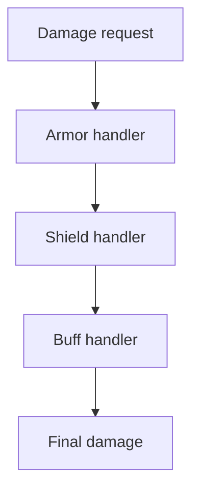
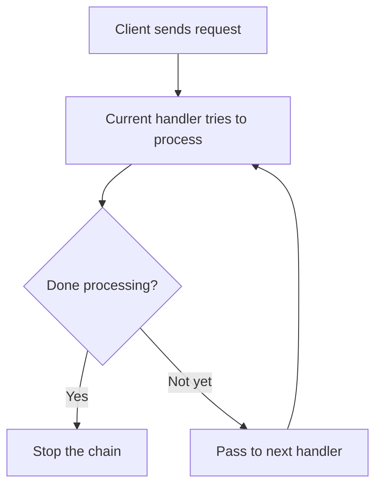
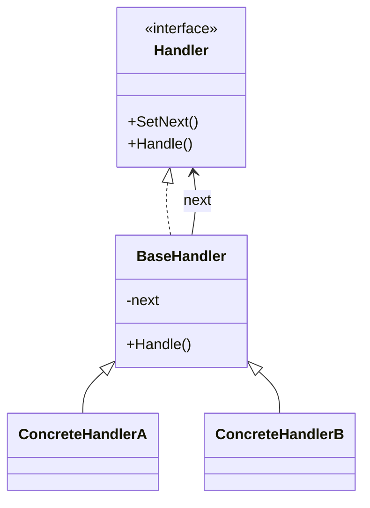

# Chain of Responsibility

> 📖 **Source:** [Refactoring.Guru — Chain of Responsibility](https://refactoring.guru/design-patterns/chain-of-responsibility) | Author: Alexander Shvets

---

## 🎯 Intent

**Chain of Responsibility** is a behavioral design pattern that lets you pass requests along a chain of handlers. Upon receiving a request, each handler decides either to process the request or to pass it to the next handler in the chain.

---

## ❌ Problem

Imagine you are building a complex **Damage Calculation** system in a role-playing game (RPG):
- When a warrior is hit, the initial base damage is `100 HP`.
- However, the character may have **physical Armor** that reduces incoming damage by 20%.
- The character may also have an active **Magic Shield** that absorbs up to 50 damage.
- In addition, the character has a special buff, **Invulnerability Buff**, that makes them take no damage at all for a period of time.
- If you write all of this logic inside one large method of the `PlayerHealth` class, you will end up with a huge block of code full of nested `if-else` statements. When the designer wants to add a new type of defense (for example, elemental resistance or evasion), you have to open that method and modify it again, which easily leads to bugs and seriously violates the **Open/Closed Principle**.

---

## ✅ Solution

The **Chain of Responsibility** design pattern suggests that you transform the separate processing steps into standalone objects called **Handlers**.

1.  Each handler holds a reference to the next handler in the chain (Next Handler).
2.  When it receives a request (here, an object carrying damage information), the handler will:
    *   Perform its own part of the work (for example, subtracting damage through armor).
    *   Decide whether to pass the modified damage information on to the next handler or to stop the chain (for example, if an invincibility shield is active, the damage becomes 0 and no further calculation is needed).
3.  The client (the character being hit) only needs to send the initial damage packet to the first handler of the preconfigured chain.

---

## 🎨 Structure

Rather than reading one large UML diagram right away, read the pattern in 3 layers: **quick idea → real execution flow → simplified UML**.

### 1. Quick Idea



### 2. Real Execution Flow



### 3. Simplified UML



### How to Read the Diagram

| Element | Meaning |
|---|---|
| Quick glance | The request travels through a chain of handlers. |
| Main flow | Each handler either processes or passes the request on. |
| In games | Damage pipeline, input bubbling, validation chain. |
| Solid arrow | An object holds a reference to or directly calls another object. |
| Triangle / dashed arrow in UML | Inheritance or interface implementation. |

> Quick-reading tip: first find the **Client/Context**, then follow the arrows to the main interface. The concrete classes are just variants plugged in at runtime.

---

## 💻 Pseudocode

```csharp
// Object carrying the request data
class DamageRequest
{
    public float Amount;
    public string DamageType;
}

// Handler interface
interface IDamageHandler
{
    IDamageHandler SetNext(IDamageHandler handler);
    DamageRequest Handle(DamageRequest request);
}

// Base class handling forwarding within the chain
abstract class BaseDamageHandler : IDamageHandler
{
    private IDamageHandler _nextHandler;

    public IDamageHandler SetNext(IDamageHandler handler)
    {
        _nextHandler = handler;
        return handler; // Return the next handler to support chaining (fluent interface)
    }

    public virtual DamageRequest Handle(DamageRequest request)
    {
        if (_nextHandler != null)
        {
            return _nextHandler.Handle(request);
        }
        return request;
    }
}
```

---

## ⚙️ Applicability

Use Chain of Responsibility when:
- The game needs to process a request through several different filtering/calculation steps, but the order or list of steps can change flexibly at runtime.
- You want to dispatch a request to a group of processing objects without the client needing to know exactly which object will handle the request.
- The set of processing objects and their order need to be configured dynamically (for example, when the player changes equipment or gains a new buff, the damage-calculation chain is rearranged).

---

## 📝 How to Implement

1.  Declare the Handler interface and define the method that processes a request.
2.  Create an abstract base handler class to store the reference to the next handler (`nextHandler`) and implement the default forwarding logic.
3.  Create concrete handler subclasses to handle distinct logic (Armor, Shield, Buff, ...). Each subclass overrides the processing method to perform its own logic, then forwards to the base class to call the next handler.
4.  On the client side, link the handlers together to form a chain using the `SetNext` method.
5.  The client triggers the chain by passing the request to the first element of the chain.

---

## ⚖️ Pros and Cons

*   **👍 Pros:**
    *   *Loose Coupling:* Decouples the object sending the request from the objects receiving/processing it.
    *   *Single Responsibility Principle:* Each handler is responsible for resolving only one specific piece of logic (for example, only reducing shield damage).
    *   *Open/Closed Principle:* You can add or remove handlers from the system without changing the existing handlers.
*   **👎 Cons:**
    *   No guarantee the request will be handled: If the chain ends without any handler stopping or fully processing it, the request may be dropped (in a game, this could result in damage being skipped entirely if there is no final handler to catch it).
    *   Hard to debug: Having the flow pass through too many objects can slightly slow performance and make it difficult to set breakpoints while tracking down errors.

---

## 🎮 In Game Dev: C# Code Example (Unity)

Below is a complete damage-calculation system using **Chain of Responsibility** in Unity:

### 1. Request Data and Handler Interface
```csharp
using UnityEngine;

public class DamageRequest
{
    public float Amount;
    public bool IsMagic;
    
    public DamageRequest(float amount, bool isMagic)
    {
        Amount = amount;
        IsMagic = isMagic;
    }
}

public interface IDamageHandler
{
    IDamageHandler SetNext(IDamageHandler handler);
    DamageRequest ProcessDamage(DamageRequest request);
}
```

### 2. Base Handler and the Concrete Handlers
```csharp
public abstract class BaseDamageHandler : IDamageHandler
{
    private IDamageHandler _nextHandler;

    public IDamageHandler SetNext(IDamageHandler handler)
    {
        _nextHandler = handler;
        return handler; // Allows chained code: handlerA.SetNext(handlerB).SetNext(handlerC)
    }

    public virtual DamageRequest ProcessDamage(DamageRequest request)
    {
        if (_nextHandler != null)
        {
            return _nextHandler.ProcessDamage(request);
        }
        return request;
    }
}

// 1. Evasion handler
public class EvasionHandler : BaseDamageHandler
{
    private float _evasionChance; // 0.0 to 1.0

    public EvasionHandler(float evasionChance)
    {
        _evasionChance = evasionChance;
    }

    public override DamageRequest ProcessDamage(DamageRequest request)
    {
        if (Random.value < _evasionChance)
        {
            Debug.Log("🎯 [Evasion] Dodged successfully! Damage reduced to 0.");
            request.Amount = 0;
            return request; // Return immediately, cutting off the processing chain
        }
        return base.ProcessDamage(request);
    }
}

// 2. Absorbing shield handler (Shield)
public class ShieldHandler : BaseDamageHandler
{
    private float _shieldHealth;

    public ShieldHandler(float shieldHealth)
    {
        _shieldHealth = shieldHealth;
    }

    public override DamageRequest ProcessDamage(DamageRequest request)
    {
        if (request.Amount <= 0) return base.ProcessDamage(request);

        if (_shieldHealth > 0)
        {
            float absorbed = Mathf.Min(request.Amount, _shieldHealth);
            _shieldHealth -= absorbed;
            request.Amount -= absorbed;
            Debug.Log($"🛡️ [Shield] Absorbed {absorbed} damage. Remaining shield HP: {_shieldHealth}. Damage that got through: {request.Amount}");
        }
        return base.ProcessDamage(request);
    }
}

// 3. Physical armor handler (Armor)
public class ArmorHandler : BaseDamageHandler
{
    private float _armorPercentReduction; // For example: 0.2f means a 20% damage reduction

    public ArmorHandler(float armorPercentReduction)
    {
        _armorPercentReduction = armorPercentReduction;
    }

    public override DamageRequest ProcessDamage(DamageRequest request)
    {
        if (request.Amount <= 0) return base.ProcessDamage(request);

        if (!request.IsMagic) // Only reduce physical damage
        {
            float reduced = request.Amount * _armorPercentReduction;
            request.Amount -= reduced;
            Debug.Log($"⚙️ [Armor] Physical armor reduces {reduced} damage. Remaining damage: {request.Amount}");
        }
        return base.ProcessDamage(request);
    }
}
```

### 3. Client Code Integrating the Chain
```csharp
public class PlayerCharacter : MonoBehaviour
{
    [Header("Stats")]
    public float maxHealth = 100f;
    public float currentHealth;

    private IDamageHandler _damageChain;

    private void Start()
    {
        currentHealth = maxHealth;

        // Configure the damage-calculation chain: Evasion -> Shield -> Physical Armor
        var evasion = new EvasionHandler(evasionChance: 0.25f); // 25% evasion
        var shield = new ShieldHandler(shieldHealth: 30f);      // Shield absorbs 30 HP
        var armor = new ArmorHandler(armorPercentReduction: 0.15f); // Armor reduces 15% physical damage

        evasion.SetNext(shield).SetNext(armor);
        _damageChain = evasion;
    }

    // When the character is attacked
    public void TakeDamage(float rawAmount, bool isMagic)
    {
        Debug.Log($"💥 Character takes raw damage: {rawAmount} (Magic: {isMagic})");
        
        DamageRequest finalRequest = new DamageRequest(rawAmount, isMagic);
        
        // Run through the damage-processing chain
        finalRequest = _damageChain.ProcessDamage(finalRequest);

        // Apply the actual damage
        currentHealth -= finalRequest.Amount;
        currentHealth = Mathf.Max(0, currentHealth);
        Debug.Log($"❤️ Player's current health: {currentHealth}/{maxHealth}\n");
    }
}
```

---
> 📚 **Origin:** Content referenced from [Refactoring.Guru](https://refactoring.guru/) — Author: Alexander Shvets, Illustrations: Dmitry Zhart

| Direction | Link |
|-------|----------|
| ← Back | [Behavioral Patterns Overview](./00-behavioral-overview.md) |
| → Next | [Command](./02-command.md) |
