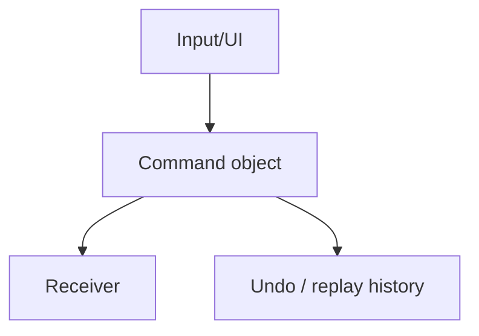
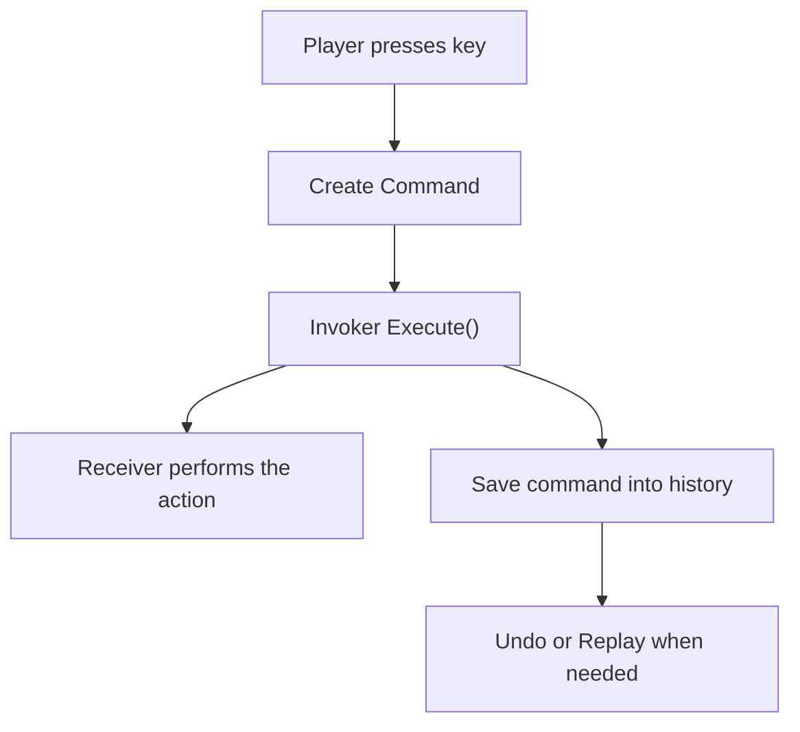
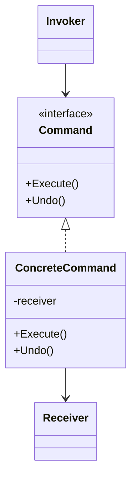

# Command

> 📖 **Source:** [Refactoring.Guru — Command](https://refactoring.guru/design-patterns/command) | Author: Alexander Shvets

---

## 🎯 Intent

**Command** is a behavioral design pattern that turns a request or action into a standalone object containing all information about that request. This transformation lets you parameterize methods with different requests, delay or queue the execution of a request, and support operations that can be undone (Undo/Redo).

---

## ❌ Problem

Imagine you are writing a turn-based strategy game or a grid-based puzzle game:
- You want to program movement for the character. Initially, you write the code directly in the `PlayerInput` class:
  `if (Input.GetKeyDown(KeyCode.W)) player.Move(Vector3.forward);`
- The game runs fine. However, the designer asks you to add an **Undo** feature in case the player makes a wrong move. Because you perform movement directly by changing the character's coordinates, you have no clean way to record movement history in order to step back.
- Moreover, the designer wants players to be able to **remap their keys (Input Mapping)** (for example, changing the movement keys from `W/A/S/D` to `I/J/K/L`, or using a console controller). If the movement code is tightly bound to specific keys, adding a key-remapping feature becomes extremely complex and error-prone.

---

## ✅ Solution

The **Command** pattern proposes separating the input-receiving flow (GUI, key presses) from the action-execution flow by wrapping all of an action's information into a standalone class that implements the `ICommand` interface.

1.  Create an `ICommand` interface that declares two methods: `Execute()` and `Undo()`.
2.  For each specific action (such as move, attack, use item), create a class that implements `ICommand` (for example, `MoveCommand`). This class holds a reference to the receiver of the command (Receiver) and the necessary parameters (such as direction and distance).
3.  When the player presses a key, instead of moving the character directly, you create the corresponding `MoveCommand` object and call its `Execute()` method.
4.  To support Undo, we push the just-executed command onto a history list (**Command History Stack**). When the player presses the Undo button, we simply pop the last command off the stack and call its `Undo()` method.

---

## 🎨 Structure

Rather than reading one large UML diagram right away, read the pattern in 3 layers: **quick idea → real execution flow → simplified UML**.

### 1. Quick Idea



### 2. Real Execution Flow



### 3. Simplified UML



### How to Read the Diagram

| Element | Meaning |
|---|---|
| Quick glance | Turn a request into an object. |
| Main flow | The Invoker doesn't know the details of the action; it only calls Execute(). |
| In games | Input mapping, undo/redo, replay, turn-based action. |
| Solid arrow | An object holds a reference to or directly calls another object. |
| Triangle / dashed arrow in UML | Inheritance or interface implementation. |

> Quick-reading tip: first find the **Client/Context**, then follow the arrows to the main interface. The concrete classes are just variants plugged in at runtime.

---

## 💻 Pseudocode

```csharp
// Base interface for all Commands
interface ICommand
{
    void Execute();
    void Undo();
}

// Concrete command for movement
class MoveCommand : ICommand
{
    private Player _player;
    private Vector3 _direction;

    public MoveCommand(Player player, Vector3 direction)
    {
        _player = player;
        _direction = direction;
    }

    public void Execute() => _player.Move(_direction);
    public void Undo() => _player.Move(-_direction); // Reverse direction to undo
}

// Stores and manages Command history
class CommandHistory
{
    private Stack<ICommand> _history = new Stack<ICommand>();

    public void Push(ICommand command)
    {
        command.Execute();
        _history.Push(command);
    }

    public void Pop()
    {
        if (_history.Count > 0)
        {
            ICommand command = _history.Pop();
            command.Undo();
        }
    }
}
```

---

## ⚙️ Applicability

Use the Command pattern when:
- You want to parameterize objects with actions (such as keyboard shortcuts, menus, or buttons in the UI).
- You need to queue actions to be executed sequentially (for example, queuing attack actions for a character in a turn-based game).
- You want to build **Undo** and **Redo** features.
- You want to build a **Replay** system (record the player's sequence of commands from the start of the level, then re-run those commands to recreate the playthrough).
- You need to support state rollback in a networked environment (Network Rewind/Client Prediction).

---

## 📝 How to Implement

1.  Define an `ICommand` interface with an `Execute()` method and, optionally, an `Undo()` method.
2.  Create the corresponding Concrete Command classes for each action. These classes need a constructor that takes the object being acted upon (Receiver) and the parameters required to perform the action.
3.  Create a history-management class (Invoker/CommandHistory) containing a Stack or List to manage the sequence of executed commands.
4.  Configure the key-detection layer (Input Manager) to map button presses to the corresponding Command objects.
5.  Send these Commands to the Invoker to be executed and stored.

---

## ⚖️ Pros and Cons

*   **👍 Pros:**
    *   *Decoupling:* Completely separates the layer that issues commands (UI, Keyboard) from the layer that executes them (Character Logic).
    *   *Undo/Redo support:* Easy to step back or re-perform actions thanks to keeping a trail of objects.
    *   *Macro support:* Allows combining many small commands into one large composite command.
    *   *Open/Closed Principle:* You can add new Commands to the game without affecting the existing input-detection source code.
*   **👎 Cons:**
    *   More verbose source code: You have to create a lot of small Command classes for each small behavior in the game.

---

## 🎮 In Game Dev: C# Code Example (Unity)

Below is a complete grid-movement system supporting **Undo/Redo** in Unity by applying the Command pattern:

### 1. ICommand Interface and Concrete Command
```csharp
using UnityEngine;

public interface ICommand
{
    void Execute();
    void Undo();
}

// Command for moving a character on the grid
public class MoveCommand : ICommand
{
    private readonly Transform _playerTransform;
    private readonly Vector3 _moveDirection;
    private readonly float _gridSize;

    public MoveCommand(Transform playerTransform, Vector3 direction, float gridSize)
    {
        _playerTransform = playerTransform;
        _moveDirection = direction;
        _gridSize = gridSize;
    }

    public void Execute()
    {
        // Move the character forward by gridSize
        _playerTransform.position += _moveDirection * _gridSize;
        Debug.Log($"🏃 [Command] Moved character toward {_moveDirection}. Current position: {_playerTransform.position}");
    }

    public void Undo()
    {
        // Move back to undo
        _playerTransform.position -= _moveDirection * _gridSize;
        Debug.Log($"↩️ [Undo] Undid movement! Current position: {_playerTransform.position}");
    }
}
```

### 2. Invoker Class (Command History)
```csharp
using System.Collections.Generic;

public class CommandInvoker
{
    private readonly Stack<ICommand> _undoStack = new Stack<ICommand>();
    private readonly Stack<ICommand> _redoStack = new Stack<ICommand>();

    // Execute a new command and clear the old Redo history
    public void ExecuteCommand(ICommand command)
    {
        command.Execute();
        _undoStack.Push(command);
        _redoStack.Clear(); // When a new action occurs, old actions can no longer be redone
    }

    // Undo the most recent action
    public void Undo()
    {
        if (_undoStack.Count > 0)
        {
            ICommand activeCommand = _undoStack.Pop();
            activeCommand.Undo();
            _redoStack.Push(activeCommand);
        }
        else
        {
            Debug.LogWarning("⚠️ No more actions to Undo!");
        }
    }

    // Redo the action that was just undone
    public void Redo()
    {
        if (_redoStack.Count > 0)
        {
            ICommand activeCommand = _redoStack.Pop();
            activeCommand.Execute();
            _undoStack.Push(activeCommand);
        }
        else
        {
            Debug.LogWarning("⚠️ No more actions to Redo!");
        }
    }
}
```

### 3. Client Code (Input Handler) in Unity
```csharp
public class PlayerInputHandler : MonoBehaviour
{
    [SerializeField] private Transform playerTransform;
    [SerializeField] private float gridSize = 1.0f;

    private CommandInvoker _invoker;

    private void Start()
    {
        _invoker = new CommandInvoker();
        if (playerTransform == null) playerTransform = transform;
    }

    private void Update()
    {
        // Detect movement input
        if (Input.GetKeyDown(KeyCode.W) || Input.GetKeyDown(KeyCode.UpArrow))
        {
            ICommand moveUp = new MoveCommand(playerTransform, Vector3.forward, gridSize);
            _invoker.ExecuteCommand(moveUp);
        }
        else if (Input.GetKeyDown(KeyCode.S) || Input.GetKeyDown(KeyCode.DownArrow))
        {
            ICommand moveDown = new MoveCommand(playerTransform, Vector3.back, gridSize);
            _invoker.ExecuteCommand(moveDown);
        }
        else if (Input.GetKeyDown(KeyCode.A) || Input.GetKeyDown(KeyCode.LeftArrow))
        {
            ICommand moveLeft = new MoveCommand(playerTransform, Vector3.left, gridSize);
            _invoker.ExecuteCommand(moveLeft);
        }
        else if (Input.GetKeyDown(KeyCode.D) || Input.GetKeyDown(KeyCode.RightArrow))
        {
            ICommand moveRight = new MoveCommand(playerTransform, Vector3.right, gridSize);
            _invoker.ExecuteCommand(moveRight);
        }

        // Detect Undo/Redo input
        if (Input.GetKeyDown(KeyCode.Z)) // Press Z to Undo
        {
            _invoker.Undo();
        }
        else if (Input.GetKeyDown(KeyCode.R)) // Press R to Redo
        {
            _invoker.Redo();
        }
    }
}
```

---
> 📚 **Origin:** Content referenced from [Refactoring.Guru](https://refactoring.guru/) — Author: Alexander Shvets, Illustrations: Dmitry Zhart

| Direction | Link |
|-------|----------|
| ← Back | [Chain of Responsibility](./01-chain-of-responsibility.md) |
| → Next | [Iterator](./03-iterator.md) |
