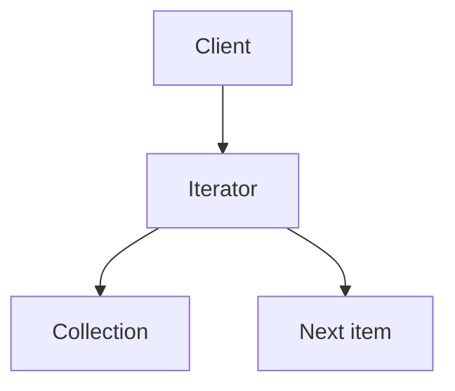
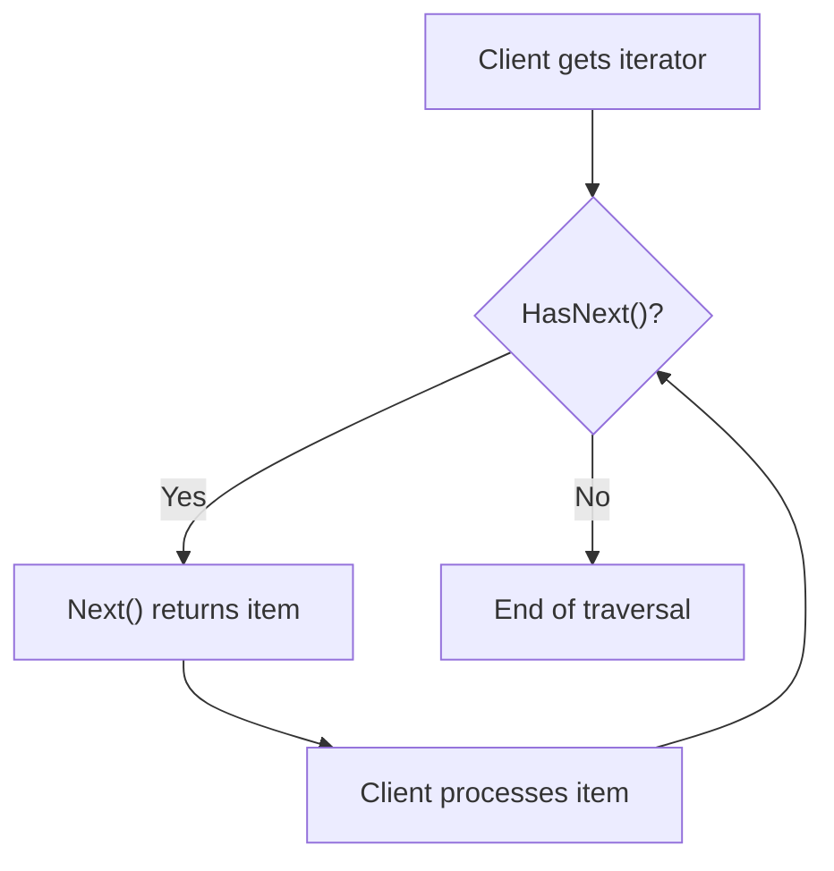
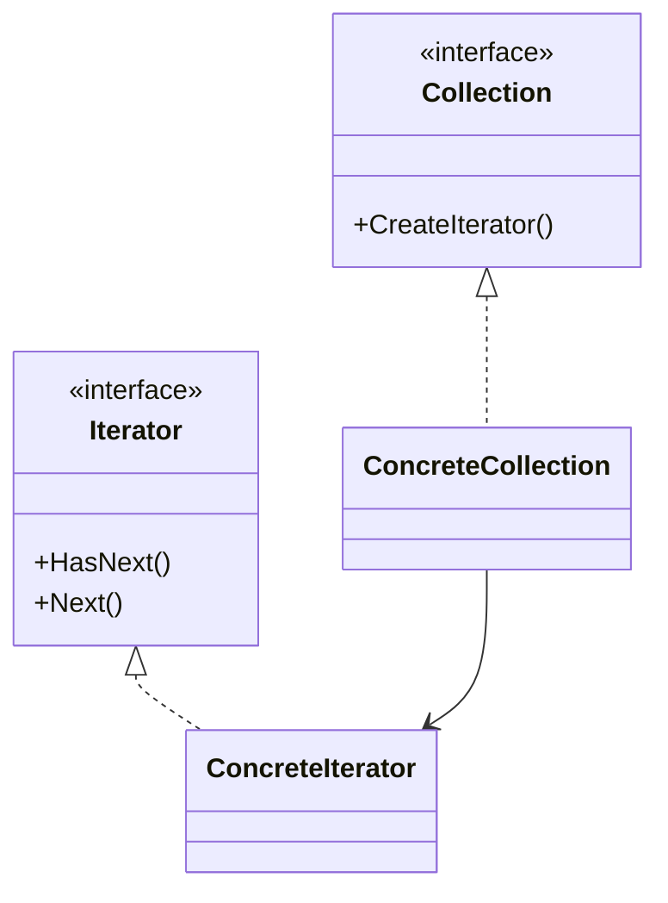

# Iterator

> 📖 **Source:** [Refactoring.Guru — Iterator](https://refactoring.guru/design-patterns/iterator) | Author: Alexander Shvets

---

## 🎯 Intent

**Iterator** is a behavioral design pattern that lets you traverse the elements of a collection sequentially without exposing its underlying representation (whether a list, stack, tree, or graph).

---

## ❌ Problem

Imagine you are developing an open-world RPG with an **Inventory System**:
- Initially, you store items as a flat list: `List<Item> items`.
- Traversing the items to display them in the UI is very simple: use a `for` or `foreach` loop.
- However, the game later becomes more complex:
  - The inventory is upgraded into tabbed compartments (Weapons, Armor, Potions, etc.).
  - The inventory gains a weight-limit mechanic, and items are sorted by rarity or arranged on a 2D grid.
- At this point, the UI Manager responsible for displaying the inventory runs into trouble. To draw the weapon list, it has to know how to filter the original list itself and handle the traversal conditions on its own. If you change the storage structure from `List<Item>` to `Dictionary<ItemType, List<Item>>` or a tree structure, all the traversal code across the various UI panels will fall apart and have to be rewritten from scratch.

---

## ✅ Solution

The **Iterator** pattern proposes separating the traversal algorithm from the collection itself and placing it into a separate object called an **Iterator**.

1.  An **Iterator** object encapsulates all the details of traversal, such as the current position (current index), the traversal direction (backward/forward), and the filter condition (for example, traversing only weapons).
2.  The collection itself (the Inventory) provides a method to create the corresponding Iterators for the client.
3.  The client (UI Manager) does not need to know whether the inventory is built on a `List`, `Array`, or `Graph` underneath. It only needs to call standardized methods such as `HasNext()` (is there a next element?) and `Next()` (get the next element) on the Iterator.

---

## 🎨 Structure

Rather than reading one large UML diagram right away, read the pattern in 3 layers: **quick idea → real execution flow → simplified UML**.

### 1. Quick Idea



### 2. Real Execution Flow



### 3. Simplified UML



### How to Read the Diagram

| Element | Meaning |
|---|---|
| Quick glance | The Iterator hides how the collection stores its data internally. |
| Main flow | The client only calls HasNext()/Next(). |
| In games | Inventory, waypoints, dialogue nodes, skill list. |
| Solid arrow | An object holds a reference to or directly calls another object. |
| Triangle / dashed arrow in UML | Inheritance or interface implementation. |

> Quick-reading tip: first find the **Client/Context**, then follow the arrows to the main interface. The concrete classes are just variants plugged in at runtime.

---

## 💻 Pseudocode

```csharp
// Standard Iterator interface
interface IIterator<T>
{
    T Current { get; }
    bool MoveNext();
    void Reset();
}

// Collection interface
interface ICollection<T>
{
    IIterator<T> CreateIterator();
}

// Concrete iterator for an array
class ArrayIterator<T> : IIterator<T>
{
    private T[] _collection;
    private int _position = -1;

    public ArrayIterator(T[] collection)
    {
        _collection = collection;
    }

    public T Current => _collection[_position];

    public bool MoveNext()
    {
        if (_position < _collection.Length - 1)
        {
            _position++;
            return true;
        }
        return false;
    }

    public void Reset() => _position = -1;
}
```

---

## ⚙️ Applicability

Use Iterator when:
- Your data collection has a complex underlying structure (for example, a binary tree or a graph of AI movement waypoints) and you want to hide this complexity from the client for security or convenience.
- You need to support multiple different traversal methods over the same collection (for example, traversing the list of monsters by nearest distance, or by decreasing health).
- You want to provide a uniform traversal interface for different data structures without the client caring about the actual data type (polymorphic iteration).

---

## 📝 How to Implement

1.  Define an `IIterator` interface containing the basic methods (`Current`, `MoveNext`, `Reset`). *Note: In C#, you should directly use the system's built-in interfaces `IEnumerator<T>` and `IEnumerable<T>`.*
2.  Create an `ICollection` interface containing a method that creates the Iterator.
3.  Implement the Concrete Iterator classes for your traversal algorithms. These classes need a reference to the Collection object to retrieve data.
4.  Implement the Concrete Collection class that returns an instance of the corresponding Iterator.
5.  In the client source code, use the Iterator to replace the manual loops that depend on the structure.

---

## ⚖️ Pros and Cons

*   **👍 Pros:**
    *   *Single Responsibility Principle:* Separates the complex traversal algorithm from the main data-storage class.
    *   *Open/Closed Principle:* You can add new traversal types (new Iterators) without affecting the old data structure or the Client code.
    *   *Concurrent traversal:* You can run multiple Iterators in parallel over the same data collection because each Iterator stores its own traversal state.
*   **👎 Cons:**
    *   Applying this pattern can be overkill if your game only uses simple flat arrays or lists and does not need custom traversal.
    *   Traversing through an Iterator is sometimes less performant than traversing an array directly by index, due to the cost of function calls through the interface.

---

## 🎮 In Game Dev: C# Code Example (Unity)

Below is how to build an Inventory Filter system in Unity. We will directly use C#'s standard interfaces (`IEnumerator` and `IEnumerable`) to be fully compatible with the default `foreach` loop:

### 1. Item Class and Related Enums
```csharp
public enum ItemRarity
{
    Common,
    Rare,
    Legendary
}

public enum ItemType
{
    Weapon,
    Armor,
    Consumable
}

[System.Serializable]
public class Item
{
    public string itemName;
    public ItemType type;
    public ItemRarity rarity;

    public Item(string name, ItemType type, ItemRarity rarity)
    {
        itemName = name;
        this.type = type;
        this.rarity = rarity;
    }
}
```

### 2. Implementing a Custom Iterator (IEnumerator) That Filters by Rarity
```csharp
using System.Collections;
using System.Collections.Generic;

// Iterator that filters items by Rarity
public class InventoryRarityIterator : IEnumerator<Item>
{
    private readonly List<Item> _items;
    private readonly ItemRarity _targetRarity;
    private int _currentIndex = -1;

    public InventoryRarityIterator(List<Item> items, ItemRarity targetRarity)
    {
        _items = items;
        _targetRarity = targetRarity;
    }

    public Item Current
    {
        get
        {
            if (_currentIndex >= 0 && _currentIndex < _items.Count)
                return _items[_currentIndex];
            return null;
        }
    }

    // IEnumerator requires this non-generic Current property
    object IEnumerator.Current => Current;

    public bool MoveNext()
    {
        // Keep advancing to find an element that satisfies the rarity condition
        while (++_currentIndex < _items.Count)
        {
            if (_items[_currentIndex].rarity == _targetRarity)
            {
                return true;
            }
        }
        return false;
    }

    public void Reset()
    {
        _currentIndex = -1;
    }

    public void Dispose()
    {
        // Release resources if needed
    }
}
```

### 3. Collection (Inventory) Providing the Iterator
```csharp
public class Inventory : IEnumerable<Item>
{
    private List<Item> _items = new List<Item>();

    public void AddItem(Item item)
    {
        _items.Add(item);
    }

    // IEnumerable traverses all items by default
    public IEnumerator<Item> GetEnumerator()
    {
        return _items.GetEnumerator();
    }

    IEnumerator IEnumerable.GetEnumerator()
    {
        return GetEnumerator();
    }

    // Custom method to get a filter by rarity
    public IEnumerable<Item> GetRarityFilter(ItemRarity rarity)
    {
        return new RarityEnumerable(_items, rarity);
    }

    // Helper class to wrap the filtering Enumerable
    private class RarityEnumerable : IEnumerable<Item>
    {
        private readonly List<Item> _items;
        private readonly ItemRarity _rarity;

        public RarityEnumerable(List<Item> items, ItemRarity rarity)
        {
            _items = items;
            _rarity = rarity;
        }

        public IEnumerator<Item> GetEnumerator()
        {
            return new InventoryRarityIterator(_items, _rarity);
        }

        IEnumerator IEnumerable.GetEnumerator()
        {
            return GetEnumerator();
        }
    }
}
```

### 4. Using It in a Unity MonoBehaviour
```csharp
using UnityEngine;

public class InventoryDisplay : MonoBehaviour
{
    private Inventory _myInventory;

    private void Start()
    {
        _myInventory = new Inventory();

        // Add mock data
        _myInventory.AddItem(new Item("Wooden Sword", ItemType.Weapon, ItemRarity.Common));
        _myInventory.AddItem(new Item("Iron Armor", ItemType.Armor, ItemRarity.Common));
        _myInventory.AddItem(new Item("Excalibur the Divine Sword", ItemType.Weapon, ItemRarity.Legendary));
        _myInventory.AddItem(new Item("Super Health Potion", ItemType.Consumable, ItemRarity.Rare));
        _myInventory.AddItem(new Item("Ring of Infinity", ItemType.Armor, ItemRarity.Legendary));

        // 1. Traverse the entire inventory using the default foreach
        Debug.Log("🎒 --- Traversing the entire inventory ---");
        foreach (var item in _myInventory)
        {
            Debug.Log($"Item: {item.itemName} | Type: {item.type} | Rarity: {item.rarity}");
        }

        // 2. Traverse only Legendary items through the filtering Iterator
        Debug.Log("\n🏆 --- Traversing legendary items (Legendary) ---");
        foreach (var item in _myInventory.GetRarityFilter(ItemRarity.Legendary))
        {
            Debug.Log($"✨ [Legendary] {item.itemName}!");
        }
    }
}
```

---
> 📚 **Origin:** Content referenced from [Refactoring.Guru](https://refactoring.guru/) — Author: Alexander Shvets, Illustrations: Dmitry Zhart

| Direction | Link |
|-------|----------|
| ← Back | [Command](./02-command.md) |
| → Next | [Mediator](./04-mediator.md) |
