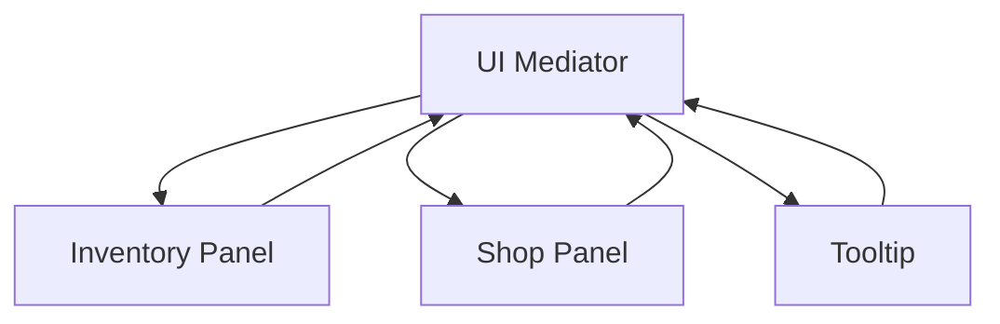
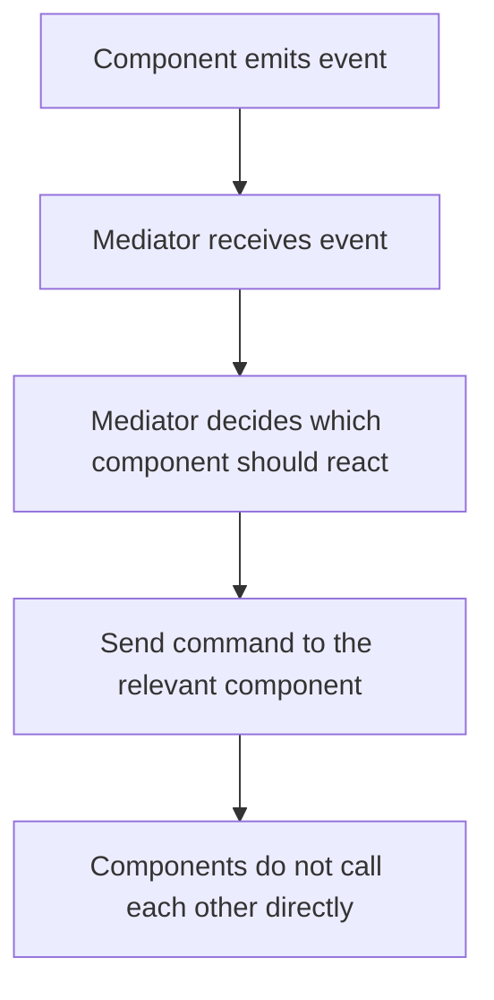
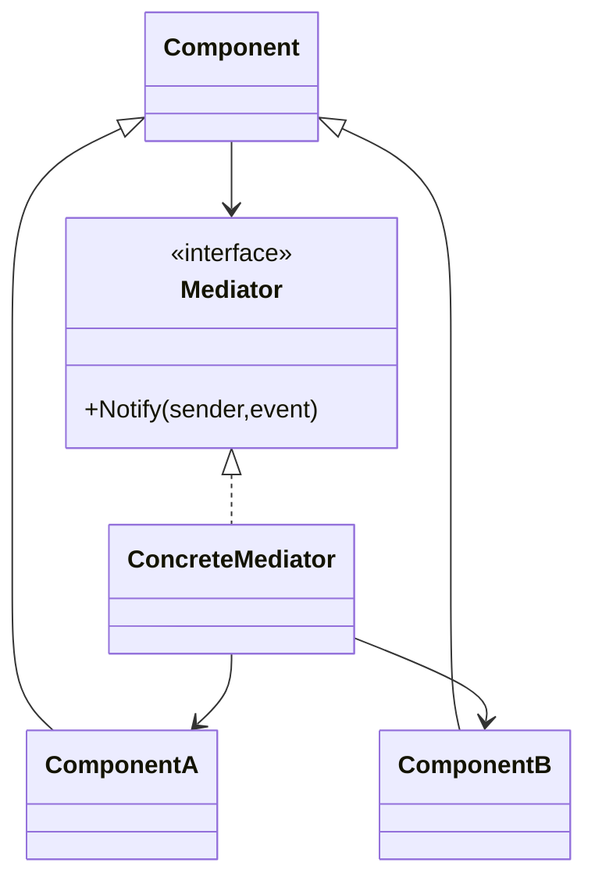

# Mediator

> 📖 **Source:** [Refactoring.Guru — Mediator](https://refactoring.guru/design-patterns/mediator) | Author: Alexander Shvets

---

## 🎯 Intent

**Mediator** is a behavioral design pattern that reduces tight coupling and direct dependencies between classes by forcing them to communicate indirectly through a single mediator object.

---

## ❌ Problem

Imagine you are building a complex **UI Panel/Dialog** screen for a game, for example a **Victory Screen** (level completed):
- This screen consists of several small UI components:
  - A **Next Level Button** to proceed to the next level.
  - A **Retry Button** to replay.
  - A **Score Text** box that displays the score.
  - A **Stars Panel** with a sparkling star effect.
- In addition, this Victory screen needs to interact with other major management systems in the game:
  - **AudioManager** to play victory music (Victory SFX).
  - **LevelLoader** to load a new level.
  - **SaveSystem** to record that the level has been completed.
- If you let the buttons call `LevelLoader` and `AudioManager` directly, and then let `LevelLoader` adjust the button states itself, your code will create a **spaghetti web of dependencies**. Each component has to hold references to 3-4 other components. You cannot reuse that button on another screen (such as a Settings Screen) because it is rigidly bound to the Victory Screen.

---

## ✅ Solution

The **Mediator** pattern proposes that you remove all direct links between components that want to collaborate. Instead, force them to depend on a single intermediary class called the **Mediator**.

1.  The communicating components (called **Colleagues**) no longer call each other's methods. When an event occurs (for example, a button is clicked), it only notifies the Mediator: *"I was just clicked!"*.
2.  The **Mediator** receives that signal, handles the coordination logic, and decides on the next actions for all the other components.
    *   For example: When the `RetryButton` is clicked, it notifies the `VictoryPanelMediator`. The mediator calls `AudioManager` to play a click sound, tells `SaveSystem` to save the score, then orders `LevelLoader` to reset the level.
3.  As a result, the Colleagues become completely independent and do not need to know who the other Colleagues are or what they do.

---

## 🎨 Structure

Rather than reading one large UML diagram right away, read the pattern in 3 layers: **quick idea → real execution flow → simplified UML**.

### 1. Quick Idea



### 2. Real Execution Flow



### 3. Simplified UML



### How to Read the Diagram

| Element | Meaning |
|---|---|
| Quick glance | The Mediator is the coordination hub, reducing cross-links. |
| Main flow | Components report events to the Mediator instead of calling each other directly. |
| In games | UI flow, dialogue panel, lobby/matchmaking screen. |
| Solid arrow | An object holds a reference to or directly calls another object. |
| Triangle / dashed arrow in UML | Inheritance or interface implementation. |

> Quick-reading tip: first find the **Client/Context**, then follow the arrows to the main interface. The concrete classes are just variants plugged in at runtime.

---

## 💻 Pseudocode

```csharp
// Common Mediator interface
interface IMediator
{
    void Notify(object sender, string ev);
}

// Base class for communicating components
abstract class Component
{
    protected IMediator _mediator;

    public Component(IMediator mediator)
    {
        _mediator = mediator;
    }
}

// Concrete component
class Button : Component
{
    public Button(IMediator mediator) : base(mediator) {}

    public void Click()
    {
        // Instead of directly calling another object's logic, just notify the Mediator
        _mediator.Notify(this, "click");
    }
}

// Concrete Mediator that coordinates the flow
class ScreenMediator : IMediator
{
    private Button _saveButton;
    private TextBox _inputBox;

    public void Notify(object sender, string ev)
    {
        if (ev == "click" && sender == _saveButton)
        {
            string content = _inputBox.GetText();
            SaveData(content);
        }
    }
}
```

---

## ⚙️ Applicability

Use Mediator when:
- Your code starts to develop a tangled web of cross-references between classes (especially UI and Managers).
- You want to reuse a component in many different places but cannot, because it is too coupled with the other components around it.
- You want to centralize the control logic of the game/UI flow into a single place so it is easier to control and modify.

---

## 📝 How to Implement

1.  Define an `IMediator` interface that declares a notification method (usually identifying the sender via a `sender` object and an `event` as an enum or string).
2.  Create a Concrete Mediator class that implements that interface and holds references to all the child components it needs to coordinate.
3.  Give the child components (Colleagues) a reference to the Mediator object. This can be passed through the constructor or a setter.
4.  Modify the source code of the child components: replace direct calls to external classes with calls to the Mediator's `Notify` method.
5.  Implement the event distribution/routing logic inside the `Notify` method of the Concrete Mediator class.

---

## ⚖️ Pros and Cons

*   **👍 Pros:**
    *   *Loose Coupling:* Breaks the direct links between components, making code easier to read and easier to test.
    *   *Single Responsibility Principle:* Encapsulates the coordination control flow in one central place (the Mediator) instead of scattering it everywhere.
    *   *Reusability:* The child components become clean and can be easily reused in other contexts.
*   **👎 Cons:**
    *   *God Object:* The Mediator risks growing over time and containing too much of the game's entire processing logic, turning it into a "Super Class" that is hard to maintain if it is not properly divided.

---

## 🎮 In Game Dev: C# Code Example (Unity)

Below is the design of a game's Victory Panel ending screen that coordinates the audio, score, and scene-transition flows through the **Mediator Pattern**:

### 1. The Mediator System and Basic UI Components
```csharp
using UnityEngine;

// Common Mediator interface
public interface IMediator
{
    void Notify(Component sender, string eventCode);
}

// Base Colleague class to link with the Mediator
public abstract class Colleague : MonoBehaviour
{
    protected IMediator mediator;

    public void Configure(IMediator mediator)
    {
        this.mediator = mediator;
    }
}
```

### 2. The Concrete Colleagues (Buttons, Effect Panel)
```csharp
using UnityEngine.UI;

// Button component in the game
public class GameButton : Colleague
{
    private Button _button;
    public string clickEventName;

    private void Awake()
    {
        _button = GetComponent<Button>();
        _button.onClick.AddListener(OnClicked);
    }

    private void OnClicked()
    {
        Debug.Log($"🔘 [UI Button] Button {gameObject.name} was clicked.");
        if (mediator != null)
        {
            mediator.Notify(this, clickEventName);
        }
    }
}

// Score display component
public class ScorePanel : Colleague
{
    public void UpdateScoreDisplay(int score)
    {
        Debug.Log($"📊 [Score Panel] Updating score UI: {score} points.");
    }
}
```

### 3. The Concrete Mediator Coordinating the Managers and UI Components
```csharp
// Mock-up of the major Managers
public class AudioManager : MonoBehaviour
{
    public void PlaySFX(string name) => Debug.Log($"🎵 [Audio Manager] Playing sound effect: {name}");
}

public class LevelLoader : MonoBehaviour
{
    public void LoadLevel(string name) => Debug.Log($"🌀 [Level Loader] Loading level: {name}");
}

// Victory Screen Mediator
public class VictoryScreenMediator : MonoBehaviour, IMediator
{
    [Header("Managers")]
    [SerializeField] private AudioManager audioManager;
    [SerializeField] private LevelLoader levelLoader;

    [Header("UI Components")]
    [SerializeField] private GameButton nextLevelButton;
    [SerializeField] private GameButton retryButton;
    [SerializeField] private ScorePanel scorePanel;

    private void Start()
    {
        // Register the mediator for the Colleagues
        nextLevelButton.Configure(this);
        retryButton.Configure(this);
        scorePanel.Configure(this);

        // Display the score when the Panel first opens
        scorePanel.UpdateScoreDisplay(5000);
        audioManager.PlaySFX("Fanfare_Victory");
    }

    // The main coordination logic lives here
    public void Notify(Component sender, string eventCode)
    {
        switch (eventCode)
        {
            case "NEXT_LEVEL":
                audioManager.PlaySFX("Button_Click");
                Debug.Log("🏆 [Mediator] Player chose Next Level. Requesting scene transition.");
                levelLoader.LoadLevel("Level_02");
                break;

            case "RETRY":
                audioManager.PlaySFX("Button_Click");
                Debug.Log("🔄 [Mediator] Player chose Retry. Resetting the level.");
                levelLoader.LoadLevel("Level_01");
                break;

            default:
                Debug.LogWarning($"⚠️ [Mediator] No handling flow found for event: {eventCode}");
                break;
        }
    }
}
```

---
> 📚 **Origin:** Content referenced from [Refactoring.Guru](https://refactoring.guru/) — Author: Alexander Shvets, Illustrations: Dmitry Zhart

| Direction | Link |
|-------|----------|
| ← Back | [Iterator](./03-iterator.md) |
| → Next | [Memento](./05-memento.md) |
