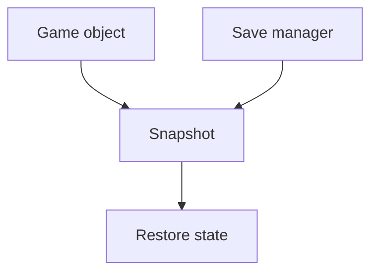
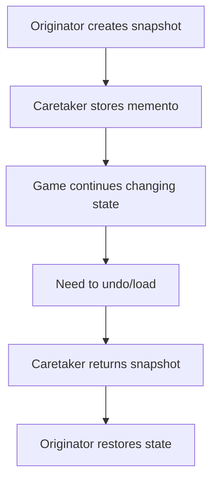
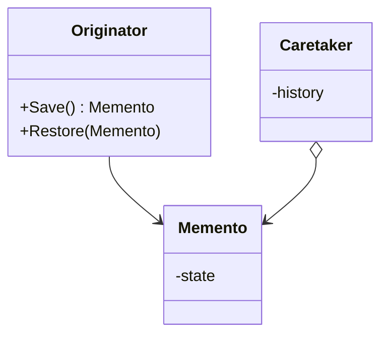

# Memento

> 📖 **Source:** [Refactoring.Guru — Memento](https://refactoring.guru/design-patterns/memento) | Author: Alexander Shvets

---

## 🎯 Intent

**Memento** is a behavioral design pattern that lets you save and restore the internal state of an object without violating the principle of encapsulation.

---

## ❌ Problem

In the development of online action games (Multiplayer) or time-rewind puzzle games (Time Rewind / Rollback System):
- You need to store the position, velocity, health, and facing direction of a character at every frame (or at checkpoints).
- If there is a data discrepancy between the Client and the Server (Desync), the Client needs to immediately **roll back its state (Rollback)** to the exact frame that went wrong, then re-simulate.
- If you design the network system to read the character's private variables directly, such as `private Vector3 position` and `private float currentHealth`, and then store them elsewhere, you break the principle of encapsulation. The network-management class would have to know far too many of the character's internal details.
- Moreover, this saving and restoring happens continuously, so if the character class changes its properties in the future (for example, adding a mana energy bar), you would have to modify all the storage code in the network system again.

---

## ✅ Solution

The **Memento** pattern proposes delegating the task of capturing state to the very object that owns that state (called the **Originator**).

1.  The character itself (Originator) creates a special state-backup copy called a **Memento**. This Memento object is immutable (read-only) and contains only the raw state data at a specific moment in time.
2.  The party outside the character (for example, a `RewindManager` acting as the **Caretaker**) only receives this Memento and stores it in a history list. The Caretaker is neither permitted nor able to view or modify the data inside the Memento.
3.  When a rewind is needed, the Caretaker hands that Memento back to the character. The character reads its own memento data and restores the corresponding values.

---

## 🎨 Structure

Rather than reading one large UML diagram right away, read the pattern in 3 layers: **quick idea → real execution flow → simplified UML**.

### 1. Quick Idea



### 2. Real Execution Flow



### 3. Simplified UML



### How to Read the Diagram

| Element | Meaning |
|---|---|
| Quick glance | The Memento stores a snapshot without exposing the state details. |
| Main flow | The Caretaker only holds the snapshot; the Originator restores itself. |
| In games | Checkpoint, save/load, undo move, rollback. |
| Solid arrow | An object holds a reference to or directly calls another object. |
| Triangle / dashed arrow in UML | Inheritance or interface implementation. |

> Quick-reading tip: first find the **Client/Context**, then follow the arrows to the main interface. The concrete classes are just variants plugged in at runtime.

---

## 💻 Pseudocode

```csharp
// Immutable Memento object that holds the state
class Memento
{
    private readonly string _state;

    public Memento(string state)
    {
        _state = state;
    }

    public string GetState() => _state;
}

// Originator object with state that needs to be saved
class Originator
{
    private string _state;

    public void SetState(string state) => _state = state;

    // Capture the current state
    public Memento Save() => new Memento(_state);

    // Restore the old state
    public void Restore(Memento memento)
    {
        _state = memento.GetState();
    }
}

// Caretaker object that manages the Memento history
class Caretaker
{
    private List<Memento> _mementos = new List<Memento>();
    private Originator _originator;

    public void Backup() => _mementos.Add(_originator.Save());
    public void Undo()
    {
        if (_mementos.Count > 0)
        {
            var memento = _mementos.Last();
            _mementos.Remove(memento);
            _originator.Restore(memento);
        }
    }
}
```

---

## ⚙️ Applicability

Use Memento when:
- You need to capture a snapshot of an object's state so that you can restore it later (Save/Load game, Checkpoint, Rollback).
- Reading the object's state directly violates encapsulation and exposes its implementation details.
- You need a rollback mechanism in network programming (Netcode), such as Client-side Prediction and Server Reconciliation.

---

## 📝 How to Implement

1.  Identify the class that plays the role of the Originator (which holds the state to be saved) and the Caretaker (which keeps the history).
2.  Create a Memento class containing the properties that describe the Originator's state. Make sure these properties are `readonly` to prevent modification from the outside.
3.  Provide the Memento class with data getters, or make it a nested class inside the Originator so that only the Originator can access its data fields.
4.  In the Originator, add a method to create a Memento (containing the current data) and a method to restore from a Memento (assigning the data back).
5.  In the Caretaker, manage the list of Mementos and decide when to capture a state snapshot and when to roll back.

---

## ⚖️ Pros and Cons

*   **👍 Pros:**
    *   *Protects encapsulation:* The client does not need to know the character's property structure in order to save and restore it.
    *   *Simplifies the Originator:* The Originator does not need to manage its own storage history.
*   **👎 Cons:**
    *   *Memory-intensive:* If you store too many Mementos every frame (Update) without freeing them, RAM usage will grow very quickly.
    *   *Initialization cost:* Continuously creating new Memento objects can trigger the Garbage Collector to work heavily, causing game lag (micro-stutter).

---

## 🎮 In Game Dev: C# Code Example (Unity)

Below is a simple **Time Rewind** system for a character in Unity that saves a snapshot every 0.1 seconds:

### 1. Memento Storing the Character's State
```csharp
using UnityEngine;

// Memento storing the player's raw state
public class PlayerStateMemento
{
    // Ensure immutability
    public Vector3 Position { get; }
    public Quaternion Rotation { get; }
    public float Health { get; }

    public PlayerStateMemento(Vector3 position, Quaternion rotation, float health)
    {
        Position = position;
        Rotation = rotation;
        Health = health;
    }
}
```

### 2. Originator (Player Controller)
```csharp
public class PlayerController : MonoBehaviour
{
    [SerializeField] private float speed = 5f;
    private float _health = 100f;
    private Rigidbody _rb;

    private void Awake()
    {
        _rb = GetComponent<Rigidbody>();
    }

    private void Update()
    {
        // Simple movement control
        float moveX = Input.GetAxis("Horizontal");
        float moveZ = Input.GetAxis("Vertical");
        Vector3 move = new Vector3(moveX, 0, moveZ) * (speed * Time.deltaTime);
        transform.Translate(move, Space.World);

        // Simulate taking damage
        if (Input.GetKeyDown(KeyCode.Space))
        {
            _health -= 10f;
            Debug.Log($"💥 Player got hit! Health remaining: {_health}");
        }
    }

    // Create a Memento that saves the current state
    public PlayerStateMemento SaveState()
    {
        return new PlayerStateMemento(transform.position, transform.rotation, _health);
    }

    // Restore the state from a Memento
    public void RestoreState(PlayerStateMemento memento)
    {
        transform.position = memento.Position;
        transform.rotation = memento.Rotation;
        _health = memento.Health;
        
        // Reset the physics velocity to avoid old inertia affecting the character after restoring
        if (_rb != null)
        {
            _rb.linearVelocity = Vector3.zero;
            _rb.angularVelocity = Vector3.zero;
        }

        Debug.Log($"↩️ [Originator] State restored! Position: {transform.position}, Health: {_health}");
    }
}
```

### 3. Caretaker (Time Rewind Manager)
```csharp
using System.Collections.Generic;
using UnityEngine;

public class TimeRewindManager : MonoBehaviour
{
    [SerializeField] private PlayerController player;
    [SerializeField] private float recordInterval = 0.1f; // Take a snapshot every 100ms
    [SerializeField] private int maxStoredStates = 50;    // Store up to 5 seconds of history

    private readonly List<PlayerStateMemento> _stateHistory = new List<PlayerStateMemento>();
    private float _recordTimer;

    private void Update()
    {
        // Press Q to activate Time Rewind
        if (Input.GetKey(KeyCode.Q))
        {
            Rewind();
        }
        else
        {
            // Automatically record the state on a cycle
            _recordTimer += Time.deltaTime;
            if (_recordTimer >= recordInterval)
            {
                Record();
                _recordTimer = 0;
            }
        }
    }

    private void Record()
    {
        if (player == null) return;

        // Capture the state and push it into the history
        _stateHistory.Add(player.SaveState());

        // Limit the number of stored states to avoid memory overflow
        if (_stateHistory.Count > maxStoredStates)
        {
            _stateHistory.RemoveAt(0); // Remove the oldest state
        }
    }

    private void Rewind()
    {
        if (_stateHistory.Count > 0)
        {
            // Take the most recent state and restore it
            int lastIndex = _stateHistory.Count - 1;
            PlayerStateMemento lastState = _stateHistory[lastIndex];
            _stateHistory.RemoveAt(lastIndex);

            player.RestoreState(lastState);
        }
        else
        {
            Debug.LogWarning("⚠️ Rewound back to the history limit!");
        }
    }
}
```

---
> 📚 **Origin:** Content referenced from [Refactoring.Guru](https://refactoring.guru/) — Author: Alexander Shvets, Illustrations: Dmitry Zhart

| Direction | Link |
|-------|----------|
| ← Back | [Mediator](./04-mediator.md) |
| → Next | [Observer](./06-observer.md) |
