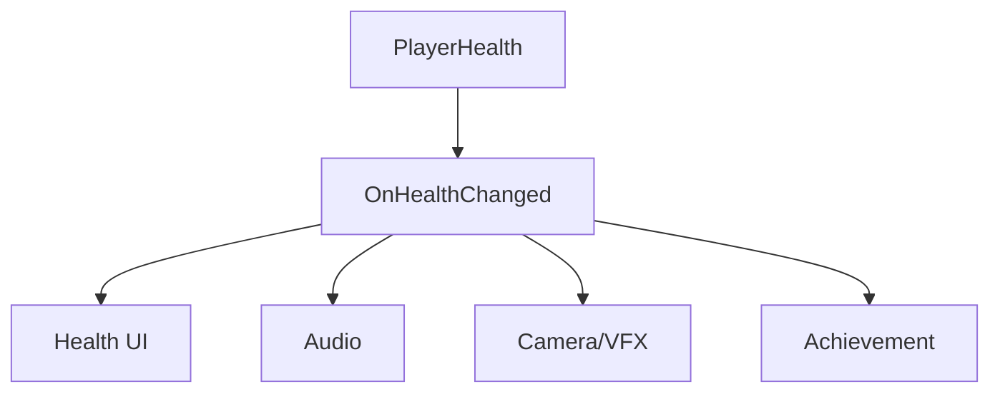
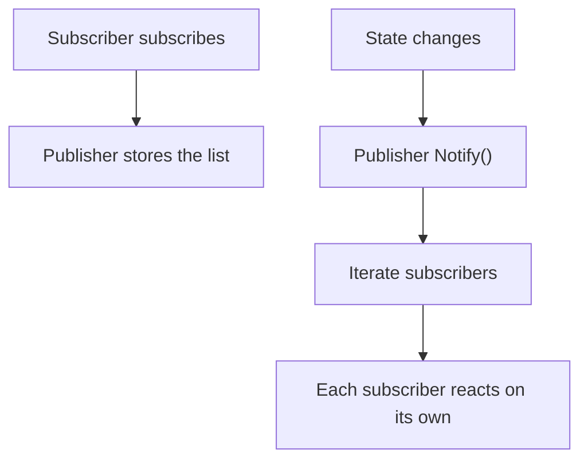
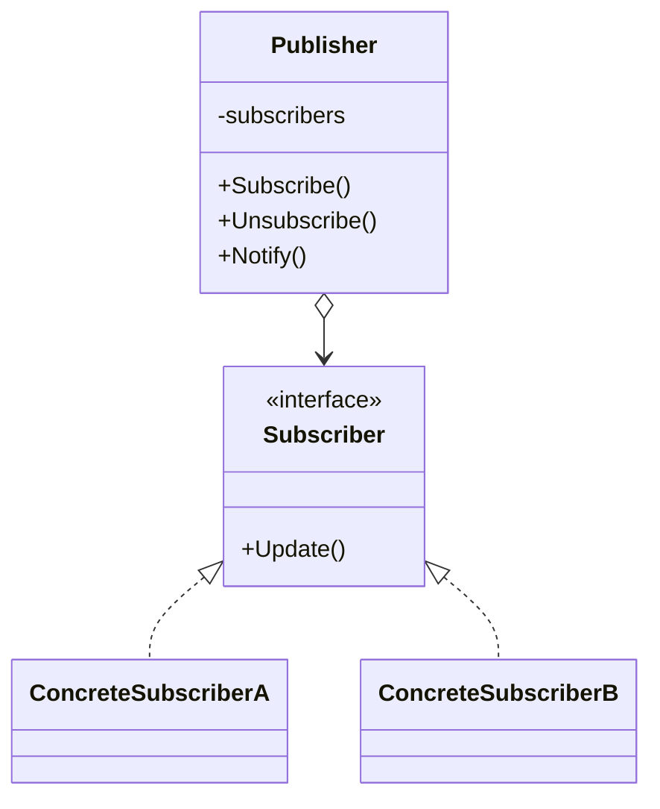

# Observer

> 📖 **Source:** [Refactoring.Guru — Observer](https://refactoring.guru/design-patterns/observer) | Author: Alexander Shvets

---

## 🎯 Intent

**Observer** is a behavioral design pattern that defines a subscription mechanism to notify multiple objects (subscribers) about any events that happen to the object they are observing (publisher).

---

## ❌ Problem

Imagine you are writing a **PlayerHealth** class that manages a character's health:
- When the player takes damage, the game needs to trigger many responses:
  1.  **UI (Health Bar)** needs to update so the red health bar shrinks.
  2.  **Sound System** needs to play a groan or a pounding heartbeat if health is too low.
  3.  **VFX (Camera Shake / Red Flash)** needs to flash red on the screen to signal danger.
  4.  **Achievement Manager** needs to check whether the player has earned the "Miraculous Survival" achievement (winning while health is below 1%).
- If you drag direct references to `HealthBar`, `SoundManager`, `CameraEffects`, and `AchievementManager` into the `PlayerHealth` script, this class becomes a **Highly Coupled Class**. You won't be able to carry the `PlayerHealth` script over to another game prototype without dragging along all of those UI, Sound, and VFX scripts. At the same time, every time you add a new response system, you have to modify the `PlayerHealth` code again.

---

## ✅ Solution

The **Observer** pattern solves this problem by introducing the **Publisher & Subscribers** model.

1.  **Publisher (PlayerHealth):** Maintains a list of interested objects (subscribers) and provides methods so they can Subscribe or Unsubscribe from the health-change event.
2.  When health changes, the Publisher simply iterates over the subscriber list and calls a common notification method.
3.  **Subscribers:** Implement a common interface (or subscribe through C#'s Delegate/Action mechanism) to listen for notifications and run their own response logic.
4.  Now `PlayerHealth` doesn't need to know who is observing it. It only has to broadcast: *"My health just changed!"*.

---

## 🎨 Structure

Instead of reading one large UML diagram from the start, read the pattern in 3 layers: **quick idea → real execution flow → condensed UML**.

### 1. Quick idea



### 2. Real execution flow



### 3. Condensed UML



### How to read the diagram

| Component | Meaning |
|---|---|
| Quick glance | The Publisher emits an event; subscribers handle it themselves. |
| Main flow | The Publisher doesn't need to know the specific UI/Audio/VFX. |
| In games | Health change, quest event, achievement, UI refresh. |
| Solid arrow | An object is holding a reference to or directly calling another object. |
| Triangle / dashed arrow in UML | Inheritance or interface implementation. |

> Quick-read tip: first find the **Client/Context**, then follow the arrow to the main interface. The concrete classes are just variants swapped in at runtime.

---

## 💻 Pseudocode

```csharp
// Observer interface
interface IObserver
{
    void Update(float health);
}

// Observed object (Subject / Publisher)
class PlayerHealth
{
    private List<IObserver> _observers = new List<IObserver>();
    private float _health = 100f;

    public void Subscribe(IObserver observer) => _observers.Add(observer);
    public void Unsubscribe(IObserver observer) => _observers.Remove(observer);

    public void TakeDamage(float damage)
    {
        _health -= damage;
        NotifyObservers();
    }

    private void NotifyObservers()
    {
        foreach (var observer in _observers)
        {
            observer.Update(_health);
        }
    }
}
```

---

## ⚙️ Applicability

Use Observer when:
- A change in one object's state requires updating other objects, and you don't know in advance how many objects need to be updated.
- You need to build a UI system that responds to gameplay logic (the UI always listens for data changes — the Data Binding mechanism).
- You need to decouple the core of the game (Core Logic) from auxiliary components such as Audio, Achievements, Quest System, or Analytics.

---

## 📝 How to Implement

1.  Identify the object that sends information (Publisher) and the object that receives information (Subscriber).
2.  *Programming in C#/Unity:* The best and most idiomatic approach is to use `System.Action` or `System.Action<T>` (Delegates) instead of manually writing an Observer interface.
3.  In the Publisher, declare an event (event Action).
4.  At runtime, Subscriber objects subscribe their handler functions to the Publisher's event using the `+=` operator.
5.  Make sure to unsubscribe with the `-=` operator when a Subscriber is deactivated (such as in `OnDestroy` or `OnDisable` in Unity) to avoid memory leaks (Memory Leak — known as the Lapsed Listener problem).
6.  When a state change occurs, the Publisher triggers the event by calling `EventName?.Invoke(data)`.

---

## ⚖️ Pros and Cons

*   **👍 Pros:**
    *   *Loose Coupling:* The Publisher and Subscribers are completely independent; changing one side won't break the other's code.
    *   *Open/Closed Principle:* You can add hundreds of new Subscribers to the system (for example, dust effects, camera shake) without modifying a single line of code in the original character class.
*   **👎 Cons:**
    *   The order in which Subscribers receive notifications is random; you cannot precisely control who runs before whom.
    *   **Memory Leak risk:** If you forget to unsubscribe (`-=`) when a UI or VFX object is destroyed, the garbage collector won't be able to clean up that object because the Publisher still holds a delegate reference to it.

---

## 🎮 In Game Dev: C# Code Example (Unity)

Below is an implementation of a player health-change event system using **C# Actions**, which is extremely common in Unity:

### 1. Publisher (Player Health)
```csharp
using System;
using UnityEngine;

public class PlayerHealth : MonoBehaviour
{
    [SerializeField] private float maxHealth = 100f;
    private float _currentHealth;

    // Define the health-change notification event: passes the current health and max health
    public event Action<float, float> OnHealthChanged;

    private void Start()
    {
        _currentHealth = maxHealth;
        // Trigger the event once at startup so the UI initializes its values
        TriggerHealthEvent();
    }

    public void TakeDamage(float amount)
    {
        if (amount <= 0) return;

        _currentHealth = Mathf.Max(0, _currentHealth - amount);
        Debug.Log($"💥 [Publisher] The character lost {amount} health. Current health: {_currentHealth}");

        TriggerHealthEvent();
    }

    private void TriggerHealthEvent()
    {
        // Invoke safely with the ?. operator (only calls when at least 1 subscriber is listening)
        OnHealthChanged?.Invoke(_currentHealth, maxHealth);
    }
}
```

### 2. The Subscribers (UI, Audio, Achievement)
```csharp
using UnityEngine;
using UnityEngine.UI;

// Subscriber 1: Health Bar UI
public class HealthBarUI : MonoBehaviour
{
    [SerializeField] private PlayerHealth playerHealth;
    [SerializeField] private Image fillImage;

    private void OnEnable()
    {
        if (playerHealth != null)
            playerHealth.OnHealthChanged += UpdateHealthBar; // Subscribe
    }

    private void OnDisable()
    {
        if (playerHealth != null)
            playerHealth.OnHealthChanged -= UpdateHealthBar; // Unsubscribe to avoid a Memory Leak
    }

    private void UpdateHealthBar(float currentHealth, float maxHealth)
    {
        float fillAmount = currentHealth / maxHealth;
        fillImage.fillAmount = fillAmount;
        Debug.Log($"📊 [HealthBar UI] Updated the health bar UI to {fillAmount * 100}%");
    }
}

// Subscriber 2: Warning audio (Audio Manager)
public class HealthAudioObserver : MonoBehaviour
{
    [SerializeField] private PlayerHealth playerHealth;

    private void OnEnable()
    {
        if (playerHealth != null)
            playerHealth.OnHealthChanged += PlayHurtSound;
    }

    private void OnDisable()
    {
        if (playerHealth != null)
            playerHealth.OnHealthChanged -= PlayHurtSound;
    }

    private void PlayHurtSound(float currentHealth, float maxHealth)
    {
        if (currentHealth <= 0)
        {
            Debug.Log("🎵 [Audio] Playing the character death sound.");
        }
        else if (currentHealth < maxHealth * 0.2f)
        {
            Debug.Log("🎵 [Audio] Playing an urgent heartbeat sound (health below 20%).");
        }
        else
        {
            Debug.Log("🎵 [Audio] Playing an 'Ah!' grunt from a light hit.");
        }
    }
}
```

### 3. Controller that issues a test attack command
```csharp
public class GameTester : MonoBehaviour
{
    [SerializeField] private PlayerHealth targetPlayer;

    private void Update()
    {
        // Press the T key to deal 15 damage and test the system's response
        if (Input.GetKeyDown(KeyCode.T))
        {
            if (targetPlayer != null)
            {
                targetPlayer.TakeDamage(15f);
            }
        }
    }
}
```

---
> 📚 **Origin:** Content adapted from [Refactoring.Guru](https://refactoring.guru/) — Author: Alexander Shvets, Illustrations: Dmitry Zhart

| Direction | Link |
|-------|----------|
| ← Back | [Memento](./05-memento.md) |
| → Next | [State](./07-state.md) |
