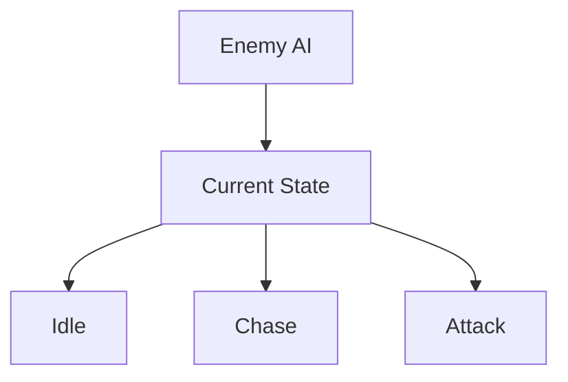
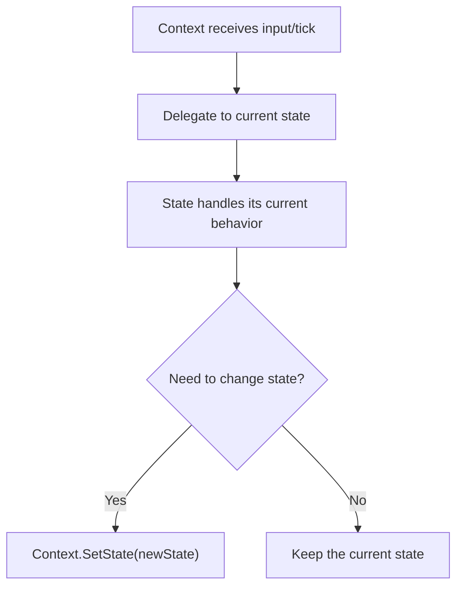
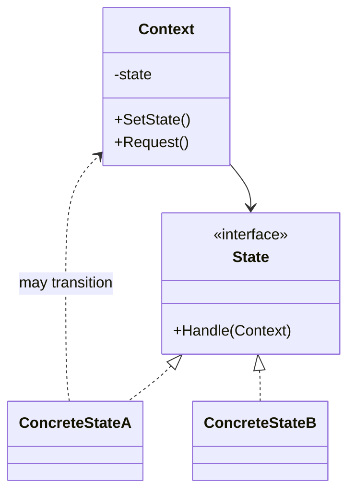

# State

> 📖 **Source:** [Refactoring.Guru — State](https://refactoring.guru/design-patterns/state) | Author: Alexander Shvets

---

## 🎯 Intent

**State** is a behavioral design pattern that lets an object change its behavior when its internal state changes. It appears as if the object has changed its class at runtime.

---

## ❌ Problem

Imagine you are writing the AI for an **Enemy AI** patrolling a level:
- The enemy has 3 active states: **Patrol**, **Chase** (chasing the player), and **Attack**.
- The usual approach is to use an enum and a big dispatch in the `Update()` function:
  ```csharp
  enum EnemyState { Patrol, Chase, Attack }

  void Update() {
      switch (currentState) {
          case EnemyState.Patrol:
              MoveAlongPatrolPath();
              if (CanSeePlayer()) currentState = EnemyState.Chase;
              break;
          case EnemyState.Chase:
              MoveTowardsPlayer();
              if (IsPlayerInAttackRange()) currentState = EnemyState.Attack;
              else if (!CanSeePlayer()) currentState = EnemyState.Patrol;
              break;
          case EnemyState.Attack:
              PerformAttackAction();
              if (!IsPlayerInAttackRange()) currentState = EnemyState.Chase;
              break;
      }
  }
  ```
- At first this structure works just fine. But as the game grows, the designer wants to add new states: **Stunned**, **Flee**, **Search**.
- At that point, the `Update()` function balloons into thousands of lines of code. The state transition logic becomes tangled together. Editing or adding a new state becomes a nightmare because it's very easy to break the behavior of the existing states.

---

## ✅ Solution

The **State** pattern suggests that you create separate classes for each state of the object and move all the state-specific behavior into those classes.

1.  Define a common interface `IState` (or an abstract base class `State`) containing lifecycle methods like `Enter()` (when entering the state), `Update()` (run every frame), and `Exit()` (when leaving the state).
2.  Create concrete state classes: `PatrolState`, `ChaseState`, `AttackState` that implement the `IState` interface.
3.  The original AI object (called the **Context**) holds a reference to the current state (`currentState`) and delegates all the work in `Update()` to that state for handling:
    `currentState.Update();`
4.  When a state change is needed, the Context simply calls a transition function to assign the new state object to the `currentState` variable.

---

## 🎨 Structure

Instead of reading one large UML diagram from the start, read the pattern in 3 layers: **quick idea → real execution flow → condensed UML**.

### 1. Quick idea



### 2. Real execution flow



### 3. Condensed UML



### How to read the diagram

| Component | Meaning |
|---|---|
| Quick glance | Behavior changes based on the object's current state. |
| Main flow | The Context delegates; a State can request a state change. |
| In games | Player state, enemy FSM, game phase. |
| Solid arrow | An object is holding a reference to or directly calling another object. |
| Triangle / dashed arrow in UML | Inheritance or interface implementation. |

> Quick-read tip: first find the **Client/Context**, then follow the arrow to the main interface. The concrete classes are just variants swapped in at runtime.

---

## 💻 Pseudocode

```csharp
// State interface
interface IState
{
    void Enter();
    void Update();
    void Exit();
}

// Context object
class Context
{
    private IState _state;

    public void TransitionTo(IState state)
    {
        _state?.Exit();
        _state = state;
        _state.Enter();
    }

    public void Request()
    {
        _state.Update();
    }
}

// A concrete state
class ConcreteStateA : IState
{
    private Context _context;

    public ConcreteStateA(Context context) => _context = context;

    public void Enter() => Print("Entering State A");
    public void Update()
    {
        // State transition condition
        _context.TransitionTo(new ConcreteStateB(_context));
    }
    public void Exit() => Print("Exiting State A");
}
```

---

## ⚙️ Applicability

Use the State pattern when:
- An object has distinctly different behaviors depending on its current state, and the number of states is large and constantly changing.
- You have too many complex `switch-case` or `if-else` branching structures to dispatch behavior based on state variables.
- You want to share common logic across states or cleanly encapsulate the source code of each AI action to make team collaboration more efficient.

---

## 📝 How to Implement

1.  Define an `IState` interface or an abstract `State` class.
2.  Create the Context class (here, the main AI controller class). Make sure this class has a `ChangeState(IState newState)` method.
3.  For each state in the game, create a class that implements `IState`. This class should receive the Context object in its constructor so it can call the state-change function or access character data.
4.  In the Context's `ChangeState` method:
    *   Call `currentState.Exit()` to clean up the old state (disable effects, stop sounds).
    *   Assign the new state: `currentState = newState;`
    *   Call `currentState.Enter()` to initialize the new state (play animation, set up variables).
5.  In the Context's `Update()` function, just call `currentState.Update()` and nothing else.

---

## ⚖️ Pros and Cons

*   **👍 Pros:**
    *   *Single Responsibility Principle:* Encapsulates the source code of each state into a dedicated class.
    *   *Open/Closed Principle:* Easily add new states without modifying the code of existing states.
    *   *Clear and explicit:* Completely eliminates the cumbersome, bug-prone `switch-case` blocks in the main update function.
*   **👎 Cons:**
    *   The source code can be split into too many script files.
    *   If the state machine is too simple (only 2–3 states that rarely change), applying this pattern adds unnecessary complexity to the project.

---

## 🎮 In Game Dev: C# Code Example (Unity)

Below is a proper **Finite State Machine (FSM)** for an Enemy AI in Unity:

### 1. The IState interface
```csharp
public interface IState
{
    void Enter();
    void Update();
    void Exit();
}
```

### 2. Context Class (Enemy AI Controller)
```csharp
using UnityEngine;

public class EnemyAI : MonoBehaviour
{
    [Header("Movement Stats")]
    public float patrolSpeed = 2f;
    public float chaseSpeed = 5f;
    public Transform[] patrolWaypoints;

    [Header("Detection")]
    public Transform playerTransform;
    public float detectionRange = 7f;
    public float attackRange = 1.5f;

    // Current state
    private IState _currentState;

    private void Start()
    {
        // Initialize the first state as Patrol
        ChangeState(new PatrolState(this));
    }

    private void Update()
    {
        // Delegate processing to the current state
        if (_currentState != null)
        {
            _currentState.Update();
        }
    }

    public void ChangeState(IState newState)
    {
        // Run the Exit function of the old state
        if (_currentState != null)
        {
            _currentState.Exit();
        }

        _currentState = newState;

        // Run the Enter function of the new state
        if (_currentState != null)
        {
            _currentState.Enter();
        }
    }

    // Helper that checks the distance to the player
    public float GetDistanceToPlayer()
    {
        if (playerTransform == null) return float.MaxValue;
        return Vector3.Distance(transform.position, playerTransform.position);
    }
}
```

### 3. The concrete states (Patrol & Chase)
```csharp
using UnityEngine;

// 1. Patrol State
public class PatrolState : IState
{
    private readonly EnemyAI _enemy;
    private int _waypointIndex;

    public PatrolState(EnemyAI enemy)
    {
        _enemy = enemy;
    }

    public void Enter()
    {
        Debug.Log("🤖 [State] Entering the PATROL state.");
        _waypointIndex = 0;
    }

    public void Update()
    {
        // Patrol between the waypoints
        if (_enemy.patrolWaypoints.Length == 0) return;

        Transform targetWaypoint = _enemy.patrolWaypoints[_waypointIndex];
        _enemy.transform.position = Vector3.MoveTowards(
            _enemy.transform.position, 
            targetWaypoint.position, 
            _enemy.patrolSpeed * Time.deltaTime
        );

        if (Vector3.Distance(_enemy.transform.position, targetWaypoint.position) < 0.2f)
        {
            _waypointIndex = (_waypointIndex + 1) % _enemy.patrolWaypoints.Length;
        }

        // Transition condition: player detected -> Chase
        if (_enemy.GetDistanceToPlayer() < _enemy.detectionRange)
        {
            _enemy.ChangeState(new ChaseState(_enemy));
        }
    }

    public void Exit()
    {
        Debug.Log("🤖 [State] Exiting the PATROL state.");
    }
}

// 2. Chase State
public class ChaseState : IState
{
    private readonly EnemyAI _enemy;

    public ChaseState(EnemyAI enemy)
    {
        _enemy = enemy;
    }

    public void Enter()
    {
        Debug.Log("🏃 [State] Entering the CHASE state.");
    }

    public void Update()
    {
        if (_enemy.playerTransform == null) return;

        // Chase the player closely
        _enemy.transform.position = Vector3.MoveTowards(
            _enemy.transform.position, 
            _enemy.playerTransform.position, 
            _enemy.chaseSpeed * Time.deltaTime
        );

        float distance = _enemy.GetDistanceToPlayer();

        // Transition condition 1: lost the player -> return to patrol
        if (distance > _enemy.detectionRange)
        {
            _enemy.ChangeState(new PatrolState(_enemy));
        }
        // Transition condition 2: closed in -> Attack (simulated with a log)
        else if (distance <= _enemy.attackRange)
        {
            Debug.Log("⚔️ [Action] The enemy attacks the player!");
        }
    }

    public void Exit()
    {
        Debug.Log("🏃 [State] Exiting the CHASE state.");
    }
}
```

---
> 📚 **Origin:** Content adapted from [Refactoring.Guru](https://refactoring.guru/) — Author: Alexander Shvets, Illustrations: Dmitry Zhart

| Direction | Link |
|-------|----------|
| ← Back | [Observer](./06-observer.md) |
| → Next | [Strategy](./08-strategy.md) |
