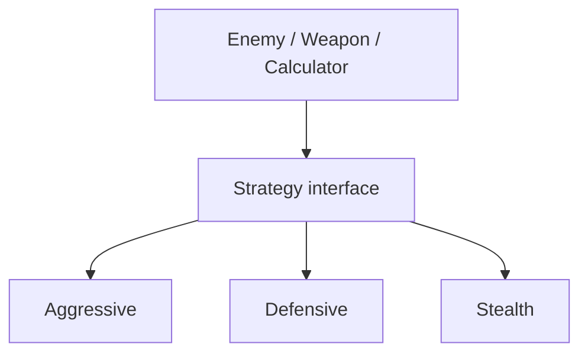
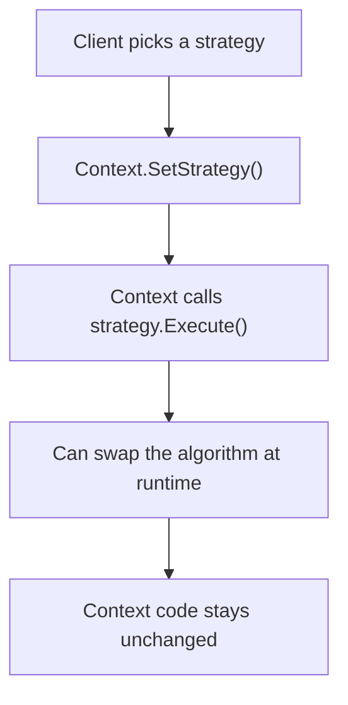
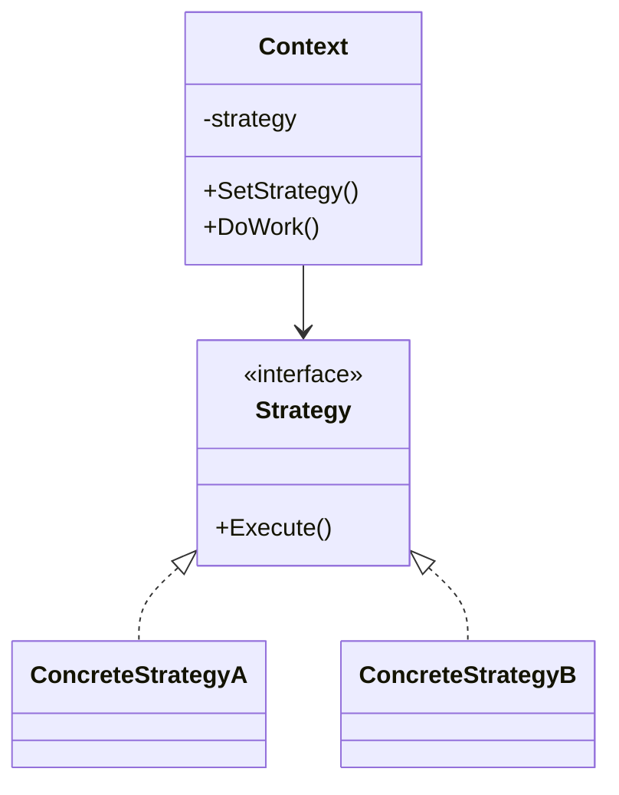

# Strategy

> 📖 **Source:** [Refactoring.Guru — Strategy](https://refactoring.guru/design-patterns/strategy) | Author: Alexander Shvets

---

## 🎯 Intent

**Strategy** is a behavioral design pattern that lets you define a family of algorithms, encapsulate each one, and make them interchangeable at runtime. This pattern lets the algorithm vary independently from the clients that use it.

---

## ❌ Problem

Imagine you are building movement AI for various types of monsters in a game:
- You want the monsters to move in different ways depending on the situation:
  - When they have plenty of health: chase the player directly (**Chase**).
  - When health drops too low, below 15%: flee from the player (**Flee**).
  - Under normal conditions: wander freely around the map (**Wander**).
- If you program all of these position-calculation algorithms directly inside the `EnemyMovement` class, that class becomes extremely complex. You'll have NavMesh pathfinding code blocks mixed in with the trigonometric formulas for fleeing.
- Changing the movement algorithm at runtime forces you to write many nested `if-else` branches. When you want to update or add a new movement type (for example, circling in an orbit — Orbit), you'll run into trouble because the code is cross-dependent and prone to unexpected bugs.

---

## ✅ Solution

The **Strategy** pattern suggests that you separate the different movement algorithms out of the main class and place them into separate classes called **Strategies**.

1.  Define a common interface `IMovementStrategy` with a movement method `ExecuteMovement()`.
2.  Create concrete strategy classes that implement this interface: `ChaseStrategy`, `FleeStrategy`, `WanderStrategy`. Each class focuses solely on solving its own specific movement-vector calculation algorithm.
3.  The main class `EnemyAgent` (the Context) stores a reference to the strategy interface: `IMovementStrategy activeStrategy`.
4.  In the movement update function, `EnemyAgent` simply calls:
    `activeStrategy.ExecuteMovement(transform, target);`
5.  When the game state changes (for example, low health), `EnemyAgent` just swaps the object assigned to `activeStrategy` without changing any internal logic of the original movement class.

---

## 🎨 Structure

Instead of reading one large UML diagram from the start, read the pattern in 3 layers: **quick idea → real execution flow → condensed UML**.

### 1. Quick idea



### 2. Real execution flow



### 3. Condensed UML



### How to read the diagram

| Component | Meaning |
|---|---|
| Quick glance | Encapsulate algorithms so they can be swapped at runtime. |
| Main flow | The Context holds a strategy and calls it through the interface. |
| In games | AI movement, damage formula, targeting mode. |
| Solid arrow | An object is holding a reference to or directly calling another object. |
| Triangle / dashed arrow in UML | Inheritance or interface implementation. |

> Quick-read tip: first find the **Client/Context**, then follow the arrow to the main interface. The concrete classes are just variants swapped in at runtime.

---

## 💻 Pseudocode

```csharp
// Common Strategy interface
interface IStrategy
{
    void Execute();
}

// Concrete Strategy A
class ConcreteStrategyA : IStrategy
{
    public void Execute() => Print("Running algorithm A");
}

// Concrete Strategy B
class ConcreteStrategyB : IStrategy
{
    public void Execute() => Print("Running algorithm B");
}

// Object that uses the strategy (Context)
class Context
{
    private IStrategy _strategy;

    public void SetStrategy(IStrategy strategy)
    {
        _strategy = strategy;
    }

    public void DoAction()
    {
        _strategy.Execute(); // Delegate to the assigned strategy
    }
}
```

---

## ⚙️ Applicability

Use Strategy when:
- You have multiple algorithm variants for solving the same task (such as different AI movement styles, A* vs Dijkstra pathfinding algorithms, or different damage calculation methods).
- You want to change an object's algorithm flexibly at runtime.
- You want to hide the details of an expensive algorithm's structure from the Context class's main business logic.

---

## 📝 How to Implement

1.  In the Context class, declare a field whose data type is the Strategy interface.
2.  Create the Strategy interface containing the algorithm execution method. Pass the necessary parameters from the Context into this method (or pass the Context object itself).
3.  Implement the Concrete Strategy classes.
4.  Provide a strategy-setting function (`SetStrategy` or via the constructor) in the Context class so the Client can configure the desired algorithm.
5.  In the Context's processing logic, replace direct calculation with a call to the current strategy object's execution method.

---

## ⚖️ Pros and Cons

*   **👍 Pros:**
    *   *Flexible changes:* Easily swap different algorithms at runtime.
    *   *Data separation:* Isolates the algorithm's complex structural data away from the main controller class.
    *   *Eliminates branching:* Avoids the enormous `if-else` conditional structures used to select movement algorithms.
    *   *Open/Closed Principle:* Easily add new algorithms without modifying existing code.
*   **👎 Cons:**
    *   The source code is more complex because you have to declare many separate classes for each algorithm.
    *   The Client using it must understand the differences between the strategies in order to choose the appropriate one.

---

## 🎮 In Game Dev: C# Code Example (Unity)

Below is a movement AI system in Unity that uses the **Strategy Pattern** to change movement style based on the monster's health:

### 1. The movement Strategy interface
```csharp
using UnityEngine;

public interface IMovementStrategy
{
    void Move(Transform agent, Transform target, float speed);
}
```

### 2. The concrete Strategy classes (Chase & Flee)
```csharp
using UnityEngine;

// 1. Chase Strategy
public class DirectChaseStrategy : IMovementStrategy
{
    public void Move(Transform agent, Transform target, float speed)
    {
        if (target == null) return;

        // Calculate the direction to the target and move straight toward it
        Vector3 direction = (target.position - agent.position).normalized;
        agent.position += direction * (speed * Time.deltaTime);

        // Face the direction of movement
        if (direction != Vector3.zero)
        {
            agent.rotation = Quaternion.LookRotation(new Vector3(direction.x, 0, direction.z));
        }

        Debug.Log("🎯 [Strategy] CHASING the player at close range.");
    }
}

// 2. Flee Strategy
public class FleeStrategy : IMovementStrategy
{
    public void Move(Transform agent, Transform target, float speed)
    {
        if (target == null) return;

        // Calculate the direction opposite the target in order to flee
        Vector3 direction = (agent.position - target.position).normalized;
        agent.position += direction * (speed * Time.deltaTime);

        // Face the fleeing direction
        if (direction != Vector3.zero)
        {
            agent.rotation = Quaternion.LookRotation(new Vector3(direction.x, 0, direction.z));
        }

        Debug.Log("🏃 [Strategy] FLEEING from the player.");
    }
}
```

### 3. Context Class (Enemy Agent) controller
```csharp
using UnityEngine;

public class EnemyAgent : MonoBehaviour
{
    [Header("Stats")]
    [SerializeField] private Transform targetPlayer;
    [SerializeField] private float movementSpeed = 3f;
    [SerializeField] private float health = 100f;

    // Reference to the movement strategy
    private IMovementStrategy _movementStrategy;

    private void Start()
    {
        // Initialize the default to the Chase strategy
        _movementStrategy = new DirectChaseStrategy();
    }

    private void Update()
    {
        // Execute the current movement strategy
        if (_movementStrategy != null && targetPlayer != null)
        {
            _movementStrategy.Move(transform, targetPlayer, movementSpeed);
        }

        // Simulate taking damage over time to trigger a strategy change
        if (Input.GetKeyDown(KeyCode.H))
        {
            TakeDamage(30f);
        }
    }

    public void SetMovementStrategy(IMovementStrategy newStrategy)
    {
        _movementStrategy = newStrategy;
    }

    public void TakeDamage(float amount)
    {
        health -= amount;
        Debug.Log($"💥 Enemy took {amount} damage. Health remaining: {health}");

        // If health drops below 30%, automatically swap the strategy to Flee
        if (health < 30f && _movementStrategy is DirectChaseStrategy)
        {
            Debug.Log("⚠️ Health too low! Swapping the movement strategy to FLEE.");
            SetMovementStrategy(new FleeStrategy());
        }
    }
}
```

---
> 📚 **Origin:** Content adapted from [Refactoring.Guru](https://refactoring.guru/) — Author: Alexander Shvets, Illustrations: Dmitry Zhart

| Direction | Link |
|-------|----------|
| ← Back | [State](./07-state.md) |
| → Next | [Template Method](./09-template-method.md) |
