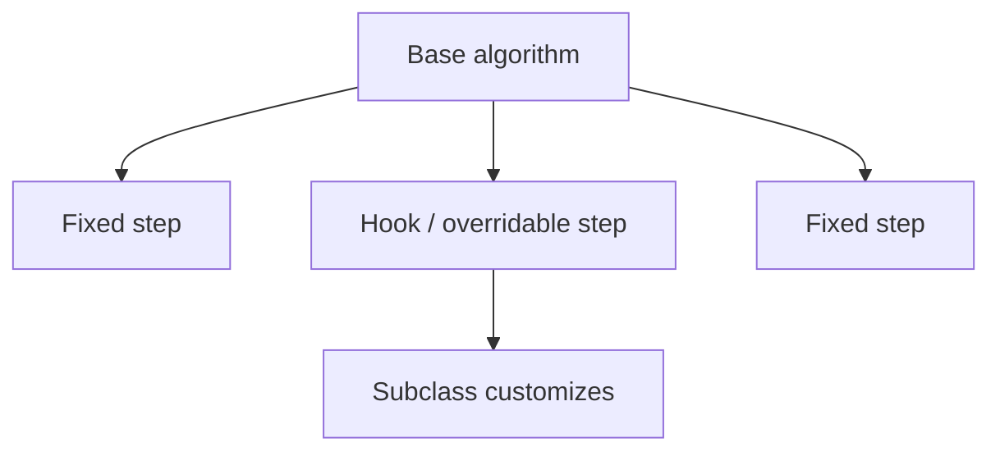
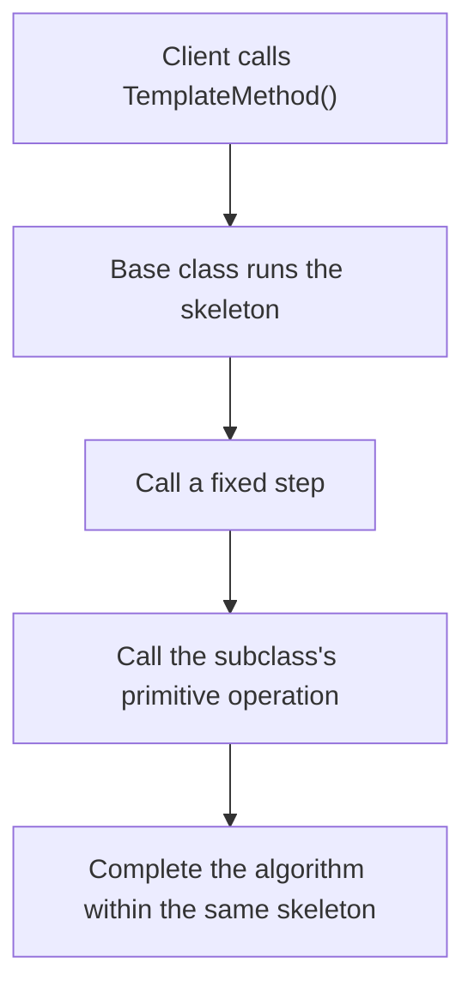
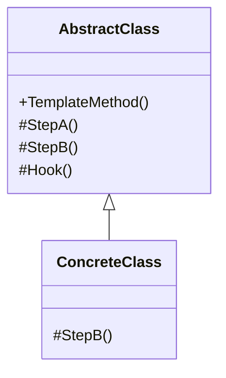

# Template Method

> 📖 **Source:** [Refactoring.Guru — Template Method](https://refactoring.guru/design-patterns/template-method) | Author: Alexander Shvets

---

## 🎯 Intent

**Template Method** is a behavioral design pattern that defines the skeleton of an algorithm in a superclass but lets subclasses override specific steps of the algorithm without changing its overall structure.

---

## ❌ Problem

Imagine you are building a strategic collectible card game (Collectible Card Game):
- Every card, when played by the player, follows a strict activation procedure:
  1.  Deduct the energy points (Mana Cost).
  2.  Play the card sound and the casting effect (Spawn Animation & Audio).
  3.  **Activate the card's special effect** (for example, a fire card breathes fire to deal damage, a healing card restores health).
  4.  Move the card to the graveyard (Move to Discard Pile).
- If every concrete card (`FireballCard`, `HealCard`, `ShieldCard`) re-implements all 4 of these steps itself, you'll end up with an enormous amount of code duplication in steps 1, 2, and 4.
- Worse still, if you later want to change the shared procedure (for example, adding a step to check whether the opponent has a counter spell before deducting mana), you'd have to open up hundreds of script files for hundreds of cards and edit them manually.

---

## ✅ Solution

The **Template Method** pattern advises you to define the common algorithm procedure in an abstract parent class as a single method (called the **Template Method**).

1.  In the parent class `Card`, define a `Play()` function that contains the sequential ordering of the steps.
2.  The steps that are identical across cards (`PayMana()`, `SendToDiscard()`) are implemented in detail directly in the parent class.
3.  The steps that differ between cards (`ApplyEffect()`) are declared as abstract methods or virtual methods.
4.  The child classes (`FireballCard`, `HealCard`) only need to inherit the `Card` class and override the single `ApplyEffect()` method.
5.  The shared execution procedure is preserved, while duplicate code is completely eliminated!

---

## 🎨 Structure

Instead of reading one large UML diagram from the start, read the pattern in 3 layers: **quick idea → real execution flow → condensed UML**.

### 1. Quick idea



### 2. Real execution flow



### 3. Condensed UML



### How to read the diagram

| Component | Meaning |
|---|---|
| Quick glance | The base class holds the algorithm skeleton; the subclass replaces a few steps. |
| Main flow | The Client calls a single template method. |
| In games | Spawn cycle, AI routine, level loading pipeline. |
| Solid arrow | An object is holding a reference to or directly calling another object. |
| Triangle / dashed arrow in UML | Inheritance or interface implementation. |

> Quick-read tip: first find the **Client/Context**, then follow the arrow to the main interface. The concrete classes are just variants swapped in at runtime.

---

## 💻 Pseudocode

```csharp
// Base class that defines the Template Method
abstract class GameAI
{
    // This is the Template Method that defines the algorithm skeleton
    public void RunTurn()
    {
        CollectResources();
        BuildStructures();
        BuildUnits();
        AttackEnemy(); // Abstract step for the subclass to customize
        EndTurn();
    }

    protected void CollectResources() => Print("Collect shared resources.");
    protected void BuildStructures() => Print("Build structures.");
    protected void BuildUnits() => Print("Buy units.");
    protected void EndTurn() => Print("End the turn.");

    // This step forces the subclass to define how it attacks
    protected abstract void AttackEnemy();
}

// Subclass that concretizes the attack algorithm
class AggressiveAI : GameAI
{
    protected override void AttackEnemy()
    {
        Print("Launch an all-out attack with infantry!");
    }
}
```

---

## ⚙️ Applicability

Use Template Method when:
- You want subclasses to extend or customize only certain specific steps of the algorithm without changing its overall structure or sequence.
- You have multiple classes performing nearly identical work, differing only slightly at a few stages. Moving the shared logic up to the parent class helps eliminate code duplication (DRY — Don't Repeat Yourself).
- You want to provide hook points (**Hooks** — empty virtual functions) so subclasses can optionally intervene before or after the important steps of the main algorithm.

---

## 📝 How to Implement

1.  Create an abstract class to serve as the parent class.
2.  Declare the main method as the Template Method (it should be `public` or `final/sealed` if the language supports it, to prevent subclasses from overriding the execution-order structure).
3.  Convert the shared execution steps into `private` or `protected` functions in the parent class.
4.  Identify the steps that vary flexibly and declare them as `abstract` methods (must be overridden) or `virtual` methods (optional override, can be left empty or given a default implementation).
5.  Create the subclasses that inherit the parent class and implement (override) the varying methods as needed.

---

## ⚖️ Pros and Cons

*   **👍 Pros:**
    *   *Maximum code reuse:* Gathers all the identical code up in the parent class.
    *   *Easy to maintain:* Changing the shared procedure only requires editing one place (the parent class).
    *   *Safe extension:* Subclasses can only change the permitted steps; they cannot disrupt the execution order of the main algorithm.
*   **👎 Cons:**
    *   *Design constraints:* Subclasses are bound to the parent class's algorithm skeleton. If the algorithm needs to completely change its execution structure for a particular subclass, this pattern can't accommodate that.
    *   *Liskov violation:* Overriding the sub-functions can sometimes inadvertently violate the Liskov substitution principle if a subclass changes the expected nature of that step.

---

## 🎮 In Game Dev: C# Code Example (Unity)

Below is how to implement a **Card Play Pipeline** in Unity using the **Template Method**:

### 1. The abstract parent class that defines the Template Method
```csharp
using UnityEngine;

public abstract class Card : MonoBehaviour
{
    [Header("Card Metadata")]
    public string cardName;
    public int manaCost;

    // Template Method: defines the card activation procedure
    // Use the sealed keyword, or simply keep the function non-virtual, so subclasses can't change the execution order
    public void PlayCard()
    {
        Debug.Log($"🃏 --- Starting the play procedure for card: {cardName} ---");
        
        if (!PayManaCost())
        {
            Debug.LogWarning("❌ Not enough energy! Card activation canceled.");
            return;
        }

        PlaySpawnAnimation();
        
        // Varying step: call the abstract function so the subclass runs its own effect
        ApplyCustomEffect();

        MoveToDiscardPile();
        
        Debug.Log($"🃏 --- Finished the play procedure for card: {cardName} ---\n");
    }

    private bool PayManaCost()
    {
        Debug.Log($"[1. Cost] Deducting {manaCost} mana from the player.");
        return true; // Simulate always having enough mana
    }

    private void PlaySpawnAnimation()
    {
        Debug.Log("[2. Visual] Playing the card-casting effect onto the battlefield.");
    }

    // The subclass MUST define this effect itself
    protected abstract void ApplyCustomEffect();

    // Hook: a default virtual function that may or may not be overridden
    protected virtual void MoveToDiscardPile()
    {
        Debug.Log("[4. Discard] Pushing the card into the graveyard by default.");
    }
}
```

### 2. The concrete Card subclasses (Fireball & Heal)
```csharp
using UnityEngine;

// 1. Fireball Card
public class FireballCard : Card
{
    [Header("Fireball Stats")]
    public float damage = 50f;

    protected override void ApplyCustomEffect()
    {
        // Run the explosion effect and reduce the opponent's health
        Debug.Log($"🔥 [Effect] Deals {damage} burning damage to the enemy!");
    }
}

// 2. Heal Card
public class HealCard : Card
{
    [Header("Heal Stats")]
    public float healAmount = 30f;

    protected override void ApplyCustomEffect()
    {
        // Run the healing effect
        Debug.Log($"💚 [Effect] Restores {healAmount} health to an ally.");
    }

    // Override the graveyard: override the Hook method if you want this card to disappear permanently instead of going to the Discard Pile
    protected override void MoveToDiscardPile()
    {
        Debug.Log("[4. Discard - Override] The Heal card is banished from the match instead of going to the graveyard!");
    }
}
```

### 3. Client code that simulates playing cards
```csharp
public class CardGameController : MonoBehaviour
{
    [SerializeField] private Card fireballCard;
    [SerializeField] private Card healCard;

    private void Start()
    {
        // Use the Template Method to run a test
        if (fireballCard != null)
        {
            fireballCard.PlayCard();
        }

        if (healCard != null)
        {
            healCard.PlayCard();
        }
    }
}
```

---
> 📚 **Origin:** Content adapted from [Refactoring.Guru](https://refactoring.guru/) — Author: Alexander Shvets, Illustrations: Dmitry Zhart

| Direction | Link |
|-------|----------|
| ← Back | [Strategy](./08-strategy.md) |
| → Next | [Visitor](./10-visitor.md) |
