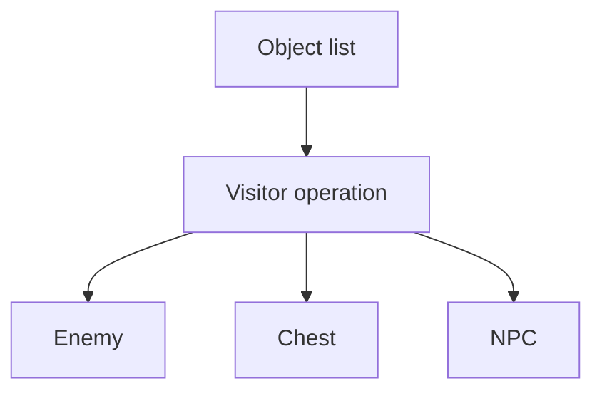
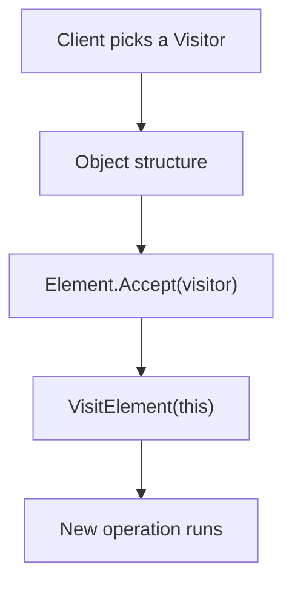
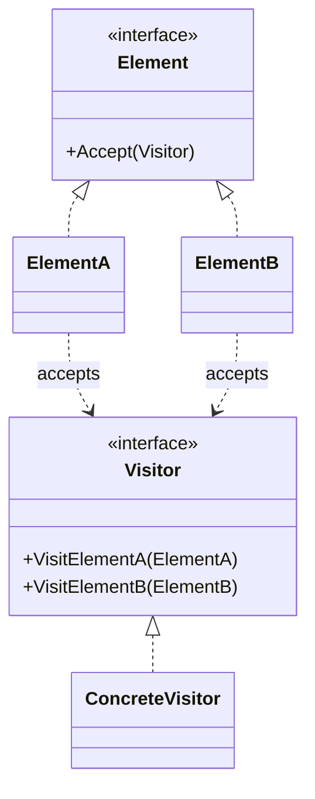

# Visitor

> 📖 **Source:** [Refactoring.Guru — Visitor](https://refactoring.guru/design-patterns/visitor) | Author: Alexander Shvets

---

## 🎯 Intent

**Visitor** is a behavioral design pattern that lets you separate algorithms and behaviors from the objects on which they operate, allowing you to add new operations to existing object structures without modifying those classes.

---

## ❌ Problem

Imagine you are designing a platformer game with a **Power-up / Buff System**:
- Your game has a few main entity types that inherit from `IEntity`: **Player**, **Enemy**, and **Obstacle** (obstacles such as wooden crates or stone walls).
- Now you want to write the feature for the **Freeze Power-up**:
  - When applied to the **Player**: freeze the player's movement for 2 seconds.
  - When applied to an **Enemy**: slow the monster by 50% for 5 seconds.
  - When applied to an **Obstacle**: make the obstacle brittle and easy to shatter.
- If you solve this by adding an `ApplyFreeze()` function directly to the `IEntity` interface and implementing it in all the subclasses, the code will work. However, a few weeks later the designer wants to add: a **Lava Power-up** and an **Electricity Power-up**.
- You'd have to open up all of the `Player`, `Enemy`, and `Obstacle` files again to write additional `ApplyLava()` and `ApplyLightning()` functions. This seriously violates the **Open/Closed Principle** (the entity classes get modified constantly for features that aren't part of their core responsibility).
- If you use manual type checks like `if (entity is Player)`, you'll create a pile of cumbersome checking code, lose object-orientation, and easily miss cases when adding new entities.

---

## ✅ Solution

The **Visitor** pattern proposes that you encapsulate the entire logic of the supplementary behaviors (Power-ups) into separate classes called **Visitors**. The existing entities themselves only provide a small hook point to accept a Visitor.

1.  Create an `IVisitor` interface that defines visit functions for each specific entity type:
    *   `Visit(Player player)`
    *   `Visit(Enemy enemy)`
    *   `Visit(Obstacle obstacle)`
2.  Create an `IEntity` interface that declares the method: `Accept(IVisitor visitor)`.
3.  In each concrete entity, implement the `Accept` function extremely simply using the **Double Dispatch** technique:
    ```csharp
    public void Accept(IVisitor visitor) {
        visitor.Visit(this); // Calls the correct Visitor overload corresponding to the type of 'this'
    }
    ```
4.  Now, when you want to add the Freeze effect, you only need to create a `FreezeVisitor` class that implements `IVisitor` and write the separate handling logic there for Player, Enemy, and Obstacle. You don't need to modify any of the core code of the entity classes anymore!

---

## 🎨 Structure

Instead of reading one large UML diagram from the start, read the pattern in 3 layers: **quick idea → real execution flow → condensed UML**.

### 1. Quick idea



### 2. Real execution flow



### 3. Condensed UML



### How to read the diagram

| Component | Meaning |
|---|---|
| Quick glance | Add a new operation via a Visitor instead of editing each element class. |
| Main flow | Double dispatch: the element calls the correct VisitX of the visitor. |
| In games | Export/save, buff effects, damage calculation across many entity types. |
| Solid arrow | An object is holding a reference to or directly calling another object. |
| Triangle / dashed arrow in UML | Inheritance or interface implementation. |

> Quick-read tip: first find the **Client/Context**, then follow the arrow to the main interface. The concrete classes are just variants swapped in at runtime.

---

## 💻 Pseudocode

```csharp
// Visitor interface containing overloads for each entity
interface IVisitor
{
    void VisitConcreteElementA(ElementA element);
    void VisitConcreteElementB(ElementB element);
}

// Element interface that accepts a Visitor
interface IElement
{
    void Accept(IVisitor visitor);
}

// Concrete Element A
class ElementA : IElement
{
    public void Accept(IVisitor visitor) => visitor.VisitConcreteElementA(this);
    public void FeatureA() => Print("A's feature");
}

// Concrete Visitor that handles the new feature
class ConcreteVisitor : IVisitor
{
    public void VisitConcreteElementA(ElementA element)
    {
        element.FeatureA(); // Run the new behavior on A
    }

    public void VisitConcreteElementB(ElementB element)
    {
        // Run the new behavior on B
    }
}
```

---

## ⚙️ Applicability

Use Visitor when:
- You need to perform an operation on all elements of a complex object structure (such as a game entity tree or a Scene Hierarchy), and these elements have different concrete classes.
- You want to clean up the source code of the entity classes by removing supplementary behaviors that aren't related to their main responsibility.
- You frequently have to add new features to the classes in an existing object structure, but the structure of these entity classes is very stable and rarely changes (only Player, Enemy, Obstacle, with no new entity types being introduced).

---

## 📝 How to Implement

1.  Define the `IVisitor` interface with a set of `Visit...` methods corresponding to each Concrete Element class that already exists in the game.
2.  Define the `Accept(IVisitor visitor)` method in the base Element interface.
3.  Implement the `Accept` method in all concrete Element classes. The implementation is always: `visitor.Visit(this);` (where `this` automatically resolves to the exact data type of the current class thanks to the compiler mechanism).
4.  Create the Concrete Visitor classes that implement `IVisitor` to install new algorithms/behaviors.
5.  When you need to apply a behavior, the Client calls: `element.Accept(visitor)`.

---

## ⚖️ Pros and Cons

*   **👍 Pros:**
    *   *Open/Closed Principle:* Easily add new effects/algorithms (new Visitors) that act on the objects without modifying those objects.
    *   *Single Responsibility Principle:* Gather all variants of a new algorithm for multiple classes into one single place.
    *   *Double Dispatch:* Cleanly solves the polymorphism-by-argument-type problem without casting.
*   **👎 Cons:**
    *   *Hard to change the Element structure:* If you add a new entity type (for example, `Npc`), you are forced to open up the entire `IVisitor` interface file and all existing Concrete Visitors to add a `VisitNpc(...)` function.

---

## 🎮 In Game Dev: C# Code Example (Unity)

Below is a **Power-up (Freeze & Fire)** interaction system that acts on different entities in Unity using the Visitor Pattern:

### 1. The main interfaces
```csharp
// Visitor interface
public interface IEntityVisitor
{
    void Visit(PlayerCharacter player);
    void Visit(EnemyCharacter enemy);
    void Visit(DestructibleObstacle obstacle);
}

// Entity interface that accepts a Visitor
public interface IGameEntity
{
    void Accept(IEntityVisitor visitor);
}
```

### 2. The concrete Element entities (Player, Enemy, Obstacle)
```csharp
using UnityEngine;

// 1. Player entity
public class PlayerCharacter : MonoBehaviour, IGameEntity
{
    public float movementSpeed = 5f;

    public void Accept(IEntityVisitor visitor)
    {
        visitor.Visit(this); // Double Dispatch routes to the correct Visitor function
    }

    public void ApplySpeedDebuff(float factor, float duration)
    {
        Debug.Log($"👤 [Player] Running speed reduced by {factor * 100}% for {duration} seconds!");
    }

    public void BurnPlayer(float damage)
    {
        Debug.Log($"👤 [Player] Caught on fire! Takes {damage} burning damage.");
    }
}

// 2. Enemy entity
public class EnemyCharacter : MonoBehaviour, IGameEntity
{
    public void Accept(IEntityVisitor visitor)
    {
        visitor.Visit(this);
    }

    public void FreezeEnemy(float stunDuration)
    {
        Debug.Log($"🤖 [Enemy] Completely FROZEN! Stunned for {stunDuration} seconds.");
    }

    public void BurnEnemy(float damage)
    {
        Debug.Log($"🤖 [Enemy] Burned to ash by fire! Takes {damage} damage.");
    }
}

// 3. Obstacle entity
public class DestructibleObstacle : MonoBehaviour, IGameEntity
{
    public void Accept(IEntityVisitor visitor)
    {
        visitor.Visit(this);
    }

    public void MakeShatterable()
    {
        Debug.Log("📦 [Obstacle] The wooden crate turns brittle and easy to break!");
    }

    public void MeltObstacle()
    {
        Debug.Log("📦 [Obstacle] The wooden barrier is burned and completely destroyed.");
    }
}
```

### 3. The Concrete Visitors (Freeze & Fire Power-up)
```csharp
using UnityEngine;

// 1. Freeze effect
public class FreezePowerUp : IEntityVisitor
{
    public void Visit(PlayerCharacter player)
    {
        // The Player is slowed
        player.ApplySpeedDebuff(0.5f, 2.0f);
    }

    public void Visit(EnemyCharacter enemy)
    {
        // The Enemy is fully stunned
        enemy.FreezeEnemy(3.0f);
    }

    public void Visit(DestructibleObstacle obstacle)
    {
        // The wooden crate turns brittle
        obstacle.MakeShatterable();
    }
}

// 2. Fire effect
public class FirePowerUp : IEntityVisitor
{
    private readonly float _damage = 25f;

    public void Visit(PlayerCharacter player)
    {
        player.BurnPlayer(_damage);
    }

    public void Visit(EnemyCharacter enemy)
    {
        enemy.BurnEnemy(_damage * 1.5f); // Fire counters monsters, so it deals double damage
    }

    public void Visit(DestructibleObstacle obstacle)
    {
        obstacle.MeltObstacle();
    }
}
```

### 4. Client code (physical collision applies the Visitor)
```csharp
using UnityEngine;

public class PowerUpTrigger : MonoBehaviour
{
    // Configure the PowerUp type via the Inspector
    public enum PowerUpType { Freeze, Fire }
    public PowerUpType activePowerUp;

    private void OnTriggerEnter(Collider other)
    {
        // Check whether the colliding object implements IGameEntity
        IGameEntity entity = other.GetComponent<IGameEntity>();
        
        if (entity != null)
        {
            IEntityVisitor visitor = null;

            switch (activePowerUp)
            {
                case PowerUpType.Freeze:
                    visitor = new FreezePowerUp();
                    Debug.Log("❄️ Triggered a FREEZE collision!");
                    break;
                case PowerUpType.Fire:
                    visitor = new FirePowerUp();
                    Debug.Log("🔥 Triggered a FIRE collision!");
                    break;
            }

            if (visitor != null)
            {
                // Execute the Visitor design pattern
                entity.Accept(visitor);
            }
        }
    }
}
```

---
> 📚 **Origin:** Content adapted from [Refactoring.Guru](https://refactoring.guru/) — Author: Alexander Shvets, Illustrations: Dmitry Zhart

| Direction | Link |
|-------|----------|
| ← Back | [Template Method](./09-template-method.md) |
| → Next | [Behavioral Patterns Overview](./00-behavioral-overview.md) |
