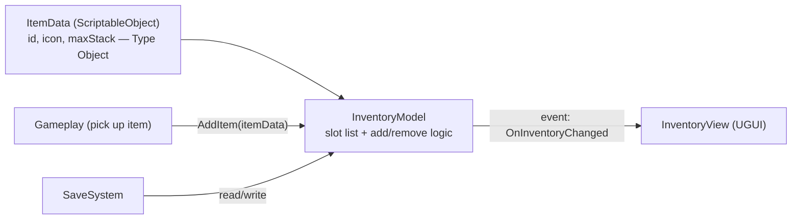
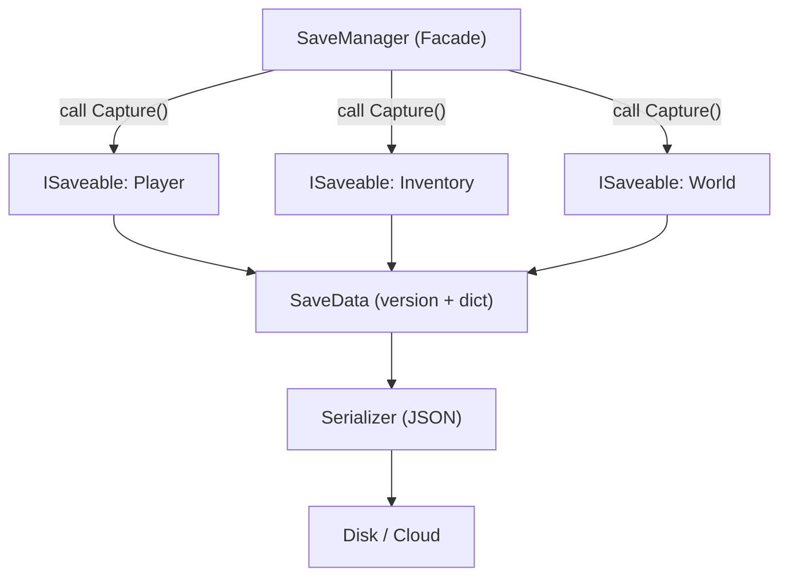
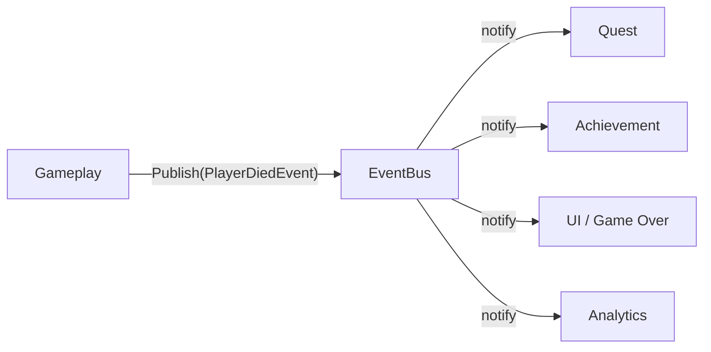
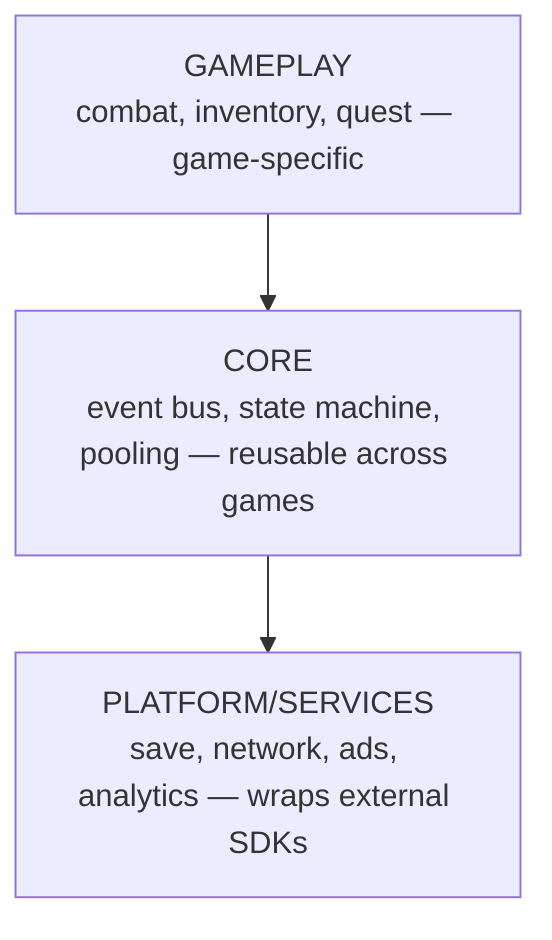

# 🏗️ Game System Design Guide

> 📖 **About this page:** A pattern teaches you to *solve one small problem*. **System design** teaches you to *combine many parts into something that lives, can be changed, and can grow*. This is the skill that separates Junior from Senior. This page goes from **one feature → one system → whole-project architecture**, with real case studies and diagrams.

---

## 🎚️ The three altitudes of "design"

Each career level designs at a different altitude:

```
ALTITUDE 1: FEATURE       →  "Build a double-jump"            (Fresher → Junior)
ALTITUDE 2: SYSTEM        →  "Build the whole Inventory"      (Junior → Middle)
ALTITUDE 3: ARCHITECTURE  →  "How the whole game fits"        (Middle → Senior → Lead)
```

> [!IMPORTANT]
> Common mistake: jumping straight to altitude 3 before mastering altitude 2. You **cannot** design good architecture if you've never owned a few systems hands-on. Climb in order.

---

## 🧭 A 6-step process to design any system

Works for *any* system (inventory, combat, quest, save…):

1. **List requirements & constraints.** What must it do? Who uses it (gameplay code? designers? UI)? What scale (10 items or 10,000)?
2. **Find the boundary.** What is "inside" (hidden details) vs "outside" (the API others call)? → this is where **Facade** lives.
3. **Separate data from behavior.** What is *data* (should be ScriptableObject/struct), what is *logic*? → **Type Object**, data-driven.
4. **Define communication.** How does the system talk to the rest: direct calls, `event` (Observer), or a queue (Event Queue)?
5. **Anticipate change.** "What will designers want to add in 6 months?" Design so you **add, not edit** (Open/Closed).
6. **Choose where to stop.** Don't over-engineer. Just enough pattern for *today's requirements + one foreseeable step*, no more.

> [!TIP]
> The golden question at step 5: *"When this changes, **how many files** must change with it?"* The ideal answer is **one**. If it's "all over the place" → you have the **Shotgun Surgery** smell and need to redraw the boundaries.

---

## 📦 Case study 1 — Inventory system *(Junior → Middle altitude)*

**Requirements:** hold items the player picks up; UI displays them; designers add new items without code; save/load works.

**Design:** split into 3 parts — **Data** (what an item is), **Model** (what's held), **View** (how it's drawn):



**Key decisions & trade-offs:**

* **Why is `ItemData` a ScriptableObject?** → designers create a new asset = a new item, **no code change** (Type Object + data-driven). Trade-off: more asset files.
* **Why does the View listen to an `event` instead of the Model calling UI directly?** → the Model **doesn't know** the UI exists (Observer). You can fully replace the UI without touching logic. Trade-off: slightly harder to trace flow.
* **Why a separate Model class, not stuffed into a MonoBehaviour?** → logic decoupled from the engine → **unit-testable**, reusable on a server.

**Patterns used:** [Type Object](#gpp-doc:type-object) · [Observer](../../02-Design-Patterns/02-Catalog/03-Behavioral/06-observer.md) · [Facade](../../02-Design-Patterns/02-Catalog/02-Structural/05-facade.md) (the `InventoryModel` API).

---

## ⚔️ Case study 2 — Damage / Combat system *(Middle altitude)*

**Requirements:** many damage sources (weapons, traps, poison); armor/resistance; designers tweak formulas; add effects (crit, lifesteal) without rewriting.

**Design:** all damage flows through **one pipeline** of pluggable steps:


**Key decisions:**

* **A modifier pipeline** instead of one giant `TakeDamage` function → adding an effect = adding one modifier (**Strategy** + **Open/Closed**), not editing old code.
* **`DamagePackage` is an object** (not just an `int amount`) → it carries context (who dealt it, what type) for modifiers and analytics to act on.
* **`OnDamaged`/`OnDied` are events** → VFX, audio, quests, achievements **subscribe themselves**; the combat system needn't know they exist.

**Patterns used:** [Strategy](../../02-Design-Patterns/02-Catalog/03-Behavioral/08-strategy.md) (modifiers) · [Command](../../02-Design-Patterns/02-Catalog/03-Behavioral/02-command.md) (action package) · [Observer](../../02-Design-Patterns/02-Catalog/03-Behavioral/06-observer.md) (post-damage reactions).

---

## 💾 Case study 3 — Save/Load system *(Middle → Senior altitude)*

**Requirements:** save state across many systems (player, inventory, world); change save structure between game versions without breaking old saves (migration).

**Design:** each system knows how to save itself via a **shared interface**; the SaveManager only orchestrates:



**Key decisions:**

* **An `ISaveable` interface** → a new system just implements the interface, the SaveManager **never changes** (Open/Closed + Dependency Inversion).
* **A `version` field in the save** → old saves still load thanks to a **migration** step. Skipping this = the classic bug when you update the game.
* **A separate `Serializer`** from the SaveManager → switch JSON to binary/encrypted without touching the data-collection logic (**Strategy**).

**Patterns used:** [Facade](../../02-Design-Patterns/02-Catalog/02-Structural/05-facade.md) · [Memento](../../02-Design-Patterns/02-Catalog/03-Behavioral/05-memento.md) (capture/restore state) · Dependency Inversion (`ISaveable`).

---

## 📨 Case study 4 — Global Event Bus *(Middle → Senior altitude)*

**Problem:** many systems must react to "player died", "level up", "picked up gold" without depending on each other.



**Decisions & warning:**

* Sender and receivers **don't know each other** → extremely decoupled.
* ⚠️ **Downside:** overusing the Event Bus = "everyone talks to everyone" → hard to trace, hard to debug. Use it for **genuinely global events**, not for local communication between two adjacent objects.

**Patterns used:** [Observer](../../02-Design-Patterns/02-Catalog/03-Behavioral/06-observer.md) + [Event Queue](#gpp-doc:event-queue) (when you need batching/latency) + [Mediator](../../02-Design-Patterns/02-Catalog/03-Behavioral/04-mediator.md).

---

## 🏛️ Altitude 3 — Whole-project architecture *(Senior → Lead altitude)*

When many systems coexist, the question is no longer "design system X" but *"how do the systems stack together?"*. The common model — **layering**:



**The golden rule:** **dependencies only point downward.** Gameplay knows Core; Core does **not** know Gameplay. Inverting this dependency (via interfaces) is the heart of Clean Architecture.

**Senior tools to enforce boundaries:**

* **Assembly Definitions (`.asmdef`)** — turn each layer into its own assembly; the compiler **forbids** a lower layer from calling an upper one. Cuts compile time and locks the architecture.
* **Dependency Injection** (VContainer/Zenject) — assemble the layers in one place instead of scattered Singletons.
* **Consider ECS/DOTS** — only when a performance problem demands it (thousands of entities), not by default.

---

## 🚩 Code smells that signal a bad design

| Sign | Problem | How to fix |
|---|---|---|
| Changing one feature touches 5 files | **Shotgun Surgery** — wrong boundary | Pull responsibility into one system |
| Two systems read each other's fields directly | **Inappropriate Intimacy** — tight coupling | Separate via interface/event |
| One `GameManager` knows everything | **God Object** | Split by responsibility |
| Adding an enemy type requires code | Missing **data-driven** | ScriptableObject + Type Object |
| Changing the UI breaks logic | Model–View tangled | Observer + separate the Model |

> [!TIP]
> Cross-reference the **[Refactoring → Code Smells](../../01-Refactoring/02-Code-Smells/00-code-smells-overview.md)** section — each smell there is a signal that a design needs another look.

---

## ✅ Self-review checklist for a design

- [ ] Does each system have **one clear boundary** (in/out API), hiding its internals?
- [ ] Is **data separated from logic** — can designers add content without programmers?
- [ ] When one part changes, is the number of files to edit **minimal** (ideally: 1)?
- [ ] Is communication between systems **intentional** (direct / event / queue), not "call whatever is handy"?
- [ ] Is it **simple enough** for today's requirements — no over-engineering?
- [ ] Can you explain **why this approach over the alternative** (trade-off)?

---

## 🔗 Read next

* [🎨 Design Pattern map by level](./07-patterns-by-level.md) — detail on each pattern used above.
* [📐 Design Patterns](../../02-Design-Patterns/00-design-patterns-overview.md) · [✂️ Refactoring](../../01-Refactoring/00-refactoring-overview.md)
* Books: **Clean Architecture**, **Game Programming Patterns** (Books & Resources section).

---

⬅️ [Design Pattern map by level](./07-patterns-by-level.md) · 🏁 [Back to Career ladder overview](./00-career-overview.md)
