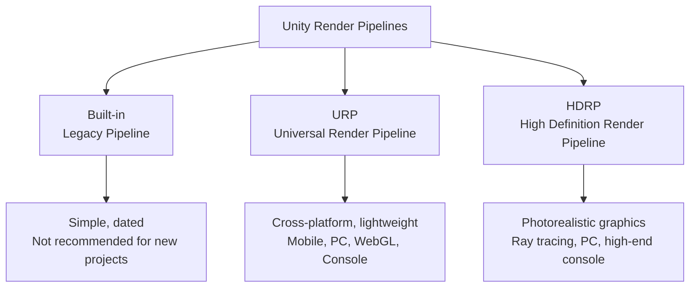
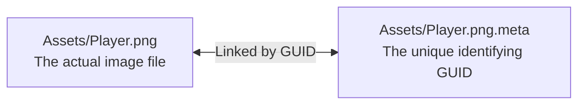

# Get Started (Getting Started with Unity 6.4)

> 📖 **Source:** This material is compiled and curated from the [Unity Manual — Get started](https://docs.unity3d.com/Manual/GettingStarted.html) based on the stable **Unity 6.4 (LTS)** release.

---

## 🎯 Intent

This document provides a detailed guide to the standard process of preparing and launching your first game project with **Unity 6.4 (LTS)**.

Rather than just describing the usual click-by-click steps, we will dig into the essence of Unity's system design: how licensing is managed, how to choose the right Render Pipeline from the very start, how to understand the folder structure of a Unity project, and how to set up a proper version control system (Git Version Control) to avoid losing assets later on.

---

## 🔑 1. Unity Hub & the Licensing Mechanism

**Unity Hub** is a standalone application that manages the lifecycle of Editor versions, game projects, account management, and the Asset Store.

### The Unity 6 license lifecycle:
With Unity 6, the licensing policy has changed in favor of independent developers:
*   **Unity Personal:** Completely free if your revenue/funding is under **$200,000 USD** in the last 12 months (the previous threshold was $100,000 USD).
*   **Splash Screen:** As of Unity 6, you can **completely disable the "Made with Unity" logo** on the startup screen even on the free Personal license (something that previously required buying the Pro version).

---

## ⚙️ 2. Installing Unity Editor 6.4 properly

When installing Unity 6.4 through Unity Hub, you need to select the appropriate add-on modules (Add modules) depending on your target platform:

### Recommended modules:
1.  **Dev Tools (Visual Studio):** The C# development environment.
2.  **Platform Build Support:**
    *   **Windows Build Support (IL2CPP):** To build the game for Windows PC using the IL2CPP compiler (which converts C# code into C++ for maximum performance optimization).
    *   **Android Build Support / iOS Build Support:** If your project targets mobile devices (comes with OpenJDK, Android SDK & NDK automatically integrated).
    *   **WebGL Build Support:** To build a game that runs directly in a web browser.

---

## 🎨 3. Choosing a Project Template & Render Pipeline

When creating a new project in Unity 6.4, choosing the right **Render Pipeline** is the single most important decision, because it affects all of your game's Shaders, Materials, and performance down the line.



### Comparing the essence of the 3 pipelines:
*   **Built-in Render Pipeline (the old default):** Unity's previous-generation rendering technology. Easy to use for beginners but not optimized, lacking support for modern shader features, and gradually being deprecated by Unity.
*   **URP (Universal Render Pipeline):** The standard rendering pipeline for Unity 6. It supports every platform, from low-end mobile to mid-range PC. It uses the *Scriptable Render Pipeline (SRP)* mechanism to help optimize draw calls and easily customize graphics filters through **Shader Graph**.
*   **HDRP (High Definition Render Pipeline):** Dedicated to AAA graphics on powerful PCs and next-gen consoles. It uses physically based rendering (PBR), real-time global illumination, Ray-tracing, and complex atmospheric effects.

---

## 📂 4. Understanding the Unity Project Folder Structure

When a Unity project is created, a series of folders appear on your hard drive. Understanding the role of each folder is mandatory for managing your source code effectively:

| Folder | What it does | Should it go into Git/VCS? |
| :--- | :--- | :--- |
| **`Assets/`** | Contains all game assets: C# code, Prefabs, Models, Audio, Scenes. This is the **heart** of the project. | **Required (YES)** |
| **`ProjectSettings/`**| Stores system configuration: Input mappings, Physics, Graphics settings, the game name, build configuration. | **Required (YES)** |
| **`Packages/`** | Contains the `manifest.json` file that defines the external libraries (Packages) the project uses. | **Required (YES)** |
| **`Library/`** | The project's local cache folder. Unity automatically unpacks and converts the files in `Assets/` into the Engine's internal binary format here. | **NO** - Regenerated automatically |
| **`Temp/`** | Contains temporary files while the Editor is open. | **NO** |
| **`Logs/`** | The Editor's activity logs. | **NO** |
| **`UserSettings/`** | Personal workspace configuration (window layout, recently opened files). | **NO** |

---

## 🐙 5. Setting up Version Control (VCS/Git) properly

When working with Unity, if you don't configure Git correctly, you will constantly run into data conflicts and your repository will balloon to tens of GB because it contains junk files from the `Library` folder.

### Step 1: Create a proper `.gitignore` file for Unity 6.4
Place a `.gitignore` file at the root of your project to ignore the temporary and cache folders:

```ini
# Ignore Unity's auto-generated temporary and cache folders
/[Ll]ibrary/
/[Tt]emp/
/[Oo]bj/
/[Build]/
/[Builds]/
/[Logs]/
/[UserSettings]/

# Ignore auto-generated IDE solution files
/*.csproj
/*.unityproj
/*.sln
/*.suo
/*.tmp
/*.user
/*.userprefs
/*.pidb
/*.booproj
/*.svd
/*.targets

# Ignore assets downloaded from the Asset Store (just re-download them with your account)
/[Aa]ssets/AssetStoreTools*

# Ignore OS-generated files
.DS_Store
Thumbs.db
```

### Step 2: Enable Force Text Serialization (Required)
Scene files (`.unity`) and Prefab files (`.prefab`) in Unity are essentially data files that link objects together.
*   **The problem:** If saved as Binary, Git cannot diff the differences between versions, leading to a total loss of data when a merge conflict occurs.
*   **The solution:** In the Unity Editor, go to `Edit -> Project Settings -> Editor -> Asset Serialization -> Mode` and select **`Force Text`**. This setting forces Unity to save all Scenes and Prefabs as structured **YAML** text. When a conflict occurs, you can easily open the file in Notepad to resolve the conflict.

### Step 3: The `.meta` file mechanism (Extremely important)
For every file you place in the `Assets/` folder, Unity automatically generates an accompanying file with a `.meta` extension (for example: `PlayerController.cs` and `PlayerController.cs.meta`).



*   **How it works:** The `.meta` file contains a **GUID (Global Unique Identifier)**. Unity uses this code to track the links between files. For example, if Scene A uses Texture B, Unity stores Texture B's GUID inside Scene A, rather than storing the file path.
*   **The danger:** If you delete a `.meta` file or fail to push it to Git, Unity loses track of the link, resulting in **Missing Reference** errors (missing images, missing materials shown as magenta/pink) across the entire project.
*   **The golden rule:** Always commit both the main file and its accompanying `.meta` file every time you push code to Git!

---

> 📚 **Source:** Content referenced from the [Unity Documentation](https://docs.unity3d.com/Manual/index.html) — Copyright Unity Technologies.

| Direction | Link |
|-------|----------|
| ← Back | [Unity Roadmap Overview](../../00-unity-overview.md) |
| → Next | [Unity Editor Interface (In progress)](../../02-Editor-Interface/00-editor-interface-overview.md) |
