# Unity Editor Interface (Unity Editor Interface & Custom Inspector)

> 📖 **Source:** This material is compiled from the [Unity Manual — Editor Interface](https://docs.unity3d.com/Manual/Editor-Interface.html) based on the stable **Unity 6.4 (LTS)** release.

---

## 🎯 Intent
Understand how the Unity Editor interface really works, the data serialization mechanism, and how to extend the Inspector interface by writing custom C# Editor code. This helps improve the productivity of Designers/Artists and optimizes the level design workflow directly inside the Editor.

---

## 🔑 Core Concepts & True Nature

The Unity Editor interface is built on a powerful, extensible architecture. A deep understanding of this structure helps us significantly optimize the game production workflow:

### 1. The Five Core Windows & How They Work:
*   **Hierarchy Window:** Represents the tree of all objects (`GameObject`) in the current Scene. Each object here corresponds to a C++ pointer in the core engine.
*   **Scene View:** A 3D/2D graphical window that lets the developer interact directly with the game space. This is where Transform operations (Position, Rotation, Scale) are performed.
*   **Game View:** The window that renders the image from the game's Camera. This is the actual result the player will see when the game runs (Runtime).
*   **Project Window:** The physical file manager on disk for the `Assets` folder. It synchronizes directly with the operating system and manages assets through `.meta` files.
*   **Inspector Window:** The window that displays the details of the properties and Components of the currently selected `GameObject`.

### 2. The C++/C# Boundary & the Serialization Mechanism:
The Unity Engine has a core written in **C++**, while the programmer's scripts are written in **C#**. When you work in the Editor:
*   The data of Components actually lives in C++ memory.
*   To display it in the Inspector, Unity performs **Serialization** to convert the C++ data structure into an intermediate C# format.
*   The `SerializedObject` and `SerializedProperty` classes are the API bridge that lets C# access this serialized C++ memory directly.
*   **The golden rule when writing a Custom Editor:** Always operate through `SerializedProperty` rather than modifying variables directly on the object (Direct Target Reference). Using `SerializedProperty` lets Unity automatically manage **Undo/Redo**, supports editing multiple objects at once (Multi-object editing), and automatically marks the Scene as changed (Dirty state) to prompt the user to save.

### 3. The Extensibility Mechanism (Extending the Editor):
Unity provides two main systems for extending the interface:
1.  **IMGUI (Immediate Mode GUI):** The traditional system for drawing the interface with code that runs continuously every frame in the Editor through `OnInspectorGUI()` or `OnGUI()`. Quick to write but resource-intensive because it redraws constantly.
2.  **UI Toolkit (the new system):** Based on XML (UXML) and CSS (USS), similar to web development. It works in Retained Mode (only redraws when something changes), saving resources and making it easier to design complex, more attractive interfaces.

---

## 🎨 Structure & Lifecycle

The diagram below represents the lifecycle of a Custom Inspector Editor when the developer selects an object (Selection Change) in the Unity Editor:

```mermaid
sequenceDiagram
    autonumber
    Actor Developer
    Participant Editor as Unity Editor Core (C++)
    Participant Target as Target MonoBehaviour (C#)
    Participant SerialObj as SerializedObject (Bridge)
    Participant CustEditor as CustomEditor Script (C#)

    Developer->>Editor: Click to select a GameObject in the Hierarchy
    Editor->>Target: Get the C# object reference
    Editor->>SerialObj: Initialize SerializedObject wrapping Target
    Editor->>CustEditor: Initialize the corresponding CustomEditor
    CustEditor->>CustEditor: Call OnEnable()
    Note over CustEditor: Initialize SerializedProperty via FindProperty()
    
    loop Each UI Render cycle (Repaint Event)
        Editor->>CustEditor: Call OnInspectorGUI()
        CustEditor->>SerialObj: Call Update() to sync the latest data from C++
        CustEditor->>CustEditor: Draw the GUI (EditorGUILayout / UI Toolkit)
        alt User interacts to edit a value
            CustEditor->>SerialObj: Update the property value
            CustEditor->>SerialObj: Call ApplyModifiedProperties()
            SerialObj->>Target: Push the serialized data down to the target
            Editor->>Editor: Mark the Scene as changed (Dirty) & register Undo State
        end
    end

    Developer->>Editor: Deselect the GameObject
    CustEditor->>CustEditor: Call OnDisable() / OnDestroy()
    Editor->>CustEditor: Destroy the CustomEditor instance
```



---

## 💻 C# Scripting API (C# Example)

Below is a complete, practical example containing a Component that stores the player's stats (`PlayerStats`) and an accompanying Custom Editor (`PlayerStatsEditor`) that adds a visual "Reset Stats to Default" button in the Inspector, with full support for Unity 6's standard Undo/Redo mechanism.

Note: The source code is structured cleanly, with the Editor script wrapped in the `#if UNITY_EDITOR` preprocessor directive so it can be placed in the same file or compiled separately without causing errors when building the game.

```csharp
using UnityEngine;

#if UNITY_EDITOR
using UnityEditor;
#endif

namespace UnityManual.EditorInterface
{
    /// <summary>
    /// Component that manages the player's basic stats.
    /// </summary>
    [AddComponentMenu("Unity Manual/Player Stats")]
    public class PlayerStats : MonoBehaviour
    {
        [Header("General Info")]
        [SerializeField] private string playerName = "New Hero";
        [SerializeField] [Range(1, 100)] private int level = 1;

        [Header("Attributes")]
        [SerializeField] private int maxHealth = 100;
        [SerializeField] private int currentHealth = 100;
        [SerializeField] private float speed = 5.5f;

        // Public properties so the Custom Editor can log or interact safely
        public string PlayerName => playerName;
        public int Level => level;

        /// <summary>
        /// Reset the stats back to the system's default values.
        /// </summary>
        public void ResetToDefault()
        {
            playerName = "Default Hero";
            level = 1;
            maxHealth = 100;
            currentHealth = 100;
            speed = 5.0f;
            
            Debug.Log($"[PlayerStats] Restored the stats of {gameObject.name} to default!");
        }
    }

#if UNITY_EDITOR
    /// <summary>
    /// Custom Inspector dedicated to the PlayerStats component.
    /// Automatically updates the visual interface and adds Designer-support features.
    /// </summary>
    [CustomEditor(typeof(PlayerStats))]
    [CanEditMultipleObjects] // Allows editing many objects at once
    public class PlayerStatsEditor : Editor
    {
        private SerializedProperty playerNameProp;
        private SerializedProperty levelProp;
        private SerializedProperty maxHealthProp;
        private SerializedProperty currentHealthProp;
        private SerializedProperty speedProp;

        private void OnEnable()
        {
            // Link the SerializedProperties to the target class's private fields by variable name
            // This approach preserves Unity's Undo/Redo and Prefab Overrides features
            playerNameProp = serializedObject.FindProperty("playerName");
            levelProp = serializedObject.FindProperty("level");
            maxHealthProp = serializedObject.FindProperty("maxHealth");
            currentHealthProp = serializedObject.FindProperty("currentHealth");
            speedProp = serializedObject.FindProperty("speed");
        }

        public override void OnInspectorGUI()
        {
            // 1. Update the data from the actual C++ object into the C# serialized object
            serializedObject.Update();

            // 2. Draw the automatically declared default fields
            // You can use DrawDefaultInspector(); if you want to draw everything automatically and quickly.
            // Here we draw manually to customize a cleaner layout:
            
            EditorGUILayout.LabelField("CHARACTER INFO", EditorStyles.boldLabel);
            EditorGUILayout.PropertyField(playerNameProp);
            EditorGUILayout.PropertyField(levelProp);

            EditorGUILayout.Space(5);
            EditorGUILayout.LabelField("SURVIVAL STATS", EditorStyles.boldLabel);
            EditorGUILayout.PropertyField(maxHealthProp);
            EditorGUILayout.PropertyField(currentHealthProp);
            EditorGUILayout.PropertyField(speedProp);

            // Check business logic and show a warning directly in the Inspector
            if (currentHealthProp.intValue > maxHealthProp.intValue)
            {
                EditorGUILayout.HelpBox("Warning: Current health is greater than maximum health!", MessageType.Warning);
            }

            EditorGUILayout.Space(15);

            // 3. Set up the custom Reset button
            // Give the button a standout background color (using a modern, easy-on-the-eyes palette)
            GUI.backgroundColor = new Color(0.25f, 0.72f, 0.45f); 
            
            if (GUILayout.Button("Reset Player Stats to Default", GUILayout.Height(35)))
            {
                // Record the Undo state before changing the data
                Undo.RecordObjects(targets, "Reset Player Stats Values");

                // Iterate over all currently selected objects (supports Multi-object editing)
                foreach (var singleTarget in targets)
                {
                    PlayerStats playerStats = (PlayerStats)singleTarget;
                    if (playerStats != null)
                    {
                        playerStats.ResetToDefault();
                        
                        // Mark the object as changed so the Editor will save it (Dirty state)
                        EditorUtility.SetDirty(playerStats);
                    }
                }
            }
            
            // Restore the default GUI color to avoid affecting components drawn afterward
            GUI.backgroundColor = Color.white;

            // 4. Apply all changes from SerializedProperty down to the actual C++ structure
            serializedObject.ApplyModifiedProperties();
        }
    }
#endif
}
```

---

## ⚙️ Implementation Steps & Practical Notes (Best Practices)

1.  **Clearly partition Editor source code:**
    *   Every script that inherits from the `Editor` or `EditorWindow` class, or uses the `UnityEditor` namespace, must be placed in a folder named `Editor` (for example: `Assets/Scripts/Editor/...`).
    *   If you don't place it in an `Editor` folder, you must wrap all of the Editor code in the `#if UNITY_EDITOR` preprocessor directive and close it with `#endif`. If you violate this, Unity will throw a compile error when you build the game for standalone platforms (such as Android, PC, WebGL).
2.  **Strictly follow the SerializedProperty mechanism:**
    *   Avoid editing variables directly, like `((PlayerStats)target).speed = 10f;`, inside a Custom Inspector.
    *   Use `serializedObject.FindProperty` and assign values through its properties, such as `property.floatValue = 10f`. This ensures data integrity for the Prefab Overrides system (showing bold text when you change a value on a Prefab Variant) and lets the user press Ctrl+Z to undo.
3.  **Optimize interface drawing performance:**
    *   The `OnInspectorGUI()` function is called continuously whenever the mouse moves or something changes in the Editor.
    *   Avoid heavy tasks such as file lookups with `Resources.Load()`, calling `GetComponent()`, or generating excessive memory garbage (GC Allocations) inside this function.
4.  **Take advantage of Custom Decorator Attributes:**
    *   Before writing a complex Custom Editor, try using Unity's built-in attributes such as `[Header]`, `[Space]`, `[Tooltip]`, `[Range]`, `[SerializeField]`, and `[Multiline]` to shape the Inspector interface quickly and cleanly without writing GUI code.

---

> 📚 **Source:** Content referenced from the [Unity Documentation](https://docs.unity3d.com/Manual/index.html) — Copyright Unity Technologies.

| Direction | Link |
|-------|----------|
| ← Back | [Getting Started with Unity 6.4](../01-Get-Started/00-get-started-overview.md) |
| → Next | [Packages & Assembly Definitions (Package Management & Code Partitioning)](../03-Packages-Management/00-packages-management-overview.md) |
