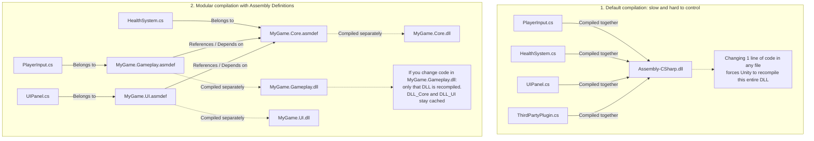

# Packages & Assembly Definitions (Package Management & Code Partition Definitions)

> 📖 **Source:** This material is compiled from the [Unity Manual — Packages](https://docs.unity3d.com/Manual/Packages.html) and [Assembly Definitions](https://docs.unity3d.com/Manual/ScriptCompilationAssemblyDefinitionFiles.html) documentation based on the stable **Unity 6.4 (LTS)** release.

---

## 🎯 Intent
Master the asset package management system (Unity Package Manager - UPM) to integrate third-party libraries and configure Scoped Registries. At the same time, deeply understand and apply Assembly Definitions (`.asmdef`) to split the project into independent code partitions (DLLs), thereby optimizing Compilation Time and enforcing a clean source code architecture that avoids spaghetti code.

---

## 🔑 Core Concepts & True Nature

### 1. Unity Package Manager (UPM) & the structure of manifest.json:
*   **How it works:** UPM is a package manager similar to `npm` in Node.js or `NuGet` in .NET. It manages packages through the main configuration file located at `Packages/manifest.json`.
*   **Storage mechanism:** Packages can be referenced from the **Unity Registry** (official), from a **Git URL** (for example: GitHub), a **Local path** on your machine, or from a **Scoped Registry**.
*   **Scoped Registries:** Allow you to declare external package-hosting servers (such as OpenUPM). This configuration defines the registry's URL and the "scopes" (groups of package name prefixes, e.g. `com.openupm`) so UPM knows when to search for a package in the external registry instead of Unity's default registry.

### 2. The essence of Assembly Definitions (.asmdef):
*   **The Monolithic Compilation problem:** By default, if you don't configure anything, Unity gathers all the C# source code in the `Assets` folder and compiles it into a single DLL named `Assembly-CSharp.dll`. When the project grows to hundreds of thousands of lines of code, changing a single semicolon forces Unity to recompile this entire DLL, causing the Editor to freeze for 10 - 30 seconds (a Compile Time Bottleneck).
*   **The solution with `.asmdef`:** When you create an `.asmdef` file in a folder, that folder (and its subfolders) is isolated and compiled into a separate assembly (DLL) (for example: `MyGame.Core.dll`).
*   **The optimized compilation flow:** When a code file changes, Unity only recompiles the assembly containing that file and the assemblies that directly depend on it. The other independent code partitions don't need to be recompiled at all, shortening the iteration loop to under 1 second.
*   **Architectural boundaries:** Assembly Definitions enforce Dependency Control. If Assembly A wants to call Assembly B's code, A must declare a Reference to B. If it doesn't, the compiler reports an error immediately. This thoroughly prevents Circular Dependencies (A calls B, B calls A) and promotes a Loose Coupling design model.

---

## 🎨 Structure & Lifecycle

The diagram below compares the difference in compilation architecture between a default Unity project (not using `.asmdef`) and a standardized modular project (using separate `.asmdef` files):



---

## 💻 C# Scripting API (C# Example)

To illustrate how Assembly Definitions actually work, we simulate a project split into 2 Assembly partitions:
1.  **Assembly `MyGame.Core`**: Contains the core foundational libraries and systems (for example: a custom logging system).
2.  **Assembly `MyGame.Gameplay`**: Contains the game logic code (for example: a Player controller), which references and uses the library from `MyGame.Core`.

### Configuring Assembly `MyGame.Core`:
The file is stored at `Assets/Scripts/Core/MyGame.Core.asmdef`:
```json
{
    "name": "MyGame.Core",
    "rootNamespace": "MyGame.Core",
    "references": [],
    "includePlatforms": [],
    "excludePlatforms": [],
    "allowUnsafeCode": false,
    "overrideReferences": false,
    "precompiledReferences": [],
    "autoReferenced": true,
    "defineConstraints": [],
    "versionDefines": [],
    "noEngineReferences": false
}
```

C# source code in Assembly `MyGame.Core` (`Assets/Scripts/Core/GameLogger.cs`):
```csharp
using UnityEngine;

namespace MyGame.Core
{
    /// <summary>
    /// The project's centralized logging system, supporting configurable log levels.
    /// </summary>
    public static class GameLogger
    {
        public enum LogLevel
        {
            Info,
            Warning,
            Error
        }

        private static LogLevel currentMinLevel = LogLevel.Info;

        public static void SetMinLogLevel(LogLevel level)
        {
            currentMinLevel = level;
        }

        public static void LogInfo(string message, string systemName = "System")
        {
            if (currentMinLevel <= LogLevel.Info)
            {
                Debug.Log($"<color=#3498db>[INFO - {systemName}]</color> {message}");
            }
        }

        public static void LogWarning(string message, string systemName = "System")
        {
            if (currentMinLevel <= LogLevel.Warning)
            {
                Debug.LogWarning($"<color=#f1c40f>[WARN - {systemName}]</color> {message}");
            }
        }

        public static void LogError(string message, string systemName = "System")
        {
            if (currentMinLevel <= LogLevel.Error)
            {
                Debug.LogError($"<color=#e74c3c>[ERROR - {systemName}]</color> {message}");
            }
        }
    }
}
```

---

### Configuring Assembly `MyGame.Gameplay` (Depends on `MyGame.Core`):
The configuration file is stored at `Assets/Scripts/Gameplay/MyGame.Gameplay.asmdef` (declaring a reference to `MyGame.Core` in the `"references"` field):
```json
{
    "name": "MyGame.Gameplay",
    "rootNamespace": "MyGame.Gameplay",
    "references": [
        "GUID:7bb0b510ed28d444ea87d3a01db54907",
        "MyGame.Core"
    ],
    "includePlatforms": [],
    "excludePlatforms": [],
    "allowUnsafeCode": false,
    "overrideReferences": false,
    "precompiledReferences": [],
    "autoReferenced": true,
    "defineConstraints": [],
    "versionDefines": [],
    "noEngineReferences": false
}
```

C# source code in Assembly `MyGame.Gameplay` (`Assets/Scripts/Gameplay/PlayerController.cs`):
```csharp
using UnityEngine;
// Use the namespace from another Assembly (you must first declare the reference in .asmdef)
using MyGame.Core;

namespace MyGame.Gameplay
{
    /// <summary>
    /// Component that manages the player's basic movement behavior.
    /// </summary>
    [AddComponentMenu("Unity Manual/Player Controller (Modular)")]
    public class PlayerController : MonoBehaviour
    {
        [SerializeField] private float moveSpeed = 5f;
        
        private void Start()
        {
            // Use the utility library from the Core Assembly
            GameLogger.LogInfo($"Initialized PlayerController on object: {gameObject.name}", "Gameplay");
        }

        private void Update()
        {
            float horizontal = Input.GetAxisRaw("Horizontal");
            float vertical = Input.GetAxisRaw("Vertical");

            Vector3 direction = new Vector3(horizontal, 0f, vertical).normalized;

            if (direction.magnitude >= 0.1f)
            {
                transform.Translate(direction * (moveSpeed * Time.deltaTime), Space.World);
                
                // Detailed logging (in practice you should avoid logging in Update; this is just to demo calling the library)
                GameLogger.LogInfo($"Player is moving in direction: {direction}", "Gameplay");
            }
        }

        public void TakeDamage(int amount)
        {
            if (amount < 0)
            {
                GameLogger.LogWarning($"Invalid damage amount received: {amount}", "Gameplay");
                return;
            }
            
            GameLogger.LogError($"Player took {amount} damage!", "Gameplay");
        }
    }
}
```

---

## ⚙️ Implementation Steps & Practical Notes (Best Practices)

1.  **Managing the extended Registry (Scoped Registry):**
    *   When using OpenUPM or external libraries, instead of manually downloading a `.unitypackage` into the Assets folder (which bloats your Git repository), declare the scoped registry directly in `Packages/manifest.json` like this:
    ```json
    "scopedRegistries": [
      {
        "name": "package.openupm.com",
        "url": "https://package.openupm.com",
        "scopes": [
          "com.openupm",
          "com.cysharp.unitask"
        ]
      }
    ]
    ```
    *   After that, you can easily manage their versions directly from the Unity Package Manager window.

2.  **Principles for setting up Assembly Definitions:**
    *   **Separate Editor source code:** Editor code that uses the `UnityEditor` library must live in its own `.asmdef` (for example: `MyGame.Editor.asmdef`) and target only the **Editor** platform (Include Platforms -> Editor). It should also reference the corresponding Runtime assembly.
    *   **Turn off Auto Referenced for external library packages:** When creating an `.asmdef` for a plugin, consider unchecking "Auto Referenced". This prevents Unity from automatically forcing all other assemblies to unnecessarily reference it, which speeds up builds.
    *   **Apply a Root Namespace:** Set the Root Namespace field in the `.asmdef` file so Visual Studio or Rider automatically generates a proper namespace when you create a new code file in that folder.

3.  **Limit unnecessary recompilation:**
    *   Split the project into large modules such as: `Core` (Utilities, Logging, Events), `Data` (Storage, Configuration), `UI` (Interface screens), `Gameplay` (Character and enemy logic), and `Plugins` (External libraries).
    *   Avoid splitting too finely (for example: one asmdef per class), because too many DLLs increases startup overhead and adds Link Time during compilation.

---

> 📚 **Source:** Content referenced from the [Unity Documentation](https://docs.unity3d.com/Manual/index.html) — Copyright Unity Technologies.

| Direction | Link |
|-------|----------|
| ← Back | [Unity Editor Interface (Unity Editor Interface & Custom Inspector)](../02-Editor-Interface/00-editor-interface-overview.md) |
| → Next | [Assets & Import Pipeline (Asset Management & Import Pipeline)](../04-Assets-Media/00-assets-media-overview.md) |
