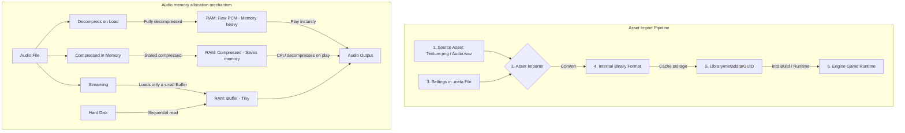

# Assets & Import Pipeline (Asset Management & Import Pipeline)

> 📖 **Source:** This material is compiled from the [Unity Manual — Asset Workflow](https://docs.unity3d.com/Manual/AssetWorkflow.html) based on the stable **Unity 6.4 (LTS)** release.

---

## 🎯 Intent
Deeply understand how the asset import pipeline (Asset Import Pipeline v2) works in Unity. Master texture compression algorithms, the Crunch compression mechanism, and distinguish the essence of the audio loading modes in RAM. Provide source code that automates asset import configuration using the `AssetPostprocessor` class to avoid manual mistakes by the art team.

---

## 🔑 Core Concepts & True Nature

### 1. The essence of the Asset Import Pipeline (V2):
*   When you drag a source file (such as `.png`, `.wav`, `.fbx`, `.psd`) into the `Assets` folder, Unity **never** uses that file directly at Runtime.
*   Instead, the **Asset Importer** reads the source file, uses the configuration in the corresponding `.meta` file, and compiles it into a binary format optimized for the target hardware (for example: converting `.png` into a raw GPU-compressed format, converting `.fbx` into an optimized polygon mesh and animation clips).
*   The compiled result is stored only in the local cache folder **`Library/metadata/`**, identified by the file's GUID. When the game runs, Unity reads only this binary file from `Library`.

### 2. Texture compression formats & the Crunch Compression mechanism:
*   **ASTC (Adaptive Scalable Texture Compression):** A modern compression standard for Mobile (Android/iOS). It allows flexible quality tuning through block size (from 4x4 to 12x12), perfectly balancing file size and sharpness.
*   **BC7 (Block Compression 7):** A high-quality standard compression format for PC/Console (DirectX/Vulkan), with better Alpha channel support and minimal color banding.
*   **Crunch Compression (the essence and its pitfalls):**
    *   *The essence:* Crunch is a lossy compression algorithm layered on top of standard GPU compression formats such as DXT (PC) or ETC (Mobile).
    *   *Advantage:* It compresses the physical file size on disk extremely small, which is hugely beneficial for reducing the install file size (`.apk`, `.ipa`) and reducing the time to download AssetBundles over the network.
    *   *Disadvantage:* **It does not save GPU VRAM!** When the game loads a Texture into memory, the CPU must decompress the Crunch format back into the original DXT or ETC format to upload it to VRAM. As a result, overusing Crunch increases scene load times (Load Scene) and causes temporary CPU bottlenecks.

### 3. Distinguishing the 3 Audio Loading Modes:
Choosing the wrong audio loading mode can overflow RAM or cause stuttering when playing sound:

| Loading mode | How it works | Advantage (RAM) | Disadvantage (CPU/Disk) | Standard use case |
| :--- | :--- | :--- | :--- | :--- |
| **Decompress on Load** | The audio is compressed on disk. When the game loads, Unity fully decompresses it into raw, uncompressed PCM data in RAM. | Plays instantly, no CPU needed to re-decompress at Runtime. | Consumes a very large amount of RAM. | Short, high-frequency sounds (UI Click, footsteps, gunshots). |
| **Compressed in Memory** | The audio is stored compressed (Vorbis/MP3) directly in RAM. When played, the CPU decompresses it directly on the playback thread. | Saves significant RAM compared to Decompress on Load. | Spends some CPU performance to decompress at Runtime during playback. | Medium-length sound effects (monster roars, spell effects). |
| **Streaming** | The audio is not loaded into RAM. Unity uses a small buffer and reads the data directly from disk in real time during playback. | Uses almost no device RAM. | Loads the disk (Disk I/O) and has high playback latency. May lag if the disk is slow. | Background music (BGM), ambient music, or long dialogue clips. |

---

## 🎨 Structure & Lifecycle

The diagram describes how the Unity Import Pipeline receives and processes an Asset, and the mechanism for distributing audio loading in system memory:



---

## 💻 C# Scripting API (C# Example)

Below is a complete Editor script that uses Unity's `AssetPostprocessor` class. This class automatically hooks into the image (Texture) import process to set standardized parameters based on the folder containing the file:
*   If the image is in a `/UI/` folder -> automatically convert it to a Sprite, turn off Mipmaps, and enable Alpha Transparency.
*   If the image is in a `/Textures/` folder -> keep the Default type, enable Mipmaps. If the file name has a `_normal` or `_n` suffix -> automatically change the Texture type to Normal Map.

```csharp
#if UNITY_EDITOR
using UnityEditor;
using UnityEngine;

namespace UnityManual.AssetsMedia
{
    /// <summary>
    /// Processor that automatically configures Textures when they are imported into the Unity project.
    /// Helps synchronize graphics settings automatically without the Designer configuring them manually.
    /// </summary>
    public class TextureImporterPostprocessor : AssetPostprocessor
    {
        /// <summary>
        /// Hook function that runs automatically BEFORE Unity imports and compresses the image file.
        /// It allows modifying the TextureImporter configuration.
        /// </summary>
        private void OnPreprocessTexture()
        {
            // Get the Importer object managing the file being processed
            TextureImporter textureImporter = (TextureImporter)assetImporter;
            
            // Get the file's relative path converted to lowercase for easy comparison
            string lowerPath = assetPath.ToLower();

            // 1. Rule for processing UI graphics (located in the /ui/ folder)
            if (lowerPath.Contains("/ui/"))
            {
                ConfigureUITexture(textureImporter);
            }
            // 2. Rule for processing 3D model textures (located in the /textures/ folder)
            else if (lowerPath.Contains("/textures/"))
            {
                ConfigureModelTexture(textureImporter, lowerPath);
            }
        }

        /// <summary>
        /// Optimal configuration for user interface (UI) images
        /// </summary>
        private void ConfigureUITexture(TextureImporter importer)
        {
            // Set the texture type to Sprite (2D and UI)
            importer.textureType = TextureImporterType.Sprite;
            importer.spriteImportMode = SpriteImportMode.Single;

            // UI doesn't need Mipmaps because its draw size is usually fixed or scales like a Vector.
            // Turning off Mipmaps saves 33% of the image's VRAM and avoids blurry UI.
            importer.mipmapEnabled = false;

            // Enable transparent alpha channel handling for the interface
            importer.alphaIsTransparency = true;

            // Configure high-quality compression for UI to avoid jagged edges
            TextureImporterPlatformSettings defaultSettings = importer.GetDefaultPlatformTextureSettings();
            defaultSettings.textureCompression = TextureImporterCompression.CompressedHQ;
            defaultSettings.resizeAlgorithm = TextureResizeAlgorithm.Mitchell;
            
            importer.SetPlatformTextureSettings(defaultSettings);
            
            Debug.Log($"[Postprocessor] Automatically configured a UI Sprite for: {assetPath}");
        }

        /// <summary>
        /// Optimal configuration for 3D surface textures
        /// </summary>
        private void ConfigureModelTexture(TextureImporter importer, string path)
        {
            // Enable Mipmaps so the GPU automatically displays a smaller texture when the object is far away (avoids Aliasing)
            importer.mipmapEnabled = true;
            importer.mipmapFilter = TextureImporterMipFilter.BoxFilter;

            // Detect Normal Maps through a file naming convention (Suffix)
            if (path.Contains("_normal") || path.Contains("_n"))
            {
                importer.textureType = TextureImporterType.NormalMap;
                importer.convertToNormalMap = false; // Don't auto-generate the map from a grayscale image (the image is expected to already be a proper normal map)
                Debug.Log($"[Postprocessor] Automatically configured a Normal Map for: {assetPath}");
            }
            else
            {
                importer.textureType = TextureImporterType.Default;
            }

            // Customize the default medium/high-quality compression to optimize VRAM
            TextureImporterPlatformSettings defaultSettings = importer.GetDefaultPlatformTextureSettings();
            defaultSettings.textureCompression = TextureImporterCompression.Compressed;
            
            // Example configuration for a specific platform (Android uses ASTC as the standard format)
            TextureImporterPlatformSettings androidSettings = new TextureImporterPlatformSettings
            {
                name = "Android",
                overridden = true,
                format = TextureImporterFormat.ASTC_6x6, // A 6x6 block ratio balances size and quality well
                textureCompression = TextureImporterCompression.Compressed
            };
            
            importer.SetPlatformTextureSettings(defaultSettings);
            importer.SetPlatformTextureSettings(androidSettings);
        }
    }
}
#endif
```

---

## ⚙️ Implementation Steps & Practical Notes (Best Practices)

1.  **Always turn off "Generate Mip Maps" for Sprites/UI:**
    *   Mipmaps are a mechanism that creates scaled-down versions of an image to optimize rendering at a distance. 2D/UI graphics are always displayed directly facing the Camera, with no 3D near/far distance.
    *   As a result, enabling Mipmaps for UI both wastes an extra 33% of VRAM and makes the UI image blurry when scaled across different screen resolutions.
2.  **Apply the correct "Audio Load Mode":**
    *   **Background music (BGM):** Always choose `Streaming` combined with `Vorbis` compression (around 70% quality is enough to hear).
    *   **Gunshots, button clicks:** Always choose `Decompress on Load` combined with the `ADPCM` format (for mobile) or uncompressed `PCM` to ensure instant playback with no frame delay.
3.  **Be cautious with Crunch Compression:**
    *   Only use Crunch compression for scenery textures that don't require extreme sharpness, or for assets distributed as additional downloads over the Internet.
    *   Do not use Crunch for Normal Maps, because this lossy compression algorithm distorts the normal vectors, causing strange lighting artifacts on the object's surface.
4.  **Automate with Naming Conventions:**
    *   Agree on a naming convention within the art team (for example: `*_albedo.png` for color, `*_normal.png` for normals, `*_metallic.png` for metalness).
    *   Thanks to this, the `AssetPostprocessor` code can scan the file name and configure it correctly 100% of the time, completely eliminating human error.

---

> 📚 **Source:** Content referenced from the [Unity Documentation](https://docs.unity3d.com/Manual/index.html) — Copyright Unity Technologies.

| Direction | Link |
|-------|----------|
| ← Back | [Packages & Assembly Definitions (Package Management & Code Partitioning)](../03-Packages-Management/00-packages-management-overview.md) |
| → Next | [2D Game Development (Developing 2D Games in Unity)](../05-2D-Game-Dev/00-2d-game-dev-overview.md) |
