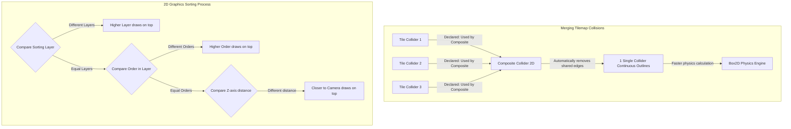

# 2D Game Development (Developing 2D Games in Unity)

> 📖 **Source:** This material is compiled from the [Unity Manual — 2D Game Development](https://docs.unity3d.com/Manual/2D.html) based on the stable **Unity 6.4 (LTS)** release.

---

## 🎯 Intent
Master the core tools and mechanisms for 2D game development in Unity. Understand how the Sprite Renderer works, how the Sprite Atlas optimizes render performance, the draw-order setup system (Sorting Layers), Tilemap/Grid map-building techniques, and distinguish the nature of 2D physics (Box2D) from 3D physics (PhysX). Provides a guide to writing source code that controls a character moving with 2D physics in a proper way.

---

## 🔑 Core Concepts & True Nature

### 1. Sprite Renderer & Sprite Atlas (Optimizing Draw Calls):
*   **Sprite Renderer:** The Component responsible for drawing 2D images onto the screen through a flat 2D polygon mesh (a Quad).
*   **The Draw Calls bottleneck problem:** If each character, monster, or item uses its own separate image file, the GPU must continuously swap Textures for each Sprite it draws. This state change (Texture binding) is extremely resource-intensive and increases the number of **Draw Calls** (draw requests the CPU sends to the GPU).
*   **The solution with Sprite Atlas:** A Sprite Atlas is a tool that packs many separate image files into one large image (a Texture Sheet). At runtime, Unity only needs to upload this large image to the GPU once. As a result, Sprite Renderers using Sprites from the Atlas can be batched and drawn together in a single pass (Dynamic Batching), reducing Draw Calls to a minimum and boosting FPS dramatically.

### 2. Tilemap, Grid & Composite Collider 2D (Preventing tile-seam snags):
*   **Tilemap & Grid:** Allow high-performance grid-based level design. The system manages all the tiles through a single Renderer instead of spawning thousands of individual GameObjects.
*   **The tile-seam snag bug (Friction Bumps):** If you add a default `BoxCollider2D` or `TilemapCollider2D` to each individual tile, the physics system calculates collisions for each tile independently. When the character slides along the ground, the tiny collision corners between adjacent tiles cause the character to "trip" or get stuck even though the ground looks perfectly flat.
*   **The solution with Composite Collider 2D:** By adding a `Composite Collider 2D` component to the Tilemap and integrating it with the `Tilemap Collider 2D` (selecting *Used by Composite*), Unity automatically optimizes by removing the interior collision edges and merging all adjacent collision tiles into a single boundary (Outlines). This both reduces the CPU's calculation load and thoroughly solves the tile-seam snag bug.

### 3. The 2D draw-layer sorting process (Sorting Order):
2D graphics rendering in Unity uses the **Painter's Algorithm**: draw the most distant objects first, then draw the closer objects on top. The order that decides which object is drawn on top strictly follows this priority sequence:
1.  **Sorting Layer:** The sorting layer (for example: Background, Default, Foreground).
2.  **Order in Layer:** The sort index within the layer (the larger the number, the more it draws on top).
3.  **Distance to Camera:** The distance from the object to the Camera (the Z axis for a 2D Orthographic system).
*   *Note:* `Sorting Group` is a special component used to group a cluster of child Sprite Renderers (for example: the parts of a single character) and sort them as a single object, preventing character A's parts from interleaving with character B's parts when they overlap.

### 4. The nature of 2D Physics vs 3D Physics:
*   **Two independent engines:** Unity's 2D physics uses the open-source C++ library **Box2D**, while 3D physics uses **NVIDIA PhysX**.
*   **No interaction:** The 2D physics components (`Rigidbody2D`, `Collider2D`) and the 3D ones (`Rigidbody`, `Collider`) are completely unaware of each other and cannot collide.
*   **Performance optimization:** 2D physics only computes on a 2-axis coordinate system (X, Y) and limits rotation to a single axis around Z. The matrix math is far simpler than PhysX's 3D space, helping 2D games run smoothly even on very low-end mobile devices.

---

## 🎨 Structure & Lifecycle

The diagram describes the mechanism of merging the Tilemap's individual Colliders into a single merged Collider via Composite Collider 2D, along with the GPU's draw-order decision sequence:



---

## 💻 C# Scripting API (C# Example)

Below is complete C# source code that controls 2D character movement (`PlayerController2D`) using physics.
*   It uses `Rigidbody2D` to move horizontally and perform jumps.
*   It automatically flips the displayed `SpriteRenderer` image based on the movement direction.
*   It collects input in the `Update()` function to avoid input lag/loss, while computing physics in the `FixedUpdate()` function to stay in sync with the Engine's physics cycle.

```csharp
using UnityEngine;

namespace UnityManual.TwoDGameDev
{
    /// <summary>
    /// Component that controls 2D character movement based on Rigidbody2D physics.
    /// Ensures accurate, smooth calculations and supports the Flip Sprite feature.
    /// </summary>
    [RequireComponent(typeof(Rigidbody2D))]
    [RequireComponent(typeof(SpriteRenderer))]
    public class PlayerController2D : MonoBehaviour
    {
        [Header("Movement Settings")]
        [SerializeField] private float moveSpeed = 8f;
        [SerializeField] private float jumpForce = 12f;

        [Header("Ground Check Settings")]
        [SerializeField] private Transform groundCheckPoint;
        [SerializeField] private float groundCheckRadius = 0.2f;
        [SerializeField] private LayerMask groundLayer;

        // Internal components
        private Rigidbody2D rb2d;
        private SpriteRenderer spriteRenderer;

        // Movement state variables
        private float horizontalInput;
        private bool isGrounded;
        private bool shouldJump;

        private void Awake()
        {
            // Get references to the Components attached to the same GameObject at startup
            rb2d = GetComponent<Rigidbody2D>();
            spriteRenderer = GetComponent<SpriteRenderer>();
        }

        private void Update()
        {
            // 1. Collect the player's input in Update (runs every Frame) to ensure no button presses are missed
            horizontalInput = Input.GetAxisRaw("Horizontal");

            // Check the Jump button (default: Space bar)
            if (Input.GetButtonDown("Jump") && isGrounded)
            {
                shouldJump = true;
            }

            // 2. Flip the Sprite based on the player's movement direction
            HandleSpriteFlipping();
        }

        private void FixedUpdate()
        {
            // 3. Perform ground collision checks and physics movement in FixedUpdate (the fixed physics cycle)
            CheckGround();
            Move();

            if (shouldJump)
            {
                Jump();
            }
        }

        /// <summary>
        /// Performs a circular physics sweep to check whether the character is standing on the ground.
        /// </summary>
        private void CheckGround()
        {
            if (groundCheckPoint != null)
            {
                // Use Physics2D OverlapCircle to sweep for collisions
                isGrounded = Physics2D.OverlapCircle(groundCheckPoint.position, groundCheckRadius, groundLayer);
            }
            else
            {
                isGrounded = false;
            }
        }

        /// <summary>
        /// Changes the Rigidbody2D velocity along the X axis to move the character.
        /// </summary>
        private void Move()
        {
            // Only change the X-axis velocity, keeping the Y-axis velocity intact (free fall, jumping)
            rb2d.velocity = new Vector2(horizontalInput * moveSpeed, rb2d.velocity.y);
        }

        /// <summary>
        /// Applies an instantaneous upward force to make the character jump.
        /// </summary>
        private void Jump()
        {
            // Change the Y-axis velocity directly instead of using AddForce to ensure the jump feels instantly responsive
            rb2d.velocity = new Vector2(rb2d.velocity.x, jumpForce);
            
            // Mark the jump as performed
            shouldJump = false;
        }

        /// <summary>
        /// Flips the SpriteRenderer based on the movement velocity.
        /// </summary>
        private void HandleSpriteFlipping()
        {
            if (horizontalInput > 0.1f)
            {
                spriteRenderer.flipX = false; // Facing right
            }
            else if (horizontalInput < -0.1f)
            {
                spriteRenderer.flipX = true;  // Facing left
            }
        }

        /// <summary>
        /// Draws the ground-check circle in the Scene window to assist with debugging.
        /// </summary>
        private void OnDrawGizmosSelected()
        {
            if (groundCheckPoint != null)
            {
                Gizmos.color = Color.green;
                Gizmos.DrawWireSphere(groundCheckPoint.position, groundCheckRadius);
            }
        }
    }
}
```

---

## ⚙️ Implementation Steps & Practical Notes (Best Practices)

1.  **Always pack Sprites with a Sprite Atlas:**
    *   Create a Sprite Atlas in the project folder and drag the folder containing the Sprites into the Atlas's list of objects to pack.
    *   Before building, Unity automatically merges them into large image sheets. Check the Preview tab in the Sprite Atlas to make sure the images aren't wasting empty space.
2.  **Apply Composite Collider 2D for terrain:**
    *   When working with terrain Tilemaps, always attach a `Composite Collider 2D` together with a `Tilemap Collider 2D`.
    *   Set the `Body Type` of the accompanying `Rigidbody2D` to **`Static`** so the terrain doesn't fall due to gravity.
    *   Set the Composite's `Geometry Type` property to **`Outlines`** for the best physics performance.
3.  **Separate Input reading from Physics calculation:**
    *   `Input.GetButtonDown` returns true for only a single Frame. If you place this function in `FixedUpdate`, then because FixedUpdate's run frequency is not in sync with Update, you will frequently encounter the "pressed jump but the character didn't jump" bug.
    *   The golden rule: **Read Input in `Update` - Apply physics forces in `FixedUpdate`**.
4.  **Use Continuous Collision Detection for fast objects:**
    *   If a 2D character or a flying projectile moves at very high speed, the default `Discrete` collision detection mode can cause the Tunneling Effect (passing through walls).
    *   Change the `Rigidbody2D`'s `Collision Detection` setting from **`Discrete`** to **`Continuous`** to enable the Sweep Test and prevent tunneling.

---

> 📚 **Source:** Content referenced from the [Unity Documentation](https://docs.unity3d.com/Manual/index.html) — Copyright Unity Technologies.

| Direction | Link |
|-------|----------|
| ← Back | [Assets & Import Pipeline (Asset Management & Import Pipeline)](../04-Assets-Media/00-assets-media-overview.md) |
| → Next | [Artificial Intelligence (AI) & Navigation (AI & the NavMesh Navigation System)](../06-AI/00-ai-overview.md) |
