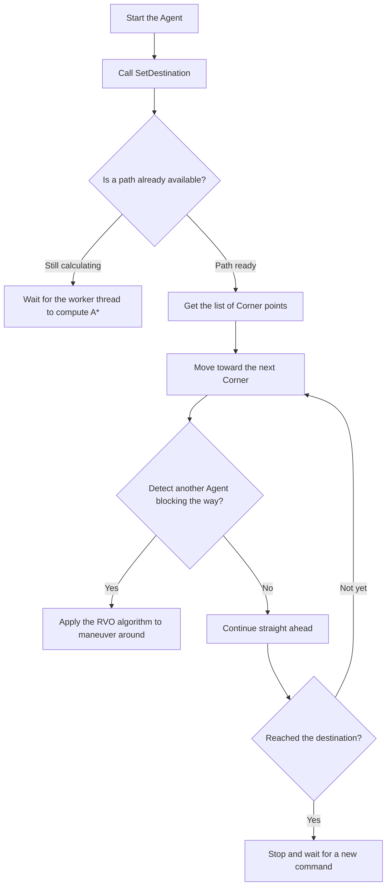

# Artificial Intelligence & Navigation (AI & the NavMesh Navigation System)

> 📖 **Source:** This material is compiled from the [Unity Manual — Navigation and Pathfinding](https://docs.unity3d.com/Manual/Navigation.html) based on the stable **Unity 6.4 (LTS)** release.

---

## 🎯 Intent
Master Unity's pathfinding and navigation system through NavMesh. Understand how NavMeshAgent works, how to optimize a NavMeshObstacle with Carving to avoid CPU bottlenecks, and how to apply Off-Mesh Links to connect disconnected terrain areas. Provides a guide to writing C# source code that controls patrolling AI (Patrol) and chasing the player (Chase) with optimized performance.

---

## 🔑 Core Concepts & True Nature

### 1. How NavMesh works:
*   Under the C# shell, Unity's pathfinding system integrates the famous open-source C++ library **Recast & Detour**.
*   **NavMesh (Navigation Mesh):** A flat polygon-mesh data structure representing the surfaces that characters can move across in the game world. The process of generating this mesh is called **Baking** (done before building, or generated in real time using Unity 6's AI Navigation Package).
*   The routing formula uses the optimal pathfinding algorithm **A* (A-Star)** running on the baked polygon mesh.

### 2. NavMeshAgent & the Local Avoidance mechanism:
*   **NavMeshAgent** is responsible for steering the entity to move along the calculated path.
*   While moving, the Agent doesn't just travel in a straight line; it also applies the **RVO (Reciprocal Velocity Obstacles)** algorithm to automatically avoid other Agents without going through the Rigidbody physics system.
*   *Performance note:* Calculating a new path (Path Calculation) is very CPU-intensive. If the project has hundreds of Agents all updating their paths continuously every Frame, it will cause an extremely severe FPS drop.

### 3. Distinguishing NavMeshObstacle With Carving vs Without Carving:
`NavMeshObstacle` is used to attach to dynamic objects that block the Agent's path (such as wooden crates or barricades):

```
       [NavMeshObstacle: No Carving]                   [NavMeshObstacle: With Carving]
              
            The Agent uses Local                       Cuts a physical hole directly
            Avoidance to maneuver around.              into the NavMesh structure.
            Suitable for moving objects.               Suitable for objects that stay still.
```

*   **No Carving (default):** The Agent detects the obstacle using the local avoidance algorithm and steers around it. This is light on the CPU and suits continuously moving obstacles (such as a running car).
*   **With Carving (cutting a hole):** When the obstacle stops, it **cuts a physical hole** directly into the NavMesh. At that point, the NavMesh's geometry is changed in that area, forcing all Agents to recalculate their overall path (Global Path).
*   *Performance pitfall:* The carving process forces Unity to recalculate part of the NavMesh's geometry. If an object both moves and continuously has Carving enabled, the CPU will be bottlenecked from re-baking the NavMesh every frame at Runtime.

### 4. Off-Mesh Link:
*   By default, NavMesh is only generated on flat surfaces with a limited slope.
*   To let the Agent perform non-physical actions such as: jumping over a chasm, climbing a vertical ladder, or going through a teleport portal, we use an **Off-Mesh Link**.
*   This class defines a start point and an end point. When the Agent reaches the start point, it temporarily pauses normal navigation and interpolates its movement to the end point along the configured trajectory.

---

## 🎨 Structure & Lifecycle

The diagram describes the routing decision process and the path-update loop of a NavMeshAgent:



---

## 💻 C# Scripting API (C# Example)

Below is complete C# source code writing an AI class that patrols and chases the player (`EnemyAI`).
*   It uses the `NavMeshAgent` class to set up the path.
*   **A crucial performance optimization:** Do not call the `SetDestination` function every Frame in the `Update()` function. Instead, set up a time buffer (`pathUpdateInterval`) to only recalculate the path every 0.5 seconds.
*   It supports a visual Debug mode by drawing the detection and attack radii directly in the Scene.

```csharp
using System.Collections.Generic;
using UnityEngine;
using UnityEngine.AI;

namespace UnityManual.AI
{
    /// <summary>
    /// Class that controls AI patrolling between Waypoints and chasing the Player when detected.
    /// Designed to optimize the frequency of NavMesh path calculation calls.
    /// </summary>
    [RequireComponent(typeof(NavMeshAgent))]
    public class EnemyAI : MonoBehaviour
    {
        public enum AIState
        {
            Patrolling,
            Chasing,
            Attacking
        }

        [Header("AI State")]
        [SerializeField] private AIState currentState = AIState.Patrolling;

        [Header("Patrol Settings")]
        [SerializeField] private List<Transform> patrolWaypoints;
        [SerializeField] private float patrolSpeed = 3.5f;
        [SerializeField] private float waypointTolerance = 1.0f;

        [Header("Chase Settings")]
        [SerializeField] private Transform playerTarget;
        [SerializeField] private float chaseSpeed = 5.5f;
        [SerializeField] private float detectionRange = 10.0f;
        [SerializeField] private float attackRange = 2.0f;

        [Header("Optimization Settings")]
        [Tooltip("The minimum time between path-finding updates (seconds)")]
        [SerializeField] private float pathUpdateInterval = 0.5f;

        private NavMeshAgent agent;
        private int currentWaypointIndex = 0;
        private float lastPathUpdateTime;

        private void Awake()
        {
            agent = GetComponent<NavMeshAgent>();
        }

        private void Start()
        {
            // Set the initial speed and head toward the first patrol point
            agent.speed = patrolSpeed;
            lastPathUpdateTime = Random.Range(0f, pathUpdateInterval); // Stagger the start times to avoid a CPU bottleneck from many AIs at once
            
            if (patrolWaypoints != null && patrolWaypoints.Count > 0)
            {
                SetDestinationToWaypoint();
            }
        }

        private void Update()
        {
            // Performance optimization: Only evaluate the state and recalculate the path on a fixed cycle
            if (Time.time - lastPathUpdateTime > pathUpdateInterval)
            {
                lastPathUpdateTime = Time.time;
                EvaluateState();
            }

            // Execute the corresponding movement behavior every frame
            ExecuteStateBehavior();
        }

        /// <summary>
        /// Analyzes the distance to the Player to switch the FSM (Finite State Machine) state.
        /// </summary>
        private void EvaluateState()
        {
            if (playerTarget == null)
            {
                currentState = AIState.Patrolling;
                return;
            }

            float distanceToPlayer = Vector3.Distance(transform.position, playerTarget.position);

            if (distanceToPlayer <= attackRange)
            {
                currentState = AIState.Attacking;
            }
            else if (distanceToPlayer <= detectionRange)
            {
                currentState = AIState.Chasing;
            }
            else
            {
                currentState = AIState.Patrolling;
            }
        }

        /// <summary>
        /// Executes movement or attack commands based on the current state.
        /// </summary>
        private void ExecuteStateBehavior()
        {
            switch (currentState)
            {
                case AIState.Patrolling:
                    HandlePatrol();
                    break;
                case AIState.Chasing:
                    HandleChase();
                    break;
                case AIState.Attacking:
                    HandleAttack();
                    break;
            }
        }

        /// <summary>
        /// Handles the logic for patrolling through the Waypoints.
        /// </summary>
        private void HandlePatrol()
        {
            agent.speed = patrolSpeed;

            if (patrolWaypoints == null || patrolWaypoints.Count == 0) return;

            // Check whether we are close enough to the current waypoint
            // pathPending ensures the path has finished calculating before reading remainingDistance
            if (!agent.pathPending && agent.remainingDistance <= waypointTolerance)
            {
                // Move to the next Waypoint in the circular list
                currentWaypointIndex = (currentWaypointIndex + 1) % patrolWaypoints.Count;
                SetDestinationToWaypoint();
            }
        }

        /// <summary>
        /// Sets the Agent's destination to the current Waypoint.
        /// </summary>
        private void SetDestinationToWaypoint()
        {
            Transform targetWaypoint = patrolWaypoints[currentWaypointIndex];
            if (targetWaypoint != null)
            {
                agent.SetDestination(targetWaypoint.position);
            }
        }

        /// <summary>
        /// Chases the Player target.
        /// </summary>
        private void HandleChase()
        {
            agent.speed = chaseSpeed;
            
            if (playerTarget != null)
            {
                // Call SetDestination to chase the target
                agent.SetDestination(playerTarget.position);
            }
        }

        /// <summary>
        /// Attack state: Stop moving and turn to face the Player.
        /// </summary>
        private void HandleAttack()
        {
            // Stop movement on the NavMeshAgent
            agent.ResetPath();

            if (playerTarget != null)
            {
                // Smoothly turn to face the Player
                Vector3 direction = (playerTarget.position - transform.position).normalized;
                direction.y = 0; // Lock the Y axis to avoid tilting the monster

                if (direction != Vector3.zero)
                {
                    Quaternion targetRotation = Quaternion.LookRotation(direction);
                    transform.rotation = Quaternion.Slerp(transform.rotation, targetRotation, Time.deltaTime * 8f);
                }
            }

            // Note: Trigger the damage logic here (for example: trigger the attack animation)
        }

        /// <summary>
        /// Draws visual circles representing the AI's range in the Scene Editor.
        /// </summary>
        private void OnDrawGizmosSelected()
        {
            // Yellow represents the Player detection range
            Gizmos.color = Color.yellow;
            Gizmos.DrawWireSphere(transform.position, detectionRange);

            // Red represents the attack range
            Gizmos.color = Color.red;
            Gizmos.DrawWireSphere(transform.position, attackRange);
        }
    }
}
```

---

## ⚙️ Implementation Steps & Practical Notes (Best Practices)

1.  **Absolutely avoid calling SetDestination every frame:**
    *   The `SetDestination()` function forces the engine to run the A* algorithm to find a path through the complex polygon mesh. Calling this function in `Update()` for many AIs will immediately destroy CPU performance (a CPU bottleneck).
    *   Use a time-based update interval (for example: only update the destination every 0.2s - 0.5s) or use a Coroutine to optimize.

2.  **Use Carving correctly for Obstacles:**
    *   For obstacles that can move (such as a pushcart or a pushable wooden chest), enable the `Carve` property of the `NavMeshObstacle`.
    *   However, set **`Carve Only Stationary`** (only carve when standing still). When the object is pushed away, it temporarily disables carving and switches to local avoidance to avoid forcing Unity to re-bake the NavMesh continuously. Only when it stops moving for the configured duration (Time To Stationary) does it carve a fixed hole again.

3.  **Separate Rotation controlled by Animators:**
    *   If the character uses Root Motion (meaning movement and rotation are decided by the Animation rather than physics code), turn off the agent's automatic position or rotation updates by setting `agent.updatePosition = false;` or `agent.updateRotation = false;`.
    *   Then, get the Agent's desired velocity with `agent.desiredVelocity` to feed into Animator parameters, so the footstep animation matches the movement speed on the mesh perfectly, eliminating foot sliding on the ground.

4.  **Optimize neighboring Agents via NavMesh Priority:**
    *   When many Agents crowd into a narrow path, they may jostle each other and cause stuttering.
    *   Tune the **`Avoidance Priority`** parameter from 0 to 99. Assign a higher priority to monster leaders or important characters so smaller monsters proactively yield the path.

---

> 📚 **Source:** Content referenced from the [Unity Documentation](https://docs.unity3d.com/Manual/index.html) — Copyright Unity Technologies.

| Direction | Link |
|-------|----------|
| ← Back | [2D Game Development (Developing 2D Games in Unity)](../05-2D-Game-Dev/00-2d-game-dev-overview.md) |
| → Next | [XR Development (Building Virtual & Augmented Reality)](../07-XR/00-xr-overview.md) |
