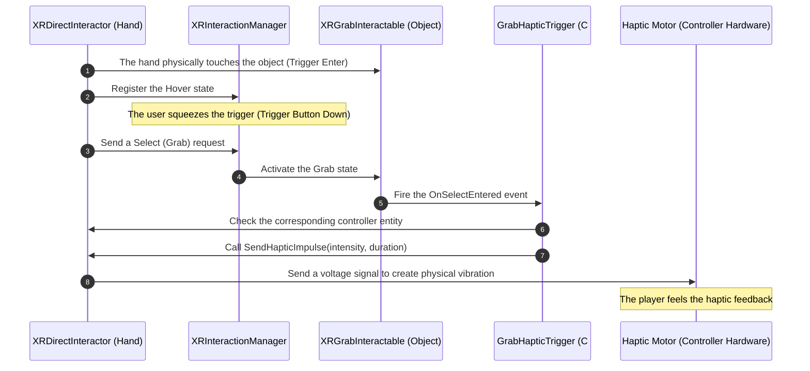

# XR Development (Building Virtual & Augmented Reality)

> 📖 **Source:** This material is compiled from the [Unity Manual — XR](https://docs.unity3d.com/Manual/XR.html) and [XR Interaction Toolkit](https://docs.unity3d.com/Packages/com.unity.xr.interaction.toolkit@latest/index.html) documentation based on the stable **Unity 6.4 (LTS)** release.

---

## 🎯 Intent
Learn the architecture for developing Virtual Reality (VR) and Augmented Reality (AR) applications in Unity using the OpenXR standard, AR Foundation, and the XR Interaction Toolkit (XRI). Grasp the structural role of XR Origin, the interaction mechanism through the Interactor - Interactable object pair, and the technique for triggering haptic feedback (Haptics) on the controllers when grabbing objects.

---

## 🔑 Core Concepts & True Nature

### 1. The OpenXR standard & the AR Foundation framework:
*   **OpenXR:** An open, cross-platform standard managed by the Khronos Group. Unity integrates OpenXR so you can write code once and deploy it to every commercial XR hardware platform, such as Meta Quest, HTC Vive, Valve Index, PlayStation VR2, or Apple Vision Pro.
*   **AR Foundation:** An Abstraction Layer built by Unity. It plays the role of translating Unity scripts into the corresponding APIs of **ARCore** (Android) or **ARKit** (iOS).
    *   `AR Session`: Manages the entire lifecycle of an AR experience (turning the camera on/off, starting/stopping the tracking system).
    *   `AR Session Origin` (merged into `XR Origin` in newer versions): Synchronizes the real-world coordinates scanned by the phone's camera with the virtual world in Unity.

### 2. The structure and nature of XR Origin:
`XR Origin` is the central anchor of any VR/AR project. It represents the player's physical real-world position within Unity's virtual space:

```
[XR Origin (GameObject)]
   ├── [Camera Offset (GameObject)]
   │      ├── [Main Camera (VR Headset Display)]
   │      ├── [Left Hand Controller (GameObject & Interactor)]
   │      └── [Right Hand Controller (GameObject & Interactor)]
```

*   **Camera Offset:** Plays the role of height calibration. For VR devices that track from the floor (Floor-level tracking), the Camera Offset automatically raises the virtual Camera to match the player's real-world height.
*   **The coordinate translator:** When the player turns their head or moves their hands in the real world, the hardware sends spatial coordinate data (6 DoF). Unity receives this information and updates the Transform of the Main Camera and Hand Controllers accordingly inside the Camera Offset.

### 3. XR Interaction Toolkit (XRI) - Interactor vs Interactable:
XRI divides interaction behavior into three main groups managed by the `XR Interaction Manager`:
*   **Interactor (the acting object):** Attached to the player's controllers to perform actions (such as `XRDirectInteractor` for direct grabbing, `XRRayInteractor` for pointing a ray from a distance, or `XRPokeInteractor` for pressing virtual buttons).
*   **Interactable (the object being acted upon):** Attached to objects in the environment to receive interaction (such as `XRGrabInteractable` to allow grabbing and throwing, or `XRSimpleInteractable` to receive hover/click events).
*   **Interaction Manager:** Acts as the "referee" coordinating all the hover, select (grab), and activate events between Interactors and Interactables.

### 4. XR Performance Optimization - The nature of Single Pass Instanced Rendering:
*   XR games must render two separate frames (for the left eye and the right eye) with a slight offset to create the stereoscopic 3D effect.
*   **Multi Pass Rendering (old & slow):** Unity traverses the entire Scene and redraws it twice. This doubles the number of Draw Calls and doubles the CPU processing burden.
*   **Single Pass Instanced Rendering (the optimized standard):** Unity sends the draw command to the GPU only once. The GPU uses the **Hardware Instancing** feature to duplicate that geometry for the second eye, while writing into a double Array Texture. This mechanism reduces Draw Calls from the CPU by 50%, and is a vital setting for VR games to hit very high target FPS (90Hz - 120Hz) on mobile VR headsets (such as Meta Quest), which have weak CPUs.

---

## 🎨 Structure & Lifecycle

The diagram describes the process of receiving a collision event and triggering controller vibration (Haptics) when the player performs a grab action:



---

## 💻 C# Scripting API (C# Example)

Below is complete C# source code (`GrabHapticTrigger`) attached to a grabbable object (`XRGrabInteractable`).
*   It listens to XRI's `selectEntered` event to know when the object is picked up.
*   It precisely identifies which controller (left or right) is performing the grab through the event parameter.
*   It sends a physical vibration impulse command (`SendHapticImpulse`) to that controller's vibration motor to create realistic haptic feedback for the player.

```csharp
using UnityEngine;
using UnityEngine.XR.Interaction.Toolkit;

namespace UnityManual.XR
{
    /// <summary>
    /// Component that automatically triggers haptic feedback (Haptics) on the controller
    /// when the XRGrabInteractable object is picked up by the player.
    /// </summary>
    [RequireComponent(typeof(XRGrabInteractable))]
    public class GrabHapticTrigger : MonoBehaviour
    {
        [Header("Haptic Settings")]
        [Tooltip("The controller's vibration intensity (from 0.0 to 1.0)")]
        [SerializeField] [Range(0f, 1f)] private float hapticIntensity = 0.5f;

        [Tooltip("The controller's vibration duration in seconds")]
        [SerializeField] private float hapticDuration = 0.15f;

        private XRGrabInteractable grabInteractable;

        private void Awake()
        {
            // Get the reference to the XRGrabInteractable component attached to the same object
            grabInteractable = GetComponent<XRGrabInteractable>();
        }

        private void OnEnable()
        {
            // Subscribe to the event when the object begins to be selected/grabbed (Select Entered)
            grabInteractable.selectEntered.AddListener(OnObjectGrabbed);
        }

        private void OnDisable()
        {
            // Unsubscribe from the event when the Component is disabled to avoid a Memory Leak
            grabInteractable.selectEntered.RemoveListener(OnObjectGrabbed);
        }

        /// <summary>
        /// Callback called automatically by XRI when this object is picked up.
        /// </summary>
        /// <param name="args">Detailed information about the interaction event</param>
        private void OnObjectGrabbed(SelectEnterEventArgs args)
        {
            // Get the reference to the Interactor performing the grab action
            IXRSelectInteractor interactor = args.interactorObject;

            // Check whether this Interactor is a Base Controller Interactor type
            // (because only interactors attached to physical controllers support haptics)
            if (interactor is XRBaseControllerInteractor controllerInteractor)
            {
                // Call the function to trigger controller vibration
                TriggerControllerHaptics(controllerInteractor.xrController);
            }
        }

        /// <summary>
        /// Triggers the vibration motor on the corresponding controller device.
        /// </summary>
        private void TriggerControllerHaptics(XRBaseController controller)
        {
            if (controller != null)
            {
                // SendHapticImpulse sends the vibration signal to the hardware
                // intensity: The vibration intensity
                // duration: The duration (in seconds)
                controller.SendHapticImpulse(hapticIntensity, hapticDuration);
                
                Debug.Log($"[XR Haptics] Sent a vibration signal to the controller: {controller.gameObject.name} | Intensity: {hapticIntensity}");
            }
        }
    }
}
```

---

## ⚙️ Implementation Steps & Practical Notes (Best Practices)

1.  **Always enable Single Pass Instanced Rendering:**
    *   Go to `Project Settings -> XR Plug-in Management -> OpenXR` (or the corresponding platform).
    *   Set **`Play Mode XR Rendering Mode`** and **`Stereo Rendering Mode`** to **`Single Pass Instanced`**. This is the single most important graphics optimization for any VR project.

2.  **Apply the Action-Based Input model instead of Device-Based:**
    *   Avoid reading physical buttons directly, like `Input.GetKey(KeyCode.JoystickButton0)`.
    *   Use the new **Input System** combined with XRI's **Action-Based Controller**. The developer defines Actions such as "Grab", "Use", and "Teleport" and binds the buttons through the Input Actions configuration file. This makes the code completely independent of any specific hardware device.

3.  **Optimize physics collisions for grabbed objects:**
    *   When the player grabs a virtual object and moves their hand into a virtual wall, if it's not handled well, the object will pass through the wall or jitter continuously.
    *   Configure the **`Movement Type`** parameter in `XRGrabInteractable`:
        *   **Instantaneous:** Moves the object instantly with the hand (lightest, but passes through walls).
        *   **Kinematic:** Moves it with Kinematic velocity (limits wall penetration).
        *   **Velocity Tracking:** Moves the object by computing and applying physics forces to pull it along with the hand (best wall-penetration prevention, the most realistic physical interaction, suitable for melee weapons).

4.  **Control the number of Draw Calls extremely strictly:**
    *   Standalone VR headsets (such as Quest 2/3) have limited mobile processing chips. To achieve a stable 72/90 FPS and avoid making the player nauseous, limit the number of Draw Calls below **100 - 150** and the number of triangles below **100,000 - 200,000** displayed per frame. Use Static/Dynamic Batching techniques and minimize Shaders.

---

> 📚 **Source:** Content referenced from the [Unity Documentation](https://docs.unity3d.com/Manual/index.html) — Copyright Unity Technologies.

| Direction | Link |
|-------|----------|
| ← Back | [Artificial Intelligence (AI) & Navigation (AI & the NavMesh Navigation System)](../06-AI/00-ai-overview.md) |
| → Next | [Multiplayer & Networking (Multiplayer Game Programming with Netcode)](../08-Multiplayer/00-multiplayer-overview.md) |
