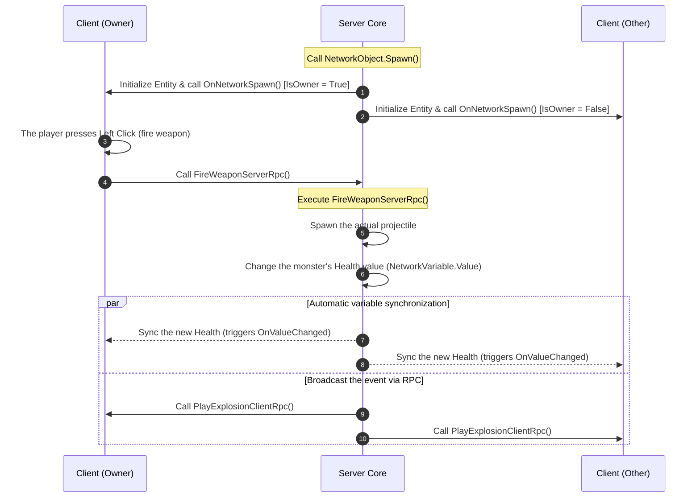

# Multiplayer & Networking (Multiplayer Game Programming with Netcode)

> 📖 **Source:** This material is compiled from the [Unity Manual — Multiplayer](https://docs.unity3d.com/Manual/multiplayer.html) and [Netcode for GameObjects Documentation](https://docs.unity3d.com/Packages/com.unity.netcode.gameobjects@latest/index.html) based on the stable **Unity 6.4 (LTS)** release.

---

## 🎯 Intent
Master the architecture of multiplayer game programming in Unity through the official **Netcode for GameObjects (NGO)** library. Understand how NetworkManager works, the state synchronization mechanism via NetworkVariable, how to route the flow of event data through RPCs (ServerRpc/ClientRpc), distinguish the authority mechanism (Server Authority vs Client Authority), and write complete source code that synchronizes movement, health, and physical projectile firing.

---

## 🔑 Core Concepts & True Nature

### 1. The role of NetworkManager & NetworkObject:
*   **NetworkManager:** The heart of the entire networking system. It manages the connection lifecycle, the network handshake, the transport protocol configuration (such as the **Unity Transport Package - UTP**), the list of connected Clients, and registration of synchronized network Prefabs (Network Prefabs).
*   **NetworkObject:** Every GameObject that wants to appear and synchronize over the network must attach this component. It assigns a unique network identifier (**NetworkObjectId**) that lets the Server and all Clients know they are operating on the same entity in the game.

### 2. The nature of State Synchronization via NetworkVariable:
*   **State-based Sync:** `NetworkVariable` is used to synchronize values that change continuously over time (such as Health, Gold, Level).
*   **How it works:** It only sends a packet when the value actually changes (Delta-compression) and automatically synchronizes the latest value to newly connected Clients (Late-joiners).
*   **Server-Authoritative:** By default, only the Server has the right to change the value of a `NetworkVariable` (`WritePermission = Server`). Clients only have read access to update their local UI. Any attempt to overwrite the value from the Client side immediately throws a Runtime exception to prevent cheating (Hack/Cheat).

### 3. Distinguishing the nature of RPCs (Remote Procedure Calls):
RPC is an event-based synchronization mechanism (Event-based Sync). It is used to send instantaneous events (such as typing in Chat, triggering an explosion effect, or firing a gun):

```
┌──────────────────────────────────────┐                   ┌──────────────────────────────────────┐
│            CLIENT (Owner)            │                   │                SERVER                │
└──────────────────┬───────────────────┘                   └──────────────────┬───────────────────┘
                   │                                                          │
                   │ ─── 1. Client calls FireWeaponServerRpc() ──────────────> │
                   │                                                          │ (Execute logic on the Server)
                   │                                                          │ (Spawn projectile, deduct ammo, validate)
                   │                                                          │
                   │ <── 2. Server calls PlayMuzzleFlashClientRpc() ──────────│
                   │                                                          │
     (Execute the effect on the Client)                                       │
```

*   **ServerRpc (Client calls, Server executes):**
    *   The Client sends an action request to the Server.
    *   The function is executed entirely on the Server.
    *   By default, the calling Client must own the object (`RequireOwnership = true`).
*   **ClientRpc (Server calls, all Clients execute):**
    *   The Server broadcasts an event message to all connected Clients.
    *   The function is executed in parallel on every Client's machine.
    *   Commonly used for visual/audio effects that don't directly affect core Gameplay stats.

### 4. The Authority Mechanism:
*   **Server-Authoritative:** The Server calculates and decides everything (character position, damage, hit results). The Client only sends button-press input and redraws the image it receives from the Server. This is absolutely secure but causes a feeling of latency (Input Latency) for the player if the connection is poor.
*   **Client-Authoritative:** The Client calculates its own movement position and pushes the coordinates to the Server to relay to the other machines. The movement experience is instantly smooth, but it is very easy to hack (for example, hacking movement speed or flying into the sky). To balance this, AAA games use the **Client-Side Prediction & Server Reconciliation** algorithm (the Client predicts movement ahead of time, and the Server cross-checks and snaps the position back if it detects a discrepancy).

---

## 🎨 Structure & Lifecycle

The diagram shows the lifecycle of a network-synchronized object, from the moment of Spawn until it exchanges data via RPC and NetworkVariable:



---

## 💻 C# Scripting API (C# Example)

Below is complete C# source code (`MultiplayerPlayerController`) written on top of Unity 6's Netcode for GameObjects.
*   It inherits from the `NetworkBehaviour` class instead of `MonoBehaviour`.
*   It uses `IsOwner` to check the authority to control the local client's movement.
*   It defines a `NetworkVariable<int>` to synchronize the character's health (the Server has write access, every client has read access to update the health bar).
*   It uses a `ServerRpc` to send the fire request and spawn the projectile object over the network from the Server side.

```csharp
using Unity.Netcode;
using UnityEngine;

namespace UnityManual.Multiplayer
{
    /// <summary>
    /// Component that manages movement, firing, and character health synchronization in a Multiplayer environment.
    /// Inherits from NetworkBehaviour to integrate the Netcode for GameObjects APIs.
    /// </summary>
    [RequireComponent(typeof(NetworkObject))]
    public class MultiplayerPlayerController : NetworkBehaviour
    {
        [Header("Movement Settings")]
        [SerializeField] private float moveSpeed = 5.0f;

        [Header("Weapon Settings")]
        [SerializeField] private Transform firePoint;
        [SerializeField] private GameObject projectilePrefab;

        // Define a NetworkVariable to synchronize health.
        // Read permission: Everyone can read it.
        // Write permission: Only the Server can change the value.
        [Header("Player Stats")]
        private readonly NetworkVariable<int> health = new NetworkVariable<int>(
            100, 
            NetworkVariableReadPermission.Everyone, 
            NetworkVariableWritePermission.Server
        );

        // Public property that lets other scripts read the current health value
        public int CurrentHealth => health.Value;

        /// <summary>
        /// NGO's automatic network startup function, replacing the default Start function.
        /// </summary>
        public override void OnNetworkSpawn()
        {
            // Subscribe to the callback when the Health variable changes value to update the UI or effects
            health.OnValueChanged += OnHealthValueChanged;

            if (IsOwner)
            {
                Debug.Log($"[Netcode] Spawned my character with NetID: {NetworkObjectId}");
            }
            else
            {
                Debug.Log($"[Netcode] Spawned another player's character with NetID: {NetworkObjectId}");
            }
        }

        /// <summary>
        /// Function called when the entity is despawned on the network.
        /// </summary>
        public override void OnNetworkDespawn()
        {
            // Unsubscribe from the event to avoid a memory leak
            health.OnValueChanged -= OnHealthValueChanged;
        }

        private void Update()
        {
            // 1. BLOCK EXECUTION: If this is not the owner (IsOwner = false),
            // absolutely do not process Input and movement to avoid the button presses controlling another player's character by mistake.
            if (!IsOwner) return;

            // Handle local movement for the Owner
            HandleMovement();

            // Left-click to fire
            if (Input.GetButtonDown("Fire1"))
            {
                // 2. SEND THE EVENT: Call ServerRpc to request the Server to perform the firing
                FireWeaponServerRpc();
            }
        }

        /// <summary>
        /// Moves the character based on button input.
        /// </summary>
        private void HandleMovement()
        {
            float horizontal = Input.GetAxis("Horizontal");
            float vertical = Input.GetAxis("Vertical");

            Vector3 moveDirection = new Vector3(horizontal, 0f, vertical).normalized;

            if (moveDirection.magnitude > 0.1f)
            {
                transform.Translate(moveDirection * (moveSpeed * Time.deltaTime), Space.World);
            }
        }

        /// <summary>
        /// ServerRpc that handles the firing logic.
        /// Triggered by the Client but only compiled and executed on the Server.
        /// </summary>
        [ServerRpc]
        private void FireWeaponServerRpc(ServerRpcParams rpcParams = default)
        {
            // Get the ClientId of the sender of the ServerRpc request to verify their identity
            ulong senderClientId = rpcParams.Receive.SenderClientId;
            Debug.Log($"[Server] Received a fire request from Client: {senderClientId}");

            // Perform server-side security checks (for example: check remaining ammo, dead state...)
            
            // The Server instantiates the projectile Prefab
            if (projectilePrefab != null && firePoint != null)
            {
                GameObject projectile = Instantiate(projectilePrefab, firePoint.position, firePoint.rotation);
                
                // Get the NetworkObject component on the projectile
                NetworkObject bulletNetObj = projectile.GetComponent<NetworkObject>();
                
                if (bulletNetObj != null)
                {
                    // Perform a network Spawn so the projectile appears simultaneously on every other player's machine
                    bulletNetObj.Spawn();
                }
            }
        }

        /// <summary>
        /// Function that applies damage to the character, only called from the Server side.
        /// </summary>
        public void ApplyDamage(int damageAmount)
        {
            // Ensure only the Server has the right to process Gameplay stat changes
            if (!IsServer) return;

            // Change the health value, automatically triggering OnValueChanged across the entire network
            health.Value = Mathf.Max(0, health.Value - damageAmount);

            Debug.Log($"[Server] Character {NetworkObjectId} took {damageAmount} damage. Current health: {health.Value}");

            if (health.Value <= 0)
            {
                Debug.Log($"[Server] Character {NetworkObjectId} has died!");
                
                // Despawn the object from the network, automatically destroying the GameObject on every client
                GetComponent<NetworkObject>().Despawn();
            }
        }

        /// <summary>
        /// Callback that runs automatically on every client when the Server updates the health value.
        /// </summary>
        private void OnHealthValueChanged(int previousValue, int newValue)
        {
            Debug.Log($"[Client - NetID {NetworkObjectId}] Health changed from {previousValue} to {newValue}");
            
            // Example: Update the health bar UI (HP Slider) or spawn a blood-spurt effect here
        }
    }
}
```

---

## ⚙️ Implementation Steps & Practical Notes (Best Practices)

1.  **Clearly distinguish between State and Events:**
    *   **Use `NetworkVariable`:** For attributes that make up an object's persistent state (Health, Armor, Level, Gold, position coordinates, display name).
    *   **Use `RPC`:** For instantaneous events that are transient in nature and don't need long-term history (gunfire sounds, blood effects, chat commands, teleport requests).
    *   *Avoid this mistake:* Using an RPC to add/subtract health or move a character's position without storing it in a variable. This causes late joiners to not receive the correct state.

2.  **Optimize bandwidth by lowering the Tick Rate:**
    *   By default, if not configured, the NetworkManager tries to synchronize network data every rendered Frame. This overloads the network bandwidth (a Network bandwidth bottleneck).
    *   Go to the `NetworkManager` component in your main Scene and tune the **`Network Tick Rate`** property down to about **20 to 30 Ticks/second** (the standard value for MMO/Coop games) instead of 60+ Hz.

3.  **Required declaration of Network Prefabs in NetworkManager:**
    *   Every object you want to spawn over the network with `NetworkObject.Spawn()` (such as flying projectiles or summoned monsters) must be declared in advance in the **`Network Prefabs`** list of the `NetworkManager`.
    *   If not declared in advance, when the Server calls Spawn, the Client cannot find the corresponding Prefab to instantiate and will report a connection crash error.

4.  **Use Client-Authoritative for movement when smoothness is needed:**
    *   If you're making a first-person shooter (FPS) or a fast-paced action game, using fully Server-Authoritative movement gives a very poor experience because the player has to wait for the round-trip packet from the Server before they see the character move.
    *   Attach the `ClientNetworkTransform` component (provided by Netcode's helper package) to the character to let the Client move the character locally and instantly and synchronize the position back to the Server.

---

> 📚 **Source:** Content referenced from the [Unity Documentation](https://docs.unity3d.com/Manual/index.html) — Copyright Unity Technologies.

| Direction | Link |
|-------|----------|
| ← Back | [XR Development (Building Virtual & Augmented Reality)](../07-XR/00-xr-overview.md) |
| → Next | [Input System (Introduction to Input)](../15-Input/01-introduction-to-input.md) |
