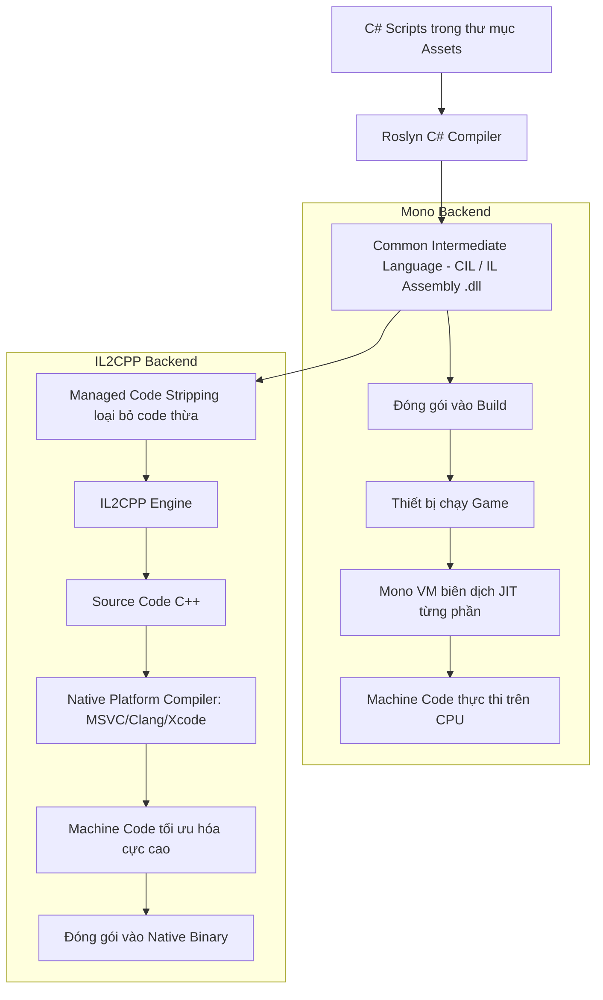

# Platform Development

> 📖 **Source:** Compiled and curated from the [Unity Manual — Platform Development](https://docs.unity3d.com/Manual/PlatformSpecific.html), based on Unity 6.4 (LTS).

---

## 🎯 Intent

The goal of this chapter is to provide the most detailed and comprehensive view of how the cross-platform development system works in **Unity 6.4 (LTS)**. Developers will gain a deep understanding of the code compilation mechanism (JIT vs AOT), the fundamental difference between the two scripting backends **Mono** and **IL2CPP**, the **Code Stripping** mechanism for memory optimization, and how to use **Conditional Compilation** directives to write optimized code for each specific device (such as Android, iOS, WebGL).

---

## 🔑 Core Concepts & True Nature

### 1. Scripting Backends: Mono vs IL2CPP

When building a game in Unity, your C# code does not run directly on the device's hardware. Instead, it is translated through one of two compilation "backends" (Scripting Backends):

#### A. Mono (Just-In-Time - JIT Compilation)
*   **Nature:** Unity's Roslyn compiler translates C# code into the intermediate **Common Intermediate Language (CIL/IL)** and packages it into `.dll` files. When the game runs on the device, a Mono Virtual Machine reads this IL code and compiles it into machine code matching the CPU at runtime.
*   **Advantages:** Extremely fast build times because it only needs to generate IL `.dll` files. Very useful during development and rapid iteration/testing.
*   **Disadvantages:** Slower runtime performance because the CPU must both run the game and compile the CIL code into machine code. In addition, `.dll` files are very easy to decompile, exposing the original source code.
*   **Supported platforms:** Mainly used in the Editor environment and test builds on PC/Stand-alone. Not supported on iOS and some Console devices.

#### B. IL2CPP (Ahead-Of-Time - AOT Compilation)
*   **Nature:** Compilation happens in several major steps before the game is packaged:
    1. The Roslyn compiler compiles the C# code into intermediate IL.
    2. Unity's **IL2CPP** tool converts all of that IL code into **C++** source code.
    3. This C++ code is then compiled by a native C++ compiler for the target platform (for example, MSVC on Windows, Xcode Clang on iOS, Clang on Android) to produce highly optimized native machine code.
*   **Advantages:**
    *   **Superior performance:** Code runs significantly faster because it is deeply optimized by modern C++ compilers.
    *   **Very high security:** Very hard to decompile because all the C# logic has been turned into complex C++ binary machine code.
    *   **Platform compliance:** It is mandatory for iOS (Apple prohibits executing JIT code), WebGL, and Console platforms (Sony PlayStation, Nintendo Switch, Microsoft Xbox).
*   **Disadvantages:** Very slow build times because it must go through many complex cross-compilation steps via C++.

```
Biên dịch Mono:   [C# Code] ──Roslyn──> [IL (.dll)] ──Mono VM (Runtime)──> [Machine Code]
Biên dịch IL2CPP: [C# Code] ──Roslyn──> [IL] ──IL2CPP──> [C++ Code] ──Native Compiler──> [Machine Code]
```

---

### 2. The Code Stripping mechanism

When using IL2CPP, Unity enables the **Managed Code Stripping** feature to reduce the size of the final binary.
*   **How it works:** The compiler performs Static Analysis of all your code, starting from the `MonoBehaviour` classes referenced in the Scene and the scripts. It finds and removes every class, method, and struct in Unity's libraries or third-party packages that you never call in your code.
*   **The Reflection problem:** If you call a function or instantiate a class indirectly through a string (**Reflection** — for example, `Type.GetType("MyNamespace.MyClass")`), Unity's static analyzer will mistakenly assume that class is unused and automatically strip it out. As a result, the game will crash on the real device with a `TypeLoadException` or `MissingMethodException`.
*   **Solution (the `link.xml` file):** To protect code that uses Reflection, you must create an XML file named `link.xml` placed in the `Assets/` folder to declare to Unity that those specific classes or assemblies must not be stripped.

---

### 3. Distinguishing compilation directives (#if) from runtime checks (Application.platform)

When writing cross-platform code, distinguishing how the compiler handles these two mechanisms is critical:

*   **Platform-Conditional Compilation (Preprocessor Directives):**
    ```csharp
    #if UNITY_ANDROID
        // Đoạn code này CHỈ được biên dịch khi mục tiêu là Android.
        // Trên các nền tảng khác (như iOS, PC), trình biên dịch hoàn toàn BỎ QUA đoạn này.
        // File Assembly build ra không chứa bất kỳ byte code nào của đoạn này.
    #endif
    ```
    *Nature:* Happens at compile time. Very safe when using libraries or APIs specific to one operating system (for example, `UnityEngine.Android`), with no risk of build errors from missing libraries on another operating system.

*   **Runtime Platform Checks:**
    ```csharp
    if (Application.platform == RuntimePlatform.Android)
    {
        // Toàn bộ đoạn code này VẪN được biên dịch vào file game cuối cùng ở MỌI nền tảng.
        // Khi game chạy, CPU mới thực hiện kiểm tra biểu thức điều kiện if.
    }
    ```
    *Nature:* Happens at runtime. If the block calls Android-exclusive APIs, the game will immediately produce a **Compilation Error** the moment you switch the Target Build to iOS/Windows, because the compiler on iOS cannot find the definition of that Android library.

---

## 🎨 Structure or Lifecycle

Below is a detailed compilation-flow diagram of a Unity project depending on whether the Scripting Backend chosen is Mono or IL2CPP:



---

## 💻 C# Scripting API (C# Example)

Below is a real-world platform management script (`PlatformManager.cs`) that demonstrates how to use conditional compilation directives (`#if`) to call OS-specific system APIs on Android and iOS (such as handling the Back button on Android, requesting an app rating, configuring the frame rate, and quitting the app safely in compliance with Apple Store / Google Play guidelines).

```csharp
using UnityEngine;

#if UNITY_IOS
using UnityEngine.iOS; // Namespace chỉ tồn tại trên môi trường build iOS
#elif UNITY_ANDROID
using UnityEngine.Android; // Namespace chỉ tồn tại trên môi trường build Android
#endif

public class PlatformManager : MonoBehaviour
{
    private void Start()
    {
        ConfigurePlatformSettings();
    }

    private void Update()
    {
        HandlePlatformInputs();
    }

    /// <summary>
    /// Cấu hình các thiết lập hệ thống đặc thù cho từng nền tảng khi khởi động game.
    /// </summary>
    private void ConfigurePlatformSettings()
    {
        // 1. Cấu hình tốc độ khung hình (Frame Rate)
        #if UNITY_IOS || UNITY_ANDROID
            // Trên thiết bị di động, khóa FPS ở mức 60 để tránh hao pin và nóng máy
            Application.targetFrameRate = 60;
            Debug.Log("[PlatformManager] Mobile Platform detected. Framerate capped to 60 FPS.");
        #elif UNITY_STANDALONE
            // Trên PC, không giới hạn FPS (hoặc chạy theo tần số quét màn hình)
            Application.targetFrameRate = -1;
            Debug.Log("[PlatformManager] Standalone PC Platform detected. Uncapped Framerate.");
        #elif UNITY_WEBGL
            // WebGL dựa vào cơ chế VSync của trình duyệt
            Application.targetFrameRate = 30;
            Debug.Log("[PlatformManager] WebGL Platform detected. Framerate managed by browser.");
        #endif

        // 2. Yêu cầu quyền truy cập đặc thù
        #if UNITY_ANDROID
            // Ví dụ: Kiểm tra và yêu cầu quyền chụp ảnh bằng Camera trên Android
            if (!Permission.HasUserAuthorizedPermission(Permission.Camera))
            {
                Permission.RequestUserPermission(Permission.Camera);
            }
        #elif UNITY_IOS
            // Trên iOS, bạn có thể thiết lập các tính năng như không cho phép backup iCloud cho một số tệp tin tạm
            Device.SetNoBackupFlag(Application.persistentDataPath);
        #endif
    }

    /// <summary>
    /// Xử lý các phím bấm vật lý hoặc sự kiện hệ thống đặc thù khi game đang chạy.
    /// </summary>
    private void HandlePlatformInputs()
    {
        #if UNITY_ANDROID
            // Trên Android, phím Escape (hoặc nút Back trên thanh điều hướng) hoạt động như nút quay lại menu/thoát game
            if (Input.GetKeyDown(KeyCode.Escape))
            {
                Debug.Log("[PlatformManager] Android Escape/Back button pressed.");
                TriggerExitConfirmation();
            }
        #elif UNITY_STANDALONE
            // Trên PC, thoát game nhanh bằng tổ hợp Alt + F4 hoặc nút Escape
            if (Input.GetKeyDown(KeyCode.Escape))
            {
                QuitGameGracefully();
            }
        #endif
    }

    /// <summary>
    /// Thực hiện việc hiển thị hộp thoại xác nhận thoát game (Đặc thù Mobile).
    /// </summary>
    private void TriggerExitConfirmation()
    {
        // Ở đây bạn có thể hiển thị UI xác nhận thoát.
        // Nếu người chơi nhấn "Đồng ý", ta gọi hàm thoát:
        QuitGameGracefully();
    }

    /// <summary>
    /// Hàm thoát game được thiết kế an toàn cho từng nền tảng để tránh bị từ chối phát hành (Rejection).
    /// </summary>
    public void QuitGameGracefully()
    {
        Debug.Log("[PlatformManager] Attempting to quit application...");

        #if UNITY_EDITOR
            // Trong Editor, chỉ cần dừng chế độ Play Mode
            UnityEditor.EditorApplication.isPlaying = false;
        #elif UNITY_ANDROID
            // Trên Android, cho phép gọi hàm thoát trực tiếp
            Application.Quit();
        #elif UNITY_IOS
            // CẢNH BÁO CỰC KỲ QUAN TRỌNG:
            // Apple nghiêm cấm việc lập trình thoát ứng dụng bằng code (gọi Application.Quit() trên iOS sẽ khiến game bị crash bất ngờ,
            // Apple App Store sẽ reject game ngay lập tức vì vi phạm iOS Human Interface Guidelines).
            // Cách xử lý đúng: Không cung cấp nút "Thoát Game" trên UI iOS, hoặc chỉ đưa ra thông báo hướng dẫn người dùng nhấn nút Home vật lý.
            Debug.LogWarning("[PlatformManager] iOS does not allow programmatic quitting. Inform the player to use Home button instead.");
        #else
            // Các nền tảng Standalone PC khác thoát bình thường
            Application.Quit();
        #endif
    }

    /// <summary>
    /// Gọi API yêu cầu Đánh giá Game (App Rating) chuẩn mực.
    /// </summary>
    public void RequestAppRating()
    {
        #if UNITY_IOS
            // Gọi API native của Apple Store Rating
            Device.RequestStoreReview();
            Debug.Log("[PlatformManager] Requested iOS Store Review Dialog.");
        #elif UNITY_ANDROID
            // Trên Android, yêu cầu sử dụng Google Play In-App Review API thông qua Package bổ sung
            Debug.Log("[PlatformManager] Google Play Review requires Google Play Core Library integration.");
        #else
            Debug.Log("[PlatformManager] App rating is not supported on this platform.");
        #endif
    }
}
```

---

## ⚙️ Best Practices & Implementation Steps

1. **Use `#if` for exclusive APIs**: Always use the `#if UNITY_ANDROID` or `#if UNITY_IOS` preprocessor for any namespace, class, or method that exists only on that operating system, to avoid cross-compilation build errors.
2. **Set up a `link.xml` file to protect Reflection**: If the project uses data serialization libraries (such as Newtonsoft.Json, Protocol Buffers) or Dependency Injection frameworks (such as Zenject), always create a `link.xml` file at the `Assets/` root to declare the assemblies that must be preserved, so IL2CPP Code Stripping does not remove them by mistake.
3. **Manage custom define symbols**: Use the `Project Settings -> Player -> Scripting Define Symbols` panel to create your own custom flags (for example, `ENABLE_LOGS`, `CHEATS_ENABLED`, `BETA_BUILD`), making it easier to toggle features across different builds.
4. **Separate Editor code from Runtime code**: Classes in the `UnityEditor` namespace only work inside the Unity Editor. Place all Editor scripts in a folder named `Editor/` or wrap them in `#if UNITY_EDITOR`; otherwise the final game build will fail.
5. **Prefer IL2CPP for official releases**: Although Mono enables fast iteration during development, always switch to IL2CPP for the Release Build to optimize CPU performance and comply with the security policies of the app stores.

---
> 📚 **Source:** Content referenced from the [Unity Documentation](https://docs.unity3d.com/Manual/index.html) — Copyright Unity Technologies.

| Direction | Link |
|-------|----------|
| ← Back | [Unity Roadmap Overview](../../00-unity-overview.md) |
| → Next | [GameObjects & Components (Next)](../../01-Manual/10-GameObjects/00-gameobjects-overview.md) |
