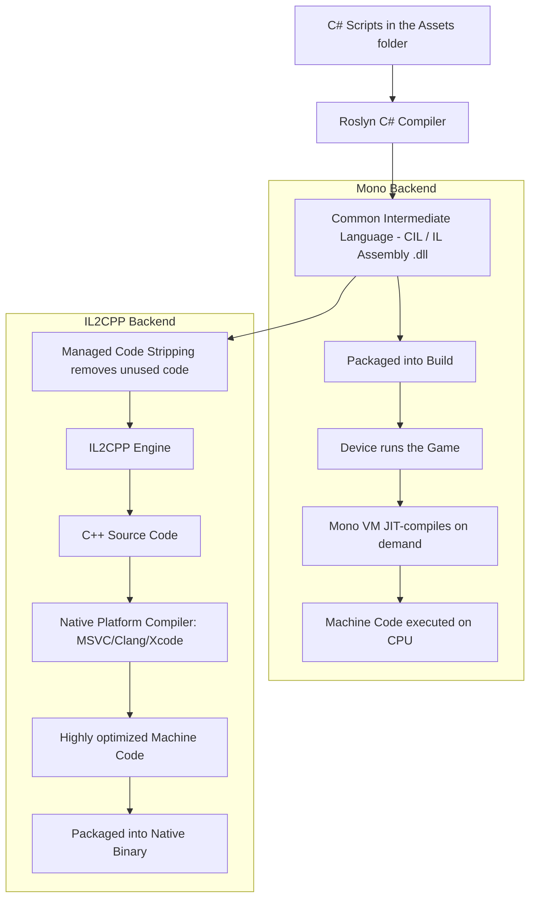

# Platform Development

> 📖 **Source:** Compiled and curated from the [Unity Manual — Platform Development](https://docs.unity3d.com/Manual/PlatformSpecific.html), based on Unity 6.4 (LTS).

---

## 🎯 Intent

The goal of this chapter is to provide the most detailed and comprehensive view of how the cross-platform development system works in **Unity 6.4 (LTS)**. Developers will gain a deep understanding of the code compilation mechanism (JIT vs AOT), the fundamental difference between the two scripting backends **Mono** and **IL2CPP**, the **Code Stripping** mechanism for memory optimization, and how to use **Conditional Compilation** directives to write optimized code for each specific device (such as Android, iOS, WebGL).

---

## 🔑 Core Concepts & True Nature

### 1. Scripting Backends: Mono vs IL2CPP

When building a game in Unity, your C# code does not run directly on the device's hardware. Instead, it is translated through one of two compilation "backends" (Scripting Backends):

#### A. Mono (Just-In-Time - JIT Compilation)
*   **Nature:** Unity's Roslyn compiler translates C# code into the intermediate **Common Intermediate Language (CIL/IL)** and packages it into `.dll` files. When the game runs on the device, a Mono Virtual Machine reads this IL code and compiles it into machine code matching the CPU at runtime.
*   **Advantages:** Extremely fast build times because it only needs to generate IL `.dll` files. Very useful during development and rapid iteration/testing.
*   **Disadvantages:** Slower runtime performance because the CPU must both run the game and compile the CIL code into machine code. In addition, `.dll` files are very easy to decompile, exposing the original source code.
*   **Supported platforms:** Mainly used in the Editor environment and test builds on PC/Stand-alone. Not supported on iOS and some Console devices.

#### B. IL2CPP (Ahead-Of-Time - AOT Compilation)
*   **Nature:** Compilation happens in several major steps before the game is packaged:
    1. The Roslyn compiler compiles the C# code into intermediate IL.
    2. Unity's **IL2CPP** tool converts all of that IL code into **C++** source code.
    3. This C++ code is then compiled by a native C++ compiler for the target platform (for example, MSVC on Windows, Xcode Clang on iOS, Clang on Android) to produce highly optimized native machine code.
*   **Advantages:**
    *   **Superior performance:** Code runs significantly faster because it is deeply optimized by modern C++ compilers.
    *   **Very high security:** Very hard to decompile because all the C# logic has been turned into complex C++ binary machine code.
    *   **Platform compliance:** It is mandatory for iOS (Apple prohibits executing JIT code), WebGL, and Console platforms (Sony PlayStation, Nintendo Switch, Microsoft Xbox).
*   **Disadvantages:** Very slow build times because it must go through many complex cross-compilation steps via C++.

```
Mono compilation:   [C# Code] ──Roslyn──> [IL (.dll)] ──Mono VM (Runtime)──> [Machine Code]
IL2CPP compilation: [C# Code] ──Roslyn──> [IL] ──IL2CPP──> [C++ Code] ──Native Compiler──> [Machine Code]
```

---

### 2. The Code Stripping mechanism

When using IL2CPP, Unity enables the **Managed Code Stripping** feature to reduce the size of the final binary.
*   **How it works:** The compiler performs Static Analysis of all your code, starting from the `MonoBehaviour` classes referenced in the Scene and the scripts. It finds and removes every class, method, and struct in Unity's libraries or third-party packages that you never call in your code.
*   **The Reflection problem:** If you call a function or instantiate a class indirectly through a string (**Reflection** — for example, `Type.GetType("MyNamespace.MyClass")`), Unity's static analyzer will mistakenly assume that class is unused and automatically strip it out. As a result, the game will crash on the real device with a `TypeLoadException` or `MissingMethodException`.
*   **Solution (the `link.xml` file):** To protect code that uses Reflection, you must create an XML file named `link.xml` placed in the `Assets/` folder to declare to Unity that those specific classes or assemblies must not be stripped.

---

### 3. Distinguishing compilation directives (#if) from runtime checks (Application.platform)

When writing cross-platform code, distinguishing how the compiler handles these two mechanisms is critical:

*   **Platform-Conditional Compilation (Preprocessor Directives):**
    ```csharp
    #if UNITY_ANDROID
        // This code block is ONLY compiled when the target is Android.
        // On other platforms (such as iOS, PC), the compiler completely SKIPS this block.
        // The resulting Assembly build contains no byte code from this block at all.
    #endif
    ```
    *Nature:* Happens at compile time. Very safe when using libraries or APIs specific to one operating system (for example, `UnityEngine.Android`), with no risk of build errors from missing libraries on another operating system.

*   **Runtime Platform Checks:**
    ```csharp
    if (Application.platform == RuntimePlatform.Android)
    {
        // This entire code block IS STILL compiled into the final game file on ALL platforms.
        // Only when the game runs does the CPU evaluate the if condition expression.
    }
    ```
    *Nature:* Happens at runtime. If the block calls Android-exclusive APIs, the game will immediately produce a **Compilation Error** the moment you switch the Target Build to iOS/Windows, because the compiler on iOS cannot find the definition of that Android library.

---

## 🎨 Structure or Lifecycle

Below is a detailed compilation-flow diagram of a Unity project depending on whether the Scripting Backend chosen is Mono or IL2CPP:



---

## 💻 C# Scripting API (C# Example)

Below is a real-world platform management script (`PlatformManager.cs`) that demonstrates how to use conditional compilation directives (`#if`) to call OS-specific system APIs on Android and iOS (such as handling the Back button on Android, requesting an app rating, configuring the frame rate, and quitting the app safely in compliance with Apple Store / Google Play guidelines).

```csharp
using UnityEngine;

#if UNITY_IOS
using UnityEngine.iOS; // Namespace exists only in the iOS build environment
#elif UNITY_ANDROID
using UnityEngine.Android; // Namespace exists only in the Android build environment
#endif

public class PlatformManager : MonoBehaviour
{
    private void Start()
    {
        ConfigurePlatformSettings();
    }

    private void Update()
    {
        HandlePlatformInputs();
    }

    /// <summary>
    /// Configures platform-specific system settings when the game starts up.
    /// </summary>
    private void ConfigurePlatformSettings()
    {
        // 1. Configure the Frame Rate
        #if UNITY_IOS || UNITY_ANDROID
            // On mobile devices, cap the FPS at 60 to avoid draining the battery and overheating
            Application.targetFrameRate = 60;
            Debug.Log("[PlatformManager] Mobile Platform detected. Framerate capped to 60 FPS.");
        #elif UNITY_STANDALONE
            // On PC, do not limit the FPS (or run at the display's refresh rate)
            Application.targetFrameRate = -1;
            Debug.Log("[PlatformManager] Standalone PC Platform detected. Uncapped Framerate.");
        #elif UNITY_WEBGL
            // WebGL relies on the browser's VSync mechanism
            Application.targetFrameRate = 30;
            Debug.Log("[PlatformManager] WebGL Platform detected. Framerate managed by browser.");
        #endif

        // 2. Request platform-specific permissions
        #if UNITY_ANDROID
            // Example: Check and request the Camera capture permission on Android
            if (!Permission.HasUserAuthorizedPermission(Permission.Camera))
            {
                Permission.RequestUserPermission(Permission.Camera);
            }
        #elif UNITY_IOS
            // On iOS, you can configure features such as disabling iCloud backup for certain temporary files
            Device.SetNoBackupFlag(Application.persistentDataPath);
        #endif
    }

    /// <summary>
    /// Handles platform-specific physical key presses or system events while the game is running.
    /// </summary>
    private void HandlePlatformInputs()
    {
        #if UNITY_ANDROID
            // On Android, the Escape key (or the Back button on the navigation bar) acts as a back-to-menu / quit-game button
            if (Input.GetKeyDown(KeyCode.Escape))
            {
                Debug.Log("[PlatformManager] Android Escape/Back button pressed.");
                TriggerExitConfirmation();
            }
        #elif UNITY_STANDALONE
            // On PC, quit the game quickly with Alt + F4 or the Escape key
            if (Input.GetKeyDown(KeyCode.Escape))
            {
                QuitGameGracefully();
            }
        #endif
    }

    /// <summary>
    /// Displays the quit-game confirmation dialog (Mobile-specific).
    /// </summary>
    private void TriggerExitConfirmation()
    {
        // Here you can show a quit-confirmation UI.
        // If the player presses "Confirm", we call the quit function:
        QuitGameGracefully();
    }

    /// <summary>
    /// A quit-game function designed safely for each platform to avoid publication rejection.
    /// </summary>
    public void QuitGameGracefully()
    {
        Debug.Log("[PlatformManager] Attempting to quit application...");

        #if UNITY_EDITOR
            // In the Editor, simply stop Play Mode
            UnityEditor.EditorApplication.isPlaying = false;
        #elif UNITY_ANDROID
            // On Android, calling the quit function directly is allowed
            Application.Quit();
        #elif UNITY_IOS
            // EXTREMELY IMPORTANT WARNING:
            // Apple strictly forbids quitting the app programmatically (calling Application.Quit() on iOS will cause the game to crash unexpectedly,
            // and the Apple App Store will reject the game immediately for violating the iOS Human Interface Guidelines).
            // The correct approach: Do not provide a "Quit Game" button in the iOS UI, or only show a message instructing the user to press the physical Home button.
            Debug.LogWarning("[PlatformManager] iOS does not allow programmatic quitting. Inform the player to use Home button instead.");
        #else
            // Other Standalone PC platforms quit normally
            Application.Quit();
        #endif
    }

    /// <summary>
    /// Calls the proper App Rating request API.
    /// </summary>
    public void RequestAppRating()
    {
        #if UNITY_IOS
            // Call Apple's native Store Rating API
            Device.RequestStoreReview();
            Debug.Log("[PlatformManager] Requested iOS Store Review Dialog.");
        #elif UNITY_ANDROID
            // On Android, this requires using the Google Play In-App Review API via an additional Package
            Debug.Log("[PlatformManager] Google Play Review requires Google Play Core Library integration.");
        #else
            Debug.Log("[PlatformManager] App rating is not supported on this platform.");
        #endif
    }
}
```

---

## ⚙️ Best Practices & Implementation Steps

1. **Use `#if` for exclusive APIs**: Always use the `#if UNITY_ANDROID` or `#if UNITY_IOS` preprocessor for any namespace, class, or method that exists only on that operating system, to avoid cross-compilation build errors.
2. **Set up a `link.xml` file to protect Reflection**: If the project uses data serialization libraries (such as Newtonsoft.Json, Protocol Buffers) or Dependency Injection frameworks (such as Zenject), always create a `link.xml` file at the `Assets/` root to declare the assemblies that must be preserved, so IL2CPP Code Stripping does not remove them by mistake.
3. **Manage custom define symbols**: Use the `Project Settings -> Player -> Scripting Define Symbols` panel to create your own custom flags (for example, `ENABLE_LOGS`, `CHEATS_ENABLED`, `BETA_BUILD`), making it easier to toggle features across different builds.
4. **Separate Editor code from Runtime code**: Classes in the `UnityEditor` namespace only work inside the Unity Editor. Place all Editor scripts in a folder named `Editor/` or wrap them in `#if UNITY_EDITOR`; otherwise the final game build will fail.
5. **Prefer IL2CPP for official releases**: Although Mono enables fast iteration during development, always switch to IL2CPP for the Release Build to optimize CPU performance and comply with the security policies of the app stores.

---
> 📚 **Source:** Content referenced from the [Unity Documentation](https://docs.unity3d.com/Manual/index.html) — Copyright Unity Technologies.

| Direction | Link |
|-------|----------|
| ← Back | [Unity Roadmap Overview](../../00-unity-overview.md) |
| → Next | [GameObjects & Components (Next)](../../01-Manual/10-GameObjects/00-gameobjects-overview.md) |
