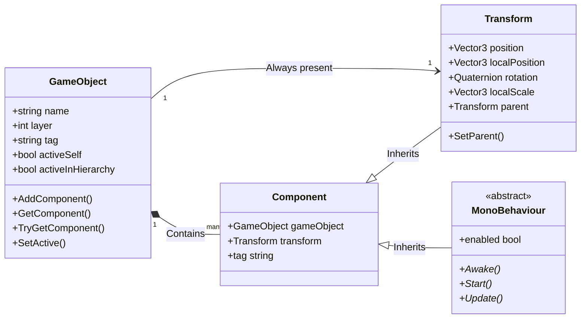

# GameObjects & Components

> 📖 **Source:** Compiled and curated from the [Unity Manual — GameObjects](https://docs.unity3d.com/Manual/GameObjects.html), based on Unity 6.4 (LTS).

---

## 🎯 Intent

The goal of this chapter is to dig into the architectural nature of the **GameObject** and the **Component** — the core foundation of the Entity-Component design model in Unity. Developers will understand the binary split between the C# shell (Managed Layer) and the C++ core (Native Layer), decode the performance cost of the physical Null check (`== null`), and master optimal C# techniques for spawning, parenting, and managing the object lifecycle.

---

## 🔑 Core Concepts & True Nature

### 1. The Entity-Component model in Unity

Unlike traditional OOP models based on deep inheritance, Unity uses the **Composition** model:
*   **GameObject (Entity):** In essence, it is just an empty container. It serves as a unique identifier (ID) and holds a list of Components. A GameObject has no behavior or graphics data of its own, except for the one mandatory minimal component, the **Transform** (which manages position, rotation, and scale).
*   **Component (Behavior & Data):** These are the functional blocks attached to a GameObject. For example, `MeshFilter` holds geometry data, `MeshRenderer` is responsible for drawing the shape to the screen, `Rigidbody` holds physics parameters, and `MonoBehaviour` (your script) controls the game logic.

---

### 2. The C# (Managed) vs C++ (Native) boundary

One of the biggest secrets affecting Unity performance lies at the boundary between two managed environments:

```
[ C# Managed Layer (Managed Heap) ]        [ C++ Engine Native Layer (Native Memory) ]
┌───────────────────────────────┐          ┌───────────────────────────────────┐
│ GameObject Wrapper (C# Object)│ ───────> │  Native GameObject (C++ Instance) │
│ - Holds only an IntPtr ptr ───┼──────────┼─> - Actual data                   │
│ - Overridden == Operator      │          │  - Binary Component list          │
└───────────────────────────────┘          └───────────────────────────────────┘
                                C# / C++ boundary
```

*   **Nature:** The core of the Unity Engine (graphics, physics, audio, memory management) is written entirely in **C++**. When you create a GameObject or Component in C#, you actually only create a super-lightweight C# object that acts as a "shell" (**Wrapper**). Inside this shell there is only a pointer (`IntPtr`) pointing to the actual C++ object that lives in Native Memory.
*   **Performance consequence:** Every time you access a property from C# (for example, `transform.position` or `gameObject.name`), Unity must perform a data transfer across the C#/C++ boundary (called **Marshalling** or the **Interop/Native-to-Managed Transition**). This transfer consumes considerably more CPU cycles than reading an ordinary C# variable.

---

### 3. The nature of the Null check (`== null`) in Unity

In standard C#, the check `myObject == null` is extremely fast because it only checks whether the memory pointer on the Managed Heap points to `null`. However, for objects that inherit from `UnityEngine.Object` (GameObject, Component, ScriptableObject), Unity has **overridden** the `==` operator.

*   **Why is the `==` operator overridden?**
    When you call `Destroy(gameObject)`, Unity immediately frees the C++ object in Native Memory to release graphics/physics resources right away. However, the C# Garbage Collector does not clean up the C# shell immediately — it must wait until the next garbage collection cycle. At this point, the C# shell still exists but the underlying C++ object has already been destroyed.
*   **How it works:** Unity's `myComponent == null` comparison performs:
    1. A check of whether the C# wrapper object is really null.
    2. If not null, it calls down to the native C++ layer to check whether the corresponding C++ object has already been destroyed.
*   **Consequence:** This call down to the native layer incurs a significant performance cost. If you write `if (myComponent == null)` thousands of times per frame in continuously running update functions (`Update()`), the game will suffer a noticeable FPS drop.
*   **Optimization tips:**
    *   Use the system comparison `System.Object.ReferenceEquals(myComponent, null)` if you only want to check whether the C# variable has been initialized (this does not detect a Native object that has been `Destroy`ed).
    *   Use the modern C# type-check operator `if (myComponent is null)` to skip the call into C++ (it only checks the C# variable).

---

### 4. Spawning & Hierarchy mechanics (Instantiate, Parent, Active State)

*   **`Instantiate`:** Copies an existing Prefab or GameObject. This is an extremely expensive operation because Unity must:
    1. Allocate memory in both the C++ and C# regions.
    2. Read and parse the Prefab's structural data (YAML/Binary).
    3. Register the object with the Scene, Physics, and Render management systems.
*   **Parenting (`transform.SetParent`):**
    When you change a GameObject's parent with `transform.SetParent(parent, worldPositionStays)`:
    *   If `worldPositionStays` is `true` (the default), Unity must recompute the child's Transform matrix (Local Position, Rotation, Scale) based on the new parent's Transform matrix in order to keep its physical position in world space unchanged. This matrix computation is very performance-heavy for deep hierarchies.
*   **Active State (`SetActive` vs `enabled`):**
    *   `SetActive(bool)`: Enables/disables the entire GameObject. When you call `SetActive(false)`, Unity recursively disables all Components inside it and all child GameObjects. This triggers a cascade of lifecycle functions (`OnDisable`) and forces the Physics/Render systems to restructure their data.
    *   `enabled = bool`: Only enables/disables a specific Component (such as `MeshRenderer` or a Custom Script). The GameObject and its other components continue to work normally. Using `enabled` is far more performant than `SetActive`.

---

## 🎨 Structure or Lifecycle

The diagram describes the hierarchical relationship between a GameObject and its basic Components:



---

## 💻 C# Scripting API (C# Example)

The script below (`GameObjectSpawner.cs`) demonstrates professional GameObject management: creating new objects, setting up a parent-child hierarchy with `SetParent`, using the optimized component-query method `TryGetComponent` instead of `GetComponent`, managing the active state, and benchmarking Null Check performance.

```csharp
using System.Diagnostics;
using UnityEngine;

public class GameObjectSpawner : MonoBehaviour
{
    [Header("Prefab Configuration")]
    [SerializeField] private GameObject cubePrefab;
    [SerializeField] private int spawnCount = 10;

    [Header("Hierarchy Settings")]
    [SerializeField] private Transform spawnRoot;

    private GameObject[] spawnedObjects;

    private void Start()
    {
        spawnedObjects = new GameObject[spawnCount];
        SpawnAndSetupHierarchy();
        TestNullCheckPerformance();
    }

    /// <summary>
    /// Spawns objects, manages the hierarchy, and adds/retrieves components optimally.
    /// </summary>
    private void SpawnAndSetupHierarchy()
    {
        if (cubePrefab == null)
        {
            UnityEngine.Debug.LogError("[Spawner] Cube Prefab is null! Cannot spawn.");
            return;
        }

        for (int i = 0; i < spawnCount; i++)
        {
            // 1. Create a random position
            Vector3 randomPos = new Vector3(i * 2.0f, 0, 0);

            // 2. Instantiate the object (keep the world position on creation)
            GameObject newCube = Instantiate(cubePrefab, randomPos, Quaternion.identity);
            newCube.name = $"Procedural_Cube_{i}";

            // 3. Set up the hierarchy (Parenting)
            if (spawnRoot != null)
            {
                // worldPositionStays = true: Keep the world coordinates (only recompute the local transform)
                // worldPositionStays = false: Turn the Cube's world coordinates into local coordinates relative to the Parent
                newCube.transform.SetParent(spawnRoot, true);
            }

            // 4. Retrieve the Component using TryGetComponent (does not generate memory garbage)
            // Instead of using: Rigidbody rb = newCube.GetComponent<Rigidbody>(); (generates Garbage if the component does not exist)
            if (newCube.TryGetComponent<Rigidbody>(out Rigidbody rb))
            {
                rb.useGravity = false;
                rb.isKinematic = true;
            }
            else
            {
                // If absent, proactively add a new one
                Rigidbody addedRb = newCube.AddComponent<Rigidbody>();
                addedRb.useGravity = true;
                addedRb.isKinematic = false;
                UnityEngine.Debug.Log($"[Spawner] Added Rigidbody dynamically to {newCube.name}");
            }

            // 5. Store it in the managed list
            spawnedObjects[i] = newCube;
        }
    }

    /// <summary>
    /// Enables/disables the entire list of procedural objects.
    /// </summary>
    public void ToggleObjectsState(bool isActive)
    {
        if (spawnedObjects == null) return;

        foreach (GameObject obj in spawnedObjects)
        {
            if (obj != null)
            {
                // SetActive(false) disables the entire GameObject along with its attached scripts
                obj.SetActive(isActive);
            }
        }
    }

    /// <summary>
    /// Evaluates the performance difference between Unity's standard Null comparison and a System Reference Check.
    /// </summary>
    private void TestNullCheckPerformance()
    {
        if (spawnedObjects == null || spawnedObjects.Length == 0) return;
        GameObject testTarget = spawnedObjects[0];

        int iterations = 100000;
        Stopwatch sw = new Stopwatch();

        // Measure the time of Unity's Null check (overridden == operator)
        sw.Start();
        for (int i = 0; i < iterations; i++)
        {
            if (testTarget == null)
            {
                // Simulated execution
            }
        }
        sw.Stop();
        long unityNullTime = sw.ElapsedTicks;

        // Measure the time of the Null check using ReferenceEquals (skips the C++ bridge)
        sw.Reset();
        sw.Start();
        for (int i = 0; i < iterations; i++)
        {
            if (System.Object.ReferenceEquals(testTarget, null))
            {
                // Simulated execution
            }
        }
        sw.Stop();
        long systemNullTime = sw.ElapsedTicks;

        UnityEngine.Debug.Log($"[Spawner] Null check performance comparison ({iterations} iterations):");
        UnityEngine.Debug.Log($"-> Unity custom '== null': {unityNullTime} ticks (causes a C++/C# transition).");
        UnityEngine.Debug.Log($"-> System 'ReferenceEquals': {systemNullTime} ticks (runs only on C# Managed).");
        UnityEngine.Debug.Log($"-> Speed difference: {(float)unityNullTime / systemNullTime:F2}x.");
    }
}

---

## ⚙️ Best Practices & Implementation Steps

1. **Prefer `TryGetComponent`**: When checking for and retrieving a Component from another object, always use `TryGetComponent` instead of `GetComponent` to avoid generating garbage (Garbage Collection Allocation) when running in the Editor.
2. **Do not call `GetComponent` in frequent loops**: Absolutely avoid calling `GetComponent` or doing a Null comparison with the `==` operator inside `Update()` or `FixedUpdate()`. Cache references in `Awake()` or `Start()` instead.
3. **Avoid deep re-parenting (`SetParent`) at runtime**: Minimize calls to `transform.SetParent` on GameObjects with deep hierarchy trees during play, in order to reduce the computational load of recalculating the transform and world matrices.
4. **Apply the Object Pooling pattern**: For entities that are continuously spawned/destroyed (such as bullet shells, explosion effects, small enemies), use an Object Pool solution (using the built-in `UnityEngine.Pool` library available since Unity 2021+) to reuse objects instead of repeatedly calling `Instantiate` and `Destroy`.
5. **Prefer disabling the component (`enabled = false`)**: If you only want to hide a model or stop the logic of a single object, disable the corresponding `Renderer` component or script instead of disabling the entire GameObject with `SetActive(false)`. This avoids triggering the recursive enable/disable cascade across the whole child hierarchy.

---
> 📚 **Source:** Content referenced from the [Unity Documentation](https://docs.unity3d.com/Manual/index.html) — Copyright Unity Technologies.

| Direction | Link |
|-------|----------|
| ← Back | [Platform Development (Back)](../../01-Manual/09-Platform-Dev/00-platform-dev-overview.md) |
| → Next | [Scenes (Next)](../../01-Manual/11-Scenes/00-scenes-overview.md) |
