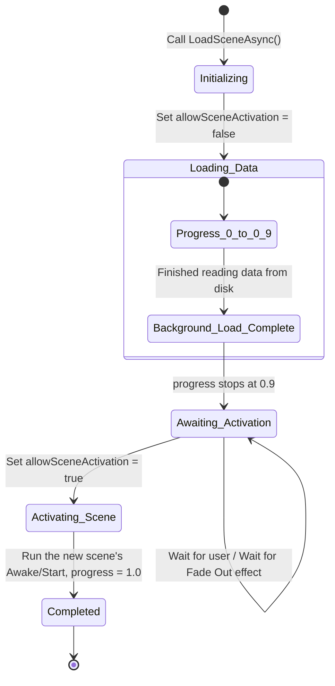

# Scenes & Scene Management

> 📖 **Source:** Compiled and curated from the [Unity Manual — Scenes](https://docs.unity3d.com/Manual/CreatingScenes.html), based on Unity 6.4 (LTS).

---

## 🎯 Intent

The goal of this chapter is to provide in-depth knowledge of how the Scene management system works in **Unity 6.4 (LTS)**. Developers will master the difference between the data-overwriting load mechanism (**Single Mode**) and the stacked load mechanism (**Additive Mode**), understand the non-blocking **Asynchronous Loading** mechanism, learn how to keep global manager objects alive across scenes with `DontDestroyOnLoad`, and learn how to program a smooth loading-screen manager.

---

## 🔑 Core Concepts & True Nature

### 1. The nature of a Scene in Unity

Physically on disk, a Scene (a `.unity` file) is actually a text file in YAML format (if Force Text Serialization is enabled). This file stores the sequential hierarchical list of all GameObjects, their accompanying Components, and that scene's own lighting parameters (Lighting Settings) and fog parameters (RenderSettings).
*   When you load a Scene, the Unity Engine reads this file, parses it, allocates native C++ memory, and creates the corresponding objects in RAM.

---

### 2. Comparing scene load modes: Single vs Additive

Unity provides two scene load modes through the `LoadSceneMode` enum:

#### A. Single Mode (`LoadSceneMode.Single`)
*   **Nature:** Unity frees all resources, destroys all GameObjects in all previously open scenes, releases RAM (triggering the C# Garbage Collector), and only then loads the new scene.
*   **Problem:** Because it must mass-clean and load anew at the same time, the game often freezes (stutters) for an instant. Not suitable for open-world games or games that need smooth scene transitions.

#### B. Additive Mode (`LoadSceneMode.Additive`)
*   **Nature:** Unity loads the new scene and stacks it into the current management hierarchy **without touching or destroying** the running scenes.
*   **Applications:** 
    *   **Open World Streaming:** Divide the game world into regions (Grid/Chunks). As the player moves, the game automatically loads the new region and unloads the regions behind them without interrupting gameplay.
    *   **UI Separation:** Keep a UI scene running independently and continuously in Additive mode, while the Gameplay scene can be loaded/unloaded underneath.

---

### 3. The Asynchronous Loading mechanism

When you call `SceneManager.LoadScene`, Unity's Main Thread is blocked to focus on reading data from disk and initializing objects. The game freezes completely until loading finishes.

To solve this problem, Unity provides an asynchronous method:
`SceneManager.LoadSceneAsync(string sceneName, LoadSceneMode mode)`
*   **Nature:** Unity creates a background task on a Worker Thread to read data from disk and prepare it. The game's main thread keeps running normally at 60 FPS (or more), letting you display a smooth loading spinner or progress bar.
*   **The `AsyncOperation` progress lifecycle:**
    *   `progress`: Returns the progress value from `0.0` to `1.0`.
    *   **Special note:** While the scene is loading, the `progress` property only runs from `0.0` to **`0.9`**. At `0.9`, Unity has loaded all the data into a temporary buffer but has **not yet activated** the scene for display. It will wait there.
    *   `allowSceneActivation`: If this property is set to `false`, Unity keeps the scene in a pending-activation state (holding `progress` at `0.9`). When you change it to `true`, Unity completes the remaining 10% (activating the scene, running the new scene's `Awake` functions) and moves `progress` to `1.0`, officially transitioning the scene.

---

### 4. DontDestroyOnLoad & the duplicate Singleton trap

When you use `DontDestroyOnLoad(gameObject)`, you are asking Unity to move that GameObject into a special internal scene called the **`DontDestroyOnLoad Scene`**. This scene is not affected by the cleanup of `LoadSceneMode.Single`.

*   **The duplicate Manager problem:**
    Suppose you have a `GameManager` placed in Scene 1. When Scene 1 loads for the first time, the `GameManager` is initialized and moved into the `DontDestroyOnLoad` region. When the player finishes, returns to the main Menu, then presses Start again to reload Scene 1, Unity will instantiate a second `GameManager` because Scene 1 already contains a `GameManager` in its design file. You will then have 2 GameManagers running in parallel, causing serious logic conflicts.
*   **Solution:** Apply the idiomatic **Singleton** pattern: check for an existing instance in `Awake()` and immediately destroy the newly spawned instance if an older one already exists in memory.

---

## 🎨 Structure or Lifecycle

State diagram of the asynchronous scene-loading process with the `allowSceneActivation` activation lock:



---

## 💻 C# Scripting API (C# Example)

Below is a complete script (`SceneLoader.cs`) used to manage scene transitions. This script handles asynchronous loading, computes a smooth display percentage from `0` to `100%` by normalizing Unity's `0.0 - 0.9` progress range, and supports a smooth transition effect before activating the new Scene.

```csharp
using System.Collections;
using UnityEngine;
using UnityEngine.SceneManagement;
using UnityEngine.UI;

public class SceneLoader : MonoBehaviour
{
    // Apply the Singleton pattern for easy access from any script
    public static SceneLoader Instance { get; private set; }

    [Header("UI Components")]
    [SerializeField] private GameObject loadingScreenCanvas;
    [SerializeField] private Slider progressBar;
    [SerializeField] private TMPro.TextMeshProUGUI progressText;
    [SerializeField] private TMPro.TextMeshProUGUI promptText;

    [Header("Settings")]
    [SerializeField] private float minLoadingTime = 1.5f; // Minimum loading display time to avoid screen flicker
    [SerializeField] private CanvasGroup fadeCanvasGroup;
    [SerializeField] private float fadeDuration = 0.5f;

    private void Awake()
    {
        // Proper Singleton management to avoid duplicates when returning to an old Scene
        if (Instance != null && Instance != this)
        {
            Destroy(gameObject);
            return;
        }

        Instance = this;
        DontDestroyOnLoad(gameObject); // Keep this loading manager alive throughout the game

        // Make sure the loading screen is hidden initially
        if (loadingScreenCanvas != null)
        {
            loadingScreenCanvas.SetActive(false);
        }
        
        if (fadeCanvasGroup != null)
        {
            fadeCanvasGroup.alpha = 0f;
        }
    }

    /// <summary>
    /// Public API to trigger asynchronous scene loading from other scripts.
    /// </summary>
    /// <param name="sceneName">The exact name of the Scene to load (must be in Build Settings)</param>
    public void LoadSceneAsync(string sceneName)
    {
        StartCoroutine(LoadSceneCoroutine(sceneName));
    }

    private IEnumerator LoadSceneCoroutine(string sceneName)
    {
        if (loadingScreenCanvas == null)
        {
            Debug.LogError("[SceneLoader] Loading Screen Canvas is not assigned!");
            yield break;
        }

        // 1. Activate the loading screen and reset the parameters
        loadingScreenCanvas.SetActive(true);
        if (progressBar != null) progressBar.value = 0f;
        if (progressText != null) progressText.text = "0%";
        if (promptText != null) promptText.gameObject.SetActive(false);

        // 2. Play the Fade In effect for the black/loading screen
        if (fadeCanvasGroup != null)
        {
            yield return StartCoroutine(FadeCanvas(0f, 1f));
        }

        // 3. Start the background asynchronous scene-loading task
        AsyncOperation asyncLoad = SceneManager.LoadSceneAsync(sceneName, LoadSceneMode.Single);
        
        // Extremely important: Prevent the scene from auto-activating as soon as loading finishes
        asyncLoad.allowSceneActivation = false;

        float elapsedTime = 0f;

        // 4. Loop that updates the loading progress
        while (!asyncLoad.isDone)
        {
            elapsedTime += Time.unscaledDeltaTime; // Use unscaledDeltaTime in case the game is paused (timeScale = 0)

            // Unity's actual progress runs from 0 to 0.9 while not yet activated
            // We normalize this value to the 0.0 to 1.0 range
            float rawProgress = Mathf.Clamp01(asyncLoad.progress / 0.9f);
            
            // Compute a smooth display progress based on the minimum elapsed time (Visual Padding)
            float visualProgress = Mathf.Min(rawProgress, elapsedTime / minLoadingTime);

            if (progressBar != null)
            {
                progressBar.value = visualProgress;
            }

            if (progressText != null)
            {
                progressText.text = $"{(visualProgress * 100f):F0}%";
            }

            // When both the actual progress and the visual display progress reach their maximum (100% / 1.0)
            if (asyncLoad.progress >= 0.9f && visualProgress >= 1.0f)
            {
                if (promptText != null)
                {
                    promptText.gameObject.SetActive(true);
                    promptText.text = "Press any key to continue...";
                }

                // Wait for the player to press a key to officially transition the scene
                if (Input.anyKeyDown)
                {
                    // 5. Allow the scene to activate
                    asyncLoad.allowSceneActivation = true;
                }
            }

            yield return null;
        }

        // 6. Play the Fade Out effect for the black screen after the new scene is displayed
        if (fadeCanvasGroup != null)
        {
            yield return StartCoroutine(FadeCanvas(1f, 0f));
        }

        // 7. Disable the loading canvas to return to the gameplay screen
        loadingScreenCanvas.SetActive(false);
    }

    /// <summary>
    /// Helper coroutine for the fade effect using CanvasGroup.
    /// </summary>
    private IEnumerator FadeCanvas(float startAlpha, float endAlpha)
    {
        float timer = 0f;
        while (timer < fadeDuration)
        {
            timer += Time.unscaledDeltaTime;
            fadeCanvasGroup.alpha = Mathf.Lerp(startAlpha, endAlpha, timer / fadeDuration);
            yield return null;
        }
        fadeCanvasGroup.alpha = endAlpha;
    }
}

---

## ⚙️ Best Practices & Implementation Steps

1. **Always use Asynchronous Loading (`LoadSceneAsync`)**: For any gameplay scene beyond a super-lightweight main Menu screen, always use asynchronous loading to avoid freezing the main graphics processing thread.
2. **Unsubscribe events to avoid memory leaks**: When switching scenes in `Single` mode, make sure you have unsubscribed (`-=`) from all C# Events or Actions linked to static objects or to Managers living in the `DontDestroyOnLoad` region. Otherwise, the old scene's objects cannot be cleaned up by the Garbage Collector, leading to a RAM leak.
3. **Manage Singletons strictly**: Make sure every Manager that uses `DontDestroyOnLoad` destroys its own duplicate in `Awake()`, avoiding the endless accumulation of object instances as the player keeps switching back and forth between scenes.
4. **Additive Scene architecture (Additive UI)**: Design gameplay scenes in a modular way: a separate UI HUD scene, a separate lighting system scene, a separate Level scene, and load them stacked with `LoadSceneMode.Additive` for easier maintenance and reuse.
5. **Synchronize scene activation with visual transitions**: Set `allowSceneActivation = false` when loading the scene in the background to wait for the transition effect (such as a screen fading to black or a slow camera pan) to finish gracefully, then set it back to `true` for the most cinematic, smooth experience.

---
> 📚 **Source:** Content referenced from the [Unity Documentation](https://docs.unity3d.com/Manual/index.html) — Copyright Unity Technologies.

| Direction | Link |
|-------|----------|
| ← Back | [GameObjects & Components (Back)](../../01-Manual/10-GameObjects/00-gameobjects-overview.md) |
| → Next | [Cameras (Next)](../../01-Manual/12-Cameras/00-cameras-overview.md) |
