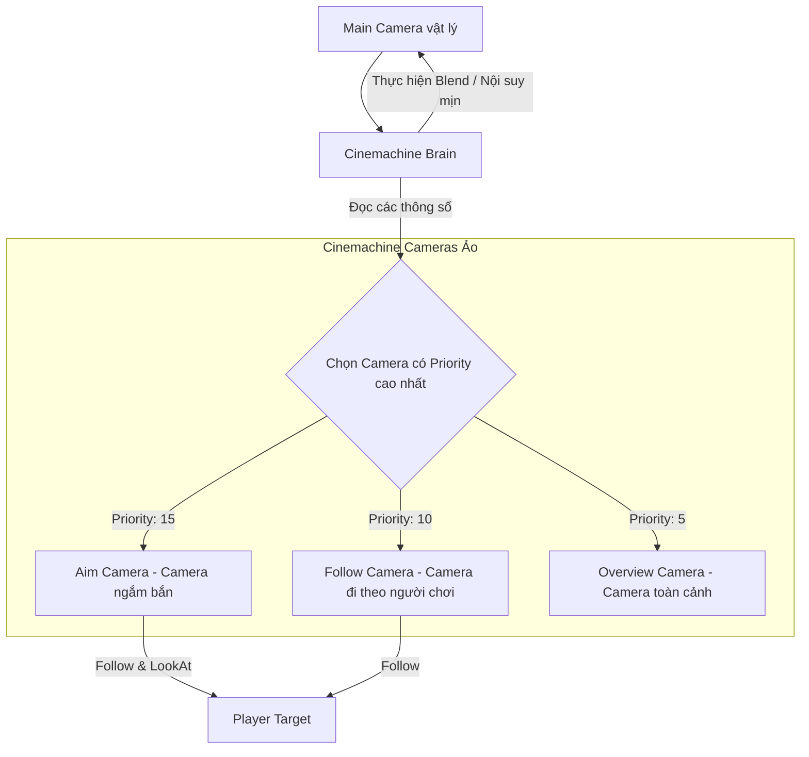

# Cameras & Cinemachine

> 📖 **Source:** Compiled and curated from the [Unity Manual — Cameras](https://docs.unity3d.com/Manual/CamerasOverview.html) and the Cinemachine v3 Documentation, based on Unity 6.4 (LTS).

---

## 🎯 Intent

The goal of this chapter is to explain in detail the technical nature of the Camera system in Unity and how to integrate the professional camera management toolset **Cinemachine** (version v3, integrated in Unity 6). Developers will master advanced rendering concepts such as the types of Projection, Viewport coordinates, the layer-filtering mechanism for rendered objects (**Culling Mask & Layers**), how the Cinemachine Brain orchestrates cameras, and how to drive dynamic camera targets based on game state through C# code.

---

## 🔑 Core Concepts & True Nature

### 1. How a Camera renders and the Z-Buffer boundary

A camera is the tool that converts the game world's 3D space (World Space) into 2D space on the player's screen (Screen Space). The two main projection modes are:
*   **Perspective Projection:** The viewing point converges to form a truncated pyramid (**Frustum**). Distant objects appear smaller than nearby ones. It is defined by the **Field of View (FOV)** angle.
*   **Orthographic Projection:** The viewing volume is a rectangular box. The distance from an object to the camera does not change its displayed size. Often used for 2D games or 3D games in an Isometric style. It is defined by the **Size** value.

#### Z-Fighting and Clipping Planes
*   **Near & Far Clipping Planes:** Define the minimum and maximum distance the camera can render.
*   **Nature:** Unity uses the **Z-Buffer** (Depth Buffer) to determine which object is in front and which is behind so they overlap correctly. The Z-Buffer has finite precision (typically 24-bit).
*   **Danger:** If you set the `Near Plane` too small (for example, `0.0001f`) or the `Far Plane` too large (for example, `100000f`), the Z-Buffer's precision becomes diluted. Objects that are very close together at a distance will experience **Z-Fighting** (the screen flickers constantly because the graphics card cannot tell which object is in front).

---

### 2. Viewport Coordinates

Viewport coordinates are normalized in the range from `(0, 0)` (bottom-left corner) to `(1, 1)` (top-right corner). By adjusting the camera's **Viewport Rect** property, you can split the screen:
*   **Split-Screen:** For 2-player local Co-op games on the same machine (set up 2 cameras with Viewport Rects of `(X:0, Y:0, W:0.5, H:1)` and `(X:0.5, Y:0, W:0.5, H:1)` respectively).
*   **Picture-in-Picture:** Show a small action camera in a corner of the screen (like a rear-view mirror in a racing game).

---

### 3. Culling Mask & Optimization

Each GameObject is assigned to a **Layer**. The camera uses the **Culling Mask** property to decide whether it renders the GameObjects on that Layer.
*   **Optimization:** 
    *   Disable Layers containing small objects and foliage for secondary cameras (such as a Minimap camera). This reduces the number of **Draw Calls** (render requests sent to the GPU), significantly boosting game performance.
    *   Use a secondary camera that renders only the player's first-person weapon (FPS Weapon Layer) on top of the main environment camera, to avoid the gun clipping through walls (Weapon Clipping).

---

### 4. The Cinemachine v3 architecture in Unity 6

In modern Unity versions, writing camera movement code manually is suboptimal. **Cinemachine** is the industry-standard solution that works on a data-separation model:

```
┌────────────────────────────────────────────────────────┐
│                   Cinemachine Brain                    │ (Gắn trên Main Camera vật lý)
└──────────────────────────┬─────────────────────────────┘
                           │ Đọc dữ liệu biến đổi
                           v
┌────────────────────────────────────────────────────────┐
│              Active Cinemachine Camera                 │ (Ảo - Không render trực tiếp)
│ - Cấu hình Ống kính (Lens)                             │
│ - Mục tiêu Theo dõi (Follow) và Nhìn vào (LookAt)      │
│ - Mức độ ưu tiên (Priority)                            │
└────────────────────────────────────────────────────────┘
```

*   **Cinemachine Brain:** Attached directly to Unity's physical Main Camera. It acts as the controlling "Brain," continuously tracking all Cinemachine Cameras in the Scene. It automatically interpolates the position/rotation (Blend) to move the Main Camera toward whichever Virtual Camera has the highest **Priority**.
*   **Cinemachine Camera (Virtual Camera):** These are super-lightweight virtual objects. They do not render data to the screen; they only store camera setup parameters (Follow target, LookAt target, Noise, Lens size).
*   *Unity 6 note:* As of Cinemachine v3 (Unity 6.4), the main object class is called **`CinemachineCamera`** (replacing the older v2 `CinemachineVirtualCamera`; the behavior is equivalent, but the component structure is more modular).

---

## 🎨 Structure or Lifecycle

The interaction-flow model between the Cinemachine Brain and the Cinemachine Cameras:



---

## 💻 C# Scripting API (C# Example)

The code below (`CameraStateController.cs`) uses the official **Cinemachine v3** API (`Unity.Cinemachine`) to manage dynamic camera switching based on the character's state (normal movement, aiming, focusing on a Boss).

```csharp
using UnityEngine;
using Unity.Cinemachine; // Namespace chính thức của Cinemachine v3 trong Unity 6

public enum CameraState
{
    DefaultFollow,
    Aiming,
    BossCutscene
}

public class CameraStateController : MonoBehaviour
{
    [Header("Cinemachine Cameras")]
    [SerializeField] private CinemachineCamera followCamera;
    [SerializeField] private CinemachineCamera aimCamera;
    [SerializeField] private CinemachineCamera bossFocusCamera;

    [Header("Targets")]
    [SerializeField] private Transform playerTransform;
    [SerializeField] private Transform bossTransform;

    private CinemachineCamera activeCamera;

    private void Start()
    {
        InitializeCameras();
    }

    /// <summary>
    /// Thiết lập ban đầu cho các camera ảo.
    /// </summary>
    private void InitializeCameras()
    {
        if (followCamera == null || aimCamera == null || bossFocusCamera == null)
        {
            Debug.LogError("[CameraController] One or more Cinemachine Cameras are not assigned!");
            return;
        }

        // Thiết lập theo dõi mục tiêu động thông qua mã nguồn
        followCamera.Follow = playerTransform;
        followCamera.LookAt = playerTransform;

        aimCamera.Follow = playerTransform;
        aimCamera.LookAt = playerTransform;

        bossFocusCamera.Follow = playerTransform;
        bossFocusCamera.LookAt = bossTransform; // Camera nhìn vào Boss nhưng đi theo Player

        // Khởi động với trạng thái mặc định
        SwitchCameraState(CameraState.DefaultFollow);
    }

    /// <summary>
    /// Thay đổi trạng thái camera bằng cách điều chỉnh trọng số Priority.
    /// Cinemachine Brain sẽ tự động chuyển đổi mượt mà đến camera có độ ưu tiên cao nhất.
    /// </summary>
    public void SwitchCameraState(CameraState newState)
    {
        // Đặt lại tất cả camera về mức ưu tiên thấp mặc định (ví dụ: 10)
        followCamera.Priority = 10;
        aimCamera.Priority = 10;
        bossFocusCamera.Priority = 10;

        switch (newState)
        {
            case CameraState.DefaultFollow:
                followCamera.Priority = 20; // Độ ưu tiên cao nhất sẽ được chọn làm Active Camera
                activeCamera = followCamera;
                Debug.Log("[CameraController] Switched to Default Follow Camera.");
                break;

            case CameraState.Aiming:
                aimCamera.Priority = 25; // Nâng mức ưu tiên cao hơn
                activeCamera = aimCamera;
                Debug.Log("[CameraController] Switched to Aiming Camera (Close-up / Over-the-shoulder).");
                break;

            case CameraState.BossCutscene:
                bossFocusCamera.Priority = 30; // Cắt cảnh hoặc tập trung Boss có độ ưu tiên cao tuyệt đối
                activeCamera = bossFocusCamera;
                Debug.Log("[CameraController] Switched to Boss Focus Camera.");
                break;
        }
    }

    /// <summary>
    /// API động để thay đổi mục tiêu theo dõi của camera hiện tại (ví dụ khi đổi nhân vật điều khiển).
    /// </summary>
    public void ChangeActiveCameraTarget(Transform newTarget)
    {
        if (activeCamera != null)
        {
            activeCamera.Follow = newTarget;
            activeCamera.LookAt = newTarget;
            Debug.Log($"[CameraController] Changed active camera target to {newTarget.name}");
        }
    }

    // Thử nghiệm nhanh chuyển đổi bằng phím bấm mẫu
    private void Update()
    {
        if (Input.GetKeyDown(KeyCode.Alpha1))
        {
            SwitchCameraState(CameraState.DefaultFollow);
        }
        else if (Input.GetKeyDown(KeyCode.Alpha2))
        {
            SwitchCameraState(CameraState.Aiming);
        }
        else if (Input.GetKeyDown(KeyCode.Alpha3))
        {
            SwitchCameraState(CameraState.BossCutscene);
        }
    }
}

---

## ⚙️ Best Practices & Implementation Steps

1. **Thoroughly prevent Z-Fighting**: Always keep a reasonable ratio between the `Near Clipping Plane` and the `Far Clipping Plane`. Never set Near too small (like `0.0001f`) and Far too large; start with `Near = 0.3f` and only increase Far just enough to cover the level's viewing distance.
2. **Follow the Cinemachine principle**: Once Cinemachine is integrated, let the Cinemachine Brain take full control of the Main Camera. Absolutely do not write scripts that directly change the Main Camera's `transform.position` or `transform.rotation`.
3. **Use the Culling Mask to optimize the GPU**: Set up secondary cameras (such as a rear-view mirror camera or a minimap camera) to render only the essential layers. Filtering out layers containing visual effects (VFX), foliage, and high-detail objects will significantly reduce the Draw Call count.
4. **Leverage the Cinemachine Target Group**: For fighting games or local Co-op games with multiple players on the same screen, use a `CinemachineTargetGroup` as the follow target. Cinemachine will automatically move and zoom the lens to keep all players within the frame.
5. **Avoid obstacles with a Cinemachine Obstacle Clip**: Always add a `Cinemachine Decollider` or `Cinemachine Collider` extension to a 3rd-person virtual camera to automatically push the camera forward when a wall obscures the character, preventing the camera from clipping through the map.

---
> 📚 **Source:** Content referenced from the [Unity Documentation](https://docs.unity3d.com/Manual/index.html) — Copyright Unity Technologies.

| Direction | Link |
|-------|----------|
| ← Back | [Scenes (Back)](../../01-Manual/11-Scenes/00-scenes-overview.md) |
| → Next | [World Building (Next)](../../01-Manual/13-World-Building/00-world-building-overview.md) |
