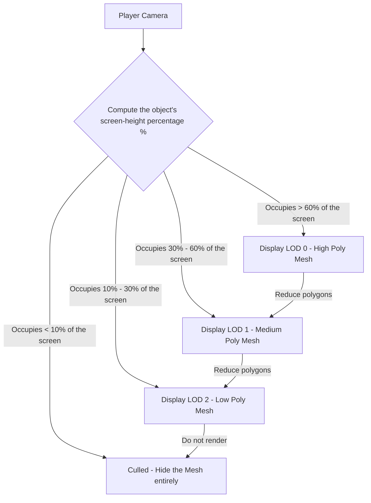

# World Building

> 📖 **Source:** Compiled and curated from the [Unity Manual — World Building](https://docs.unity3d.com/Manual/CreatingEnvironments.html), based on Unity 6.4 (LTS).

---

## 🎯 Intent

The goal of this chapter is to provide comprehensive knowledge of the Level Design tools in **Unity 6.4 (LTS)**. Developers and level designers will gain a deep understanding of the **Terrain** system, the rough-modeling tool **ProBuilder**, the static-environment graphics optimization mechanism via **Static Batching Flags**, the multi-distance detail system **LOD Group**, and how to write Editor extension tools (Editor Scripting) to automate level layout.

---

## 🔑 Core Concepts & True Nature

### 1. The world-design toolset in Unity 6

*   **Terrain System:** 
    *   *Nature:* Unity's terrain is built on a **Heightmap** database. The ground's elevation is stored as a 16-bit grayscale texture, where white corresponds to the highest point and black to the lowest.
    *   *Advantages:* The system automatically subdivides the terrain Mesh into small patches and applies a dynamic LOD mechanism (reducing polygon count far from the camera), optimizing memory and speeding up rendering for the graphics card.
*   **ProBuilder (fast 3D modeling):**
    *   *Nature:* Lets you build 3D models directly inside the Unity Editor. You can push and pull vertices, edges, and faces, bevel, extrude, and quickly lay out UVs.
    *   *Application:* Commonly used during the **Graybox** stage (building rough frames out of gray blocks to test gameplay before having finished art assets from the artists).
*   **3D Tilemap:**
    *   *Nature:* Uses a Grid to stack repeating 3D model blocks (Tiles). Helps build modular levels quickly.

---

### 2. Static world optimization: Static Flags & Batching

To build a vast world with tens of thousands of objects (such as houses, trees, pebbles) running smoothly at 60+ FPS, you must understand the **Batching** mechanism.

In the Inspector of every GameObject there is a checkbox named **Static**. When you click the arrow next to it, you will see various flags, especially **Batching Static**:
*   **Static Batching:**
    *   *How it works:* Before the game is packaged (Build Time) or when the game starts, Unity finds all GameObjects marked `Batching Static` that share the same Material. Unity automatically gathers their independent Meshes and merges them into a **single giant Mesh**.
    *   *Consequence:* Instead of sending hundreds of separate Draw Calls for each small object to the GPU, Unity only needs to send **a single Draw Call** for this giant Mesh.
    *   *Trade-off:* Static Batching consumes a lot of system RAM because it must create and store the new merged Mesh in memory, in parallel with keeping the original Meshes in the asset file.

---

### 3. The LOD Group system (Level of Detail)

The GPU will be overloaded if it has to process a 3D model with 100,000 polygons when that model is very far from the camera (occupying only 2 pixels on screen).

*   **The LOD Group solution:** The `LODGroup` component lets you link multiple Mesh versions of the same object with decreasing levels of detail:
    *   **LOD 0:** The full-detail original Mesh version (when the camera is extremely close).
    *   **LOD 1:** A polygon-reduced Mesh version (camera at medium distance).
    *   **LOD 2:** An extremely rough Mesh version (camera very far).
    *   **Culled:** The camera is too far; Unity hides the model entirely to save 100% of rendering resources.
*   **How it works:** Unity automatically computes the percentage of the screen height the object occupies (Screen Height Percentage) and automatically swaps in the appropriate Mesh.

---

## 🎨 Structure or Lifecycle

The diagram of the LOD Group component's mesh-display switching based on camera distance:



---

## 💻 C# Scripting API (C# Example)

Manually arranging hundreds of Prefabs on a grid during world building is very time-consuming. Below is a professional Editor Utility script (`GridPlacementEditor.cs`). This script adds a menu tool to the Unity Editor (`Tools -> World Building -> Place Prefabs Grid`), automatically arranges selected GameObjects in a 3D grid, automatically assigns **Static Flags** to optimize Static Batching, and automatically attaches a **LOD Group** component to the objects.

```csharp
using UnityEngine;

#if UNITY_EDITOR
using UnityEditor;

public class GridPlacementEditor : EditorWindow
{
    private GameObject prefabToSpawn;
    private int rows = 5;
    private int columns = 5;
    private float spacing = 3.0f;
    private bool markAsBatchingStatic = true;

    [MenuItem("Tools/World Building/Grid Placement Tool")]
    public static void ShowWindow()
    {
        // Show the custom tool window in the Editor
        GetWindow<GridPlacementEditor>("Grid Placement Tool");
    }

    private void OnGUI()
    {
        GUILayout.Label("Grid World Generation Setup", EditorStyles.boldLabel);

        prefabToSpawn = (GameObject)EditorGUILayout.ObjectField("Prefab to place", prefabToSpawn, typeof(GameObject), false);
        rows = EditorGUILayout.IntField("Rows", rows);
        columns = EditorGUILayout.IntField("Columns", columns);
        spacing = EditorGUILayout.FloatField("Spacing", spacing);
        markAsBatchingStatic = EditorGUILayout.Toggle("Set Batching Static?", markAsBatchingStatic);

        if (GUILayout.Button("Generate Grid"))
        {
            GenerateGrid();
        }
    }

    private void GenerateGrid()
    {
        if (prefabToSpawn == null)
        {
            EditorUtility.DisplayDialog("Error", "Please assign a Prefab before generating the grid!", "Close");
            return;
        }

        // Create a parent GameObject to hold the whole grid for a tidy Hierarchy
        GameObject parentRoot = new GameObject($"Procedural_Grid_{prefabToSpawn.name}");
        Undo.RegisterCreatedObjectUndo(parentRoot, "Generate Prefab Grid");

        for (int r = 0; r < rows; r++)
        {
            for (int c = 0; c < columns; c++)
            {
                // 1. Compute the grid coordinates
                Vector3 spawnPosition = new Vector3(r * spacing, 0, c * spacing);

                // 2. Instantiate the Prefab through the Editor tool to keep the original Prefab link (not the runtime Instantiate)
                GameObject spawnedObj = (GameObject)PrefabUtility.InstantiatePrefab(prefabToSpawn);
                spawnedObj.transform.position = spawnPosition;
                spawnedObj.transform.SetParent(parentRoot.transform);

                // Record history so you can press Ctrl + Z in the Editor to undo
                Undo.RegisterCreatedObjectUndo(spawnedObj, "Spawn Grid Element");

                // 3. Automatically set Static Flags to optimize Draw Calls
                if (markAsBatchingStatic)
                {
                    // Set the Batching Static and Occluder Static flags
                    GameObjectUtility.SetStaticEditorFlags(
                        spawnedObj,
                        StaticEditorFlags.BatchingStatic | StaticEditorFlags.OccludeeStatic | StaticEditorFlags.OccluderStatic
                    );
                }

                // 4. Check or set up the LOD Group component
                ConfigureLODGroup(spawnedObj);
            }
        }

        Debug.Log($"[GridPlacementTool] Generated {rows * columns} objects successfully under {parentRoot.name}.");
    }

    /// <summary>
    /// Automatically checks and sets up a sample LOD Group for the generated objects.
    /// </summary>
    private void ConfigureLODGroup(GameObject target)
    {
        // Check whether the object already has a LODGroup component
        if (!target.TryGetComponent<LODGroup>(out LODGroup lodGroup))
        {
            // If not, we can add it automatically
            lodGroup = target.AddComponent<LODGroup>();

            // Get all child MeshRenderers to automatically assign to LOD 0
            MeshRenderer[] renderers = target.GetComponentsInChildren<MeshRenderer>();
            
            if (renderers.Length > 0)
            {
                // Set up a sample LOD level
                LOD[] lods = new LOD[1];
                lods[0] = new LOD(0.5f, renderers); // LOD0 applies from 50% of the screen and above
                
                lodGroup.SetLODs(lods);
                lodGroup.RecalculateBounds();
            }
        }
    }
}
#endif

---

## ⚙️ Best Practices & Implementation Steps

1. **Set Static Flags to the maximum**: Always assign the `Batching Static` flag together with `Occluder/Occludee Static` to every stationary terrain and architecture object, to optimize draw calls and take advantage of the hidden-object culling mechanism (Occlusion Culling).
2. **Limit the number of LOD levels**: Design at most 2 to 3 LOD levels (LOD 0 for close range, LOD 1 for medium range, LOD 2 for far range) to avoid bloating the game package size from storing too many duplicate Meshes.
3. **Follow 3D file naming conventions**: When exporting models from Blender or Maya, use clear suffixes (such as `MyRock_LOD0`, `MyRock_LOD1`). Unity automatically detects these suffixes on import and auto-generates a `LODGroup` component pre-linked to the corresponding Meshes.
4. **Limit ProBuilder to the prototyping stage**: ProBuilder is very powerful for quickly prototyping play spaces (Graybox). However, remember to replace them with mesh-optimized FBX Mesh files before releasing the official version of the game.
5. **Bake Occlusion Culling for first/third-person games**: For games moving through obstacle-heavy environments (such as mazes, cities, caves), baking the occlusion-culling structure lets the GPU completely skip rooms and buildings behind the line of sight, boosting graphics processing performance many times over.

---
> 📚 **Source:** Content referenced from the [Unity Documentation](https://docs.unity3d.com/Manual/index.html) — Copyright Unity Technologies.

| Direction | Link |
|-------|----------|
| ← Back | [Cameras (Back)](../../01-Manual/12-Cameras/00-cameras-overview.md) |
| → Next | [Physics (Next)](../../01-Manual/14-Physics/00-physics-overview.md) |
