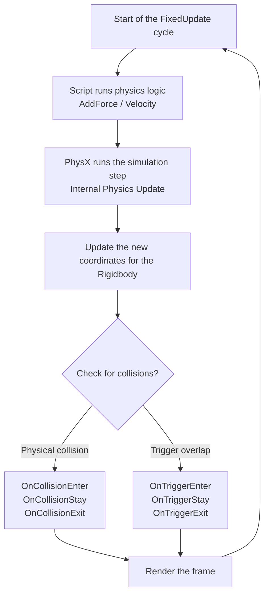

# Physics & Collision

> 📖 **Source:** Compiled and curated from the [Unity Manual — Physics](https://docs.unity3d.com/Manual/PhysicsSection.html), based on Unity 6.4 (LTS).

---

## 🎯 Intent

The goal of this chapter is to dig into how the 3D physics system (**NVIDIA PhysX**) integrated in **Unity 6.4 (LTS)** works. Developers will distinguish the roles of the **Rigidbody** and the **Collider**, understand the friction calculation mechanism of the **Physics Material**, master optimized **Raycasting** techniques, and become familiar with the proper physics update flow that runs independently between the `FixedUpdate` and `Update` functions.

---

## 🔑 Core Concepts & True Nature

### 1. Rigidbody vs Colliders: Physics & Collision mechanics

The physics system clearly separates dynamics behavior from collision geometry:
*   **Rigidbody (Mass & Force):** The component that grants a GameObject the ability to be affected by gravity, applied forces, torque, and air drag.
    *   *Kinematic Rigidbody (`isKinematic = true`):* A physics object that is not affected by external forces or collisions, but moves entirely through code (via Transform or Script). However, it can still push other dynamic Rigidbodies and still fires full collision events.
*   **Collider (Collision shape):** Defines the geometric boundary for collision detection.
    *   *Primitive Colliders:* `BoxCollider`, `SphereCollider`, `CapsuleCollider`. These shapes are calculated for collisions using super-lightweight analytic geometry formulas. Always prefer these Colliders.
    *   *Mesh Collider (complex collision mesh):* Uses the 3D model's polygon mesh directly as the collision boundary. Very CPU-intensive to compute collision intersections.
    *   *Convex warning:* If a Mesh Collider is attached to a GameObject that moves (not a static object), you must enable the **Convex** property (limiting the mesh to under 255 triangles with no concave angles). Otherwise, PhysX will refuse to compute collisions between this Mesh Collider and other Mesh Colliders.
*   **Trigger Colliders (`isTrigger = true`):** When this flag is enabled, the object will not block other objects' movement (they pass through each other), but Unity still tracks and dispatches intersection-check events through the `OnTriggerEnter`, `OnTriggerStay`, and `OnTriggerExit` functions.

---

### 2. The physics update loop: FixedUpdate vs Update

A classic mistake of new developers is applying physics forces inside the `Update()` function.

```
Graphics loop:   [Update] (Variable timestep)  ──> [Render Frame]          ──> [Display]
Physics loop:    [FixedUpdate] (Fixed 0.02s)   ──> [PhysX Simulation Step] ──> [Collision Events]
```

*   **`Update()`:** Runs once per frame. The frame rate varies continuously depending on the scene's graphics load and the machine's configuration. The interval between two frames (`Time.deltaTime`) is completely unstable.
*   **`FixedUpdate()`:** Runs at absolutely fixed time intervals (by default once every `0.02` seconds, i.e. 50Hz).
*   **Why must physics forces be in `FixedUpdate`?**
    PhysX solves the differential equations of motion in fixed time steps (**Fixed Time Step**). If you call `Rigidbody.AddForce` in `Update`, force will be added at an uneven rate (a powerful machine with high FPS adds more force, a weak machine with low FPS adds less), causing the character to jump higher or fly farther on machines with different configurations.

---

### 3. Raycasting & ray-scan optimization

A **Raycast** fires a mathematical ray from an origin point in a given direction with a limited length to detect whether it hits any Collider.
*   *Nature:* PhysX uses a spatial acceleration hierarchy tree, the **AABB (Axis-Aligned Bounding Box Tree)**, to quickly find Colliders along the ray's path.
*   *Optimization:* 
    *   Always limit the ray's maximum distance (`maxDistance`); avoid casting infinite rays.
    *   Always use a **`LayerMask`** filter so the Raycast skips unnecessary objects (such as hidden-zone Triggers, UI, foliage) and focuses only on the main Layers (such as `Default`, `Ground`, `Obstacles`).

---

### 4. Physics Materials

Used to configure the **Friction** and bounce (**Bounciness / Restitution**) of a Collider's surface when they collide. When two objects collide, PhysX combines the Physics Materials of both based on blending algorithms (Average, Minimum, Multiply, Maximum) to compute the most realistic reaction force.

---

## 🎨 Structure or Lifecycle

The event-processing flow within Unity's physics loop:



---

## 💻 C# Scripting API (C# Example)

The script below (`RaycastShooter.cs`) demonstrates a first-person gun controller (FPS Raycast Weapon). When firing, the Raycast is launched from the center of the Camera screen and filters collisions using a `LayerMask`. If it hits an object with a `Rigidbody`, the gun transmits a physics impulse at the exact contact point (`AddForceAtPosition`) and spawns bullet holes (Decals) oriented precisely along the surface normal vector (`hit.normal`).

```csharp
using UnityEngine;

public class RaycastShooter : MonoBehaviour
{
    [Header("Weapon Configurations")]
    [SerializeField] private Camera playerCamera;
    [SerializeField] private float fireRate = 0.15f;
    [SerializeField] private float weaponRange = 100f;
    [SerializeField] private float hitForce = 15f; // Impulse transferred to the object that is hit

    [Header("Raycast Targeting")]
    [SerializeField] private LayerMask shootableLayers; // Layer filter to hit only enemies/environment

    [Header("Visual Effects")]
    [SerializeField] private GameObject impactDecalPrefab; // Prefab for the bullet hole / small impact effect
    [SerializeField] private float decalDestroyTime = 3.0f;

    private float nextFireTime;

    private void Update()
    {
        // Read the fire button in Update to avoid missing fast mouse-click events
        if (Input.GetButton("Fire1") && Time.time >= nextFireTime)
        {
            nextFireTime = Time.time + fireRate;
            ShootWeapon();
        }
    }

    /// <summary>
    /// Performs the gun-firing mechanism using a Raycast and transmits the physics interaction.
    /// </summary>
    private void ShootWeapon()
    {
        if (playerCamera == null)
        {
            Debug.LogError("[Shooter] Player Camera is not assigned!");
            return;
        }

        // 1. Determine the screen center to cast the ray
        Vector3 rayOrigin = playerCamera.ViewportToWorldPoint(new Vector3(0.5f, 0.5f, 0f));
        Vector3 rayDirection = playerCamera.transform.forward;

        // 2. Perform the collision-detecting Raycast
        RaycastHit hit;

        // Cast a collision-detecting ray that targets only shootableLayers
        if (Physics.Raycast(rayOrigin, rayDirection, out hit, weaponRange, shootableLayers))
        {
            Debug.Log($"[Shooter] Hit: {hit.collider.name} at location {hit.point}");

            // 3. Physics interaction: Apply the impact force at the contact point (Hit Point)
            // Get the Rigidbody of the object that was hit (if any)
            if (hit.collider.TryGetComponent<Rigidbody>(out Rigidbody rb))
            {
                // Compute the push direction: along the direction of the fired ray
                Vector3 forceDirection = rayDirection * hitForce;

                // Apply force at the hit point (ForceMode.Impulse: instant impact-style force)
                rb.AddForceAtPosition(forceDirection, hit.point, ForceMode.Impulse);
            }

            // 4. Spawn the impact visual effect (Decal)
            if (impactDecalPrefab != null)
            {
                // Create the decal right at the contact point hit.point
                // The decal's orientation is rotated to face opposite to the surface normal vector (hit.normal)
                Quaternion decalRotation = Quaternion.LookRotation(hit.normal);

                GameObject decalInstance = Instantiate(impactDecalPrefab, hit.point + (hit.normal * 0.001f), decalRotation);
                
                // Parent the decal to the object that was hit so it moves along with that object (for example, a moving wooden crate)
                decalInstance.transform.SetParent(hit.collider.transform);

                // Automatically destroy the decal after a few seconds to free memory
                Destroy(decalInstance, decalDestroyTime);
            }
        }
        else
        {
            Debug.Log("[Shooter] Shot missed. No hit detected.");
        }
    }

    // Draw a red Debug ray in the Scene view to make development easier
    private void OnDrawGizmos()
    {
        if (playerCamera != null)
        {
            Gizmos.color = Color.red;
            Vector3 startPoint = playerCamera.transform.position;
            Vector3 endPoint = startPoint + (playerCamera.transform.forward * weaponRange);
            Gizmos.DrawLine(startPoint, endPoint);
        }
    }
}

---

## ⚙️ Best Practices & Implementation Steps

1. **Apply physics forces in `FixedUpdate`**: Every physics-force operation such as `Rigidbody.AddForce`, `AddTorque`, or directly changing velocity through Unity 6 properties like **`Rigidbody.linearVelocity`** and **`Rigidbody.angularVelocity`** must be performed in `FixedUpdate` to ensure they operate independently of the frame rate.
2. **Prefer primitive Colliders**: Minimize use of `MeshCollider`. For complex-shaped objects, build a collision composite (**Compound Collider**) by attaching multiple primitive Colliders (Box, Sphere, Capsule) to child GameObjects under the parent GameObject that holds the `Rigidbody`.
3. **Always attach a Rigidbody to a moving Collider**: If a GameObject has a moving Collider (for example, a moving lift platform or an automatic door), always attach a Rigidbody component to it and mark `isKinematic = true`. Moving a Static Collider (one without a Rigidbody) forces PhysX to rebuild the entire spatial acceleration hierarchy tree (AABB Tree), causing a severe CPU performance drop.
4. **Always filter with a LayerMask when raycasting**: Never call `Physics.Raycast` without declaring a `LayerMask`. Clearly specifying the collision layers lets PhysX immediately discard 90% of irrelevant objects, speeding up ray-scan computation many times over.
5. **Enable Physics Interpolation**: For main characters followed by the camera (or fast-moving vehicles), set the **Interpolate** property on the Rigidbody to `Interpolate`. This setting lets Unity smoothly interpolate the physics position in sync with the main graphics thread, completely eliminating camera jitter.

---
> 📚 **Source:** Content referenced from the [Unity Documentation](https://docs.unity3d.com/Manual/index.html) — Copyright Unity Technologies.

| Direction | Link |
|-------|----------|
| ← Back | [World Building (Back)](../../01-Manual/13-World-Building/00-world-building-overview.md) |
| → Next | [Input (Next)](../../01-Manual/15-Input/01-introduction-to-input.md) |
