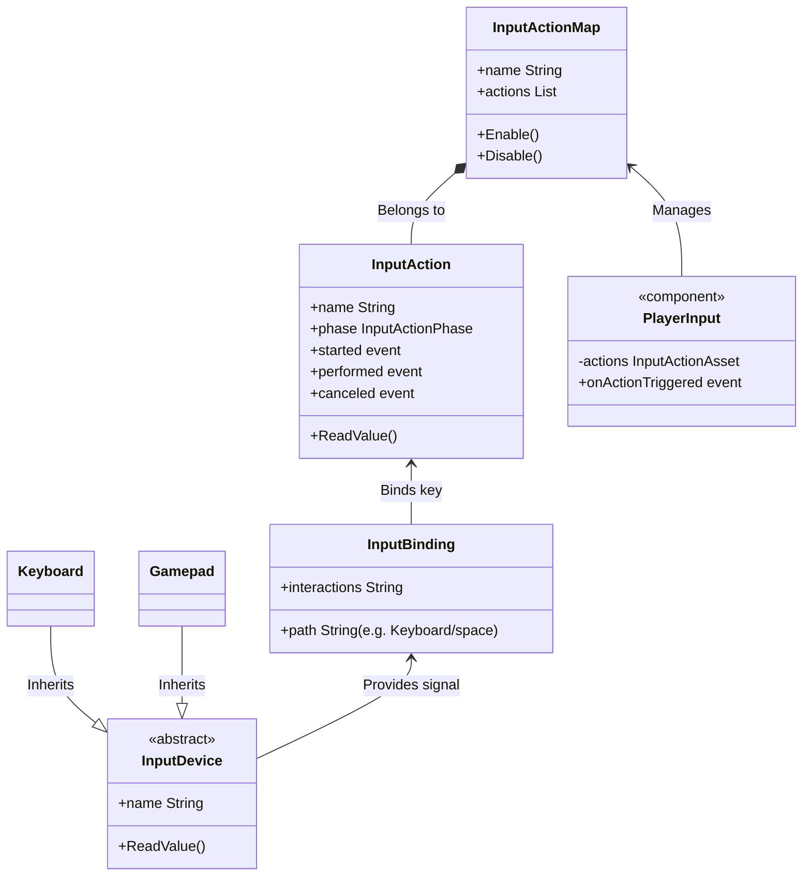

# Introduction to Input

> 📖 **Source:** Compiled, curated, and written in depth from the official [Unity Manual — Input](https://docs.unity3d.com/Manual/Input.html) documentation, version **Unity 6.4 (LTS)**.

---

## 🎯 Intent

The **Input** system in Unity is responsible for receiving, processing, and dispatching control signals from the player's hardware devices (keyboard, mouse, gamepad, touchscreen, VR/XR devices) into the game's logic.

The goal of this chapter is to help you understand the underlying **architectural nature** of the input processing system, draw a clear comparison between the two generations — the **Legacy Input Manager** and the **New Input System** — in **Unity 6.4**, and learn how to write idiomatic C# to optimize both performance and the player experience.

---

## ❌ Problem: The physical journey of an Input event

To understand why the Input system works the way it does, look at the journey of a button press from the player's finger to the screen:

```
[Hardware: Space key] 
       │ (Press button)
       v
[Operating System: Windows/OS] -> Create Input Event (OS Event Loop: Win32 Message, Cocoa Event)
       │ (Send the event to the Game's Window)
       v
[Unity Engine Runtime (C++)] -> Read the event on the Native thread (Native Input Event Queue)
       │ (Buffer the event and feed it into the game loop)
       v
[Unity Player Loop] -> Input System Update (Start of frame)
       │ (Distribute the data to the C# Scripting Layer)
       v
[C# Scripting API] -> Read the state via the Input class or call a Callback Event
       │ (Change the Rigidbody's velocity)
       v
[Physics & Rendering Engine] -> Draw the character jumping on screen
```

If a game engine does not design this reception layer well, the game will suffer serious problems:
*   **Input Lag:** Events are delayed across several frames before the script receives them.
*   **Input Loss:** The player presses a key very quickly (double tap) but the game fails to register it because of a dropped (lagging) frame.
*   **Frame rate Dependency:** Movement speed or key-detection behavior changes depending on whether the game runs at 30 FPS versus 120 FPS.

---

## ✅ Solution

Unity provides two parallel solutions for handling input in Unity 6.4:

1.  **Legacy Input Manager (`UnityEngine.Input`):** Uses a **Polling** mechanism. Every frame, the script asks the engine directly: *"Is the Space key currently being pressed?"*.
2.  **New Input System (`UnityEngine.InputSystem`):** Uses an **Event-Driven** mechanism. The manager notifies the script: *"The Space key was just pressed, trigger the jump action!"*.

---

## 🎨 Structure of the New Input System

The architecture of the **New Input System** is designed to fully decouple the physical hardware from the logic-processing code (Loose Coupling) through abstraction layers:



### Explanation of the components:
*   **Input Device:** Represents the physical device.
*   **Input Binding:** Defines the specific device path that links to an action (for example, the `W` key on the Keyboard, or pushing the `Left Stick` up on a Gamepad).
*   **Input Action:** Represents the logical action in the game (for example, `Jump`, `Move`, `Shoot`). Your code only interacts with this Action without needing to know whether the player is using a keyboard or a gamepad.
*   **Action Map:** Groups related Actions together (for example, the `Player` group for movement, the `UI` group for moving the mouse in menus). The whole group can be enabled or disabled depending on the game context.
*   **Player Input:** A Unity component that connects Action Map events directly to C# functions through Unity Events in the Inspector.

---

## 💻 Pseudocode & Scripting API (C# Unity 6.4)

Below are four ways to handle input in Unity 6.4, ranging from the traditional approach to the modern one:

### Approach 1: Using the Legacy Input Manager (traditional polling)
This approach is simple and well suited for quick prototyping, but hard to scale.

```csharp
using UnityEngine;

public class LegacyInputExample : MonoBehaviour
{
    [SerializeField] private float speed = 5.0f;

    void Update()
    {
        // Polling (continuous querying) every Update frame
        float moveHorizontal = Input.GetAxis("Horizontal"); // Returns a value from -1.0f to 1.0f
        float moveVertical = Input.GetAxis("Vertical");

        Vector3 movement = new Vector3(moveHorizontal, 0.0f, moveVertical);
        transform.Translate(movement * speed * Time.deltaTime);

        // Check a single button press
        if (Input.GetButtonDown("Jump"))
        {
            PerformJump();
        }
    }

    private void PerformJump()
    {
        Debug.Log("Jump using Legacy Input!");
    }
}
```

### Approach 2: Reading the device directly in the New Input System (Direct Polling)
The New Input System also supports reading hardware state directly without going through an Action Asset configuration file.

```csharp
using UnityEngine;
using UnityEngine.InputSystem; // Must import the new namespace

public class DirectNewInputExample : MonoBehaviour
{
    [SerializeField] private float speed = 5.0f;

    void Update()
    {
        // Check whether the device is active
        if (Keyboard.current == null) return;

        // Read values directly from the physical keys
        Vector2 moveInput = Vector2.zero;
        if (Keyboard.current.wKey.isPressed) moveInput.y = 1;
        if (Keyboard.current.sKey.isPressed) moveInput.y = -1;
        if (Keyboard.current.aKey.isPressed) moveInput.x = -1;
        if (Keyboard.current.dKey.isPressed) moveInput.x = 1;

        Vector3 movement = new Vector3(moveInput.x, 0.0f, moveInput.y);
        transform.Translate(movement * speed * Time.deltaTime);

        // Check the key that was just pressed down in the current frame
        if (Keyboard.current.spaceKey.wasPressedThisFrame)
        {
            PerformJump();
        }
    }

    private void PerformJump()
    {
        Debug.Log("Jump using New Input (reading the device directly)!");
    }
}
```

### Approach 3: Event-driven programming via an auto-generated C# class from an InputAction Asset (recommended for clean code)
This is the most professional approach: it optimizes performance and fully separates key configuration from source code.

1.  Create an `.inputactions` file in the Unity Editor (for example, name it `GameControls`).
2.  Enable the **Generate C# Class** option on that file so Unity automatically generates the `GameControls.cs` class.
3.  Write code that subscribes to the events as follows:

```csharp
using UnityEngine;
using UnityEngine.InputSystem;

public class EventNewInputExample : MonoBehaviour
{
    private GameControls controls; // Class auto-generated from the Action Asset
    private Vector2 moveInput;

    private void Awake()
    {
        controls = new GameControls();

        // Register callback events
        // started: The button was just pressed down
        // performed: Held down or the value changed (for analog sticks)
        // canceled: The button was released
        controls.Player.Move.performed += ctx => moveInput = ctx.ReadValue<Vector2>();
        controls.Player.Move.canceled += ctx => moveInput = Vector2.zero;

        controls.Player.Jump.started += OnJumpTriggered;
    }

    private void OnEnable()
    {
        controls.Player.Enable(); // Enable the "Player" Action Map
    }

    private void OnDisable()
    {
        controls.Player.Disable(); // Disable the Action Map to avoid memory leaks
    }

    private void OnDestroy()
    {
        // Unsubscribe from the event when the GameObject is destroyed
        controls.Player.Jump.started -= OnJumpTriggered;
    }

    void Update()
    {
        Vector3 movement = new Vector3(moveInput.x, 0.0f, moveInput.y);
        transform.Translate(movement * 5.0f * Time.deltaTime);
    }

    private void OnJumpTriggered(InputAction.CallbackContext context)
    {
        Debug.Log("Jump via Event-driven C# Actions!");
    }
}
```

### Approach 4: Using the `PlayerInput` component wired to UnityEvents (easy for game designers)
Well suited for team work: it lets you drag-and-drop functions directly in the Unity Inspector without writing a single line of event-subscription code.

```csharp
using UnityEngine;
using UnityEngine.InputSystem;

public class DesignerInputExample : MonoBehaviour
{
    private Vector2 moveInput;

    // This function is drag-and-drop assigned to the OnMove event of the PlayerInput Component in the Inspector
    public void OnMove(InputValue value)
    {
        moveInput = value.Get<Vector2>();
    }

    // This function is assigned to OnJump in the Inspector
    public void OnJump()
    {
        Debug.Log("Jump via PlayerInput UnityEvent!");
    }

    void Update()
    {
        Vector3 movement = new Vector3(moveInput.x, 0.0f, moveInput.y);
        transform.Translate(movement * 5.0f * Time.deltaTime);
    }
}
```

---

## ⚙️ Applicability

| Comparison criterion | Legacy Input Manager | New Input System (recommended) |
| :--- | :--- | :--- |
| **Operating mechanism** | Polling-based (passive querying) | Event-driven (actively raises events) |
| **Coupling** | Very tight (keys hardcoded into the script) | Very loose (code only communicates through Actions) |
| **Local Co-op support** | Extremely complex, requires configuring gamepads manually | Automatically dispatches devices via `PlayerInputManager` |
| **In-game Rebinding** | Very hard to implement, requires writing a custom config file | Built-in support via the library's `RebindingOperation` API |
| **Unit Test capability** | Nearly impossible without running an Editor simulation | Very easy to test by injecting simulated events |

---

## ⚠️ Real-world solution: Dropped or duplicated inputs between Update and FixedUpdate (Rigidbody physics)

This is a **classic problem** that gives many Unity developers headaches when handling physics-based jump forces:

### Symptoms:
*   You write jump code using `Rigidbody.AddForce` in `FixedUpdate()` because it relates to physics.
*   If you call `Input.GetButtonDown("Jump")` directly inside `FixedUpdate()`, sometimes the player presses Space but the character does not jump at all (dropped input).
*   Sometimes the player presses only once but the character jumps twice in a row (duplicated input).

### Root cause:
1.  `Update()` runs at the screen's refresh rate (for example, a game running at 120 FPS -> Update runs 120 times per second).
2.  `FixedUpdate()` runs on an independent fixed time cycle (by default 50 times per second, i.e. every 0.02 seconds).
3.  The `GetButtonDown` flag, or the button-press event, exists for **only a single `Update()` frame**. 
    *   If during one `Update()` frame no `FixedUpdate()` cycle runs -> the jump signal is cleared before physics can read it -> **dropped input**.
    *   If the game lags and Update runs slowly (20 FPS) while FixedUpdate still runs steadily (50 FPS), there will be 2 to 3 consecutive FixedUpdate cycles between two Update frames. Because the jump flag still holds the value `true` until the next Update frame, all 3 FixedUpdate cycles read `true` and add force 3 times in a row -> **duplicated jump force**.

### The idiomatic solution:
Read input in `Update()` (catching 100% of the fastest button presses) and store the state in a flag variable. Then execute and **immediately consume** that flag in `FixedUpdate()`.

```csharp
using UnityEngine;
using UnityEngine.InputSystem;

[RequireComponent(typeof(Rigidbody))]
public class PhysicsJumpSolver : MonoBehaviour
{
    [SerializeField] private float jumpForce = 5.0f;
    private Rigidbody rb;
    private GameControls controls;
    
    // Flag that stores the input state
    private bool isJumpPending = false;

    private void Awake()
    {
        rb = GetComponent<Rigidbody>();
        controls = new GameControls();
        
        // Register the event: pressing the button sets the flag to true
        controls.Player.Jump.started += ctx => isJumpPending = true;
    }

    private void OnEnable() => controls.Player.Enable();
    private void OnDisable() => controls.Player.Disable();

    void Update()
    {
        // If using Legacy Input, you would write it like this:
        // if (Input.GetButtonDown("Jump")) { isJumpPending = true; }
    }

    // FixedUpdate runs in sync with the physics cycle
    void FixedUpdate()
    {
        // If there is a pending jump flag waiting to be processed
        if (isJumpPending)
        {
            // Execute the physics jump force
            rb.AddForce(Vector3.up * jumpForce, ForceMode.Impulse);
            
            // CONSUME THE FLAG: Reset to false immediately to avoid duplicate force on the next frame
            isJumpPending = false;
        }
    }
}
```

---

> 📚 **Source:** Content referenced from the [Unity Documentation](https://docs.unity3d.com/Manual/index.html) — Copyright Unity Technologies.

| Direction | Link |
|-------|----------|
| ← Back | [Unity Roadmap Overview](../../00-unity-overview.md) |
| → Next | [Get Started (in progress)](../../01-Manual/01-Get-Started/00-get-started-overview.md) |
