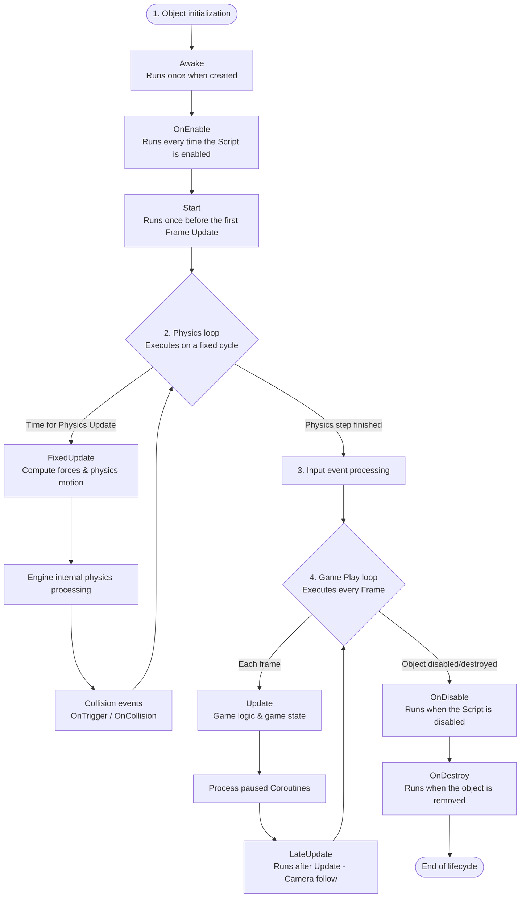

# MonoBehaviour Lifecycle

> 📖 **Source:** This document was compiled and written in detail from the [Unity Manual — Order of execution for event functions](https://docs.unity3d.com/Manual/ExecutionOrder.html), based on the stable **Unity 6.4 (LTS)** release.

---

## 🎯 Intent

The `MonoBehaviour` class is the base class that all C# scripts in Unity inherit from if they want to be attached to a `GameObject` as a Component. Unity manages the lifecycle of a `MonoBehaviour` through a chain of event functions that are called in a **strict execution order** within the main game loop (Player Loop).

Understanding this diagram clearly helps the programmer avoid bugs related to resource asynchrony (for example, accessing an uninitialized object leading to a `NullReferenceException`) and write performance-optimized code.

---

## 🎨 Event Loop Structure

Unity's main loop consists of major phases executed sequentially as follows:



---

## 🔍 Details of the Core Phases

### 1. Initialization Phase
*   **`Awake()`**: 
    *   Called immediately after the GameObject is created (via loading a Scene or Instantiate).
    *   *Purpose:* Used to set up local references inside the GameObject itself (for example, `GetComponent()`, initializing internal lists).
    *   *Note:* Always called, even if that `MonoBehaviour` component is disabled.
*   **`OnEnable()`**:
    *   Called immediately when the Script becomes active.
    *   *Purpose:* Used to subscribe to events (Events/Delegates).
*   **`Start()`**:
    *   Called before the first frame in which the Script runs Update.
    *   *Purpose:* Used to connect to and fetch data from other GameObjects in the Scene (for example, finding the GameManager, setting up cross-object links).

> [!IMPORTANT]
> **The golden rule for dividing between Awake and Start:**
> Always initialize the class's own internal variables in `Awake()`. Always access variables or call functions from other Scripts in `Start()`. This ensures that when you call into another Script in `Start()`, that other object has certainly already run through its `Awake()` and finished configuring its references.

### 2. Physics Loop
Unlike the graphics rendering loop (Frame Update), the physics loop runs on a fixed time cycle independent of the frame rate (by default once every `0.02` seconds).
*   **`FixedUpdate()`**: 
    *   All features related to applying force (`AddForce`) and physical movement (`velocity`) of a Rigidbody must be placed in this function.
    *   *Time:* Use `Time.fixedDeltaTime` instead of `Time.deltaTime` to compute physics acceleration.
*   **Collision events**: `OnCollisionEnter`, `OnTriggerStay`, `OnCollisionExit`, etc. are called immediately after the Engine's internal physics processing step.

### 3. Game Play Loop (Game Logic Loop)
Runs based on the graphics card's frame rendering rate (frame-rate dependent).
*   **`Update()`**: 
    *   Called once per frame. The call frequency depends on the device's hardware configuration (a powerful machine running more FPS will call it more often).
    *   *Purpose:* Receiving Input from the player, computing timers, moving non-physical objects.
    *   *Time:* You must multiply movement factors by `Time.deltaTime` to ensure smooth, consistent motion on every device (Framerate Independence).
*   **`LateUpdate()`**:
    *   Called once per frame, guaranteed to occur **after all** other `Update()` functions across the entire Scene have finished.
    *   *Purpose:* Best suited for a camera following a character (Camera Follow). The character moves in `Update()`, and the camera moves to follow in `LateUpdate()` to eliminate image jittering.

### 4. Decommissioning Phase
*   **`OnDisable()`**: Called when the script is disabled or the GameObject is hidden (`SetActive(false)`). Suitable for unsubscribing from event listeners to avoid memory leaks.
*   **`OnDestroy()`**: Called before the object is completely released from RAM by the `Destroy()` function.

---

## 🎮 Practical Source Code (Unity C#)

Below is a sample script demonstrating in detail how to apply the MonoBehaviour lifecycle order in a real project, integrating standard physics handling and camera tracking.

```csharp
using UnityEngine;

public class PlayerLifecycleDemo : MonoBehaviour
{
    [Header("Movement Options")]
    [SerializeField] private float speed = 5f;
    [SerializeField] private Transform cameraTarget;

    private Rigidbody rb;
    private Vector3 movementInput;
    private float customTimer;

    // ==========================================
    // Phase 1: INITIALIZATION
    // ==========================================
    
    private void Awake()
    {
        // 1. Only set up internal references in Awake
        rb = GetComponent<Rigidbody>();
        Debug.Log("[Lifecycle] Awake: Successfully cached Rigidbody.");
    }

    private void OnEnable()
    {
        // 2. Subscribe to system events when the component is enabled
        Debug.Log("[Lifecycle] OnEnable: Subscribed to event listeners.");
    }

    private void Start()
    {
        // 3. Connect to external components in Start
        customTimer = 0f;
        Debug.Log("[Lifecycle] Start: The game has begun.");
    }

    // ==========================================
    // Phase 2: EVENT LOOP
    // ==========================================

    private void Update()
    {
        // A. Receive Input data (must be done in Update to avoid missing key-press events)
        float x = Input.GetAxisRaw("Horizontal");
        float z = Input.GetAxisRaw("Vertical");
        movementInput = new Vector3(x, 0f, z).normalized;

        // B. Compute the timer using Time.deltaTime (varies per frame)
        customTimer += Time.deltaTime;

        if (Input.GetKeyDown(KeyCode.Space))
        {
            Debug.Log($"[Lifecycle] Update: Pressed Space at second: {customTimer:F2}");
        }
    }

    private void FixedUpdate()
    {
        // C. Handle physics movement (must be done in FixedUpdate)
        // Use Time.fixedDeltaTime, which represents the fixed physics cycle
        if (rb != null)
        {
            Vector3 velocity = movementInput * speed;
            rb.MovePosition(rb.position + velocity * Time.fixedDeltaTime);
        }
    }

    private void LateUpdate()
    {
        // D. Handle the camera following the character (must be done in LateUpdate)
        if (cameraTarget != null)
        {
            // Position the camera to track the Target closely
            cameraTarget.position = transform.position + new Vector3(0f, 5f, -10f);
        }
    }

    // ==========================================
    // Phase 3: END OF LIFECYCLE
    // ==========================================

    private void OnDisable()
    {
        // Unsubscribe from events to avoid Memory Leak bugs
        Debug.Log("[Lifecycle] OnDisable: Unsubscribed from events.");
    }

    private void OnDestroy()
    {
        // Clean up garbage resources before the object disappears completely
        Debug.Log("[Lifecycle] OnDestroy: Releasing the script's memory.");
    }
}
```

---
> 📚 **Source:** Content referenced from the [Unity Documentation](https://docs.unity3d.com/Manual/index.html) — Copyright Unity Technologies.

| Direction | Link |
|-------|----------|
| ← Back | [UnityEngine Core API](./01-core-api.md) |
| → Next | [UnityEngine.InputSystem API](./03-inputsystem-api.md) |
