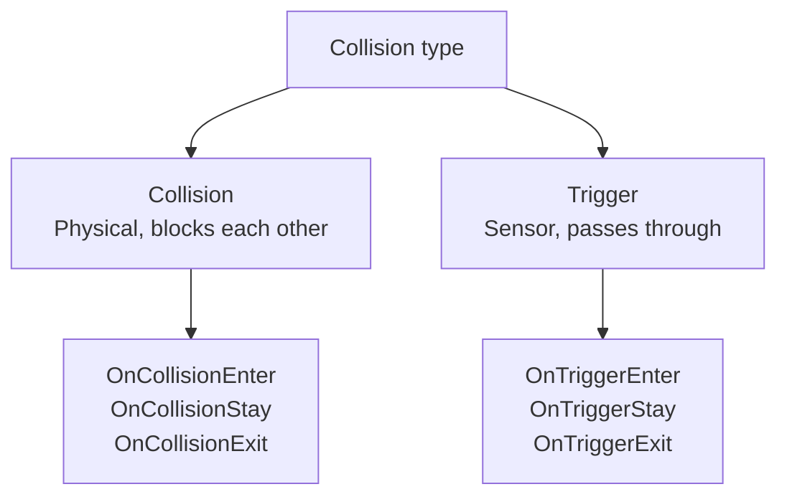

# Physics & Physics2D API

> 📖 **Source:** This document was compiled and written in detail from the [Unity Scripting Reference — UnityEngine.Physics](https://docs.unity3d.com/ScriptReference/Physics.html) and [UnityEngine.Physics2D](https://docs.unity3d.com/ScriptReference/Physics2D.html), compatible with the stable **Unity 6.4 (LTS)** release.

---

## 🎯 Intent

Unity's physics system (3D based on **NVIDIA PhysX**, 2D based on **Box2D**) handles realistic interactions between objects. Programming the physics system requires correctly understanding the nature of the interaction between forces and collisions, as well as how to perform spatial queries such as Raycast, Overlap, and Sweeps. Optimizing physics performance is extremely important to avoid frame stutter (CPU spikes).

---

## ⚡ 1. The Nature of Collisions: Collision vs Trigger

For Unity to detect any collision, **at least one of the two objects** involved must have a **Rigidbody** (or Rigidbody2D) component attached.



### Comparing their nature:
*   **Collision (Physical effect):** The two objects block each other, with push and reaction forces that change velocity.
*   **Trigger (Spatial sensor):** The two objects can pass through each other. Use the `Is Trigger` property on the Collider to enable this mechanism.
*   **Performance:** A Trigger costs less CPU than a Collision because the Engine does not have to compute the complex physical reaction matrix (contacts, friction, bounce).

---

## 🔍 2. Spatial Queries

Spatial queries let you detect objects in the game world without relying on direct physical collisions.

1.  **Raycast (Casting a ray):** Casts an invisible ray from a point in a direction to find obstacles.
    *   *Usage:* `Physics.Raycast(origin, direction, out RaycastHit hitInfo, maxDistance, layerMask)`
2.  **Overlap (Sweeping a region):** Checks which Colliders are within a defined spatial region (Sphere, Box, Capsule).
    *   *Usage:* `Physics.OverlapSphere(position, radius, layerMask)`
3.  **Sweep (Sweeping a shape):** Moves a geometric shape (Sphere, Box) along a direction to sweep for obstacles (similar to firing a projectile with a real size rather than a super-thin laser ray).

> [!WARNING]
> **Performance rules when using Spatial Queries:**
> *   **Always use a `LayerMask`:** If you do not pass a LayerMask, Unity has to iterate over every Collider in the entire Scene, wasting CPU.
> *   **Avoid the array-allocating versions:** `Physics.OverlapSphere` returns a `Collider[]` array, which causes garbage allocation (GC Alloc). Use the non-allocating version: **`Physics.OverlapSphereNonAlloc`**, which takes a pre-allocated array.

---

## 🎮 Practical Source Code (Unity C#)

Below is practical C# source code that combines a high-performance Raycast (ignoring teammates thanks to a LayerMask) and a physics explosion that sweeps the surrounding region (using the NonAlloc version to avoid garbage).

```csharp
using UnityEngine;

public class PhysicsSystemDemo : MonoBehaviour
{
    [Header("Raycast Settings")]
    [SerializeField] private float rayDistance = 20f;
    [SerializeField] private LayerMask enemyLayer;

    [Header("Explosion Settings")]
    [SerializeField] private float explosionRadius = 5f;
    [SerializeField] private float explosionForce = 500f;
    [SerializeField] private LayerMask destructibleLayer;

    // A pre-allocated array used for the non-allocating (Non-Alloc) query
    private Collider[] overlapResults = new Collider[10];

    private void Update()
    {
        // 1. Check the Raycast when the left mouse button is clicked
        if (Input.GetMouseButtonDown(0))
        {
            PerformRaycastLaser();
        }

        // 2. Trigger the physics explosion when Space is pressed
        if (Input.GetKeyDown(KeyCode.Space))
        {
            TriggerExplosion();
        }
    }

    private void PerformRaycastLaser()
    {
        Vector3 origin = transform.position;
        Vector3 direction = transform.forward;

        // Draw a debug ray in the Editor for visualization
        Debug.DrawRay(origin, direction * rayDistance, Color.red, 1f);

        // Cast the Raycast, passing the LayerMask to optimize the search
        if (Physics.Raycast(origin, direction, out RaycastHit hit, rayDistance, enemyLayer))
        {
            Debug.Log($"[Raycast] Hit target: {hit.collider.name} at position: {hit.point}");
            
            // Get the collision contact point and normal to create an effect
            Vector3 hitPoint = hit.point;
            Vector3 hitNormal = hit.normal;
            
            // Handle dealing damage if the object has a Health script
            if (hit.collider.TryGetComponent<Rigidbody>(out Rigidbody targetRb))
            {
                // Apply a local push force at the hit point
                targetRb.AddForceAtPosition(direction * 200f, hitPoint);
            }
        }
    }

    private void TriggerExplosion()
    {
        Vector3 explosionOrigin = transform.position;

        // Use OverlapSphereNonAlloc to avoid garbage allocation (GC Alloc)
        // Returns the number of Colliders actually swept (at most the result array length, which is 10)
        int hitCount = Physics.OverlapSphereNonAlloc(explosionOrigin, explosionRadius, overlapResults, destructibleLayer);

        Debug.Log($"[Explosion] The explosion swept {hitCount} objects.");

        for (int i = 0; i < hitCount; i++)
        {
            Collider col = overlapResults[i];
            
            if (col.TryGetComponent<Rigidbody>(out Rigidbody rb))
            {
                // Apply the explosion force radiating from the explosion center
                // The explosion force automatically falls off with distance from the explosion center
                rb.AddExplosionForce(explosionForce, explosionOrigin, explosionRadius, 3.0f, ForceMode.Impulse);
            }
        }
    }
}
```

---
> 📚 **Source:** Content referenced from the [Unity Documentation](https://docs.unity3d.com/Manual/index.html) — Copyright Unity Technologies.

| Direction | Link |
|-------|----------|
| ← Back | [UnityEngine.InputSystem API](./03-inputsystem-api.md) |
| → Next | [SceneManagement API](./05-scene-management-api.md) |
