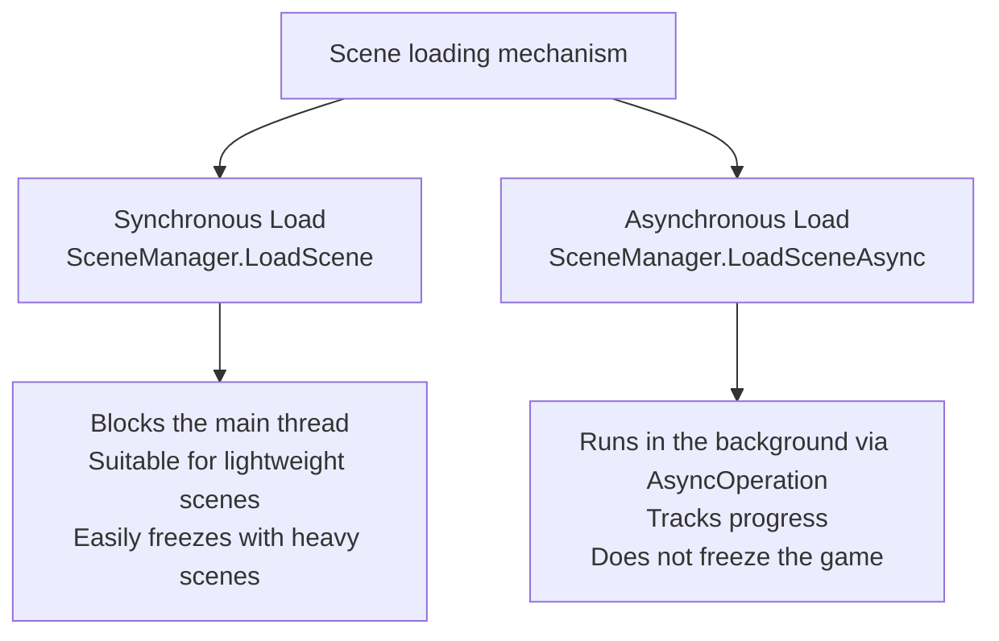

# SceneManagement API

> 📖 **Source:** This document was compiled and written in detail from the [Unity Scripting Reference — UnityEngine.SceneManagement](https://docs.unity3d.com/ScriptReference/SceneManagement.SceneManager.html), compatible with the stable **Unity 6.4 (LTS)** release.

---

## 🎯 Intent

The **UnityEngine.SceneManagement** subsystem manages the state of the Scenes in a game. Programming scene transitions requires good control over load timing (synchronous vs asynchronous), memory management through additive scene loading, and maintaining data integrity through the object-preservation mechanism (`DontDestroyOnLoad`).

---

## 🔁 1. Synchronous vs Asynchronous

There are two main methods for loading a Scene in Unity:



### Detailed comparison:
*   **SceneManager.LoadScene (Synchronous):** Halts the game's entire main thread to read data from disk into RAM. This temporarily freezes the game screen. Recommended only for very lightweight scenes such as the Main Menu.
*   **SceneManager.LoadSceneAsync (Asynchronous):** Unity loads the data on a background thread and returns an `AsyncOperation` object. This object contains properties such as `progress` (progress from `0` to `1.0`) and the `isDone` flag to track the scene loading progress.

---

## 🧱 2. Additive Scene Loading

In open-world games or games with complex UI design, loading multiple Scenes additively at the same time is an optimal resource-management solution:
*   **`LoadSceneMode.Single` (Default):** Closes all current Scenes and frees their memory before loading the new Scene.
*   **`LoadSceneMode.Additive`:** Loads the new Scene on top of the open Scenes without removing them.

> [!TIP]
> **Practical application of Additive Loading:**
> Split the project into small Scenes: `BaseScene` (containing the GameManager, Camera, and main UI HUD), `Level1_Environment` (the environment of level 1), and `Level1_Enemies` (the enemies of level 1). When moving to level 2, you only need to unload (`UnloadSceneAsync`) the environment and enemies of level 1, keeping `BaseScene` unchanged. This reduces memory load and speeds up transition times.

---

## 🎮 Practical Source Code (Unity C#)

Below is a complete script written in C# that manages an asynchronous level-transition process with support for drawing an accurate loading bar and a safe scene-transition mechanism that preserves data.

```csharp
using System.Collections;
using UnityEngine;
using UnityEngine.UI;
using UnityEngine.SceneManagement;
using TMPro;

public class GameManagerDemo : MonoBehaviour
{
    // Apply the Singleton Pattern to keep a single GameManager throughout the scenes
    public static GameManagerDemo Instance { get; private set; }

    [Header("UI Loading References")]
    [SerializeField] private GameObject loadingCanvas;
    [SerializeField] private Slider progressBar;
    [SerializeField] private TextMeshProUGUI progressText;

    private void Awake()
    {
        if (Instance == null)
        {
            Instance = this;
            // Force this GameManager object to not be destroyed when a new scene loads
            DontDestroyOnLoad(gameObject);
        }
        else
        {
            Destroy(gameObject);
        }
    }

    // Function called from outside (for example, when the Play button is pressed in the Menu)
    public void LoadGameLevel(string sceneName)
    {
        StartCoroutine(LoadSceneCoroutine(sceneName));
    }

    private IEnumerator LoadSceneCoroutine(string sceneName)
    {
        // 1. Activate the loading screen UI
        if (loadingCanvas != null)
        {
            loadingCanvas.SetActive(true);
        }

        // 2. Call the asynchronous scene-loading API in the background
        AsyncOperation operation = SceneManager.LoadSceneAsync(sceneName, LoadSceneMode.Single);
        
        // Prevent the scene from automatically displaying as soon as it finishes loading, to control the opening timing
        operation.allowSceneActivation = false;

        // 3. Loop that updates the loading progress
        while (!operation.isDone)
        {
            // Unity loads a scene in 2 stages: loading data (0 -> 0.9) and activating the display (0.9 -> 1.0)
            // Therefore we normalize the value to a 0 to 100% scale
            float progress = Mathf.Clamp01(operation.progress / 0.9f);
            
            if (progressBar != null)
            {
                progressBar.value = progress;
            }
            if (progressText != null)
            {
                progressText.text = $"LOADING: {progress * 100:F0}%";
            }

            // The data-loading stage is complete
            if (operation.progress >= 0.9f)
            {
                if (progressText != null)
                {
                    progressText.text = "PRESS ANY KEY TO CONTINUE...";
                }

                // Wait for the player to interact before opening the new level
                if (Input.anyKeyDown)
                {
                    operation.allowSceneActivation = true;
                }
            }

            yield return null;
        }

        // 4. Turn off the loading screen after loading is complete
        if (loadingCanvas != null)
        {
            loadingCanvas.SetActive(false);
        }
    }
}
```

---
> 📚 **Source:** Content referenced from the [Unity Documentation](https://docs.unity3d.com/Manual/index.html) — Copyright Unity Technologies.

| Direction | Link |
|-------|----------|
| ← Back | [Physics & Physics2D API](./04-physics-api.md) |
| → Next | [Events & Actions API](./06-events-api.md) |
