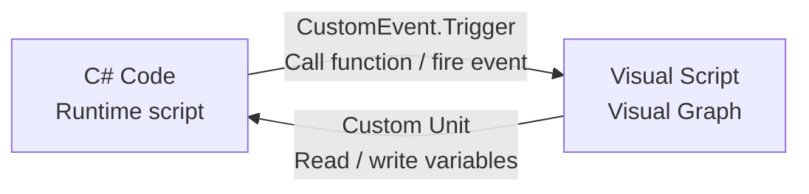

# Unity.VisualScripting API (Visual Scripting via C# Code)

> 📖 **Source:** This document is compiled and written in detail based on [Unity Visual Scripting Package Reference — Unity.VisualScripting](https://docs.unity3d.com/Packages/com.unity.visualscripting@1.9/manual/index.html), compatible with the stable **Unity 6.4 (LTS)** release.

---

## 🎯 Intent

The **Unity Visual Scripting** system lets game designers build game logic by connecting visual graphical blocks (Nodes) without writing code. For programmers, however, the core task is figuring out how C# code can interact bidirectionally with the Visual Scripting system: invoking custom-built Custom Units, getting/setting variables from Visual Graphs, and triggering custom events from C# code into the Visual Scripting graph.

---

## ⚙️ 1. Two-Way Communication: C# vs Visual Scripting



1.  **C# calling into Visual Scripting:**
    *   Use the **`CustomEvent.Trigger`** class to send an event with parameters directly to an object that contains a `ScriptMachine` component. The `Custom Event` event nodes in the Visual Graph will catch this event and continue running the subsequent logic.
2.  **Visual Scripting calling into C# (Custom Units):**
    *   A programmer can write C# classes that inherit from `Unit` to create new custom nodes that appear in the Visual Scripting search list (Fuzzy Finder). This is very useful for packaging complex C# algorithms or third-party APIs (such as Firebase or AdMob) into simple blocks for designers to use.

---

## 🎮 Hands-On Source Code (Unity C#)

Below are two hands-on C# scripts:
1.  **Script 1:** Creates a new Custom Node (Custom Unit) in Visual Scripting that takes two floats and returns the largest difference between them.
2.  **Script 2:** Invokes and triggers a Custom Event from C# code, sending a signal and parameters into a Visual Scripting Machine.

### Script 1: Custom-built Custom Node (must be placed in the `Editor/MaxDifferenceUnit.cs` folder or in a project script file)
```csharp
using Unity.VisualScripting;
using UnityEngine;

// Register the display description for the node in the Visual Scripting Finder
[UnitTitle("Max Difference")]
[UnitCategory("Math/Advanced")]
public class MaxDifferenceUnit : Unit
{
    // Declare the input ports
    [DoNotSerialize] public ValueInput valueA;
    [DoNotSerialize] public ValueInput valueB;

    // Declare the output port
    [DoNotSerialize] public ValueOutput result;

    // Configure the connection ports
    protected override void Definition()
    {
        // Initialize the input ports with a default data type of float
        valueA = ValueInput<float>("Value A", 0f);
        valueB = ValueInput<float>("Value B", 0f);

        // Initialize the output port
        result = ValueOutput<float>("Result", CalculateMaxDifference);

        // Set up the dependency relationship (the output port depends on the input ports to compute)
        Requirement(valueA, result);
        Requirement(valueB, result);
    }

    // The logic handler that computes the value when the output port requests it
    private float CalculateMaxDifference(Flow flow)
    {
        // Read the values from the graph's input ports
        float a = flow.GetValue<float>(valueA);
        float b = flow.GetValue<float>(valueB);

        // Compute and return the result
        return Mathf.Abs(a - b);
    }
}
```

### Script 2: Firing an Event from C# into Visual Scripting (Runtime Script)
```csharp
using UnityEngine;
using Unity.VisualScripting; // Visual Scripting namespace

public class CSharpToVisualScriptEventDemo : MonoBehaviour
{
    [Header("Target Machine")]
    [SerializeField] private GameObject targetObjectWithVisualScript;

    private void Update()
    {
        // When the player presses the left mouse button
        if (Input.GetMouseButtonDown(0))
        {
            TriggerEventInVisualScript();
        }
    }

    private void TriggerEventInVisualScript()
    {
        if (targetObjectWithVisualScript == null) return;

        // 1. Prepare the parameter data to send
        string eventName = "OnPlayerDamageReceived";
        int damageAmount = 25;
        string source = "Spike Trap";

        // 2. Trigger the Custom Event in the target GameObject's Visual Scripting Machine
        // You need to pass: the target GameObject, the event name, and the parameter array (args)
        CustomEvent.Trigger(targetObjectWithVisualScript, eventName, damageAmount, source);
        
        Debug.Log($"[C# Event] Fired event '{eventName}' with {damageAmount} damage into Visual Scripting.");
    }
}
```

---
> 📚 **Source:** Content referenced from [Unity Documentation](https://docs.unity3d.com/Manual/index.html) — Copyright Unity Technologies.

| Direction | Link |
|-------|----------|
| ← Back | [Unity.Profiling API (Performance Measurement)](../03-Unity/03-profiling.md) |
| → Next | [Assembly & Scoped Packages (Advanced Configuration)](./02-assemblies-packages.md) |
