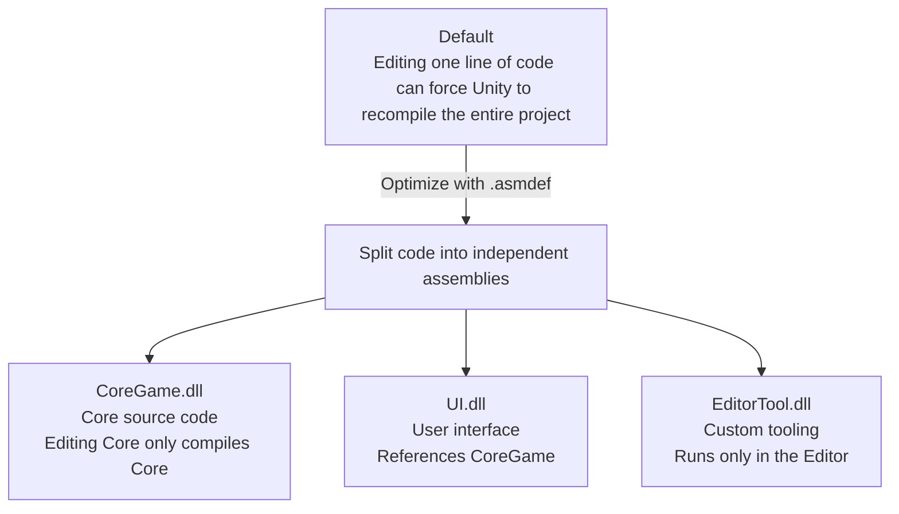

# Assembly Definitions & Packages (Managing Compilation Structure and Packages)

> 📖 **Source:** This document is compiled and written in detail based on [Unity Manual — Assembly definitions](https://docs.unity3d.com/Manual/ScriptCompilationAssemblyDefinitionFiles.html), compatible with the stable **Unity 6.4 (LTS)** release.

---

## 🎯 Intent

As a game project grows in scale, your C# code can balloon to hundreds of thousands of lines. By default, Unity compiles all of the project's source code into a single shared library file named `Assembly-CSharp.dll`. This makes the recompilation time extremely long every time you edit code.

This document explains how to use **Assembly Definitions (`.asmdef`)** to split source code into independent compilation modules, and how to manage extension library packages from external registries.

---

## ⚙️ 1. Assembly Definitions (.asmdef)

An `Assembly Definition` (`.asmdef`) is a Unity-specific JSON configuration file that defines the scope of a set of source code so that it compiles into a separate `.dll` file.



### Core benefits of Assembly Definitions:
1.  **Faster Compilation Time:** When you change code in the `UI.asmdef` module, Unity only needs to recompile that `UI.dll` file, completely skipping the core game and external plugins, saving tens of seconds on every edit.
2.  **Architecture Isolation:** Helps avoid spaghetti design flaws. For example, you can configure the project so that classes in the Core Game library cannot call back into UI classes, ensuring proper layering of the project (UI references Core, Core cannot reference UI).
3.  **Separating Editor-only code:** Create a dedicated `.asmdef` file for the `Editor` folder and configure the **Platform: Editor** property. This fully replaces the traditional approach of placing scripts in an `Editor` folder.

---

## 📦 2. Scoped Registries & Package Manifest

The Unity Package Manager (UPM) uses the `Packages/manifest.json` configuration file to manage the project's additional resource packages.
*   **Scoped Registries:** Allow you to connect the project to third-party community package distribution gateways (such as **OpenUPM**) to download unofficial extension libraries safely and update them automatically through the Package Manager UI.

---

## 🎮 Hands-On Source Code (JSON Configuration)

Below is the sample configuration content of a **`CoreGame.asmdef`** file (managing the core game code that uses the New Input System package) and a **`Packages/manifest.json`** file with a Scoped Registry configuration for OpenUPM.

### File 1: The `CoreGame.asmdef` Assembly configuration file (stored as JSON text)
```json
{
    "name": "CoreGame",
    "rootNamespace": "Game.Core",
    "references": [
        "GUID:75469ad4d38634e559750d17036d5f7c"
    ],
    "includePlatforms": [],
    "excludePlatforms": [],
    "allowUnsafeCode": false,
    "overrideReferences": false,
    "precompiledReferences": [],
    "autoReferenced": true,
    "defineConstraints": [],
    "versionDefines": [],
    "noEngineReferences": false
}
```
*Explanation:* The `"references"` property contains a GUID pointing to `Unity.InputSystem.asmdef`, signaling that your CoreGame module has permission to use the new Input System APIs.

### File 2: The `Packages/manifest.json` configuration that supports loading the OpenUPM Registry
```json
{
  "scopedRegistries": [
    {
      "name": "OpenUPM",
      "url": "https://package.openupm.com",
      "scopes": [
        "com.openupm",
        "com.neuecc.uni-task"
      ]
    }
  ],
  "dependencies": {
    "com.unity.inputsystem": "1.7.0",
    "com.unity.textmeshpro": "3.0.6",
    "com.neuecc.uni-task": "2.5.0",
    "com.unity.modules.ui": "1.0.0"
  }
}
```
*Explanation:* The configuration above adds the **OpenUPM** registry to the Package Manager and automatically installs the well-known multithreading optimization package **UniTask** (`com.neuecc.uni-task`) directly from the internet.

---
> 📚 **Source:** Content referenced from [Unity Documentation](https://docs.unity3d.com/Manual/index.html) — Copyright Unity Technologies.

| Direction | Link |
|-------|----------|
| ← Back | [Unity.VisualScripting API (Visual Script)](./01-visual-scripting.md) |
| → Next | [Back to the Overview Roadmap](../../00-unity-overview.md) |
